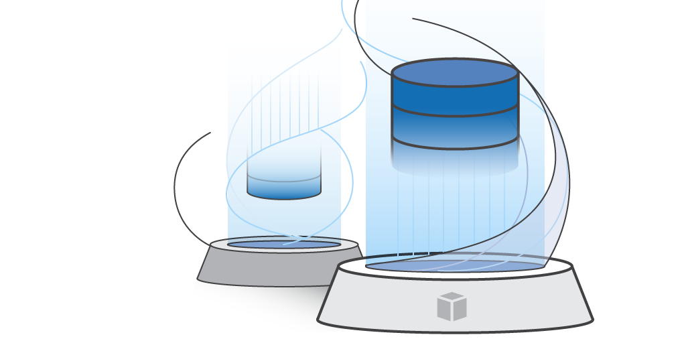

# ***AWS 데이터베이스 마이그레이션 (E2E) 워크샵***



데이터베이스 마이그레이션은 마이그레이션 전 평가, 데이터베이스 스키마 및 코드 변환, 데이터 마이그레이션, 기능 테스트, 성능 조정 및 기타 여러 단계를 포함하는 복잡한 다단계 프로세스일 수 있습니다. 이 프로세스에서 가장 많은 노력이 필요한 두 가지 기본 단계는 스키마 및 데이터베이스 코드 개체의 변환과 데이터 자체의 마이그레이션입니다. 다행히 AWS는 각 단계에 도움이 되는 도구를 제공합니다. 이 워크숍은 데이터베이스 마이그레이션 여정을 시작하기 전에 이러한 도구를 직접 사용해 보고 경험을 얻을 수 있는 방법을 제공합니다.

> ⚠️ 이 워크샵에서 사용된 AWS 콘솔 조작과 관련된 설명 및 스크린샷은 ```영어 (English (US))```로 설정된 것을 가정하고 작성되었습니다.

> 📕 (참고)<br>
> - 여기에 포함된 내용은 지속적으로 추가 및 업데이트될 예정입니다.
> - 이 글을 작성하는 현재 (2024-08-22) 시점에 적용된 AWS 서비스와 관련된 화면은 실제 워크샵 수행 시에는 다르게 보일 수 있습니다. 주목할 만한 사항이 있을 경우 진행자가 사전에 안내를 드릴 수 있도록 하겠습니다.

---

## 목차

* [AWS 데이터베이스 마이그레이션 (E2E) 워크샵 소개](README.md)
* [환경 설정](setup-environment/Setup-Environment-README.md)
  * [공통 설정](setup-environment/Setup-Common-Configuration.md)
  * [소스 환경 구성](setup-environment/Setup-Source-Environment.md)
  * [타겟 환경 구성](setup-environment/Setup-Target-Environment.md)
  * [소스/타겟 연결 구성](setup-environment/Setup-Source-Target-Connectivity.md)
* [오라클 데이터베이스 동일기종 (Homogenous) 마이그레이션](migrate-oracle-to-oracle/Migrate-Oracle-to-Oracle-README.md)
  * [소스 데이터베이스 구성](migrate-oracle-to-oracle/Configure-Source-Database.md)
  * [DMS 복제 인스턴스 생성](migrate-oracle-to-oracle/Create-DMS-Replication-Instance.md)
  * [DMS 소스 및 타겟 엔드포인트 생성](migrate-oracle-to-oracle/Create-DMS-Source-and-Target-Endpoints.md)
  * [DMS 마이그레이션 태스크 생성](migrate-oracle-to-oracle/Create-DMS-Migration-Task.md)
  * [타겟 데이터베이스 데이터 확인](migrate-oracle-to-oracle/Inspect-Target-Database-Data.md)
  * [데이터 변경 복제](migrate-oracle-to-oracle/Replicate-Data-Changes.md)
* [오라클 데이터베이스의 이기종 (Heterogeneous) 마이그레이션](./migrate-oracle-to-postgresql/Migrate-Oracle-to-PostgreSQL-README.md)
  * [파트 1: 스키마 변환](./migrate-oracle-to-postgresql/Convert-Oracle-Schema-To-PostgreSQL.md)
    * [AWS 스키마 변환 도구 (AWS Schema Conversion Tool) 설치](./migrate-oracle-to-postgresql/Install-AWS-Schema-Conversion-Tool.md)
    * [데이터베이스 마이그레이션 프로젝트 생성](./migrate-oracle-to-postgresql/Create-Database-Migration-Project.md)
    * [스키마 변화](./migrate-oracle-to-postgresql/Convert-Schema.md)
  * [파트 2: 데이터 마이그레이션](./migrate-oracle-to-postgresql/Data-Migration.md)
    * [타겟 데이터베이스 설정](./migrate-oracle-to-postgresql/Configure-Target-Database.md)
    * [DMS 복제 인스턴스 생성](./migrate-oracle-to-postgresql/Create-DMS-Replication-Instance.md)
    * [DMS 소스 및 타겟 엔드포인트 생성](./migrate-oracle-to-postgresql/Create-DMS-Source-and-Target-Endpoints.md)
    * [DMS 마이그레이션 태스크 생성](./migrate-oracle-to-postgresql/Create-DMS-Migration-Tasks.md)
    * [타겟 데이터베이스 데이터 검사](./migrate-oracle-to-postgresql/Inspect-Target-Database-Content.md)
    * [데이터 변경 복제](./migrate-oracle-to-postgresql/Replicate-Data-Changes.md)
  * [이기종 데이터 마이그레이션 요약](./migrate-oracle-to-postgresql/Summary-Heterogeneous-Data-Migration.md)
* [애플리케이션과 함께 데이터베이스 마이그레이션](./migrate-application-database/Migrate-Application-Database-README.md)
  * [(소스) 레거시 애플리케이션/데이터베이스 구성 및 실행](./migrate-application-database/Configure-and-Launch-Legacy-Application-and-Database.md)
  * [(타겟) 신규 데이터베이스 및 애플리케이션 인프라 구성](./migrate-application-database/Configure-New-Database-and-Application-Infrastructure.md)
  * [사용자 인터페이스 (프론트엔드) 분리](./migrate-application-database/Separate-Frontend.md)
  * [```HotelSpecials``` 데이터베이스 스키마 전환](./migrate-application-database/Convert-HotelSpecials-Database-Schema.md)
  * [```HotelSpecials``` 서비스 마이그레이션](./migrate-application-database/Migrate-HotelSpecials-Service.md)
  * [```Application Load Balancer (ALB)``` 요청 라우팅 설정](./migrate-application-database/Configure-ALB-Request-Routing.md)
  * [애플리케이션 트래픽 유입 중단](./migrate-application-database/Stop-Application-Traffic-Inflow.md)
  * [```HotelSpecials``` 데이터 마이그레이션](./migrate-application-database/Migrate-HotelSpecials-Data.md)
  * [프론트엔드의 백엔드 접속 엔드포인트 (DNS)를 ALB로 변경](./migrate-application-database/Change-Frontend-Backend-ALB.md)
  * [넓은 지역으로 DNS 전파 확인](./migrate-application-database/Check-DNS-Propagation.md)
  * [프론트엔드로 트래픽 유입 재개](./migrate-application-database/Resume-Frontend-Traffic.md)
  * [```HotelSpecials`` 데이터의 SSOT 클라우드 전환 완료 선언](./migrate-application-database/Declare-HotelSpecials-SSOT-Cloud-Transition-Complete.md)
  * [```FlightSpecials``` 데이터베이스 스키마 전환](./migrate-application-database/Convert-FlightSpecials-Database-Schema.md)
  * [애플리케이션 트래픽 유입 중단](./migrate-application-database/Stop-Application-Traffic-Inflow.md)
  * [```FlightSpecials``` 서비스 마이그레이션](./migrate-application-database/Migrate-FlightSpecials-Service.md)
  * [```FlightSpecials``` 데이터 마이그레이션](./migrate-application-database/Migrate-FlightSpecials-Data.md)
  * [프론트엔드로 트래픽 유입 재개](./migrate-application-database/Resume-Frontend-Traffic.md)
  * [```FlightSpecials`` 데이터의 SSOT 클라우드 전환 완료 선언](./migrate-application-database/Declare-FlightSpecials-SSOT-Cloud-Transition-Complete.md)
  * [데이터베이스 역동기화](./migrate-application-database/Database-Reverse-Synchronization.md)
