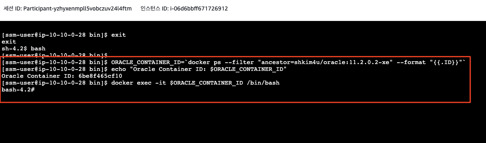
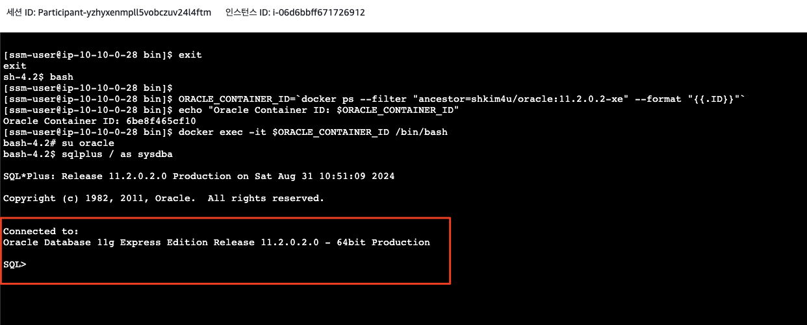
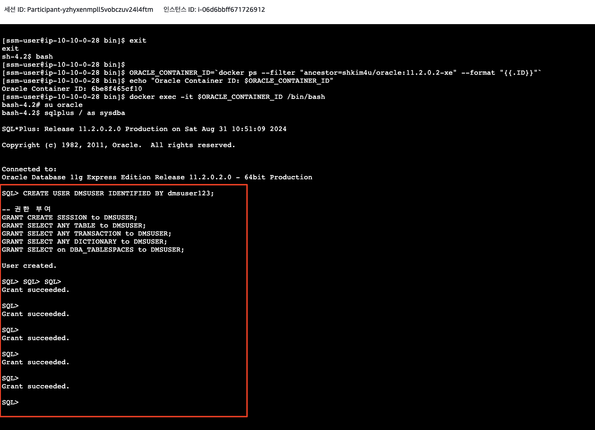

* ```애플리케이션 서버 (OnPremAppServer-DMSWorkshop-Source)```에 AWS 콘솔의 ```Session Manager```로 접속합니다.


* ```Oracle``` 데이터베이스 컨테이너 내로 직접 접속합니다.

```bash
bash

ORACLE_CONTAINER_ID=`docker ps --filter "ancestor=shkim4u/oracle:11.2.0.2-xe" --format "{{.ID}}"`
echo "Oracle Container ID: $ORACLE_CONTAINER_ID" 
docker exec -it $ORACLE_CONTAINER_ID /bin/bash
```



* ```oracle``` 유저로 전환합니다 (su - oracle).

```bash
su oracle
```

* ```sqlplus / as sysdba```로 데이터베이스에 접속합니다.

```bash
sqlplus / as sysdba
```




* ```AWS SCT```및 ```DMS```를 위한 공통 오라클 사용자(```DMSUSER```)를 생성하고 권한을 부여합니다.

```sql
-- 사용자 생성
CREATE USER DMSUSER IDENTIFIED BY dmsuser123;

-- 권한 부여
GRANT CREATE SESSION to DMSUSER;
GRANT SELECT ANY TABLE to DMSUSER;
GRANT SELECT ANY TRANSACTION to DMSUSER;
GRANT SELECT ANY DICTIONARY to DMSUSER;
GRANT SELECT on DBA_TABLESPACES to DMSUSER;
```


