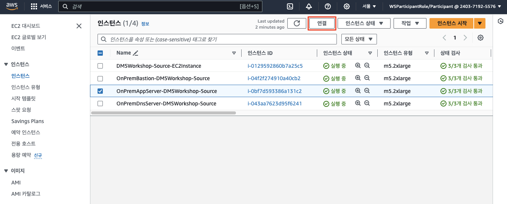
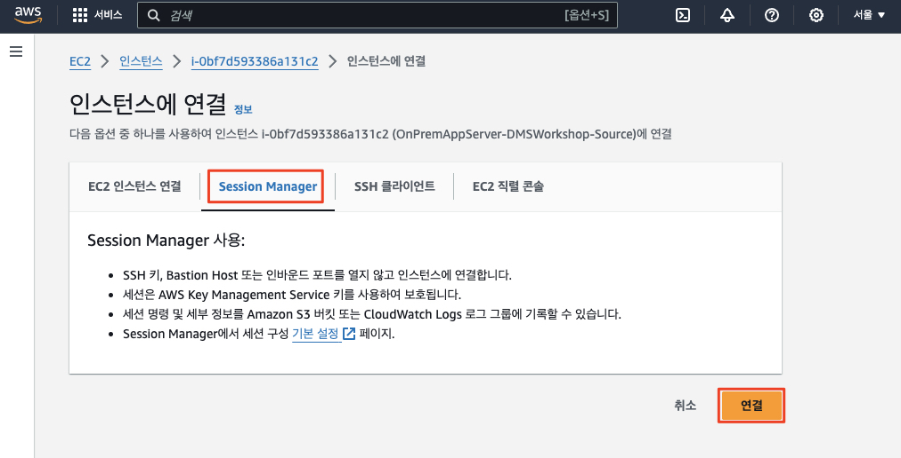
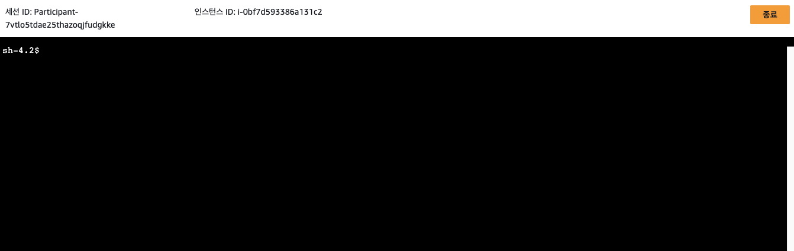
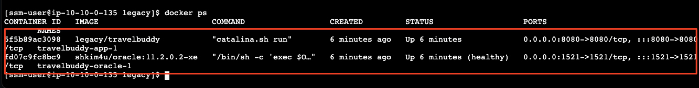
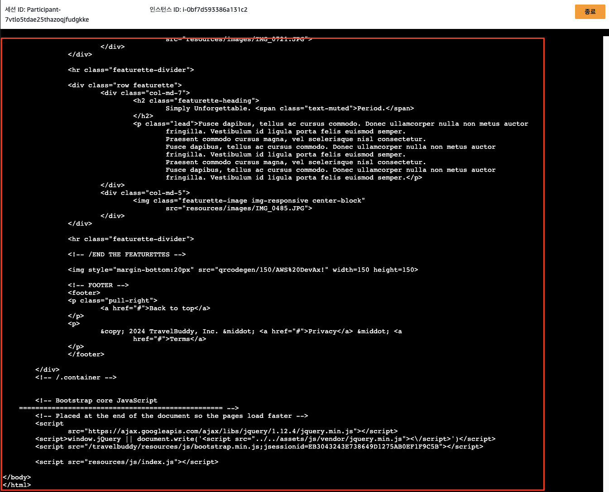
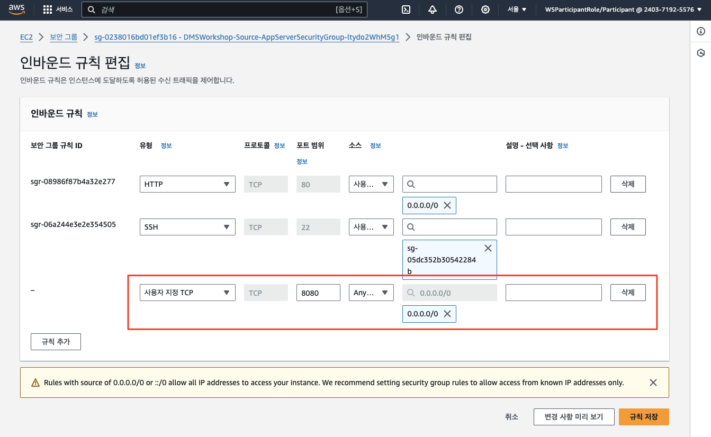
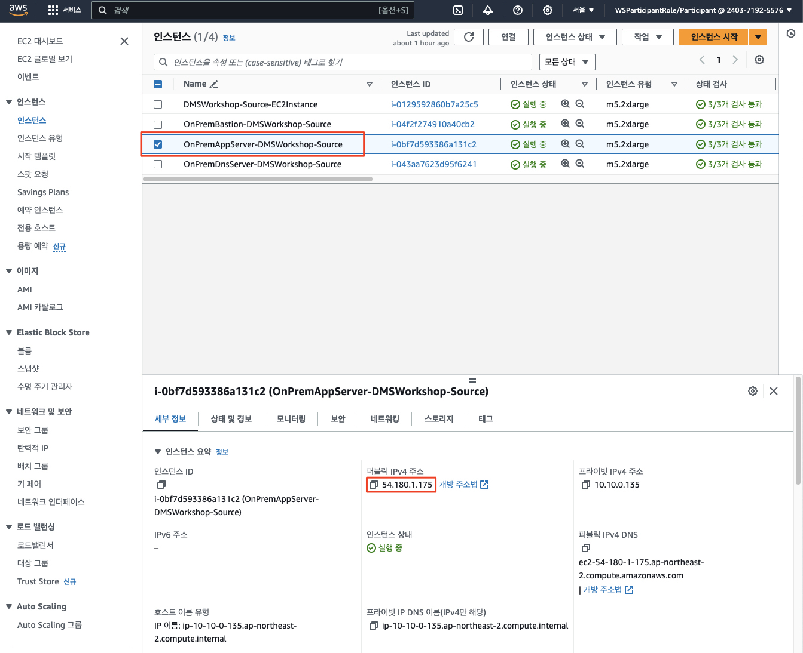
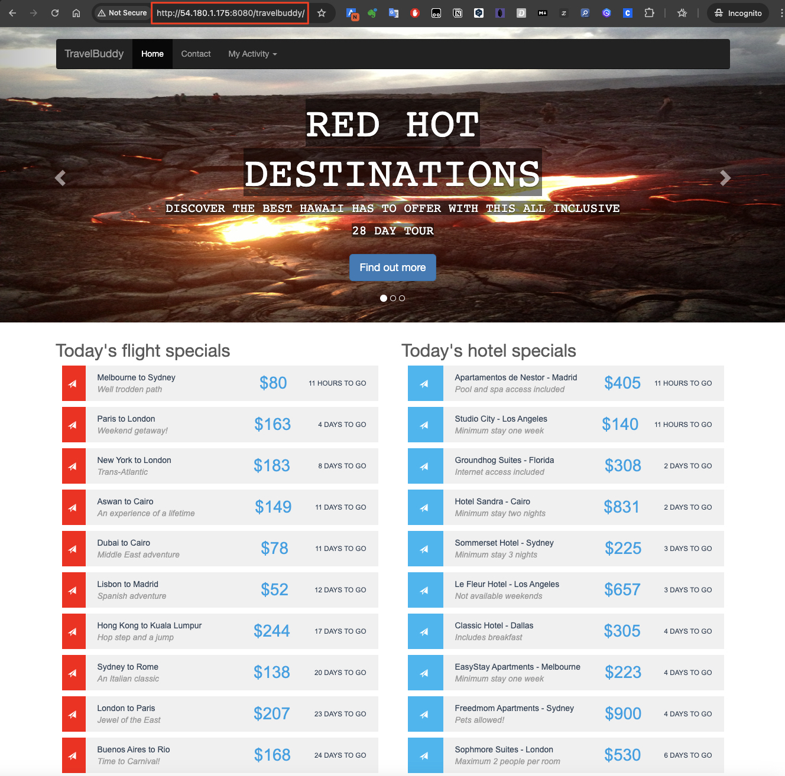

# ***(소스) 레거시 애플리케이션/데이터베이스 구성 및 실행***

> 📕 **소스 환경에서 작업**<br>
> 레거시 애플리케이션은 소스 환경에서 구동되므로 이 단계는 소스 환경에서 진행합니다.

우선 소스 환경에서 레거시 애플리케이션 및 데이터베이스를 구성하고 실행시켜 보도록 하겠습니다.

1. ```EC2 > 인스턴스```로 이동하여 ```OnPremAppServer-DMSWorkshop-Source``` (```애플리케이션 서버```) 인스턴스를 선택하고 ```연결```을 클릭합니다.

   

2. ```Session Manager```를 통해 인스턴스에 연결합니다.

   

   

3. 컨테이너화된 애플리케이션 및 데이터베이스 서버를 실행하여야 하므로 ```Docker```를 설치합니다.

   ```bash
   bash
   
   # 인스턴스에 설치한 패키지 및 패키지 캐시를 업데이트
   sudo yum update -y
   
   # 최신 Docker Engine 패키지를 설치
   sudo amazon-linux-extras install docker -y
   
   # Docker 서비스를 시작
   sudo service docker start
   
   # 시스템이 재부팅될 때마다 Docker 대몬이 시작되도록 하려면 다음 명령을 실행
   sudo systemctl enable docker
   
   # sudo를 사용하지 않고도 Docker 명령을 실행할 수 있도록 docker 그룹에 ec2-user를 추가
   sudo usermod -a -G docker ec2-user
   sudo usermod -a -G docker ssm-user
   
   docker ps
   
   # 만일 docker를 실행했을 때 권한 오류가 발생하면 docker 그룹으로 Change 하거나 인스턴스를 재부팅해봅니다.
   newgrp docker
   
   docker ps
   ```

4. 또한 다중 컨테이너 애플리케이션을 정의하고 실행하기 위해 ```Docker Compose```를 설치합니다.

   ```bash
   sudo curl -L "https://github.com/docker/compose/releases/download/v2.29.2/docker-compose-linux-x86_64" -o /usr/local/bin/docker-compose
   sudo chmod +x /usr/local/bin/docker-compose
   docker-compose --version
   ```

5. 오라클 데이터베이스를 컨테이너로 실행시키기 위하여 Base 이미지 (```Oracle 11gR2 XE```)를 다운로드 받고 이미지를 등록합니다.

   ```bash
   cd ~
   # Step 1: Download the Oracle 11gR2 XE Docker image
   wget https://application-migration-with-aws-workshop-ap-northeast-2.s3.ap-northeast-2.amazonaws.com/container/oracle-11.2.0.2-xe.tar.gz -O oracle-11.2.0.2-xe.tar.gz
   
   # Step 2: Extract the .gz file
   gunzip oracle-11.2.0.2-xe.tar.gz
   
   # Step 3: Load the Docker image
   docker load -i oracle-11.2.0.2-xe.tar
   ```

6. 애플리케이션 소스 코드, Dockerfile, Docker Compose 파일을 담고 있는 리포지터리를 클론합니다.

   ```bash
   cd ~

   # Update the package index
   sudo yum update -y
   
   # Install Git
   sudo yum install -y git
   
   # Verify the installation
   git --version

   git clone https://github.com/shkim4u/aws-database-migration.git
   ```

7. 클론한 리포지터리로 이동하여 애플리케이션을 빌드하고 실행합니다.

   ```bash
   cd ~/aws-database-migration/legacy
   docker-compose -p travelbuddy up -d
   docker ps
   ```

   

8. 애플리케이션 및 데이터베이스 컨테이너가 정상적으로 실행되었는지 확인합니다. 우선 로컬호스트에서 애플리케이션을 호출하여 정상적으로 응답이 오는지 확인합니다.

   > 📌 **참고**<br>
   > 오라클 데이터베이스가 초기화되는 몇 분 정도 걸릴 수 있으므로, 최초 실행 시 오류 메시지가 발생하면 잠시 기다렸다가 다시 실행해 보십시오.

   ```bash
   curl http://localhost:8080/travelbuddy/
   ```

   

9. 다음으로 ```애플리케이션 서버``` 보안 그룹에 ```8080``` 포트를 허용하여 외부에서도 애플리케이션에 접근할 수 있도록 합니다.

   

10. ```애플리케이션 서버```의 퍼블릭 IP 주소를 확인하고 이를 이용하여 애플리케이션에 접근합니다.

   

   

   > **주의**<br>
   > * 위에서 애플리케이션 동작을 확인할 사용하는 URL은 ```http://<애플리케이션 서버 퍼블릭 IP>:8080/travelbuddy/``` 입니다.
   > * Request Mapping 정의에 따라 마지막에 ```/```를 붙여주어야 함을 유의하십시요.
