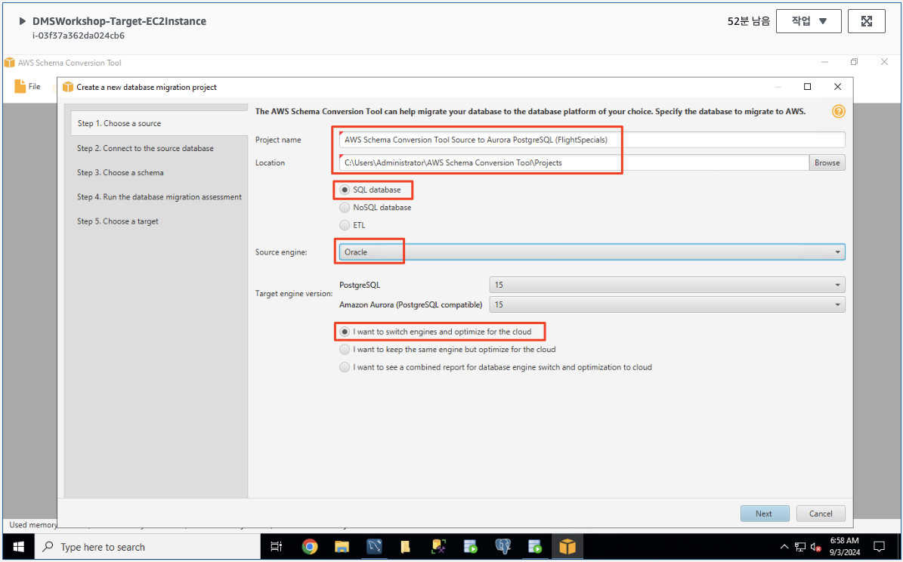
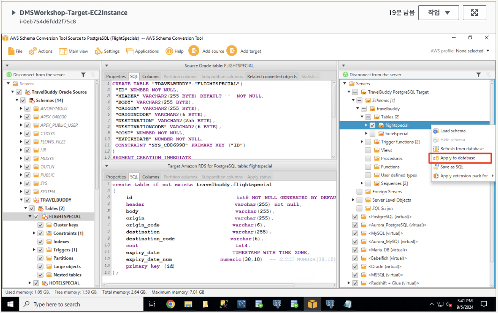

# ***```FlightSpecials``` 데이터베이스 스키마 전환***

## **Agenda**
1. 개요
2. ```AWS Schema Conversion Tool (AWS SCT)``` 설치
3. 데이터베이스 마이그레이션 프로젝트 생성
4. 스키마 변환
5. 프로시저 코드 수정

---

## **1. 개요**

```TravelBuddy``` 시스템의 두 가지 중요 기능 중 항공권 여정 프로모션 (```FlightSpecials```) 서비스의 데이터베이스 및 애플리케이션을 클라우드로 전환하는 작업을 시작합니다.

우선 ```FlightSpecials``` 데이터베이스의 스키마를 전환하는 작업을 수행합니다. 실제 데이터는 해당 ```FlightSpecials``` 서비스가 클라우드로 전화되기 직전에 옮겨질 예정이므로 여기서는 스키마만을 전환하도록 하겠습니다.

전환 작업은 ```Oracle``` 소스에서 ```Amazon Aurora PostgreSQL``` 타겟으로 진행합니다.


---

## **2. (타겟 환경) ```AWS Schema Conversion Tool (AWS SCT)``` 설치**

> 📕 **참고**<br>
> ```AWS SCT```가 타겟 환경의 ```EC2 인스턴스```에 이미 설치되어 있으면 이 과정을 건너뛰어도 됩니다.

EC2 인스턴스에 ```Fleet Manager``` 혹은 ```RDP```를 통해 연결한 후 ```AWS 스키마 변환 도구```를 설치합니다.

> ⚠️ (주의)<br>
> Chrome 이외의 브라우저를 사용하여 Fleet Manger RDP에 접속한 경우 클립보드를 통한 복사/붙여넣기를 사용할 수 없습니다. Chrome 브라우저의 사용을 권장하며 부득이 다른 브라우저를 사용할 경우 진행자에게 문의합니다.


1. EC2 서버에서 ```데스크톱```에 있는 ```DMS Workshop``` 폴더를 엽니다 (다른 앱이 열려 있는 경우 바탕 화면으로 이동하면 아래 이미지와 같은 폴더가 표시됩니다). 그런 다음 ```Schema Conversion Tool download``` 링크를 두 번 클릭하여 아래 그림과 같은 최신 버전의 소프트웨어를 다운로드합니다.

   

2. 다운로드가 완료되면 콘텐츠의 압축을 해제하고 ```AWS SCT``` 설치 패키지를 더블클릭하여 설치를 시작합니다. 기본값을 적용하여 설치 마법사 단계를 마치면 ```AWS Schema Conversion Tool``` 설치가 완료됩니다.

   > 📕 (참고)
   > - 때때로 ```Fleet Manager``` 세션에서 더블클릭하는 것이 까다로울 수 있습니다. 파일이 선택된 상태에서 ```Enter``` 키를 누르는 것이 쉬울 수 있습니다.<br>
   > - 또한 설치 마법사가 가려지는 경우도 있으므로 하단 작업 표시줄에 있는지 확인하고 클릭하면 해당 창을 다시 활성화할 수 있습니다.

   

   

   

   

   

   

   

   

3. 설치가 완료되면 ```시작 메뉴```로 이동하여 ```AWS Schema Conversion Tool```을 시작하거나 바탕 화면에서 ```AWS Schema Conversion Tool``` 아이콘을 더블클릭하여 실행합니다.

   

   

4. AWS에서는 관리 콘솔을 통해 소스 스키마를 변환하는 서비스의 기능을 점차 개선하고 있습니다. 하지만 일부 지원되지 않는 기능이 있으므로 오늘은 ```AWS SCT```를 사용하여 스키마를 변환합니다.

   

5. 이용약관에 동의하고 ```AWS SCT```를 실행합니다.

   

6. ```AWS SCT```가 정상적으로 실행되면 아래와 같이 화면이 표시됩니다.

---

## **3. 데이터베이스 마이그레이션 프로젝트 생성**

다음 단계는 설치된 ```스키마 변환 도구 (AWS Schema Conversion Tool)```를 사용하여 데이터베이스 마이그레이션 프로젝트를 생성하는 것입니다.

(Optional) ```Amazon Aurora PostgreSQL```을 타겟으로 하는 프로젝트를 생성하기 위해서는 우선 ```PostgreSQL JDBC 드라이버```를 설정합니다. 다음 단계를 따라 진행하세요.

1. (Optional) ```AWS SCT```를 실행한 후 ```Settings > Global Settings```를 선택합니다.

   

2. (Optional) ```PostgreSQL JDBC 드라이버```를 아래 그림과 같이 설정해 줍니다.
   * ```C:\Users\Administrator\Desktop\DMS Workshop\JDBC\postgresql-42.7.3.jar```

   

3. ```스키마 변환 도구``` 내에서 새 프로젝트 마법사가 시작되지 않으면 왼쪽 상단의 파일 메뉴로 이동하여 ```새 프로젝트 마법사```를 시작하세요. 프로젝트 마법사 모드에서 양식에 다음 값을 입력한 후 ```다음```을 클릭하세요. (때때로 다음 버튼이 표시되도록 하려면 창을 최대화하거나 이동해야 하는 경우가 있습니다.)

   

   

   | **파라미터**      | **값**                                                                                         |
   |---------------|-----------------------------------------------------------------------------------------------|
   | **프로젝트 이름**   | ```AWS Schema Conversion Tool Source to PostgreSQL (FlightSpecials)```                 |
   | **위치**        | ```C:\Users\Administrator\AWS Schema Conversion Tool\Projects (기본값)```                        |
   | **데이터베이스 타입** | ```SQL database```                                                                            |
   | **소스 엔진**     | ```Oracle```                                                                                  |
   | **타겟 엔진 버전**  | ```Amazon Aurora (PostgreSQL compatible) 15 ```                      |
   | **전환 옵션**     | ```나는 엔진을 전환하고 클라우드용으로 최적화하려고 합니다 (I want to switch engines and optimize for the cloud)``` 선택 |

   

4. 양식에 아래 값을 사용하여 소스 데이터베이스 구성을 지정합니다. 그런 다음 ```Test connection```을 클릭하세요. 연결 테스트가 성공적으로 완료되면 연결 성공 버튼에서 ```확인```을 클릭한 후 ```다음```을 클릭하세요.

   | **파라미터**                    | **값**                                                              |
   |-----------------------------|--------------------------------------------------------------------|
   | **연결 이름 (Connection name)** | ```TravelBuddy Oracle Source```                                    |
   | **타입**                      | ```SID```                                                          |
   | **서버 이름**                   | ```소스 환경의 CloudFormation의 출력 탭에서 확인 AppServer Private IP 확인```     |
   | **서버 포트**                   | ```1521```                                                         |
   | **SID**                     | ```XE```                                                           |
   | **사용자 이름**                  | ```travelbuddy```                                                  |
   | **암호**                      | ```welcome```                                                      |
   | **SSL 사용**                  | ```체크 해제 (미사용)```                                                  |
   | **암호 저장**                   | ```체크 (암호 저장)```                                                   |
   | **오라클 드라이버 경로**             | ```C:\Users\Administrator\Desktop\DMS Workshop\JDBC\ojdbc11.jar``` |

   

   

   > ⚠️ **참고**<br>
   > * 만약 연결 테스트가 실패하면 소스 데이터베이스 포트 ```1521```를 위한 위한 방화벽 (보안 그룹)에 ```10.16.0.0/12``` 대역이 허용되어 있는지 확인합니다.
   >   * 또한 아래와 같이 ```travelbuddy``` 사용자가 ```스키마 전환```에 필요한 권한이 없다는 오류가 나타날 수 있습니다.

   

    > 📕 **수행 과제 (이미 진행하였다면 건너뛰십시요!)**<br>
    > * <u>***소스 측을 담당하는 분께서는 위의 오류를 해결하고 다시 연결 테스트를 수행해 보도록 합니다.***</u>
    > * 타겟 측을 담당하시는 분과 긴밀하게 협력하여 진행해 주시면 감사하겠습니다.
    > * 힌트<br>
    >   * ```애플리케이션 서버 (OnPremAppServer-DMSWorkshop-Source)```에 AWS 콘솔의 ```Session Manager```로 접속합니다.
    >   * ```Oracle``` 데이터베이스 컨테이너로 직접 접속합니다 (docker exec -it <Oracle 컨테이너 ID> /bin/bash).
    >   * 이후에는 오라클 서버를 관린하는 옛날(?) 기억을 되살려 ```SQLPlus```를 사용하여 ```DMS_USER``` 사용자를 생성하고 필요한 권한을 부여합니다.

   * 소스 측에서 위 작업을 완료하면 타겟 측의 ```AWS SCT```로 돌아와 다음과 같이 값을 다시 설정하고 연결 테스트를 수행합니다.

   | **파라미터**                    | **값**                                                              |
   |-----------------------------|--------------------------------------------------------------------|
   | **연결 이름 (Connection name)** | ```TravelBuddy Oracle Source```                                    |
   | **타입**                      | ```SID```                                                          |
   | **서버 이름**                   | ```소스 환경의 CloudFormation의 출력 탭에서 확인 AppServer Private IP 확인```     |
   | **서버 포트**                   | ```1521```                                                         |
   | **SID**                     | ```XE```                                                           |
   | **사용자 이름**                  | ```dmsuser```                                                      |
   | **암호**                      | ```dmsuser123```                                                   |
   | **SSL 사용**                  | ```체크 해제 (미사용)```                                                  |
   | **암호 저장**                   | ```체크 (암호 저장)```                                                   |
   | **오라클 드라이버 경로**             | ```C:\Users\Administrator\Desktop\DMS Workshop\JDBC\ojdbc11.jar``` |

   

5. ```TRAVELBUDDY``` 스키마를 선택한 다음 ```다음```을 클릭합니다.

   > 📒 **참고**<br>
   > ```TRAVELBUDDY``` 스키마를 클릭하여야 ```다음``` 버튼이 활성화됩니다.

   

   

   > 📕 **참고**<br>
   > ```다음```을 누르고 메타데이터를 로드한 후 다음과 같은 경고 메시지가 나타날 수 있습니다. **Metadata loading was interrupted because of data fetching issues.** 이 메시지는 워크샵 진행에 영향을 주지 않으므로 무시해도 됩니다. ```SCT```가 데이터베이스 개체를 분석하는 데 몇 분 정도 걸립니다.

6. ```데이터베이스 마이그레이션 평가 보고서```의 요약 페이지를 검토한 다음 ```Amazon Aurora PostgreSQL``` 변환 섹션까지 아래로 스크롤합니다 (오른쪽 스크롤 막대의 중간 조금 아래에 있습니다).

   

   * ```SCT```는 소스 데이터베이스 스키마의 모든 개체를 자세히 검토합니다. 가능한 한 많은 것을 자동으로 변환하고 변환할 수 없는 항목에 대한 자세한 정보를 제공합니다.

   

   * 우리가 지금 마이그레이션 하고자 하는 ```TravelBuddy``` 데이터베이스에는 해당하지 않지만, 일반적으로 소스 데이터베이스는 패키지, 프로시저 및 함수는 가장 많은 사용자 지정 또는 비즈니스 로직 SQL 코드를 포함하고 있기 때문에 해결해야 할 문제가 있을 가능성이 높습니다. ```AWS SCT```는 각 개체 유형을 변환하는 데 필요한 수동 변경의 양을 산정합니다. 또한 이러한 개체를 대상 스키마에 성공적으로 적응시키기 위한 힌트를 제공합니다.

7. 데이터베이스 마이그레이션 평가 보고서 검토를 마친 후 ```다음```을 클릭합니다.

8. 아래 값을 사용하여 타겟 데이터베이스에 대한 정보를 제공합니다. ```Test connection``` 버튼을 눌러 연결 테스트가 성공적으로 완료되면 ```마침```을 클릭하세요.

   | **파라미터**                    | **값**                                                                        |
   |-----------------------------|------------------------------------------------------------------------------|
   | **타겟 엔진**                   | ```Amazon RDS for PostgreSQL (기본값이 아니므로 변경하세요)```                            |
   | **연결 이름 (Connection name)** | ```TravelBuddy PostgreSQL Target```                                          |
   | **서버 이름**                   | ```(진행자와 함께 타겟 환경의 RDS 콘솔에서 확인합니다)```                                        |
   | **서버 포트**                   | ```5432```                                                                   |
   | **데이터베이스**                  | ```dso```                                                                    |
   | **사용자 이름**                  | ```postgres```                                                               |
   | **암호**                      | ```<진행자와 함께 SecretsManager에서 확인>```                                          |
   | **SSL 사용**                  | ```체크 해제 (미사용)```                                                            |
   | **암호 저장**                   | ```체크 (암호 저장)```                                                             |
   | **Amazon Aurora 드라이버 경로**   | ```C:\Users\Administrator\Desktop\DMS Workshop\JDBC\postgresql-42.7.3.jar``` |

   * 아래와 같이 접속이 실패합니다. 진행자의 안내를 받아 필요한 설정을 수행하고 다시 시도해 보세요.

   

   * 타겟 환경의 ```DmsVPC```와 ```워크로드 VPC (M2M-VPC)``` 간의 라우팅 테이블 - 각 VPC에 ```10.16.0.0/12``` 주소 대역을 ```Transit Gateway```로 라우팅하는 라우팅 테이블이 있는지 확인합니다.
   * ```Amazon RDS PostgreSQL```의 보안 그룹 설정 - ```Inbound``` 규칙에 ```10.16.0.0/12``` 대역을 허용하는 규칙이 있는지 확인합니다.
   * 또한 ```pgAdmin4```를 통해 ```AWS SCT``` 및 ```AWS DMS``` 작업에 사용할 ```PostgreSQL``` 데이터베이스 유저를 생성하고 (`dmsuser`) 암호를 확인하여 입력해 줍니다. (진행자의 안내를 받아 ```AWS SecretsManager```에 저장된 비밀번호를 확인하고 접속하십시요)

       ```sql
       CREATE ROLE dmsuser LOGIN PASSWORD 'dmsuser123';
       GRANT CREATE ON DATABASE dso TO dmsuser;
       ALTER DATABASE dso SET SEARCH_PATH = "$user", public_synonyms, public;
       GRANT rds_superuser TO dmsuser; -- 필요 시 제한적 사용
       ```


[//]: # ([Step 3: Configure Your PostgreSQL Target Database]&#40;https://docs.aws.amazon.com/dms/latest/sbs/chap-oracle2postgresql.steps.configurepostgresql.html&#41;)

[//]: # ([Migrating from Oracle to Amazon RDS for PostgreSQL or Amazon Aurora PostgreSQL with AWS Schema Conversion Tool]&#40;https://docs.aws.amazon.com/SchemaConversionTool/latest/userguide/CHAP_Source.Oracle.ToPostgreSQL.html&#41;)


[//]: # (    ```sql)

[//]: # (    CREATE USER dmsuser WITH PASSWORD 'dmsuser123';)

[//]: # (    ALTER USER dmsuser WITH SUPERUSER;)

[//]: # (    GRANT CONNECT ON DATABASE dso TO dmsuser;)

[//]: # (    GRANT USAGE ON SCHEMA schema_name TO postgresql_sct_user;)

[//]: # (    GRANT SELECT ON ALL TABLES IN SCHEMA schema_name TO postgresql_sct_user;)

[//]: # (    GRANT ALL ON ALL SEQUENCES IN SCHEMA schema_name TO postgresql_sct_user;)

[//]: # (    ```)

[//]: # (  ![PostgreSQL Workbench로 PostgreSQL 사용자 생성 및 권한 부여]&#40;../../images/mysql-workbench-create-sct-dms-user.png&#41;)

[//]: # (![SCT PostgreSQL TravelBuddy 타겟 연결 실패]&#40;../../images/SCT-travelbuddy-mysql-connect-fail-dmsuser.png&#41;)

   


   > 📕 **참고**<br>
   > ```다음```을 누르고 메타데이터를 로드한 후 다음과 같은 경고 메시지가 나타날 수 있습니다. **Metadata loading was interrupted because of data fetching issues.** 이 메시지는 워크샵 진행에 영향을 주지 않으므로 무시해도 됩니다. ```SCT```가 데이터베이스 개체를 분석하는 데 몇 분 정도 걸립니다.

---

## **4. 스키마 변환**

이제 ```TravelBuddy``` 애플리케이션이 사용하는 데이터베이스를 오라클에서 PostgreSQL 데이터베이스로 이기종 스키마 변환을 수행해 보겠습니다.

1. 화면 왼쪽 소스에서 ```TRAVELBUDDY``` 스키마를 클릭합니다.

   

   > 📒 **참고**<br>
   > 오른쪽에 보이는 Postgres 타겟에는 ```travelbuddy```와 같은 애플리케이션별 스키마가 없다는 것을 알 수 있습니다. 다음 몇 단계에서 ```SCT``` 프로세스의 일부로 이를 생성하겠습니다.


* ```AWS SCT```는 스키마를 분석하고 ```PostgreSQL```로의 변환을 위한 데이터베이스 마이그레이션 평가 보고서를 생성합니다. 비교적 간단한 ```TravelBuddy``` 스키마에는 해당되지 않지만, 빨간색으로 채워진 느낌표가 있는 항목은 원본에서 대상으로 자동 변환할 수 없는 항목을 나타냅니다. 여기에는 대표적으로 ```저장 프로시저```와 ```패키지``` 등이 포함됩니다.

2. ```보기``` 버튼을 클릭하고 ```평가 보고서 보기```를 선택합니다.

   

3. 보고서의 ```작업 항목 (Action Items)``` 탭으로 이동하여 도구로 변환할 수 없는 항목을 확인하고 수동으로 변경해야 하는 정도를 알아보세요. ```TravelBuddy``` 애플리케이션에는 해당되지 않지만 대개의 경우 ```저장 프로시저``` 혹은 ```패키지``` 등의 커스텀 코드에서 수동으로 변경이 필요할 수 있습니다. 또한 테이블 컬럼의 데이터 유형 정확도 (Precision) 등에서 최적화가 되면 좋을 내용이 있을 수 있습니다. 일단 스키마 전환에 영향을 주지 않는 항목이므로 무시하고 진행합니다.

   

4. 여기서 우리는 오라클 소스의 ```TRAVELBUDDY``` 스키마를 타겟 ```PostgreSQL```에서는 ```dso.travelbuddy``` 스키마 (데이터베이스)로 변경해 보고자 합니다. 아래와 같이 ```보기 (View) > Mapping View```로 이동합니다.

   

5. ```New mapping rule``` > ```Add new rule```을 클릭하여 새로운 매핑 규칙을 추가하기 위한 화면을 준비합니다.

   

   

   * 진행자의 안내를 받아 아래 `JSON` 형식의 매핑 규칙을 윈도우 인스턴스 측에 파일로 저장한 후 `AWS SCT`에 업로드하여 적용합니다.

   ```json
   {
     "rules": [
       {
         "rule-type": "selection",
         "rule-id": "1",
         "rule-name": "SelectFlightspecial",
         "object-locator": {
           "schema-name": "TRAVELBUDDY",
           "table-name": "FLIGHTSPECIAL"
         },
         "rule-action": "include",
         "filters": []
       },
       {
         "rule-type": "transformation",
         "rule-id": "2",
         "rule-name": "SchemaLower",
         "rule-action": "convert-lowercase",
         "rule-target": "schema",
         "object-locator": {
           "schema-name": "TRAVELBUDDY"
         }
       },
       {
         "rule-type": "transformation",
         "rule-id": "3",
         "rule-name": "TableLower",
         "rule-action": "convert-lowercase",
         "rule-target": "table",
         "object-locator": {
           "schema-name": "TRAVELBUDDY",
           "table-name": "FLIGHTSPECIAL"
         }
       },
       {
         "rule-type": "transformation",
         "rule-id": "4",
         "rule-name": "IdLower",
         "rule-action": "convert-lowercase",
         "rule-target": "column",
         "object-locator": {
           "schema-name": "TRAVELBUDDY",
           "table-name": "FLIGHTSPECIAL",
           "column-name": "ID"
         }
       },
       {
         "rule-type": "transformation",
         "rule-id": "5",
         "rule-name": "HeaderLower",
         "rule-action": "convert-lowercase",
         "rule-target": "column",
         "object-locator": {
           "schema-name": "TRAVELBUDDY",
           "table-name": "FLIGHTSPECIAL",
           "column-name": "HEADER"
         }
       },
       {
         "rule-type": "transformation",
         "rule-id": "6",
         "rule-name": "BodyLower",
         "rule-action": "convert-lowercase",
         "rule-target": "column",
         "object-locator": {
           "schema-name": "TRAVELBUDDY",
           "table-name": "FLIGHTSPECIAL",
           "column-name": "BODY"
         }
       },
       {
         "rule-type": "transformation",
         "rule-id": "7",
         "rule-name": "OriginLower",
         "rule-action": "convert-lowercase",
         "rule-target": "column",
         "object-locator": {
           "schema-name": "TRAVELBUDDY",
           "table-name": "FLIGHTSPECIAL",
           "column-name": "ORIGIN"
         }
       },
       {
         "rule-type": "transformation",
         "rule-id": "8",
         "rule-name": "OriginCodeRename",
         "rule-action": "rename",
         "rule-target": "column",
         "object-locator": {
           "schema-name": "TRAVELBUDDY",
           "table-name": "FLIGHTSPECIAL",
           "column-name": "ORIGINCODE"
         },
         "value": "origin_code"
       },
       {
         "rule-type": "transformation",
         "rule-id": "9",
         "rule-name": "DestinationLower",
         "rule-action": "convert-lowercase",
         "rule-target": "column",
         "object-locator": {
           "schema-name": "TRAVELBUDDY",
           "table-name": "FLIGHTSPECIAL",
           "column-name": "DESTINATION"
         }
       },
       {
         "rule-type": "transformation",
         "rule-id": "10",
         "rule-name": "DestinationCodeRename",
         "rule-action": "rename",
         "rule-target": "column",
         "object-locator": {
           "schema-name": "TRAVELBUDDY",
           "table-name": "FLIGHTSPECIAL",
           "column-name": "DESTINATIONCODE"
         },
         "value": "destination_code"
       },
       {
         "rule-type": "transformation",
         "rule-id": "11",
         "rule-name": "CostLower",
         "rule-action": "convert-lowercase",
         "rule-target": "column",
         "object-locator": {
           "schema-name": "TRAVELBUDDY",
           "table-name": "FLIGHTSPECIAL",
           "column-name": "COST"
         }
       },
       {
         "rule-type": "transformation",
         "rule-id": "12",
         "rule-name": "ExpiryDateRename",
         "rule-action": "rename",
         "rule-target": "column",
         "object-locator": {
           "schema-name": "TRAVELBUDDY",
           "table-name": "FLIGHTSPECIAL",
           "column-name": "EXPIRYDATE"
         },
         "value": "expiry_date"
       }
     ]
   }
   ```

[//]: # (6. 아래와 같이 스키마 이름을 ```m2m```으로 변경하는 매핑 규칙을 추가합니다.)

[//]: # (    * **Name** : ```RenameSchema```)

[//]: # (    * **For**: ```schema```)

[//]: # (    * **where schema name like**: ```TRAVELBUDDY```)

[//]: # (    * **Actions**: ```rename to``` ```m2m```)

[//]: # (    * ```Save > Close``` 버튼 클릭)

[//]: # ()
[//]: # (   ![SCT TravelBuddy 스키마 변환 Mapping View 3]&#40;../../images/sct-travelbuddy-schema-mapping-new-rule-rename-schema.png&#41;)

6. ```보기 > Data Migration View (Standard DMS)```로 전환합니다.

   

7. 왼쪽 패널에서 ```TRAVELBUDDY``` 스키마를 오른쪽 버튼 클릭하고 ```스키마 변환 (Convert Schema)```를 클릭합니다.

   

8. 스키마가 변환되어 오른쪽 타겟 쪽에서 표시되면 아래 그림과 같이 스키마 객체를 선택하고 소스와 타겟을 비교할 수 있게 됩니다.

    

   * 타겟 쪽 테이블 정의에 아래 스크립트를 붙여넣고 `CTRL + S`를 눌러 저장합니다.

   ```sql
   create table if not exists travelbuddy.flightspecial
   (
       id                              int8 NOT NULL GENERATED BY DEFAULT AS IDENTITY,
       header                          varchar(255) not null,
       body                            varchar(255),
       origin                          varchar(255),
       origin_code                     varchar(6),
       destination                     varchar(255),
       destination_code                varchar(6),
       cost                            int4,
       expiry_date                     TIMESTAMP WITH TIME ZONE,
       expiry_date_num                 numeric(38,10),  -- 소스의 NUMBER(38,10) 데이터 타입
       primary key (id)
   );
   ```

   

9. 타겟 측에서 `flightspecial` 테이블 만을 선택한 후 `데이터베이스에 적용 (Apply to database)` 버튼을 누릅니다.

   

9. "대상 데이터베이스에 개체가 이미 존재할 수 있습니다. 바꾸시겠습니까?"라는 대화 상자가 표시될 수 있습니다. **예**를 선택합니다.

   

   

10. ```TravelBuddy``` 데이터베이스 스키마 중 `FlighSpecials` 서비스가 사용하는 테이블 (`flightspecial`)을 오라클 소스에서 ```Amazon Aurora PostgreSQL``` 타겟으로 성공적으로 변환했습니다.

11. 마지막으로 `FlightSpecials` 서비스는 신규 서비스 기능을 위해 소스에는 없었던 몇몇 추가적인 테이블을 사용합닏다. 해당 테이블들을 `pgAdmin4`에서 생성해 줍니다.

   ```sql
   create sequence if not exists travelbuddy.hibernate_sequence start 1 increment 1;
   create table if not exists travelbuddy.flight
   (
      flight_no                       int8 GENERATED ALWAYS AS IDENTITY,
      profile_id                      varchar(255),
      flight_name                     varchar(255) not null,
      pushing_status_code             varchar(255) not null,
      poping_step                     int4         not null,
      register_id                     varchar(255) not null,
      registration_date_time          TIMESTAMP    not null,
      primary key (flight_no)
      );
   create table if not exists travelbuddy.flight_name_history
   (
      flight_name_history_no          int8 GENERATED ALWAYS AS IDENTITY,
      flight_name                     varchar(255) not null,
      flight_no                       int8         not null,
      primary key (flight_name_history_no)
      );
   
   alter table travelbuddy.flight_name_history
      add constraint flight_name_history_fk_flight_no foreign key (flight_no) references travelbuddy.flight;
   ```

   

이제 다음 단계로 진행하여 ```PostgreSQL```을 사용하는 애플리케이션 증 ```FlightSpecials``` 기능을 클라우드로 이전해 보도록 하겠습니다.

---

## **References**
* [Oracle Sequences and Identity Columns and PostgreSQL Sequences and AUTO INCREMENT Columns](
  https://docs.aws.amazon.com/dms/latest/oracle-to-aurora-mysql-migration-playbook/chap-oracle-aurora-mysql.sql.identity.html)

* [Oracle 데이터베이스를 Amazon Aurora로 마이그레이션 하기](https://aws.amazon.com/ko/blogs/korea/how-to-migrate-your-oracle-database-to-amazon-aurora/)
