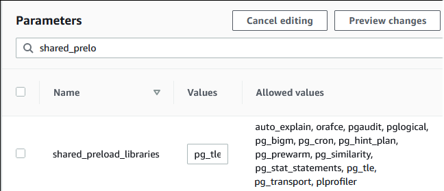
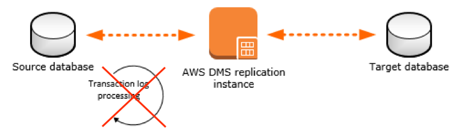
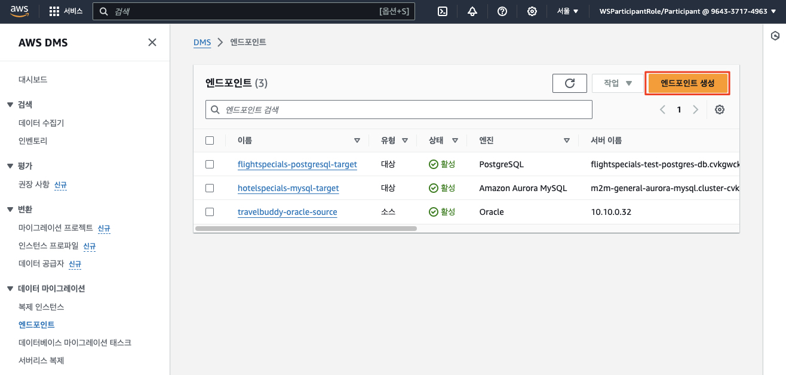
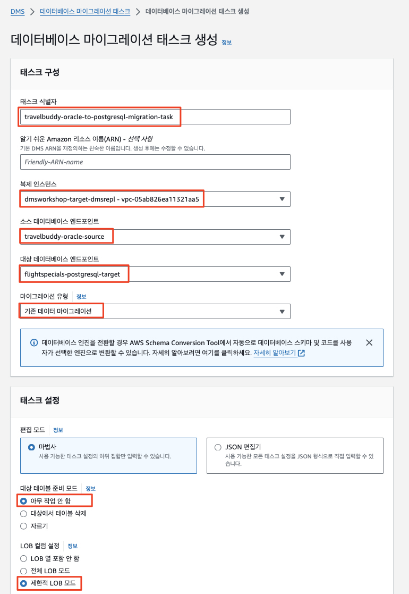
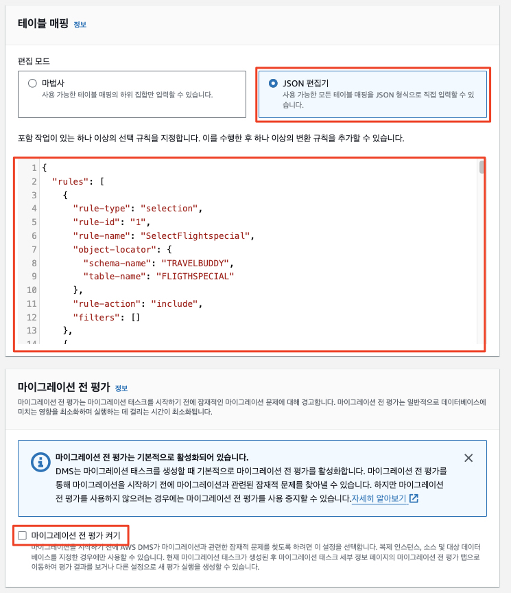
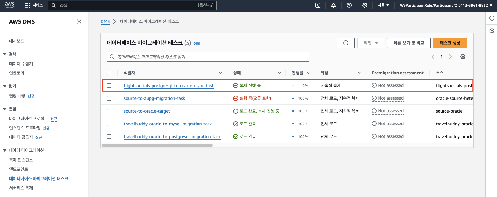

# ***데이터베이스 역동기화 (Reverse Synchronization)***

---

## **Agenda**
1. 개요
2. `PostgreSQL` 지속적 복제 설정
3. 복제 인스턴스 확인
4. 소스 및 타겟 엔드포인스 생성
5. `DMS 마이그레이션 태스크` 생성
6. 데이터 변경 및 역동기화 테스트

---

## **1. 개요**

우리는 이제까지 `TravelBuddy` 애플리케이션과 데이터베이스를 클라우드로 마이그레이션하는 과정을 살펴보았습니다.

하지만 `TravelBuddy` 애플리케이션의 모든 운영 인프라가 한번에 새로운 환경으로 옮겨오는 것은 매우 복잡하고 위험하며 많은 시간이 소요되는 작업이므로, 기존 운영 환경의 일부와 병행 운영하는 기간이 필요할 수 있습니다 (```Parallel Run```).

이러한 기존 운영 환경의 예로서는 다음과 같은 것들이 있습니다.
* `BI (Business Intelligence)` 시스템이 연전히 기존 데이터베이스를 참조
* 제3자 결제 관련 정산 (Settlement) 및 대사 (Reconciliation) 시스템
* SAP와 같은 ERP 시스템
* 기타 외부 시스템과의 연동

따라 실제 프로젝트에서는 이러한 작업을 주된 마일스톤 단위로 나누고 각 단계별로 안정성을 검증하며 진행합니다. 그리고 우리는 이러한 단계 중 많은 부분을 순서대로 접해 보았습니다.

이제 마지막 작업으로 위의 기존 운영 환경과의 병행 운영을 감안하여 (예: 기존 데이터베이스를 참조하는 `BI` 시스템) 신규 시스템에서의 데이터 변경 사항을 기존 운영 환경으로 역동기화하는 작업을 수행해 보겠습니다.

---

## **2. PostgreSQL 지속적 복제 설정**

현재 사용 가능한 모든 `RDS for PostgreSQL` 버전은 논리적 복제 기능을 지원하며 이를 위해서는 아래 사항을 적용하여야 합니다. `pglogical` 확장은 `PostgreSQL 버전 10`에서 도입된 기능적으로 유사한 논리적 복제 기능보다 먼저 출시되었습니다.

1. 논리적 복제를 위한 데이터베이스 파라미터 설정 (`테라폼`으로 배포 시 이미 적용되어 있음)
   1. `shared_preload_libraries` 파라미터에 `pglogical` 포함
      1. 
   2. `rds.logical_replication` 파라미터를 `1`로 설정
2. `dso` 데이터베이스에 대한 `pglogical` 확장 생성 (`pgAdmin4` 또는 `psql` 쿼리로 수행)
   1. ```SQL
      -- `pglogical`이 초기화 되었는지 확인 (기대값: rdsutils,pglogical)
      SHOW shared_preload_libraries;
      -- 논리적 디코딩을 위한 설정 확인 (기대값: logical)
      SHOW wal_level;
      CREATE EXTENSION pglogical;
      ```
3. `PostgreSQL` 데이터베이스 재부팅
   1. ```bash
      aws rds reboot-db-instance --db-instance-identifier flightspecials-test-postgres-db
      ```

* 참고: [pglogical을 사용하여 인스턴스 간 데이터 동기화](https://docs.aws.amazon.com/ko_kr/AmazonRDS/latest/UserGuide/Appendix.PostgreSQL.CommonDBATasks.pglogical.html)

---

## **3. 복제 인스턴스 확인**

우리는 아래 그림과 같이 소스 데이터베이스 (`FlightSpecials` PostgreSQL)로부터 타겟 데이터베이스 (`TravelBuddy` Oracle)로 데이터를 복제할 예정입니다.

주목할 사항은 다음과 같습니다.
* 기존의 정방향 마이그레이션과 달리, 이번에는 이제까지 타겟으로 삼았던 데이터베이스의 변경된 데이터를 기존의 소스 데이터베이스로 역동기화하는 작업입니다. 즉, 방향이 반대가 되어 소스가 타겟이 되고 타겟이 소스로 되는 것입니다.
* `FlightSpecials` 서비스 데이터의 `SSoT`는 신규 클라우드 환경으로 옮겨 왔으므로 새로운 데이터는 이제 클라우드의 `PostgreSQL` 데이터베이스에 저장됩니다. 이러한 새로운 데이터만을 기존 `Oracle` 데이터베이스로 역동기화할 것이므로 <u>***변경분만 복제***</u>하도록 합니다.

환경 설정과정에서 생성되었던 ```DMS 복제 인스턴스 (Replication Instance)```를 그대로 사용하도록 하겠습니다.



1. ```DMS > 데이터 마이그레이션 > 복제 인스턴스```로 이동합니다.

2. 이미 환경 설정 과정에서 생성된 복제 인스턴스 (```dmsworkshop-target-dmsrepl```)가 존재할 것입니다. 이번에는 이 복제 인스턴스를 사용합니다.

   

---

## **4. 소스 및 타겟 엔드포인스 생성**

### **4.1. 소스 엔드프인트 생성**

1. ```DMS > 데이터 마이그레이션 > 엔드포인트```로 이동한  후 오른쪽 상단의 ```엔드포인트 생성```을 클릭합니다.

   

2. ```소스 엔드포인트```를 선택한 후 다음 정보를 입력한 후 ```연결 테스트```을 클릭합니다. 상태가 **성공**으로 바뀌면 **엔드포인트 생성**을 클릭합니다.

   | **파라미터**                    | **값**                                           |
            |-----------------------------|-------------------------------------------------|
   | **엔드포인트 유형**                | ```소스 엔드포인트```                                  |
   | **RDS DB 인스턴스 선택**          | ```체크```                                        |
   | **RDS DB 인스턴스**             | ```flightspecials-test-postgres-db```           |
   | **엔드포인트 식별자**               | ```flightspecials-postgresql-rsync-source```    |
   | **대상 엔진**                   | ```PostgreSQL```                                |
   | **엔드포인트 데이터베이스 액세스**        | ```수동으로 액세스 정보 제공```                            |
   | **서버 이름**                   | ```(자동으로 설정)```                                 |
   | **포트**                      | ```5432```                                      |
   | **사용자 이름**                  | ```dmsuser```                                   |
   | **비밀번호**                    | ```dmsuser123```                                |
   | **SSL 모드**                  | ```없음```                                        | 
   | **데이터베이스 이름**               | ```dso```                                       | 
   | **엔드포인트 연결 테스트 -> VPC**     | ```이름에 DmsVpc가 포함된 VPC ID```                    |
   | **엔드포인트 연결 테스트 -> 복제 인스턴스** | ```dmsworkshop-target-dmsrepl```                |

   

   

   

   

   > 📌 **참고**<br>
   > * 사실 우리는 앞선 과정에서 이미 동일한 `PostgreSQL` 데이터베이스에 대한 엔드포인트를 생성하였습니다. `AWS DMS 마이그레이션 태스크`는 동일한 엔드포인트 설정이라면 소스와 타겟에 관계없이 엔드포인트를 재사용할 수 있으므로 엔드포인트를 새로 생성하지 않고 이전에 생성한 엔드포인트를 그대로 사용할 수 있습니다.
   > * 하지만 소스와 타겟에 따라 `Read-only` 속성이나 `Extra Connection Attributes (ECA)` 등이 다를 수 있으므로, 그 때는 새로운 엔드포인트를 생성하여 사용하는 것이 좋습니다.
   > * 대표적인 예가 앞서 수행했던 `PostgreSQL` 타겟 엔드포인트에서 추가 연결 속성을 지정했던 부분입니다 (`truncateTrailingZerosForPlainNumeric=true`). 

### **4.2. 타겟 엔드포인트 생성**

1. ```DMS > 데이터 마이그레이션 > 엔드포인트```로 이동한  후 오른쪽 상단의 ```엔드포인트 생성```을 클릭합니다.

   

2. 다음 값들을 사용하여 소스 ```TravelBuddy``` 데이터베이스에 대한 엔드포인트를 생성합니다.

3. ```소스 엔드포인트```를 선택한 후 다음 정보를 입력한 후 ```연결 테스트```을 클릭합니다. 상태가 **성공**으로 바뀌면 **엔드포인트 생성**을 클릭합니다.

   | **파라미터**                | **값**                                                     |
            |-------------------------|-----------------------------------------------------------|
   | **엔드포인트 유형**            | ```타겟 엔드포인트```                                            |
   | **RDS DB 인스턴스 선택**      | ```체크 해제 (선택하지 않음)```                                     |
   | **엔드포인트 식별자**           | ```travelbuddy-oracle-target```                           |
   | **소스 엔진**               | ```Oracle```                                              |
   | **엔드포인트 데이터베이스 액세스**    | ```수동으로 액세스 정보 제공```                                      |
   | **서버 이름**               | ```(소스 측 담당자분 확인) 소스 측에서 생성된 오라클 데이터베이스 주소 (애플리케이션 서버)``` |
   | **포트**                  | ```1521```                                                |
   | **SSL 모드**              | ```없음```                                                  |
   | **사용자 이름**              | ```dmsuser```                                             |
   | **비밀번호**                | ```dmsuser123```                                          |
   | **SID/Service Name**    | ```XE```                                                  |   
   | **엔드포인트 연결 테스트 -> VPC** | ```이름에 DmsVpc가 포함된 VPC ID```                              |
   | **엔드포인트 연결 테스트 -> 복제 인스턴스**             | ```dmsworkshop-target-dmsrepl```                          |

   

   

   

   

---

## **5. ```DMS 마이그레이션 태스크``` 생성**

1. ```DMS > 데이터 마이그레이션 > 데이터베이스 마이그레이션 태스크```로 이동한 다음 오른쪽 상단에서 ```태스크 생성``` 버튼을 클릭합니다.

   

2. ```TRAVELBUDDY``` 스키마의 마이그레이션을 위해 다음 값을 사용하여 ```데이터베이스 마이그레이션 태스크```를 생성합니다. (아래 적히지 않은 값들은 기본값을 사용합니다)

   | **파라미터**                         | **값**                                                     |
         |----------------------------------|-----------------------------------------------------------|
   | **태스크 식별자**                      | ```flightspecials-postgresql-to-oracle-rsync-task```      |
   | **친숙한 Amazon 리소스 이름(ARN)**       | ```비워둠```                                                 |
   | **복제 인스턴스**                      | ```dmsworkshop-target-dmsrepl``` (혹은 별도로 생성한 복제 인스턴스의 이름) |
   | **소스 데이터베이스 엔드포인트**              | ```flightspecials-postgresql-rsync-source```              |
   | **대상 데이터베이스 엔드포인트**              | ```travelbuddy-oracle-target```                           |
   | **마이그레이션 유형**                    | ```데이터 변경 사항만 복제```                                       |
   | **대상 테이블 준비 모드**                 | ```아무 작업 안 함``` (기본값 아님)                                  |
   | **LOB 컬럼 설정**                    | ```제한된 LOB 모드```                                          |
   | **최대 LOB 크기(KB)**                | ```32```                                                  |
   | **데이터 검증**                       | ```끄기```                                                  |
   | **태스크 로그 / CloudWatch 로그 켜기**    | ```CloudWatch 로그 켜기 체크``` (기본값 아님)                        |
   | **로그 컨텍스트**                      | ```체크된 상태로 로깅의 기본 수준 사용```                                |

3. ```테이블 매핑``` 섹션을 확장하고 편집 모드로 ```JSON 편집기```를 선택하고 아래 JSON 텍스트를 붙여넣습니다. 종종 많은 변환 규칙을 정의할 때는 ```JSON``` 형태로 정의된 템플릿을 사용하는 것이 편리하게 작업할 수 있으며, ```DMS```가 데이터를 변환하는 방법을 세밀하게 제어할 수 있습니다.

   ```json
   {
      "rules": [
         {
            "rule-type": "transformation",
            "rule-id": "556134354",
            "rule-name": "556134354",
            "rule-target": "column",
            "object-locator": {
               "schema-name": "travelbuddy",
               "table-name": "flightspecial",
               "column-name": "expiry_date"
            },
            "rule-action": "rename",
            "value": "EXPIRYDATE",
            "old-value": null
         },
         {
            "rule-type": "transformation",
            "rule-id": "556002807",
            "rule-name": "556002807",
            "rule-target": "column",
            "object-locator": {
               "schema-name": "travelbuddy",
               "table-name": "flightspecial",
               "column-name": "detination_code"
            },
            "rule-action": "rename",
            "value": "DESTINATIONCODE",
            "old-value": null
         },
         {
            "rule-type": "transformation",
            "rule-id": "555920505",
            "rule-name": "555920505",
            "rule-target": "column",
            "object-locator": {
               "schema-name": "travelbuddy",
               "table-name": "flightspecial",
               "column-name": "origin_code"
            },
            "rule-action": "rename",
            "value": "ORIGINCODE",
            "old-value": null
         },
         {
            "rule-type": "transformation",
            "rule-id": "555867091",
            "rule-name": "555867091",
            "rule-target": "column",
            "object-locator": {
               "schema-name": "travelbuddy",
               "table-name": "flightspecial",
               "column-name": "%"
            },
            "rule-action": "convert-uppercase",
            "value": null,
            "old-value": null
         },
         {
            "rule-type": "transformation",
            "rule-id": "555830387",
            "rule-name": "555830387",
            "rule-target": "table",
            "object-locator": {
               "schema-name": "travelbuddy",
               "table-name": "flightspecial"
            },
            "rule-action": "convert-uppercase",
            "value": null,
            "old-value": null
         },
         {
            "rule-type": "transformation",
            "rule-id": "555805535",
            "rule-name": "555805535",
            "rule-target": "schema",
            "object-locator": {
               "schema-name": "travelbuddy"
            },
            "rule-action": "convert-uppercase",
            "value": null,
            "old-value": null
         },
         {
            "rule-type": "selection",
            "rule-id": "555776470",
            "rule-name": "555776470",
            "object-locator": {
               "schema-name": "travelbuddy",
               "table-name": "flightspecial"
            },
            "rule-action": "include",
            "filters": []
         }
      ]
   }
   ```

4. ```태스크 생성```을 클릭합니다.

   TODO: 상황에 맞는 화면 덤프

   * ```마이그레이션 태스크 시작 구성``` 아래 ```생성 시 자동으로 시작```이 선택되어 있는지 확인한 다음 ```태스크 생성```을 클릭합니다.

   * 설정된 화면은 아래와 유사합니다.

   

   

   

   


5. ```마이그레이션 태스크``` 실행이 시작되고 소스 (`Amazon RDS PostgreSQL`) `travelbuddy` 스키마의 데이터가 온프레미스 `Oracle` 데이터베이스로 복제되기 시작합니다.

   

---

## **6. 데이터 변경 및 역동기화 테스트**


1. 우선 데이터 변경을 위한 API 엔드포인트를 설정합니다.

```bash
export API_URL=http://$(kubectl get ingress/flightspecials-ingress -n flightspecials -o jsonpath='{.status.loadBalancer.ingress[*].hostname}')
export API_URI=${API_URL}/travelbuddy/flightspecials/1/name && echo ${API_URI}
```

2. 확인된 API 엔드포인트를 이용하여 데이터 변경을 수행합니다.

```bash
curl --location --verbose ${API_URI} --header 'Content-Type: application/json' --data '{"id": 1, "flightSpecialHeader": "London to Busan"}'
```

TODO: 이미지

6. ```마이그레이션 태스크 (flightspecials-postgresql-to-oracle-rsync-task)```를 클릭하고 ```테이블 통계``` 탭으로 이동하여 테이블 통계를 보고 이동된 행 수를 확인합니다.

TODO: 이미지 교체

   

---

## 🎉🎉🎉 축하합니다! 🎉🎉🎉

### - ```FlightSpecials``` 서비스의 데이터 마이그레이션이 성공적으로 완료되었고, 프론트엔드를 통해서도 성공적으로 서비스되고 있음을 확인하였습니다.

### - 이로서 앞서 진행한 ```HotelSpecials``` 서비스의 데이터 마이그레이션과 함께 ```TravelBuddy``` 애플리케이션의 모든 데이터베이스와 서비스의 마이그레이션이 성공적으로 완료되었습니다.

### - 이제 모든 데이터의 ```SSoT```가 신규 클라우드 환경에 있음을 선언하고 전체 서비스 트래픽을 신규 환경으로 재개하면 됩니다.


