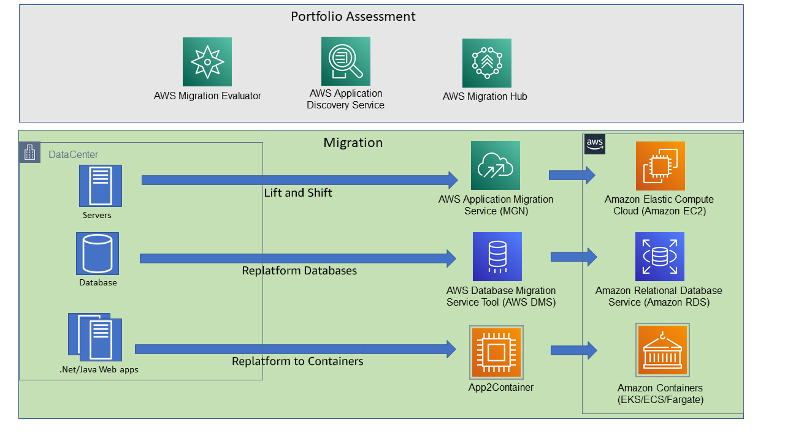

# ***애플리케이션과 함께 데이터베이스 마이그레이션***

---

## **Agenda**
1. 개요
2. 시나리오
3. 실습 단계

---

## **1. 개요**

애플리케이션 데이터베이스 리팩토링은 데이터베이스 스키마를 변경하고 데이터를 마이그레이션하는 작업을 말합니다. 이 작업은 데이터베이스의 테이블 구조를 변경하거나 데이터를 이전하는 등의 작업을 포함합니다. 특히 이 과정에서 온프레이스 환경으로부터 클라우드 환경으로의 데이터 마이그레이션을 수행하는 경우가 많습니다.

또한 데이터베이스는 대개의 경우 홀로 존재하지 않고 애플리케이션에 포함되어 사용되므로, 데이터베이스와 함께 애플리케이션의 마이그레이션을 다루어 봄으로써, 데이터베이스 마이그레이션 과정을 보다 실질적으로 이해해 보고자 합니다.



> **참고**<br>
> * 위 그림과 같이 AWS는 데이터베이스 마이그레이션 뿐만 아니라, 데이터베이스를 사용하는 애플리케이션을 보다 용이하게 전환할 수 있도록 다양한 마이그레이션 서비스를 제공합니다.
> * 이번 주제가 데이터베이스의 전환을 주로 다루는 것이므로, 이러한 서비스를 깊이 있게 알아보지는 않을 것이지만 필요에 따라 활용되고 있는 서비스에 대해서는 간략히 언급할 예정입니다.

---

## **2. 시나리오**

이번 실습은 다음과 같은 시나리오로 진행됩니다.

### **여행 전문 애플리케이션 ```TravelBuddy``` 소개**

`TravelBuddy`는 관광 및 여행 전문 서비스 회사로서 동명의 `TravelBuddy`라는 애플리케이션을 통해 다양한 관광, 여행, 숙박 관련 서비스를 제공하고 있습니다.<br>

이 회사가 운영하는 `TravelBuddy` 애플리케이션은 사용자 친화적인 기능과 인터페이스를 통해 많은 고객을 유치함으로써 회사의 성장에 크게 기여하였습니다.

하지만 고객이 늘어나고 회사가 성장함에 따라 시스템에 발생하는 장애도 함께 증가하고 있으며, 유연하지 못한 시스템 구조로 인한 신규 서비스 출시 지연은 비지니스 민첩성마저 저하시키고 있습니다.

또한 애플리케이션의 데이터베이를 `Oracle 11gR2`로 운용하고 있는데, 이로 인해 다음과 같은 고충 사항을 가지고 있습니다.
* 높은 라이선스 비용을 지불
* 시스템 개선을 위한 확장성이 떨어짐
* 새로운 기술을 수용을 어렵게 하고 기술 부채로서 작용

이 실습에서는 낙후된 애플리케이션과 데이터베이스를 현대화된 클라우드 환경으로 전환하는 작업을 수행해 봄으로서 애플리케이션 및 데이터베이스 리팩토링 과정이 어떤 모습으로 일어나는지 살펴볼 예정입니다.<br>

고객은 현행 애플리케이션을 고객의 `온프레미스` (`On-Premise`) 서버 상에서 아래와 같이 운영하고 있습니다.
* **애플리케이션**: `Java Spring Boot` (컨테이너화 되어 있음)
* **주요 서비스**: 호텔 조회, 항공권 조회 (모놀리스 구조)
* **데이터베이스**: `Oracle 11gR2`

목표하는 환경은 아래와 같습니다.
* **애플리케이션**: `Amazon EKS (Elastic Kubernetes Service)` (컨테이너 오케스트레이션 서비스)
* **주요 서비스**: 항공권 여정 조회, 호텔 예약 (마이크로서비스 구조)
* **데이터베이스** (Polyglot Persistence)
  * 호텔 조회: `Amazon Aurora (MySQL)` 
  * 항공권 조회: `Amazon Aurora (PostgreSQL)` 

다음 순서로 진행합니다.

---

## **3. 실습 단계**

아래와 같은 단계로 애플리케이션과 함께 데이터베이스를 마이그레이션합니다.

TODO: Migration Path 옵션에 대한 설명 추가
TODO: 대량의 데이터를 마이그레이션 하는 작업이 무중단 시간을 작게 가져가면서 수행하기에는 어려움을 설명

> 📕 **참고**<br>
> * [[무중단 데이터베이스 마이그레이션 전략 및 고려 사항]](./Zero-Downtime-Migration-Strategy.md)

무중단 데이터베이스 마이그레이션 누구에게나 매력적으로 들릴 수 있지만 실제 환경에서는 달성하기 어려운 목표일 수 있습니다.<br>
예를 들어 데이터베이스 관리자는 변경 데이터 캡처를 위한 시스템 설정 및 변경을 극도로 제한하는 등의 제약을 받을 수 있습니다.<br>


1. 프론트엔드 사용자 인터페이스 분리 (React.js 등), 백엔드 도메인 주소의 TTL 값을 미리 축소해 둠 -> ```HotelSpecials``` 데이터베이스 스키마 전환 -> 애플리케이션의 리플랫폼 (EC2 -> EKS)을 통한 ```HotelSpecials``` 백엔드 애플리케이션 마이그레이션 및 실행 -> ALB Request Routing 설정 -> [애플리케이션 트래픽 유입 중단] -> ```HotelSpecials``` 데이터 마이그레이션 -> 프론트엔드 To 백엔드 접속 DNS를 ALB로 변경 (최초 일회) -> [넓은 지역으로 DNS 전파가 확인되면 트래픽 유입 재개] -> ```HotelSpecials``` 데이터의 SSOT 클라우드 전환 완료, ```FlightSpecials``` 트래픽은 기존 온프레미스로 유입 -> ```FlightSpecials``` 데이터베이스 스키마 전환 -> [애플리케이션 트래피 유입 중단] -> ```FlightSpecials``` 서비스 마이그레이션 및 실행 -> ```FlightSpecials``` 데이터 마이그레이션 ``` -> ALB 요청 라우팅 설정 -> [애플리케이션 트래픽 유입 재개] -> ```HotelSpecials``` 데이터 SSOT 클라우드 전환 완료 -> 데이터베이스 역동기화

* [(소스) 레거시 애플리케이션/데이터베이스 구성 및 실행](./Configure-and-Launch-Legacy-Application-and-Database.md)
* [(타겟) 신규 데이터베이스 및 애플리케이션 인프라 구성](./Configure-New-Database-and-Application-Infrastructure.md)
* [사용자 인터페이스 (프론트엔드) 분리](./Separate-Frontend.md)
* [```HotelSpecials``` 데이터베이스 스키마 전환](./Convert-HotelSpecials-Database-Schema.md)
* [```HotelSpecials``` 서비스 마이그레이션](./Migrate-HotelSpecials-Service.md)
* [```Application Load Balancer (ALB)``` 요청 라우팅 설정](./Configure-ALB-Request-Routing.md)
* [애플리케이션 트래픽 유입 중단](./Stop-Application-Traffic-Inflow.md)
* [```HotelSpecials``` 데이터 마이그레이션](./Migrate-HotelSpecials-Data.md)
* [프론트엔드의 백엔드 접속 엔드포인트 (DNS)를 ALB로 변경](./Change-Frontend-Backend-ALB.md)
* [넓은 지역으로 DNS 전파 확인](./Check-DNS-Propagation.md)
* [프론트엔드로 트래픽 유입 재개](./Resume-Frontend-Traffic.md)
* [```HotelSpecials``` 데이터의 SSOT 클라우드 전환 완료 선언](./Declare-HotelSpecials-SSOT-Cloud-Transition-Complete.md)
* [```FlightSpecials``` 데이터베이스 스키마 전환](./Convert-FlightSpecials-Database-Schema.md)
* [애플리케이션 트래픽 유입 중단](./Stop-Application-Traffic-Inflow.md)
* [```FlightSpecials``` 서비스 마이그레이션](./Migrate-FlightSpecials-Service.md)
* [```FlightSpecials``` 데이터 마이그레이션](./Migrate-FlightSpecials-Data.md)
* [프론트엔드로 트래픽 유입 재개](./Resume-Frontend-Traffic.md)
* [```FlightSpecials``` 데이터의 SSOT 클라우드 전환 완료 선언](./Declare-FlightSpecials-SSOT-Cloud-Transition-Complete.md)
* [데이터베이스 역동기화](./Database-Reverse-Synchronization.md)
