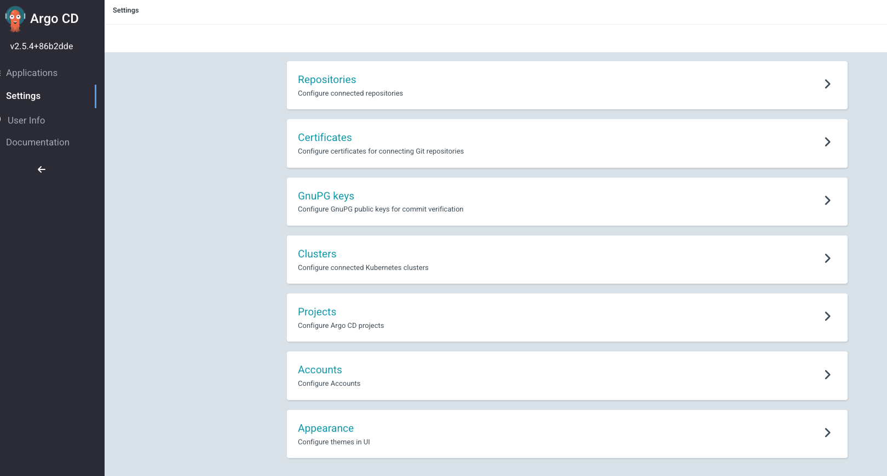
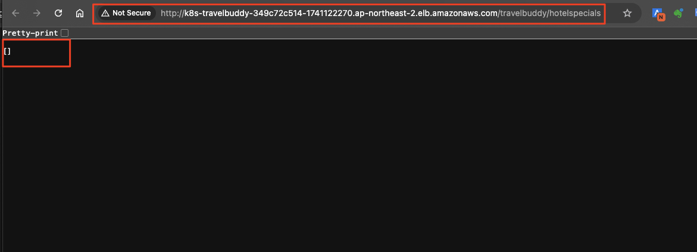

# ***```FlightSpecials``` 서비스 마이그레이션***

## **어젠다**
1. 개요
2. ```FlightSpecials``` 서비스 ```Amazon EKS``` 클러스터에 배포
   1. ```GitOps``` 리포지터리 (```Helm```) 설정
   2. ```GitOps``` 배포 설정 (```ArgoCD```)
   3. ```FlightSpecials``` 서비스 빌드
   4. ```FlightSpecials``` 서비스 배포 확인
3. 다음 단계

---

## **1. 개요**

우리는 앞서 `HotelSpecials` 서비스의 데이터베이스를 ```Oracle```에서 ```Amazon Aurora MySQL```로 마이그레이션하였습니다. 그리고 기존의 `TravelBuddy`애플리케이션을 최대한 활용하면서 빠르게 클라우드로 이전하기 위해 ```Amazon EKS``` 클러스터에 배포하는 작업을 진행하였습니다.

이번에는 `FlightSpecials` 서비스를 새로운 기술 스택을 사용하여 구현하고 이를 ```Amazon EKS``` 클러스터에 배포하는 작업을 진행하겠습니다.

활용되는 기술 스택에는 다음과 같은 것들이 있습니다.
* ```Domain Driven Design (DDD)``` 기반 설계 및 ```레이어드 아키텍처```
* ```Gradle``` 멀티 프로젝트 구조
* ```Spring Cloud``` 프레임워크 및 ```Apache Kafka```를 활용한 ```Event-Driven 아키텍처```

우리는 데이터베이스 마이그레이션에 집중해야 하므로 이런한 주제는 다음으로 미루고 빠르게 ```FlightSpecials``` 서비스 애플리케이션을 배포하도록 하겠습니다.

---

## **2. ```FlightSpecials``` 서비스 ```Amazon EKS``` 클러스터에 배포**

### **2.1. ```GitOps``` 리포지터리 (```Helm```) 설정**

애플리케이션이 빌드되면 ```Amazon EKS``` 클러스터에 배포하기 위한 ```GitOps``` 리포지터리를 설정합니다.

앞서 ```HotelSpecials``` 배포에서 살펴본 것처럼 이 리포지터리는 ```GitOps```를 담당하는 ```ArgoCD```에 의해 사용되며, 컨테이너 이미지가 빌드되어 ```ECR```에 푸시되면 이 리포지터리를 통해 ```Amazon EKS``` 클러스터에 배포됩니다.

컨테이너 이미지 빌드 파이프라인은 아래에서 설정합니다.

```bash
# 1. 어플리케이션 Helm Artifact 경로로 이동
cd ~/environment/aws-database-migration/modernization/applications/FlightSpecials/helm

# 2. git 연결
git init
git branch -M main

export HELM_CODECOMMIT_URL=$(aws codecommit get-repository --repository-name flightspecials-configuration --region ap-northeast-2 | grep -o '"cloneUrlHttp": "[^"]*' | grep -o '[^"]*$')
echo $HELM_CODECOMMIT_URL

# CodeCommit 배포 리포지터리와 연결
git remote add origin $HELM_CODECOMMIT_URL

# 3. Git 스테이징 영역에 파일을 추가합니다.
git add .

# 4. Commit 및 배포 리포지터리에 Push합니다.
git commit -am "First commit."
git push --set-upstream origin main
```

### **2.2. ```GitOps``` 배포 설정 (```ArgoCD```)**

1. ArgoCD 접속에 필요한 정보 확인 및 접속<br>

테라폼을 통해서 이미 배포한 EKS 클러스터에는 ```ArgCD```가 설치되어 있으며, 또한 ```AWS ELB (Elastic Load Balancer)```를 통하여 외부에서 접속할 수 있습니다.<br>

아래와 같이 ```ArgoCD``` 접속에 필요한 URL을 확인합니다.<br>

```bash
# ArgoCD 접속 주소 확인
kcp
export ARGOCD_SERVER=`kubectl get ingress/argocd-server -n argocd -o json | jq --raw-output '.status.loadBalancer.ingress[0].hostname'`
echo https://$ARGOCD_SERVER
```

확인한 접속 주소와 이미 설정한 패스워드 (```Abraca00#1```)를 사용하여 ArgoCD Web UI에 접속해 봅니다.


2. (Optional) ```ArgoCD```가 배포 (Helm) 리포지터리에 접속할 수 있도록 IAM 사용자 및 Git Credentials을 생성하고 메모해 둡니다. 만약 이전 단계에서 사용자를 생성하였으면 해당 정보를 사용합니다.<br>

```bash
# IAM User 생성
aws iam create-user --user-name argocd 

# AWSCodeCommitPowerUser 관리형 권한 정책 연결 (arn:aws:iam::aws:policy/AWSCodeCommitPowerUser)
aws iam attach-user-policy --user-name argocd --policy-arn arn:aws:iam::aws:policy/AWSCodeCommitPowerUser

# CodeCommit 접근을 위한 Specific Credential 생성
# (중요) 결과로서 반환되는 "ServiceUserName"과 "ServicePassword"를 기록해 둡니다.
aws iam create-service-specific-credential --user-name argocd --service-name codecommit.amazonaws.com
```

3. ArgoCD 설정<br>
- 로그인 이후 좌측의 ```Settings```를 클릭한 뒤 ```Repositories``` 항목을 클릭합니다.<br>

  

- Connect Repo 버튼을 클릭하고 Method는 ```VIA HTTPS```, Project는 ```default```를 입력합니다.<br>

- ```Repository URL```에는 앞서 확인한 배포 ```CodeCommit``` Repository의 HTTPS 주소를 (혹은 아래 CLI로 확인 가능), Username 및 Password에는 메모해 둔 정보를 입력합니다.<br>

   ```bash
   export HELM_CODECOMMIT_URL=$(aws codecommit get-repository --repository-name flightspecials-configuration --region ap-northeast-2 | grep -o '"cloneUrlHttp": "[^"]*'|grep -o '[^"]*$')
   echo $HELM_CODECOMMIT_URL
   ```

  

  

- ```Application``` 텝에서 ```NewApp```버튼을 클릭하고 아래 정보를 ```애플리케이션``` 하나를 생성합니다. 이는 ```ArgoCD```가 배포를 관리하는 애플리케이션 하나를 등록하는 의미입니다.

    * **Application Name**: ```flightspecials```
    * **Project**: ```default```
    * **Sync Policy**: ```Manual```
    * **Repository URL**: ```앞서 설정한 배포 리포지터리```
    * **PATH**: ```.```
    * **Destination 섹션 > Cluster URL**: ```https://kubernetes.default.svc```
    * **Destination 섹션 > Namespace**: ```flightspecials```를 입력하고 상단의 Create를 클릭합니다.

  

  > (참고)<br>
  > Application 생성 시 화면 하단에 Helm Setting 값들이 정상적으로 표시되는지 확인합니다.

### **2.3. ```FlightSpecials``` 서비스 빌드**

1. ```Cloud9``` 상에서 ```FlightSpecials``` 서비스의 소스 코드를 푸시하고 빌드 파이프라인을 실행합니다.

    ```bash
    # 1. 어플리케이션 소스 경로로 이동
    cd ~/environment/aws-database-migration/modernization/applications/FlightSpecials/build/
    
    # 2. git 연결
    git init
    git branch -M main
    
    export BUILD_CODECOMMIT_URL=$(aws codecommit get-repository --repository-name flightspecials-application --region ap-northeast-2 | grep -o '"cloneUrlHttp": "[^"]*'|grep -o '[^"]*$')
    echo $BUILD_CODECOMMIT_URL
    
    git remote add origin $BUILD_CODECOMMIT_URL
    # (예)
    # git remote add origin https://git-codecommit.ap-northeast-2.amazonaws.com/v1/repos/M2M-BuildAndDeliveryStack-SourceRepository
    
    # 3. Git 스테이징 영역에 파일을 추가합니다.
    git add .
    
    # 4. Commit 및 Push합니다.
    git commit -am "First commit."
    git push --set-upstream origin main
    ```

3. ```CodeCommit``` 리포지터리에 소스 코드가 푸시되었음을 확인합니다.

   

4. 또한 빌드 파이프라인도 트리거되어 실행되었음을 확인합니다. 다만, Build Spec이 없거나 정상적으로 구성되지 않은 등의 이유로 파이프라인은 실패하였을 수 있습니다. 발생한 오류를 확인하고 수정합니다.

   

### **2.4. ```FlightSpecials``` 서비스 배포 확인**

위의 과정이 정상적으로 수행되면 ```ArgoCD```에서 ```flightspecials``` 애플리케이션에 대한 배포가 자동으로 수행됩니다.


위 화면에서 ```flightspecials-ingress``` 항목의 링크 열기 미니 아이콘을 클릭하여 ```FlightSpecials``` 서비스가 정상적으로 배포되었는지 확인합니다.


아래와 같이 요청이 정상적으로 처리되면 브라우저에 표시됩니다.



> 📌 **참고**<br>
> 브라우저에서 아무 데이터가 표시되지 않는 것은 정상입니다.<br>
> 우리가 아직 데이터 마이그레이션을 수행하지 않았으므로 데이터베이스에 데이터가 없기 때문입니다.

이 상태에서 프론트엔드를 확인해 보면 아래와 같이 보이게됩니다.


> 📌 **참고**<br>
> * 위 화면과 같은 이유로 각 서비스를 단계별로 이관할 때도 해당 서비스의 순단이 발생할 수 있습니다.
> * 혹은 서비스 별 이관에 하나의 차원을 더해 각 엔드 유저들을 추가로 확인하여 마이그레이션이 완전히 완료된 사용자의 트래픽만 클라우드로 라우팅하는 방법도 있습니다. 하지만 이는 보다 정교한 준비와 구현이 필요합니다.

> ❓ **의문점**<br>
> * 우리가 앞선 과정에서 설정한 `/*` 경로를 온프레미스 애플리케이션 서비스로 보내는 `AWS ALB` Rule은 특별히 삭제하지 않았음에도 불구하고 해당 로드밸런서 항목에서는 삭제되어 동작하지 않습니다. 이는 왜 그런 것일까요?
>   * 
> * 원인을 정확하게 이해하려면 `Kubernetes`의 `Ingress` 리소스와 이의 AWS 구현체인 `AWS Load Balancer Controller`에 대한 이해가 필요합니다.
> * 이런 이해와 함께 `ExternalDNS`, `ClusterIP` 등을 결합하면 더 정교한 병행 운영 (Parallel Run)을 위한 적용을 도모할 수 있습니다.

---

## **다음 단계**

> 📕 **현재 상황 정리**<br>
> * 항공권 여정 프로모션 서비스의 기능이 클라우드에서 동작하기 시작하였습니다.
> * 이 서비스가 사용하는 데이터베이스를 클라우드로 마이그레이션하고 앞서 온프레미스로 라우팅 되었던 요청 트래픽을 새로 클라우드로 배포된 `FlightSpecials` 서비스로 전송하게되면 데이터베이스와 애플리케이션의 전환 과정을 끝나게 됩니다.
> * 이제 `FlightSpecials` 서비스의 데이터를 마이그레이션하도록 하겠습니다.
