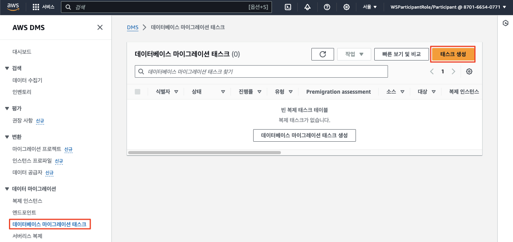

# ***```HotelSpecials``` 데이터 마이그레이션***

---

## **Agenda**

1. 개요
2. 복제 인스턴스 확인
3. 소스 및 타겟 엔드포인트 생성
4. ```DMS 마이그레이션 태스크``` 생성 및 마이그레이션 실행
5. 타겟 데이터베이스에서 데이터 확인
6. 프론트엔드에서 데이터 확인

---

[//]: # (> **참고**<br>)

[//]: # (> 이후 단계를 먼저 진행하면 변경되는 모습을 확인하면서 진행할 수 있습니다.)

## **1. 개요**

이제 ```HotelSpecials``` 데이터 마이그레이션을 수행합니다.

```AWS Database Migration Service (DMS)```를 사용하여 소스 데이터베이스에서 대상 ```Amazon Aurora MySQL```로 데이터를 마이그레이션해 보도록 하겠습니다.

한편 이렇게 수행되는 데이터 마이그레이션은 ```HotelSpecials``` 서비스의 데이터 ```SSoT (Single Source of Truth)```를 타겟 테이터베이스로 전환하는 것을 목표로 하므로 전체 Full Load만을 수행하고 지속적 변경 복제는 수행하지 않습니다.

```AWS DMS```는 데이터 마이그레이션과 특별히 관련되지 않은 보조 인덱스, 시퀀스, 기본값, 저장 프로시저, 트리거, 동의어, 뷰 및 기타 스키마 객체를 마이그레이션하지 않습니다. 이러한 객체들은 ```AWS Schema Conversion Tool```을 사용하여 미리 ```Amazon Aurora MySQL```  대상으로 마이그레이션해 두었습니다 (가정).

---

## **2. 복제 인스턴스 확인**

우리는 아래 그림과 같이 소스 데이터베이스 (```TravelBuddy 오라클 데이터베이스```)로부터 타겟 데이터베이스 (```HotelSpecials Amazon Aurora MySQL```)로 데이터를 복제할 예정입니다.

이를 위해 환경 설정 과정에서 생성되었던 ```DMS 복제 인스턴스 (Replication Instance)```를 그대로 사용합니다.


1. ```DMS > 데이터 마이그레이션 > 복제 인스턴스```로 이동합니다.

2. 이미 환경 설정 과정에서 생성된 복제 인스턴스 (```dmsworkshop-target-dmsrepl```)가 존재할 것입니다. 이번에는 이 복제 인스턴스를 사용합니다.  

    

---

## **3. 소스 및 타겟 엔드포인트 생성**

### **3.1. 소스 엔드포인트 생성**

1. ```DMS > 데이터 마이그레이션 > 엔드포인트```로 이동한  후 오른쪽 상단의 ```엔드포인트 생성```을 클릭합니다.

    

2. ```소스 엔드포인트```를 선택한 후 다음 정보를 입력한 후 ```연결 테스트```을 클릭합니다. 상태가 **성공**으로 바뀌면 **엔드포인트 생성**을 클릭합니다.

   | **파라미터**                | **값**                                                     |
      |-------------------------|-----------------------------------------------------------|
   | **엔드포인트 유형**            | ```소스 엔드포인트```                                            |
   | **RDS DB 인스턴스 선택**      | ```체크 해제 (선택하지 않음)```                                     |
   | **엔드포인트 식별자**           | ```travelbuddy-oracle-source```                           |
   | **소스 엔진**               | ```Oracle```                                              |
   | **엔드포인트 데이터베이스 액세스**    | ```수동으로 액세스 정보 제공```                                      |
   | **서버 이름**               | ```(소스 측 담당자분 확인) 소스 측에서 생성된 오라클 데이터베이스 주소 (애플리케이션 서버)``` |
   | **포트**                  | ```1521```                                                |
   | **SSL 모드**              | ```없음```                                                  |
   | **사용자 이름**              | ```dmsuser```                                             |
   | **비밀번호**                | ```dmsuser123```                                          |
   | **SID/Service Name**    | ```XE```                                                  |   
   | **엔드포인트 연결 테스트 -> VPC** | ```DMSWorkshop-Target-DmsVPC```                           |
   | **복제 인스턴스**             | ```dmsworkshop-target-dmsrepl```                          |

   

   

   

### **3.2. 타겟 엔드포인트 생성**

1. 동일하게 다음 값을 사용하여 ```Aurora MySQL```에 대한 타겟 엔드포인트를 생성합니다```연결  테스트```를 수행하고 ```엔드포인트 생성```을 클릭합니다.

   | **파라미터**                | **값**                                                         |
      |-------------------------|---------------------------------------------------------------|
   | **엔드포인트 유형**            | ```대상 엔드포인트```                                                |
   | **엔드포인트 식별자**           | ```hotelspecials-mysql-target```                              |
   | **대상 엔진**               | ```Amazon Aurora MySQL```                                     |
   | **엔드포인트 데이터베이스 액세스**    | ```수동으로 액세스 정보 제공```                                          |
   | **서버 이름**               | ```(RDS 콘솔 -> m2m-general-aurora-mysql -> 라이터 엔드포인트 이름 사용)``` |
   | **포트**                  | ```3306```                                                    |
   | **사용자 이름**              | ```dmsuser```                                                 |
   | **비밀번호**                | ```dmsuser123```                                              |
   | **SSL 모드**              | ```없음```                                                      | 
   | **엔드포인트 연결 테스트 -> VPC** | ```DMSWorkshop-Target-DmsVpc```                                  |
   | **복제 인스턴스**             | ```dmsworkshop-target-dmsrepl```                              |

   

   

   

   

---

## **4. ```DMS 마이그레이션 태스크``` 생성 및 마이그레이션 실행**

1. ```DMS > 데이터 마이그레이션 > 데이터베이스 마이그레이션 태스크```로 이동한 다음 오른쪽 상단에서 ```태스크 생성``` 버튼을 클릭합니다.

   

2. ```TRAVELBUDDY``` 스키마의 마이그레이션을 위해 다음 값을 사용하여 ```데이터베이스 마이그레이션 태스크```를 생성합니다.

   | **파라미터**                         | **값**                                                    |
   |----------------------------------|----------------------------------------------------------|
   | **태스크 식별자**                      | ```travelbuddy-oracle-to-mysql-migration-task```         |
   | **친숙한 Amazon 리소스 이름(ARN)**       | ```비워둠```                                                |
   | **복제 인스턴스**                      | ```dmsworkshop-target-dmsrepl``` (혹은 별도로 생성한 복제 인스턴스의 이름) |
   | **소스 데이터베이스 엔드포인트**              | ```travelbuddy-oracle-source```                          |
   | **대상 데이터베이스 엔드포인트**              | ```hotelspecials-mysql-target```                         |
   | **마이그레이션 유형**                    | ```기존 데이터 마이그레이션```                       |
   | **대상 테이블 준비 모드**                 | ```대상에서 테이블 삭제``` (기본값)                                  |
   | **LOB 컬럼 설정**                    | ```제한된 LOB 모드```                                         |
   | **최대 LOB 크기(KB)**                | ```32```                                                 |
   | **데이터 검증**                       | ```끄기```                                                 |
   | **태스크 로그 / CloudWatch 로그 켜기**    | ```CloudWatch 로그 켜기 체크``` (기본값 아님)                       |
   | **로그 컨텍스트**                      | ```체크된 상태로 로깅의 기본 수준 사용```                               |

   > **주의**<br>
   > * 위에서 ```대상 테이블 준비 모드```를 ```대상에서 테이블 삭제```를 선택하십시요. 이는 ```Oracle```에서 ID 컬럼을 구현하기 위하여 적용되었던 트리거를 ```AWS SCT```에서 그대로 적용하였지만, 트리거 로직이 타겟과 부합하지 않아 데이터 적재 시 오류를 발생시키기 때문입니다.
   > * 트리거를 비활성화할 수 있지만. 좀 더 쉽게는 테이블 만을 삭제하고 (트리거도 Cascded 삭제됨) 다시 생성함으로써 ```AWS SCT```의 테이블 전환 결과를 ```DMS```가 Override하도록 할 수 있습니다. 

3. ```테이블 매핑``` 섹션을 확장하고 편집 모드로 ```JSON 편집기```를 선택하고 아래 JSON 텍스트를 붙여 넣습니다.

   ```json
   {
       "rules": [
           {
               "rule-type": "selection",
               "rule-id": "1",
               "rule-name": "SelectSchemaAndTable",
               "object-locator": {
                   "schema-name": "TRAVELBUDDY",
                   "table-name": "HOTELSPECIAL"
               },
               "rule-action": "include",
               "filters": []
           },
           {
               "rule-type": "transformation",
               "rule-id": "2",
               "rule-name": "RenameSchema",
               "rule-target": "schema",
               "object-locator": {
                   "schema-name": "TRAVELBUDDY"
               },
               "rule-action": "rename",
               "value": "m2m",
               "old-value": null
           },
           {
               "rule-type": "transformation",
               "rule-id": "3",
               "rule-name": "LowercaseTable",
               "rule-target": "table",
               "object-locator": {
                   "schema-name": "TRAVELBUDDY",
                   "table-name": "%"
               },
               "rule-action": "convert-lowercase",
               "value": null,
               "old-value": null
           },
           {
               "rule-type": "transformation",
               "rule-id": "4",
               "rule-name": "LowercaseId",
               "rule-target": "column",
               "object-locator": {
                   "schema-name": "TRAVELBUDDY",
                   "table-name": "HOTELSPECIAL",
                   "column-name": "ID"
               },
               "rule-action": "convert-lowercase",
               "value": null,
               "old-value": null
           },
           {
               "rule-type": "transformation",
               "rule-id": "5",
               "rule-name": "LowercaseHotel",
               "rule-target": "column",
               "object-locator": {
                   "schema-name": "TRAVELBUDDY",
                   "table-name": "HOTELSPECIAL",
                   "column-name": "HOTEL"
               },
               "rule-action": "convert-lowercase",
               "value": null,
               "old-value": null
           },
           {
               "rule-type": "transformation",
               "rule-id": "6",
               "rule-name": "LowercaseDescription",
               "rule-target": "column",
               "object-locator": {
                   "schema-name": "TRAVELBUDDY",
                   "table-name": "HOTELSPECIAL",
                   "column-name": "DESCRIPTION"
               },
               "rule-action": "convert-lowercase",
               "value": null,
               "old-value": null
           },
           {
               "rule-type": "transformation",
               "rule-id": "7",
               "rule-name": "LowercaseLocation",
               "rule-target": "column",
               "object-locator": {
                   "schema-name": "TRAVELBUDDY",
                   "table-name": "HOTELSPECIAL",
                   "column-name": "LOCATION"
               },
               "rule-action": "convert-lowercase",
               "value": null,
               "old-value": null
           },
           {
               "rule-type": "transformation",
               "rule-id": "8",
               "rule-name": "LowercaseCost",
               "rule-target": "column",
               "object-locator": {
                   "schema-name": "TRAVELBUDDY",
                   "table-name": "HOTELSPECIAL",
                   "column-name": "COST"
               },
               "rule-action": "convert-lowercase",
               "value": null,
               "old-value": null
           },
           {
               "rule-type": "transformation",
               "rule-id": "9",
               "rule-name": "LowercaseExpiryDate",
               "rule-target": "column",
               "object-locator": {
                   "schema-name": "TRAVELBUDDY",
                   "table-name": "HOTELSPECIAL",
                   "column-name": "EXPIRYDATE"
               },
               "rule-action": "rename",
               "value": "expiryDate",
               "old-value": null
           }
       ]
   }
   ```

   > 📌 **참고**<br>
   > * Oracle, MySQL, PostgreSQL은 객체 이름에 대소문자를 다루는 방식이 조금씩 다릅니다. 이에 대한 내용은 아래 보충 문서를 참고하세요.<br>
   >   * [[Oracle, MySQL, PostgreSQL의 대소문자 구분]](./Case-Sensitivity-for-Oracle-PostgreSQL-MySQL.md) 
   
4. 📕 시간 여유가 있다면 이번에는 진행자의 안내를 받아 (S3 및 IAM Role 설정) ```마이그레이션 전 평가 켜기```는 활성화하여 어떤 평가 보고서가 생성되는지 살펴보는 것도 좋습니다.

5. ```마이그레이션 태스크 시작 구성``` 아래 ```생성 시 자동으로 시작```이 선택되어 있는지 확인한 다음 ```태스크 생성```을 클릭합니다.

   * 설정된 화면은 아래와 유사합니다.

   

   

   

   

6. ```마이그레이션 태스크``` 실행이 시작되고 소스의 ```TRAVELBUDDY``` 스키마의 데이터가 ```Amazon Aurora RDS MySQL``` 인스턴스로 복제되기 시작합니다. 데이터의 복제가 완료되면 아래와 같이 표시됩니다.

   

7. ```마이그레이션 태스크 (travelbuddy-oracle-to-mysql-migration-task)```를 클릭하고 ```테이블 통계``` 탭으로 이동하여 테이블 통계를 보고 이동된 행 수를 확인합니다.

   

8. 오류가 발생하면 상태 색상이 녹색에서 빨간색으로 변경됩니다. 디버그할 로그에 대해 로그 보기 링크를 클릭합니다.

---

## **5. 타겟 데이터베이스에서 데이터 확인**

1. 데이터가 정상적으로 마이그레이션 되었다면 타겟 데이터베이스에서 아래와 같이 데이터가 정상 조회될 것입니다..

   

---
## **6. 프론트엔드에서 데이터 확인**

1. 데이터가 정상적으로 마이그레이션 되었다면 앞서 프론트엔드에서 표시되지 않았던 호텔 프로모션 정보가 정상적으로 표시될 것입니다. 브라우저에서 페이지를 리프레스하여 데이터가 표시되는지 확인합니다.

   

---

## **References**
* [Using a MySQL-compatible database as a target for AWS Database Migration Service](https://docs.aws.amazon.com/dms/latest/userguide/CHAP_Target.MySQL.html#CHAP_Target.MySQL.Prerequisites.)
