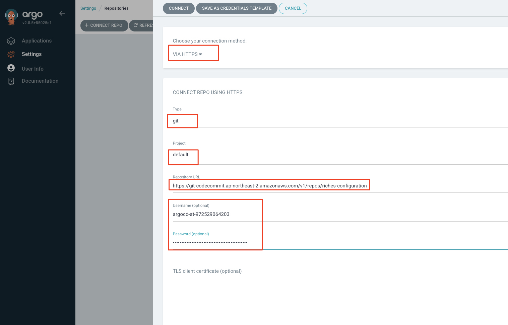
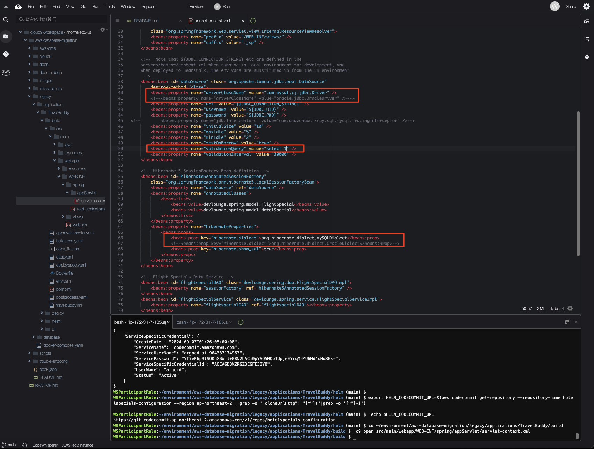
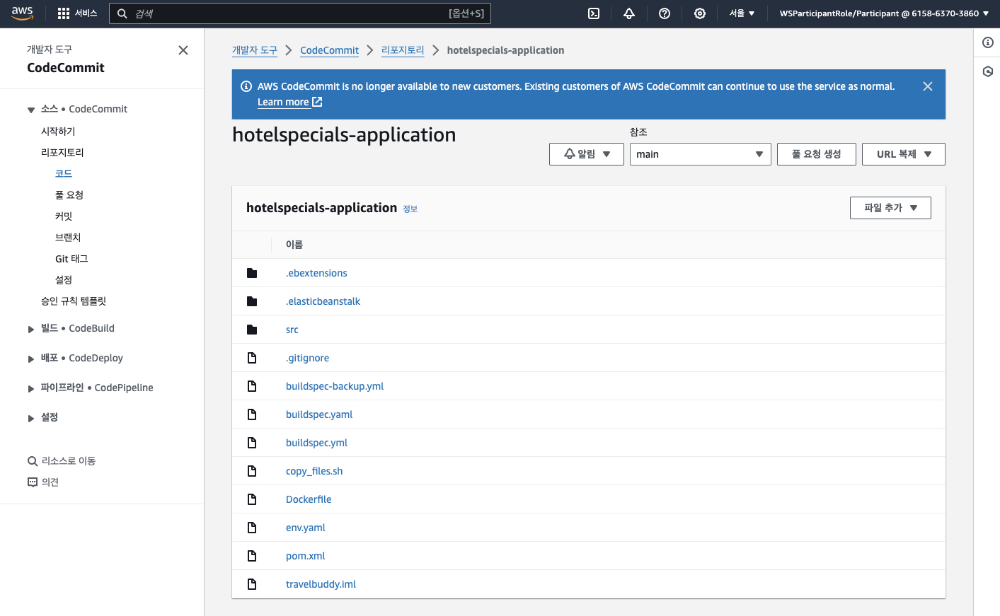
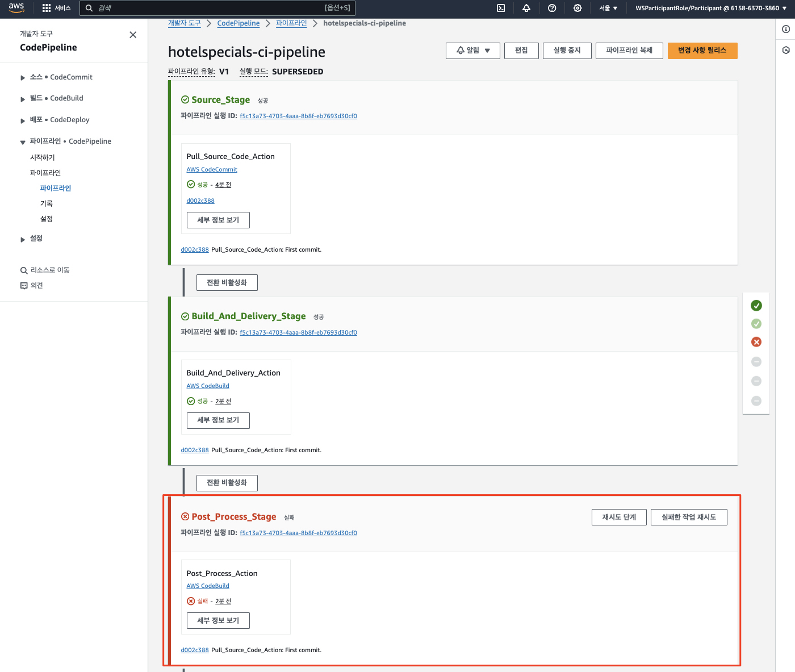
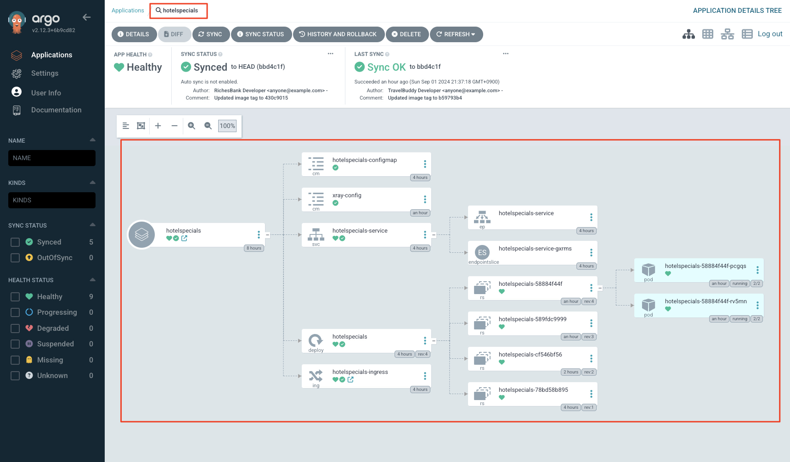
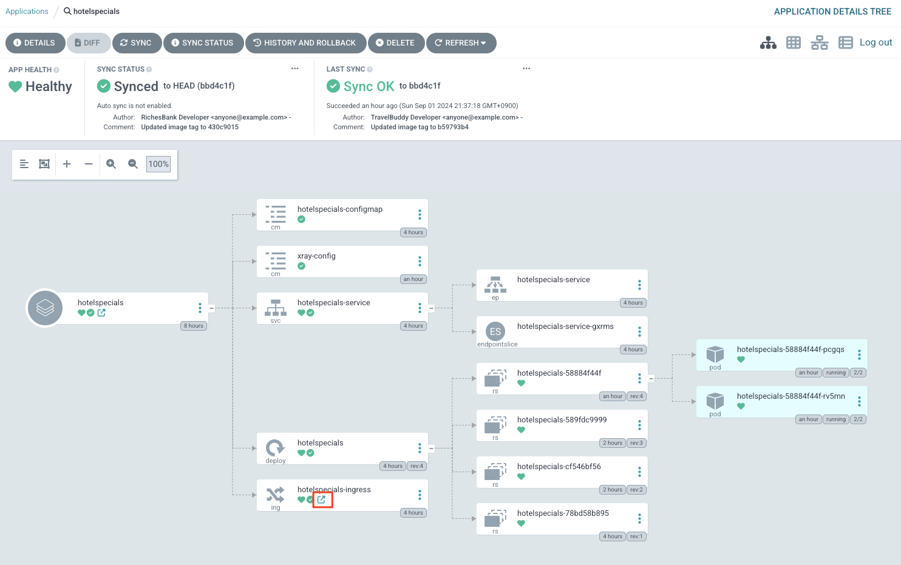
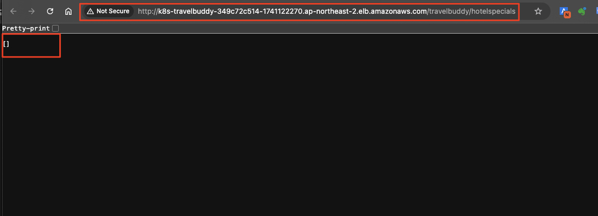

# ***```HotelSpecials``` 서비스 마이그레이션***

## **Agenda**
1. 개요
2. ```HotelSpecials``` 서비스 ```Amazon EKS``` 클러스터에 배포
   1. ```GitOps``` 리포지터리 (```Helm```) 설정
   2. ```GitOps``` 배포 설정 (```ArgoCD```)
   3. ```HotelSpecials``` 서비스 빌드
   4. ```HotelSpecials``` 서비스 배포 확인

---

## **1. 개요**
우리는 앞서 ```FlightSpeicals``` 서비스를 마이그레이션하기 위해 우선 데이터베이스 스키마를 준비해 두었습니다. 이제 이 서비스를 ```Amazon EKS``` 클러스터에 배포해 보겠습니다.

> 📌 **참고**<br>
> * 온프레미스에서 이미 운영 중인 ```TravelBuddy``` 애플리케이션은 비록 화면 표현 계층과 비즈니스 로직, 그리고 각 서비스별 단일 데이터베이스를 가진 모놀리식 구조이지만, ```HotelSpecials``` 서비스를 위한 모델 조회용 ```REST``` API는 이미 분리되어 있습니다. 이 API는 ```HotelSpecials``` 서비스의 데이터베이스 스키마를 조회하는 역할을 합니다.
> * 이러한 기본 구조를 최대한 활용하기 위하여 ```HotelSpecials``` 서비스는 최소한의 수정 (데이터베이스 Oracle -> MySQL로 변경된 부분을 반영) 으로 ```Amazon EKS``` 클러스터에 배포합니다.

---

## **2. ```HotelSpecials``` 서비스 ```Amazon EKS``` 클러스터에 배포**
우리의 주된 관심사가 데이터베이스 마이그레이션이므로 ```쿠버테네트``` 및 ```GitOps``` 배포 체계에 대해서 시간을 들여 알아보지는 않고 아래 읽을거리만을 간단하게 참고로 달아두었으니 관심있으신 분들은 읽어보셔도 좋을 것 같습니다.<br>

> 📕 **참고 문서**<br>
> * [Kubernetes Solutions Market Forecast](https://www.linkedin.com/pulse/kubernetes-solutions-market-2024-cagr-2371-forecast-gplwc/)
> * [데브옵스의 확장 모델 – 깃옵스(GitOps) 이해하기 - 삼성SDS 인사이트 리포트](https://www.samsungsds.com/kr/insights/gitops.html)

### **2.1. ```GitOps``` 리포지터리 (```Helm```) 설정**
먼저 애플리케이션이 빌드되면 ```Amazon EKS``` 클러스터에 배포하기 위한 ```GitOps``` 리포지터리를 설정합니다.

참고로 이 리포지터리는 ```GitOps```를 담당하는 ```ArgoCD```에 의해 사용되며, 컨테이너 이미지가 빌드되어 ```ECR```에 푸시되면 이 리포지터리를 통해 ```Amazon EKS``` 클러스터에 배포됩니다.

컨테이너 이미지를 빌드하는 파이프라인에 대해서는 아래에서 설명합니다.

```bash
cd ~/environment/aws-database-migration
rm -rf .git

# 1. 어플리케이션 Helm Artifact 경로로 이동
cd ~/environment/aws-database-migration/legacy/applications/TravelBuddy/helm

# 2. git 연결
git init
git branch -M main

export HELM_CODECOMMIT_URL=$(aws codecommit get-repository --repository-name hotelspecials-configuration --region ap-northeast-2 | grep -o '"cloneUrlHttp": "[^"]*' | grep -o '[^"]*$')
echo $HELM_CODECOMMIT_URL

# CodeCommit 배포 리포지터리와 연결
git remote add origin $HELM_CODECOMMIT_URL

# 3. Git 스테이징 영역에 파일을 추가합니다.
git add .

# 4. Commit 및 배포 리포지터리에 Push합니다.
git commit -am "First commit."
git push --set-upstream origin main
```

### **2.2. ```GitOps``` 배포 설정 (```ArgoCD```)**
1. ArgoCD 접속에 필요한 정보 확인 및 접속<br>

테라폼을 통해서 이미 배포한 EKS 클러스터에는 ```ArgCD```가 설치되어 있으며, 또한 ```AWS ELB (Elastic Load Balancer)```를 통하여 외부에서 접속할 수 있습니다.<br>

아래와 같이 ```ArgoCD``` 접속에 필요한 URL을 확인합니다.<br>

```bash
# ArgoCD 접속 주소 확인
kcp
export ARGOCD_SERVER=`kubectl get ingress/argocd-server -n argocd -o json | jq --raw-output '.status.loadBalancer.ingress[0].hostname'`
echo https://$ARGOCD_SERVER
```

확인한 접속 주소와 이미 설정한 패스워드 (```Abraca00#1```)를 사용하여 ArgoCD Web UI에 접속해 봅니다.<br>


2. ```ArgoCD```가 배포 (Helm) 리포지터리에 접속할 수 있도록 IAM 사용자 및 Git Credentials을 생성하고 메모해 둡니다. (CLI 사용).<br>

```bash
# IAM User 생성
aws iam create-user --user-name argocd 

# AWSCodeCommitPowerUser 관리형 권한 정책 연결 (arn:aws:iam::aws:policy/AWSCodeCommitPowerUser)
aws iam attach-user-policy --user-name argocd --policy-arn arn:aws:iam::aws:policy/AWSCodeCommitPowerUser

# CodeCommit 접근을 위한 Specific Credential 생성
# (중요) 결과로서 반환되는 "ServiceUserName"과 "ServicePassword"를 기록해 둡니다.
aws iam create-service-specific-credential --user-name argocd --service-name codecommit.amazonaws.com
```

3. ArgoCD 설정<br>
- 로그인 이후 좌측의 ```Settings```를 클릭한 뒤 ```Repositories``` 항목을 클릭합니다.<br>

   

- Connect Repo 버튼을 클릭하고 Method는 ```VIA HTTPS```, Project는 ```default```를 입력합니다.<br>

- ```Repository URL```에는 앞서 확인한 배포 ```CodeCommit``` Repository의 HTTPS 주소를 (혹은 아래 CLI로 확인 가능), Username 및 Password에는 메모해 둔 정보를 입력합니다.<br>

   ```bash
   export HELM_CODECOMMIT_URL=$(aws codecommit get-repository --repository-name hotelspecials-configuration --region ap-northeast-2 | grep -o '"cloneUrlHttp": "[^"]*'|grep -o '[^"]*$')
   echo $HELM_CODECOMMIT_URL
   ```

    

    

- ```Application``` 텝에서 ```NewApp```버튼을 클릭하고 아래 정보를 ```애플리케이션``` 하나를 생성합니다. 이는 ```ArgoCD```가 배포를 관리하는 애플리케이션 하나를 등록하는 의미입니다.

    * **Application Name**: ```hotelspecials```
    * **Project**: ```default```
    * **Sync Policy**: ```Manual```
    * **Repository URL**: ```앞서 설정한 배포 리포지터리```
    * **PATH**: ```.```
    * **Destination 섹션 > Cluster URL**: ```https://kubernetes.default.svc```
    * **Destination 섹션 > Namespace**: ```hotelspecials```를 입력하고 상단의 Create를 클릭합니다.

   

    > (참고)<br>
    > Application 생성 시 화면 하단에 Helm Setting 값들이 정상적으로 표시되는지 확인합니다.

### **2.3. ```HotelSpecials``` 서비스 빌드**

1. ```Cloud9```에서 ```HotelSpecials``` 서비스가 사용하는 데이터베이스를 ```오라클``` -> ```MySQL```로 변경합니다.

    * 40번째 줄 근처에 주석처리된 ```MySQL``` 드라이버 사용 구문을 주석 해제합니다. (사용)
    * 그 다음 줄에 ```Oracle``` 드라이버 사용 구문을 주석 처리합니다. (미사용)
    * 50번째 줄의 ```select 1 from dual``` 쿼리를 ```select 1```로 변경합니다.
    * 60, 61번째 줄 각각 주석 처리 토글: ```Hibernate```의 ```Oracle``` Dialect 주석 처리, ```MySQL``` Dialect 주석 해제.

    ```bash
    cd ~/environment/aws-database-migration/legacy/applications/TravelBuddy/build
    c9 open src/main/webapp/WEB-INF/spring/appServlet/servlet-context.xml
    ```

    


2. ```Cloud9``` 상에서 ```HotelSpecials``` 서비스의 소스 코드를 푸시하고 빌드 파이프라인을 실행합니다.

    ```bash
    # 1. 어플리케이션 소스 경로로 이동
    cd ~/environment/aws-database-migration/legacy/applications/TravelBuddy/build/
    
    # 2. git 연결
    git init
    git branch -M main
    
    export BUILD_CODECOMMIT_URL=$(aws codecommit get-repository --repository-name hotelspecials-application --region ap-northeast-2 | grep -o '"cloneUrlHttp": "[^"]*'|grep -o '[^"]*$')
    echo $BUILD_CODECOMMIT_URL
    
    git remote add origin $BUILD_CODECOMMIT_URL
    # (예)
    # git remote add origin https://git-codecommit.ap-northeast-2.amazonaws.com/v1/repos/M2M-BuildAndDeliveryStack-SourceRepository
    
    # 3. Git 스테이징 영역에 파일을 추가합니다.
    git add .
    
    # 4. Commit 및 Push합니다.
    git commit -am "First commit."
    git push --set-upstream origin main
    ```

3. ```CodeCommit``` 리포지터리에 소스 코드가 푸시되었음을 확인합니다.

    

4. 또한 빌드 파이프라인도 트리거되어 실행되었음을 확인합니다. 다만, Build Spec이 없거나 정상적으로 구성되지 않은 등의 이유로 파이프라인은 실패하였을 수 있습니다. 발생한 오류를 확인하고 수정합니다.

   

### **2.4. ```HotelSpecials``` 서비스 배포 확인**
위의 과정이 정상적으로 수행되면 ```ArgoCD```에서 ```hotelspecials``` 애플리케이션에 대한 배포가 자동으로 수행됩니다.



위 화면에서 ```hotelspecials-ingress``` 항목의 링크 열기 미니 아이콘을 클릭하여 ```HotelSpecials``` 서비스가 정상적으로 배포되었는지 확인합니다.



아래와 같이 요청이 정상적으로 처리되면 브라우저에 표시됩니다.



> 📌 **참고**<br>
> 브라우저에서 아무 데이터가 표시되지 않는 것은 정상입니다.<br>
> 우리가 아직 데이터 마이그레이션을 수행하지 않았으므로 데이터베이스에 데이터가 없기 때문입니다.

---
