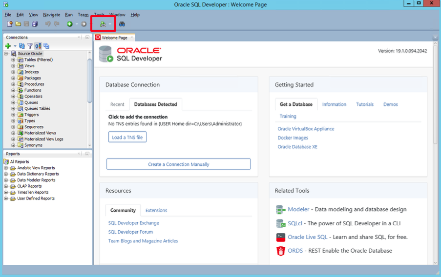
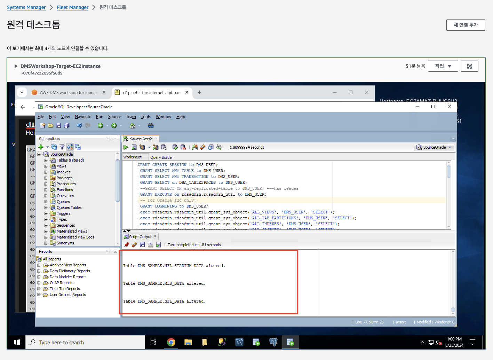

# ***소스 오라클 데이터베이스 구성***

Oracle을 ```AWS Database Migration Service (AWS DMS)```의 소스로 사용하려면 먼저 Oracle 데이터베이스에 대한 읽기 및 쓰기 권한이 있는 사용자 계정 (DMS 사용자)을 제공해야 합니다.

또한 ```CDC``` 복제에 필요한 ```LogMiner```에 필요한 정보를 제공하려면 ```ARCHIVELOG``` 모드가 켜져 있는지 확인해야 합니다. AWS DMS는 변경 사항을 캡처할 수 있도록 ```LogMiner```를 사용하여 아카이브 로그에서 정보를 읽습니다.

```AWS DMS```가 이 정보를 읽을 수 있게 아카이브 로그가 데이터베이스 서버에 보관되어 있는지 확인하십시오. 일반적으로 아카이브 로그를 24시간 동안 보관하는 것으로 충분합니다.

또한 변경 데이터를 캡처하려면 ```AWS DMS```에서는 소스 데이터베이스에서 ```데이터베이스 수준 보충 로깅 (Supplemental Logging)```을 활성화해야 합니다. 이렇게 하면 ```LogMiner```가 ```클러스터 테이블``` 및 ```인덱스 구성 테이블(Index Organized Table)```과 같은 다양한 테이블 구조를 지원하는 데 필요한 최소한의 정보를 확보하게 됩니다.

마찬가지로 마이그레이션하려는 각 테이블에 대해 테이블 수준 보충 로깅을 활성화해야 합니다.

> 📕 참고<br>
> Chrome 브라우저는 Fleet Manager 인스턴스와 클립보드를 통하여 정보를 교환할 수 있습니다. 하지만 Firefox 등의 브라우저에서는 클립보드 공유가 지원되지 않습니다. Chrome 이와의 브라우저를 사용하면 SQL Developer에서 직접 긴 문장을 입력해야 할 경우 번거로울 수 있습니다. 이 경우 온라인 클립보드 도구를 사용하여 클립보드에 복사한 후 SQL Developer에 붙여넣을 수 있습니다.<br>
> 해당 사항에 대해서는 진행자의 안내를 따릅니다.


1. ```Oracle SQL Developer``` 내에서 SQL 워크시트 아이콘을 클릭한 다음 원본 Oracle 데이터베이스에 연결합니다.

    

2. 다음 SQL 문을 복사하여 붙여넣고 실행하여 ```AWS DMS``` 사용자를 생성하고 필요한 권한을 부여합니다.

    ```sql
    GRANT CREATE SESSION to DMS_USER;
    GRANT SELECT ANY TABLE to DMS_USER;
    GRANT SELECT ANY TRANSACTION to DMS_USER;
    GRANT SELECT on DBA_TABLESPACES to DMS_USER;
    --GRANT SELECT ON any-replicated-table to DMS_USER; ---has issues
    GRANT EXECUTE on rdsadmin.rdsadmin_util to DMS_USER;
    -- For Oracle 12c only:
    GRANT LOGMINING to DMS_USER;
    exec rdsadmin.rdsadmin_util.grant_sys_object('ALL_VIEWS', 'DMS_USER', 'SELECT');
    exec rdsadmin.rdsadmin_util.grant_sys_object('ALL_TAB_PARTITIONS', 'DMS_USER', 'SELECT');
    exec rdsadmin.rdsadmin_util.grant_sys_object('ALL_INDEXES', 'DMS_USER', 'SELECT');
    exec rdsadmin.rdsadmin_util.grant_sys_object('ALL_OBJECTS', 'DMS_USER', 'SELECT');
    exec rdsadmin.rdsadmin_util.grant_sys_object('ALL_TABLES', 'DMS_USER', 'SELECT');
    exec rdsadmin.rdsadmin_util.grant_sys_object('ALL_USERS', 'DMS_USER', 'SELECT');
    exec rdsadmin.rdsadmin_util.grant_sys_object('ALL_CATALOG', 'DMS_USER', 'SELECT');
    exec rdsadmin.rdsadmin_util.grant_sys_object('ALL_CONSTRAINTS', 'DMS_USER', 'SELECT');
    exec rdsadmin.rdsadmin_util.grant_sys_object('ALL_CONS_COLUMNS', 'DMS_USER', 'SELECT');
    exec rdsadmin.rdsadmin_util.grant_sys_object('ALL_TAB_COLS', 'DMS_USER', 'SELECT');
    exec rdsadmin.rdsadmin_util.grant_sys_object('ALL_IND_COLUMNS', 'DMS_USER', 'SELECT');
    exec rdsadmin.rdsadmin_util.grant_sys_object('ALL_LOG_GROUPS', 'DMS_USER', 'SELECT');
    exec rdsadmin.rdsadmin_util.grant_sys_object('V_$ARCHIVED_LOG', 'DMS_USER', 'SELECT');
    exec rdsadmin.rdsadmin_util.grant_sys_object('V_$LOG', 'DMS_USER', 'SELECT');
    exec rdsadmin.rdsadmin_util.grant_sys_object('V_$LOGFILE', 'DMS_USER', 'SELECT');
    exec rdsadmin.rdsadmin_util.grant_sys_object('V_$DATABASE', 'DMS_USER', 'SELECT');
    exec rdsadmin.rdsadmin_util.grant_sys_object('V_$THREAD', 'DMS_USER', 'SELECT');
    exec rdsadmin.rdsadmin_util.grant_sys_object('V_$PARAMETER', 'DMS_USER', 'SELECT');
    exec rdsadmin.rdsadmin_util.grant_sys_object('V_$NLS_PARAMETERS', 'DMS_USER', 'SELECT');
    exec rdsadmin.rdsadmin_util.grant_sys_object('V_$TIMEZONE_NAMES', 'DMS_USER', 'SELECT');
    exec rdsadmin.rdsadmin_util.grant_sys_object('V_$TRANSACTION', 'DMS_USER', 'SELECT');
    exec rdsadmin.rdsadmin_util.grant_sys_object('V_$CONTAINERS', 'DMS_USER', 'SELECT');
    exec rdsadmin.rdsadmin_util.grant_sys_object('DBA_REGISTRY', 'DMS_USER', 'SELECT');
    exec rdsadmin.rdsadmin_util.grant_sys_object('OBJ$', 'DMS_USER', 'SELECT');
    exec rdsadmin.rdsadmin_util.grant_sys_object('ALL_ENCRYPTED_COLUMNS', 'DMS_USER', 'SELECT');
    exec rdsadmin.rdsadmin_util.grant_sys_object('V_$LOGMNR_LOGS', 'DMS_USER', 'SELECT');
    exec rdsadmin.rdsadmin_util.grant_sys_object('V_$LOGMNR_CONTENTS','DMS_USER','SELECT');
    exec rdsadmin.rdsadmin_util.grant_sys_object('DBMS_LOGMNR', 'DMS_USER', 'EXECUTE');
    -- (as of Oracle versions 12.1 and later)
    exec rdsadmin.rdsadmin_util.grant_sys_object('REGISTRY$SQLPATCH', 'DMS_USER', 'SELECT');
    -- (for Amazon RDS Active Dataguard Standby (ADG))
    exec rdsadmin.rdsadmin_util.grant_sys_object('V_$STANDBY_LOG', 'DMS_USER', 'SELECT');
    -- (for transparent data encryption (TDE))
    exec rdsadmin.rdsadmin_util.grant_sys_object('ENC$', 'DMS_USER', 'SELECT');
    -- (for validation with LOB columns)
    exec rdsadmin.rdsadmin_util.grant_sys_object('DBMS_CRYPTO', 'DMS_USER', 'EXECUTE');
    -- (for binary reader)
    exec rdsadmin.rdsadmin_util.grant_sys_object('DBA_DIRECTORIES','DMS_USER','SELECT');
    
    ---archive log & supplement log for cdc
    exec rdsadmin.rdsadmin_util.set_configuration('archivelog retention hours',24);
    exec rdsadmin.rdsadmin_util.alter_supplemental_logging('ADD');
    exec rdsadmin.rdsadmin_util.alter_supplemental_logging('ADD','PRIMARY KEY');
    alter table dms_sample.nfl_stadium_data add supplemental log data (ALL) columns;
    alter table dms_sample.mlb_data add supplemental log data (ALL) columns;
    alter table dms_sample.nfl_data add supplemental log data (ALL) columns;
    ```

3. ```Run Script (F5)```를 클릭하여 SQL 문을 실행합니다.

    
