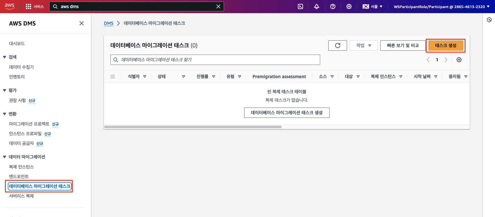
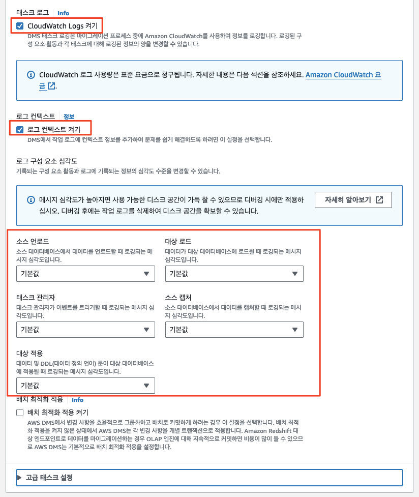

# ***DMS 마이그레이션 태스크 생성***

```AWS DMS```는 ```데이터베이스 마이그레이션 태스크```를 사용하여 소스에서 대상 데이터베이스로 데이터를 마이그레이션합니다. 이 마이그레이션을 위한 ```데이터베이스 마이그레이션 태스크```를 생성합니다. 여기에는 기존 데이터를 마이그레이션하고 원본 데이터베이스의 데이터 변경 사항을 캡처하여 변경 사항을 대상 데이터베이스에 복제하기 위한 설정이 동시에 포함될 것입니다.

1. ```AWS DMS > 데이터 마이그레이션 > 데이터베이스 마이그레이션 태스크```로 이동한 후 ```태스크 생성``` 버튼을 클릭합니다.

    

2. 아래 값을 사용하여 ```데이터베이스 마이그레이션 태스크```를 생성합니다. 이 설정은 소스 데이터베이스의 ```DMS_SAMPLE``` 스키마의 데이터를 타겟 데이터베이스로 복제합니다.

   | **입력 파라미터**                   | **값**                                                     |
   |-------------------------------|-----------------------------------------------------------|
   | **태스크 식별자**                   | ```source-to-oracle-target```                             |
   | **복제 인스턴스**                   | ```dmsreplication-<각자 이름>``` (앞서 생성하고 테스트한 복제 인스턴스)       |
   | **소스 데이터베이스 엔드포인트**           | ```source-oracle``` (앞서 생성한 소스 엔드포인드)                     |
   | **대상 데이터베이스 엔드포인트**           | ```dmsworkshop-target-targetoracledb``` (앞서 생성한 타겟 엔드포인트) |
   | **마이그레이션 유형**                 | ```기존 데이터 마이그레이션 및 지속적인 변경 사항 복제```                       |
   | **CDC 중지 모드**                 | ```사용자 정의 CDC 중지 모드 사용 안 함```                             |
   | **대상 데이터베이스에 복구 테이블 생성**      | ```체크 해제```                                               |
   | **대상 테이블 준비 모드**              | ```아무 작업 안 함 (기본값 아님)```                                  |
   | **전체 로드 완료 후 태스크 중지**         | ```중지 안 함```                                              |
   | **LOB 열 설정 / LOB 열 복제에 포함**   | ```제한된 LOB 모드```                                          |
   | **최대 LOB 크기 (KB)**            | ```32```                                                  |
   | **데이터 검증**                    | ```끄기```                                                     |
   | **태스크 로그 / CloudWatch 로그 켜기** | ```(체크) CloudWatch 로그 사용```                               |
   | **로그 컨텍스트**                   | ```(체크) 로깅에 대한 기본 수준 사용```                                      |
   | **배치 최적화 적용 켜기**              | ```(체크 안 함)```                                                  |

   > ⚠️ **주의**<br>
   > - ```대상 테이블 준비 모드```에 ```아무 작업 안 함``` 선택하십시오. 그렇지 않으면 오류가 발생합니다!!!

   

   

   

3. ```테이블 매핑```섹션을 확장하고 편집 모드로 ```마법사```를 선택합니다.

4. ```새 선택 규칙 추가``` 버튼을 클릭하고 양식에 다음 값을 입력합니다.

   | **스키마**       | ```스키마 입력```      |
   |---------------|-------------------|
   | **소스 이름**     | ```DMS_SAMPLE%``` |
   | **소스 테이블 이름** | ```%```           |
   | **작업**        | ```포함```          |
    
    

5. ```사전 마이그레이션 평가 켜기``` 선택을 취소하면 ```마이그레이션 전 평가``` 섹션이 축소됩니다. 시간 관계 상 이 부분은 수행하지 않고, 워크샵의 목적 달성에 큰 영향을 미치지 않습니다.

   

6.  값을 입력한 후 ```마이그레이션 태스크 시작 구성```이 ```생성 시 자동으로 시작```되도록 설정되어 있는지 확인한 다음 ```태스크 생성```을 클릭합니다.

   

7. 이 시점에서 ```태스크```는 실행되며 소스 데이터베이스의 ```DMS_SAMPLE``` 스키마의 데이터를 ```Amazon RDS Oracle``` 인스턴스로 복제하기 시작합니다. ```마이그레이션 태스크```는 ```생성 (상태=생성 중)```하는 데 잠시 시간이 걸린 다음 ```상태=Created```, ```상태=시작 중```, ```상태=실행 중```으로 전환됩니다. 새로 고침 버튼을 사용하여 작업 상태를 업데이트할 수 있습니다.

    

8. 데이터가 전송되는 동안 작업 진행 상황을 모니터링할 수 있습니다.

9. 작업 (```source-to-oracle-target``` 작업)을 클릭하고 ```테이블 통계 섹션```으로 이동하여 복제된 행 수를 확인할 수 있습니다.

   

10. 오류가 있는 경우 상태 색상이 녹색에서 빨간색으로 변경됩니다. 디버그할 로그에 대해 로그 보기 링크를 클릭합니다.

---

> 📒 **참고**<br>
> 모든 데이터를 복사하는 데 몇 분 정도 걸립니다. `SPORT_TYPE` 테이블 데이터의 복제가 끝나면 다음 단계로 넘어갈 수 있습니다. `SPORTING_EVENT_TICKET`과 같은 더 큰 테이블이 완료될 때까지 기다릴 필요가 없으므로 다음 단계로 진행하세요.
