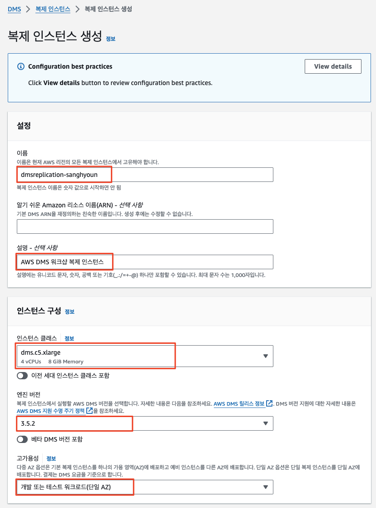

# ***(타겟 측) DMS 복제 인스턴스 생성***


다음 그림은 오라클 데이터베이스 마이그레이션의 개략적인 프로세스를 보여줍니다.


> 📕 ```AWS DMS 복제 인스턴스```<br>
> AWS DMS 복제 인스턴스는 소스와 대상 간의 실제 데이터 마이그레이션을 수행합니다. 복제 인스턴스는 마이그레이션 중에 트랜잭션 로그도 캐시합니다. 복제 인스턴스의 CPU 양과 메모리 용량은 마이그레이션에 필요한 전체 시간에 영향을 미칩니다.

1. ```DMS (Database Migration Service) > 데이터 마이그레이션 > 복제 인스턴스```로 이동합니다.
2. ```DMS 복제 인스턴스```가 이미 생성되었으므로 이를 사용하여도 되지만, 우리는 복제 인스턴스를 직접 만들어 보도록 하겠습니다. DMS 복제 인스턴스 구축 경험을 얻으려면 계속 진행하세요.
3. 오른쪽 상단의 ```복제 인스턴스 생성``` 버튼을 클릭합니다.

    

4. 다음 정보를 사용하여 복제 인스턴스를 생성합니다.
    
   | **입력 파라미터**         | **값**                           |
   |---------------------|---------------------------------|
   | **이름**              | ```dmsreplication-<본인 이니셜>```   |
   | **설명**              | ```AWS DMS 워크샵 복제 인스턴스```       |
   | **인스턴스 클래스**        | ```dms.c5.xlarge```             |
   | **엔진 버전**           | 기본값 유지                          |
   | **고가용성/멀티-AZ**      | ```개발 또는 테스트 워크로드 (단일-AZ)```    |
   | **할당된 스토리지 (GB)**   | ```50```                        |
   | **VPC**             | ```DmsVpc``` 이름이 포함된 VPC ID로 변경 |
   | **복제 서브넷 그룹**       | ```기본 선택값``` |
   | **퍼블릭 액세스 가능**      | ```아니요``` (체크 해제)               |
   | **고급 -> VPC 보안 그룹** | ```기본값```                       |

   

   
 
    > 📒 **참고**
    > - IAM 관련 오류 ```The IAM Role arn aws iam ########## role dms-vpc-role is not configured properly```가 발생할 경 취소를 클릭하고 위 단계를 반복해 보십시요.<br>
    > - 복제 인스턴스 생성에는 몇 분이 소요됩니다.<br>
    > - 복제 인스턴스가 생성되는 동안 소스 및 대상 데이터베이스 엔드포인트를 생성할 수 있지만, 연결을 테스트하려면 복제 인스턴스가 생성이 완료되어야 합니다. 왜냐하면 실제 작업 시에는 복제 인스턴스가 소스 및 대상 엔드포인트를 사용하여 데이터베이스에 접속하기 때문에 연결이 성공하는지 미리 확인할 필요가 있기 때문입니다.

5. ```DMS 복제 인스턴스```가 생성되었습니다. 이제 ```DMS 소스 및 타겟 엔드포인트 생성```을 진행합니다.

   

