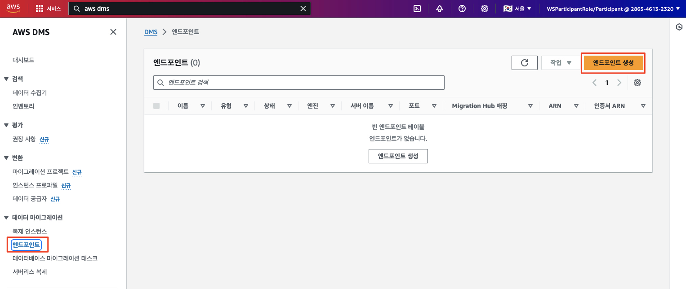
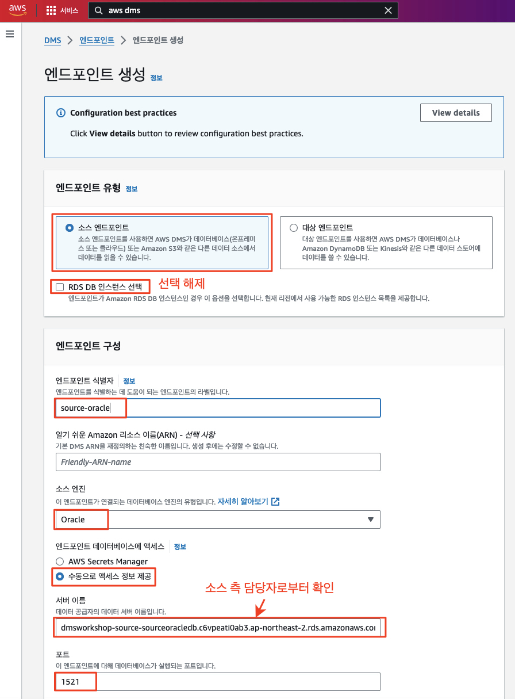
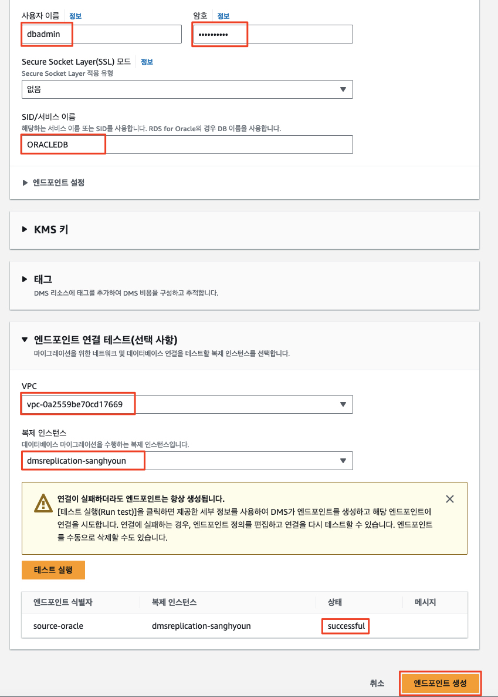
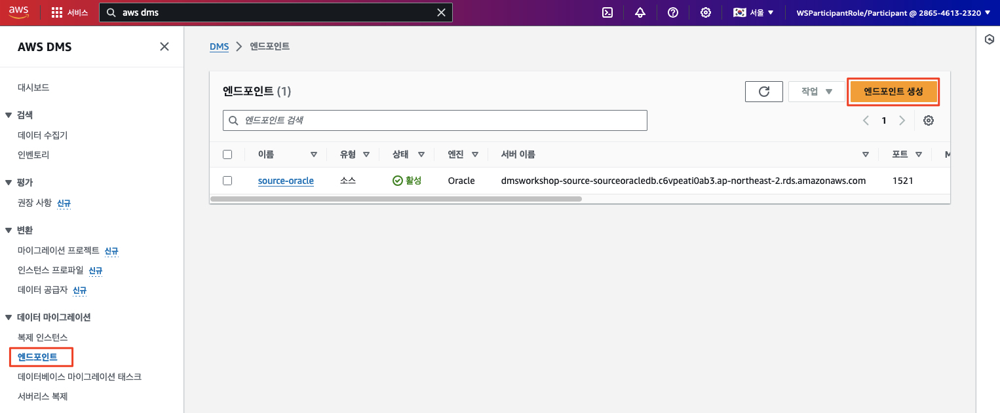
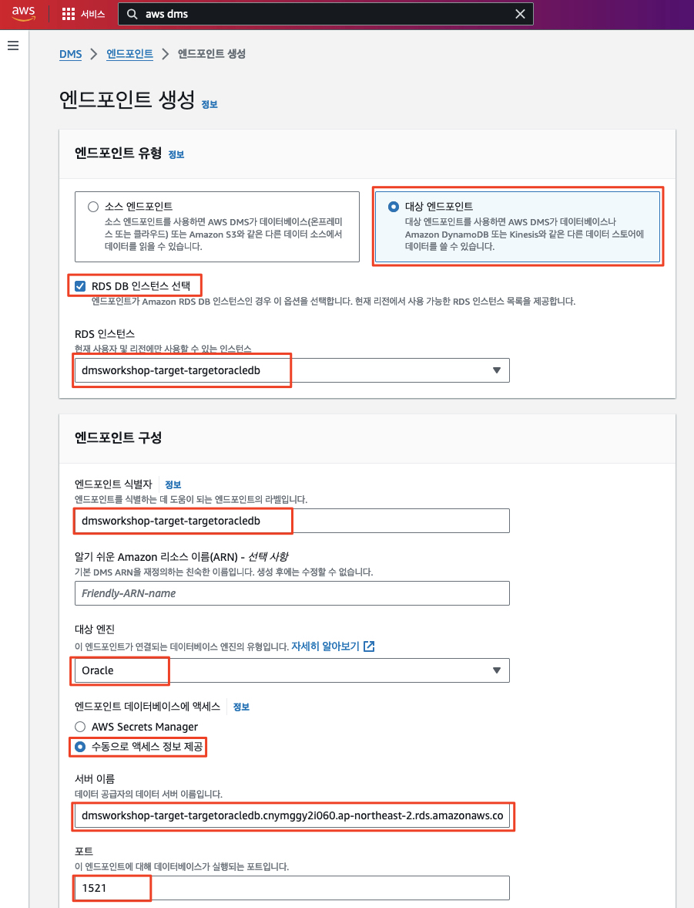
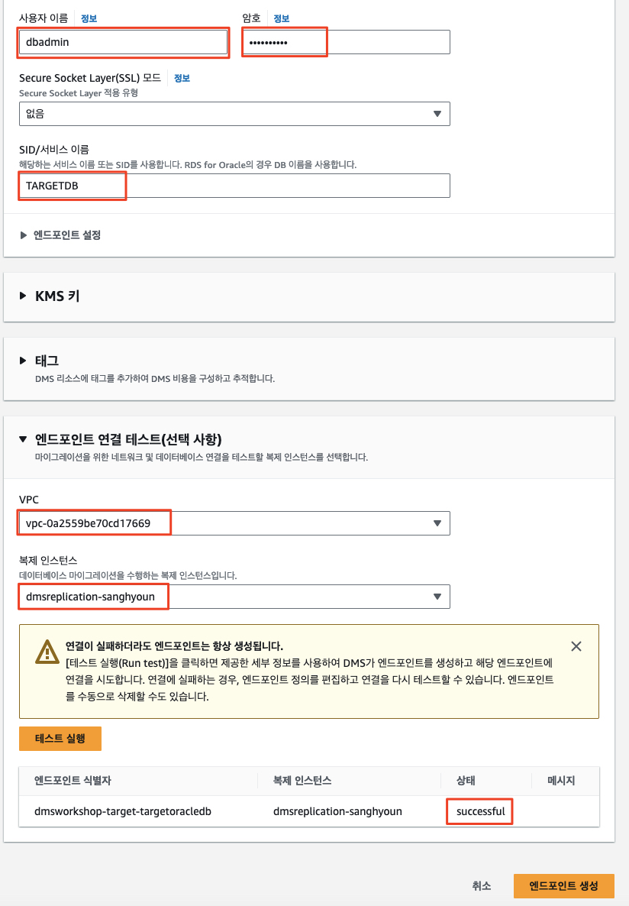

# ***DMS 소스 및 타겟 엔드포인트 생성***

앞에서 생성한 복제 인스턴스를 사용하여 데이터베이스를 마이그레이션할 소스 및 타겟 엔드포인트를 생성합니다.

---

## ***소스 엔드포인트 생성***

1. ```AWS DMS > 데이터 마이그레이션 > 엔드포인트``` 화면에서 ```엔드포인트 생성```을 클릭합니다.

    


2. 다음 정보를 입력하여 소스 오라클 데이터베이스에 대한 엔드포인트를 생성합니다.

   | **입력 파라미터**                          | **값**                           |
   |--------------------------------------|---------------------------------|
   | **엔드포인트 유형**                         | ```소스 엔드포인트```                  |
   | **RDS DB 인스턴스 선택**                   | ```체크 해제``` (선택하지 않음)           |
   | **엔드포인트 식별자**                        | ```source-oracle```             |
   | **알기 쉬운 Amazon 리소스 이름(ARN) - 선택 사항** | (비워둠)                           |
   | **소스 엔진**                            | ```Oracle```                    |
   | **엔드포인트 데이터베이스에 액세스**                | ```수동으로 액세스 정보 제공```            |
   | **서버 이름**                            | ```(소스 측으로부터 확인된 소스 오라클 엔드포인트)``` |
   | **포트**                               | 1521                            |
   | **사용자 이름**                           | ```dbadmin```                   |
   | **암호**                               | ```dbadmin123```                |
   | **Secure Socket Layer(SSL) 모드**      | ```없음```                        |
   | **SID/서비스 이름**                       | ```ORACLEDB```                  |
   | **엔드포인트 연결 테스트 -> VPC**              | ```DmsVpc 이름이 포함된 VPC```           |
   | **복제 인스턴스**                          | ```앞서 생성한 복제 인스턴스```            |

   <br>
   <br>

---

## ***타겟 엔드포인트 생성***

1. ```AWS DMS > 데이터 마이그레이션 > 엔드포인트``` 화면에서 ```엔드포인트 생성```을 클릭합니다.

   


2. 다음 정보를 입력하여 타겟 오라클 데이터베이스에 대한 엔드포인트를 생성합니다.

   | **입력 파라미터**                          | **값**                                                     |
      |--------------------------------------|-----------------------------------------------------------|
   | **엔드포인트 유형**                         | ```대상 엔드포인트```                                            |
   | **RDS DB 인스턴스 선택**                   | ```체크``` (선택함)                                            |
   | **RDS DB 인스턴스**                      | ```dmsworkshop-target-targetoracledb``` (혹은 자원 생성 시 부여된 이름) |
   | **엔드포인트 식별자**                        | ```dmsworkshop-target-targetoracledb```                   |
   | **알기 쉬운 Amazon 리소스 이름(ARN) - 선택 사항** | (비워둠)                                                     |
   | **대상 엔진**                            | ```Oracle```                                              |
   | **엔드포인트 데이터베이스에 액세스**                | ```수동으로 액세스 정보 제공```                                      |
   | **서버 이름**                            | ```(자동으로 설정된 서버 이름 지정)```                                 |
   | **포트**                               | 1521                                                      |
   | **사용자 이름**                           | ```dbadmin```                                             |
   | **암호**                               | ```dbadmin123```                                          |
   | **Secure Socket Layer(SSL) 모드**      | ```없음```                                                  |
   | **SID/서비스 이름**                       | ```TARGETDB```                                            |
   | **엔드포인트 연결 테스트 -> VPC**              | ```DmsVpc 이름이 포함된 VPC```                                      |
   | **복제 인스턴스**                          | ```앞서 생성한 복제 인스턴스```                                      |

   <br>
   <br>

___
