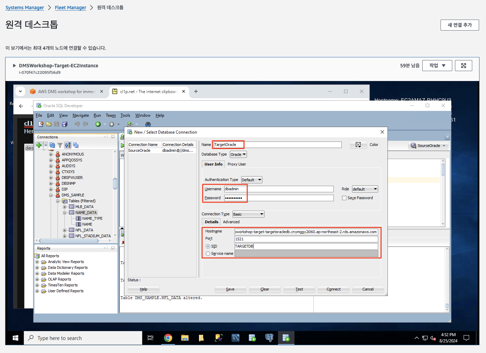
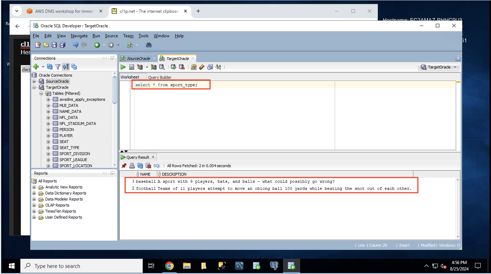

# ***타겟 데이터베이스 데이터 확인***

1. (타겟 환경) 이전에 사용했던 EC2 인스턴스로 다시 돌아가 (연결이 끊어져 있으면 재접속) ```Oracle SQL Developer```에서 다음 값을 사용하여 새 연결을 추가합니다.

    | **파라미터** | **값**                          |
    | --- |--------------------------------|
    | **연결 이름** | ```TargetOracle```             |
    | **사용자 이름** | ```dbadmin```                  |
    | **암호** | ```dbadmin123```               |
    | **암호 저장** | ```체크```                       |
    | **호스트 이름** | ```CloudFormation의 출력 탭에서 확인``` |
    | **포트** | 1521                           |
    | **SID/서비스 이름** | TARGETDB                       |

    

2. 대상 데이터베이스의 테이블 중 하나를 쿼리하여 마이그레이션된 데이터를 검사합니다. 예를 들어 다음 쿼리는 두 개의 행이 있는 테이블을 반환해야 합니다.

    ```sql
    SELECT * FROM SPORT_TYPE;
    ```

    

    > **참고**<br>
    > - ```baseball```과 ```football```이 현재 유일한 두 가지 스포츠입니다. 다음 섹션에서는 다른 스포츠 유형에 대한 정보가 포함된 추가적인 레코드를 소스 데이터베이스에 삽입합니다. `DMS`는 이러한 새 레코드를 소스 데이터베이스에서 대상 데이터베이스로 자동으로 복제합니다.

___
