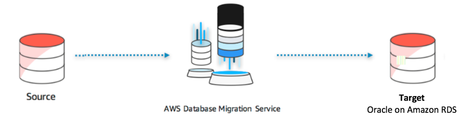

# ***오라클 데이터베이스 동일 기종 (Homogeneous) 마이그레이션***

이제 ```AWS Database Migration Service(DMS)```를 사용하여 소스 데이터베이스의 데이터를 Amazon RDS 인스턴스에서 실행되는 타겟 Oracle 데이터베이스로 마이그레이션해보도록 하겠습니다. 이 과정에서 소스 데이터베이스에서 대상 데이터베이스로 데이터베이스 변경 사항을 지속적으로 복제하기 위한 설정도 알아보도록 하겠습니다.



---

다음 단계로 진행하세요.

- [소스 데이터베이스 구성](./Configure-Source-Database.md)
- [DMS 복제 인스턴스 생성](./Create-DMS-Replication-Instance.md)
- [DMS 소스 및 타겟 엔드포인트 생성](./Create-DMS-Source-and-Target-Endpoints.md)
- [DMS 마이그레이션 태스크 생성](./Create-DMS-Migration-Task.md)
- [타겟 데이터베이스 데이터 확인](./Inspect-Target-Database-Data.md)
- [데이터 변경 복제](./Replicate-Data-Changes.md)
