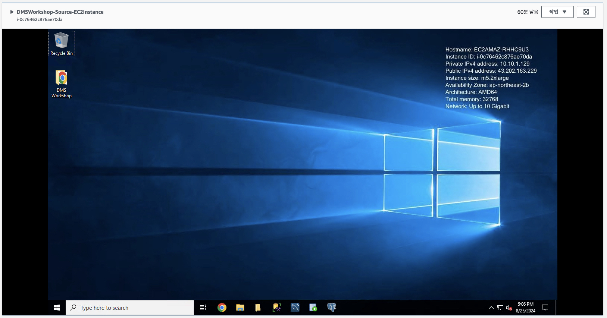
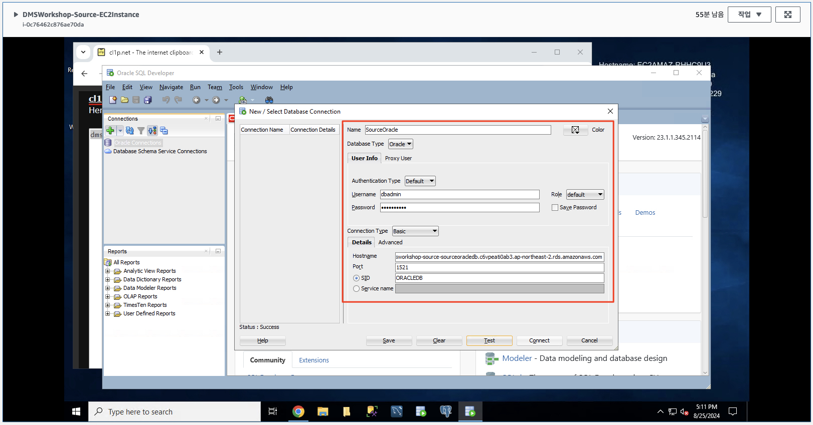
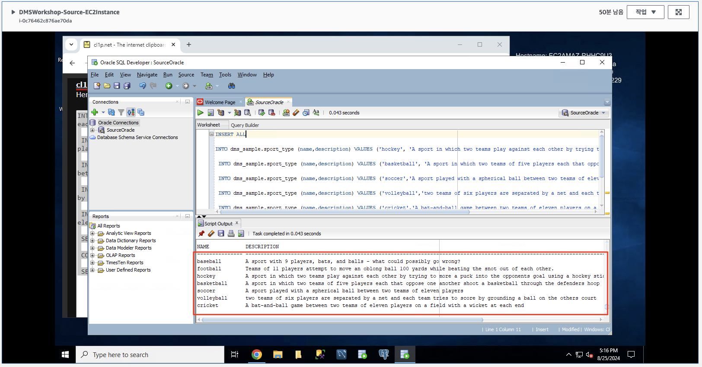
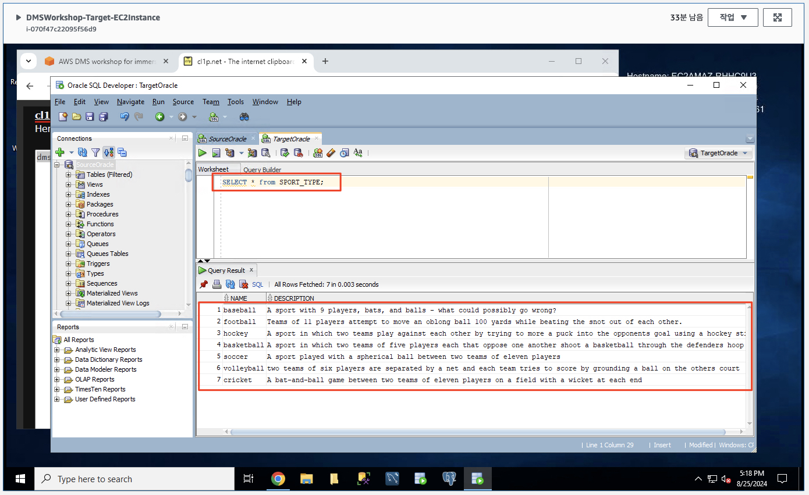
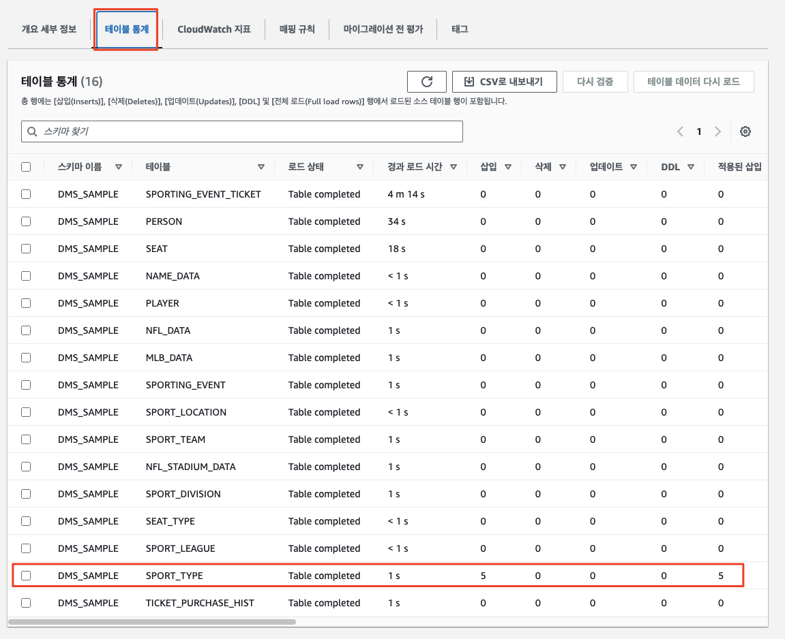

# ***데이터 변경 복제***

이제 소스 데이터베이스의 ```SPORT_TYPE``` 테이블을 업데이트하여 소스 데이터베이스에 대한 트랜잭션을 시뮬레이션하겠습니다. ```Database Migration Service```는 이러한 변경 사항을 자동으로 감지하고 대상 데이터베이스에 복제합니다.

---

## (소스 환경) ```SPORT_TYPE``` 테이블에 새로운 행 추가

1. ```EC2 > 인스턴스 > DMSWorkshop-Source-EC2Instance``` 인스턴스를 선택한 후 ```연결 > RDP 클라이언트 > Fleet Manager```를 클릭하여 RDP 세션을 시작합니다.

    

2. ```Oracle SQL Developer```를 실행하고 소스 데이터베이스에 접속합니다. 연결 정보가 아직 생성되기 전이라면 아래 정보를 이용하여 연결 정보를 생성하고 접속합니다.
    
    | **파라미터** | **값**                           |
    | --- |---------------------------------|
    | **연결 이름** | ```SourceOracle```              |
    | **사용자 이름** | ```dbadmin```                   |
    | **암호** | ```dbadmin123```                |
    | **암호 저장** | ```체크```                        |
    | **호스트 이름** | ```CloudFormation의 출력 탭에서 확인``` |
    | **포트** | 1521                            |
    | **SID/서비스 이름** | ```ORACLEDB```                        |
    
    

3. 다음 SQL 문을 사용하여 ```SPORT_TYPE``` 테이블에 새로운 행을 추가합니다.

    ```sql
    INSERT ALL
   
    INTO dms_sample.sport_type (name,description) VALUES ('hockey', 'A sport in which two teams play against each other by trying to more a puck into the opponents goal using a hockey stick')

    INTO dms_sample.sport_type (name,description) VALUES ('basketball', 'A sport in which two teams of five players each that oppose one another shoot a basketball through the defenders hoop')

    INTO dms_sample.sport_type (name,description) VALUES ('soccer','A sport played with a spherical ball between two teams of eleven players')

    INTO dms_sample.sport_type (name,description) VALUES ('volleyball','two teams of six players are separated by a net and each team tries to score by grounding a ball on the others court')

    INTO dms_sample.sport_type (name,description) VALUES ('cricket','A bat-and-ball game between two teams of eleven players on a field with a wicket at each end')

    SELECT * FROM dual;

    COMMIT;

    SELECT * FROM dms_sample.sport_type;
    ```

    

---

## (대상 환경) 데이터 변경 사항 확인

1. 마찬가지로 ```Oracle SQL Developer``` 툴을 사용하여 타겟 데이터베이스 접속 후 다음 SQL 문을 실행하여 ```SPORT_TYPE``` 테이블에 새로운 행이 추가되었는지 확인합니다.

    ```sql
    SELECT * FROM SPORT_TYPE;
    ```

    

2. 소스 데이터베이스의 ```SPORT_TYPE``` 테이블에 농구, 크리켓, 하키, 축구, 배구에 대해 추가한 새 레코드가 타겟 데이터베이스에 복제되었습니다. AWS 콘솔에서 ```데이터베이스 마이그레이션 태스크```의 ```테이블 통계```를 확인하여 삽입, 삭제, 업데이트 및 DDL 수를 자세히 조사할 수 있습니다.

    

> 📕 **참고**<br>
> ```AWS DMS 태스크```는 소스 데이터베이스 변경 사항에 따라 대상 Oracle 데이터베이스를 최신 상태로 유지합니다. AWS DMS는 애플리케이션 마이그레이션을 구현할 때까지 작업의 모든 테이블을 최신 상태로 유지합니다. 소스 데이터의 초기 복제가 완료된 이후에는 변경 데이터의 Latency는 0에 가까울 정도로 빠르게 이루어집니다.

___
