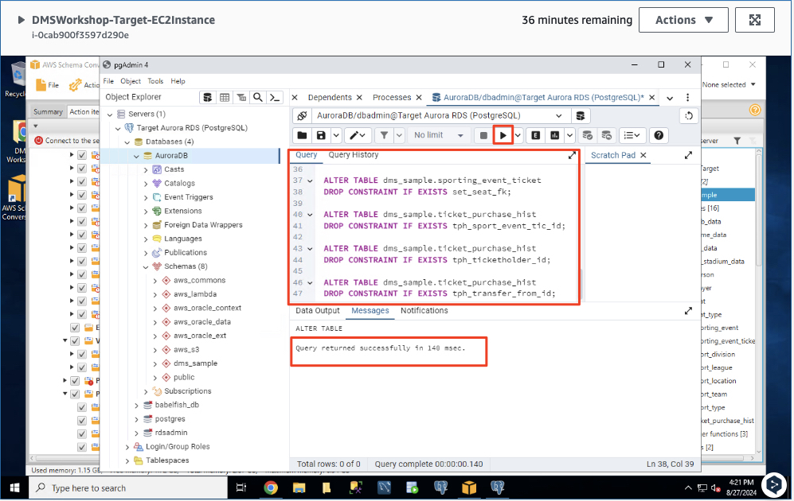

# ***타겟 데이터베이스 설정***

> ⚠️ **주의**<br>
> * 전체 로드 프로세스 중에 ```AWS DMS```는 특정 순서로 테이블을 로드하지 않으므로 상위 테이블 데이터보다 먼저 하위 테이블 데이터를 로드할 수 있습니다.<br>
> * 결과적으로 외래 키 제약 조건이 있다면 이를 위반하게 되고 데이터 로드가 실패할 수 있습니다.
> * 또한 대상 데이터베이스에 트리거가 있으면 ```AWS DMS```에서 로드한 데이터가 예상치 못한 방식으로 변경될 수 있습니다. 이런 상황을 피하기 위해 대상 데이터베이스에 대한 제약 조건을 삭제합니다.

1. 화면 하단의 EC2 서버 작업 표시줄 내에서 ```pgAdmin```을 열고 (코끼리 아이콘) 해당 항목을 클릭하여 엽니다. 새 버전의 ```pgAdmin```에 대한 경고가 나타나면 무시하여도 됩니다. 인스턴스의 아이콘 순서는 아래 이미지와 다를 수 있습니다.

    

2. ```Add New Server``` 버튼을 클릭하거나, 왼쪽 트리 창에서 ```Server```를 클릭한 다음 마우스 오른쪽 버튼을 클릭하고 ```Register > Server...```를 클릭하면 ```Aurora PostgreSQL``` 서버를 등록할 수 있습니다. ```일반 (General)``` 탭과 ```연결 (Connection)``` 탭을 별도로 완료해야 합니다. 

    
    
    | **파라미터** | **값**                                                                       |
    | --- |-----------------------------------------------------------------------------|
    | **일반 (General) -> 이름** | ```Target Aurora RDS (PostgreSQL)```                                        |
    | **연결 (Connection) -> 호스트 이름/주소** | ```CloudFormation > 출력``` 탭에서 확인하거나 AWS 콘솔에서 PostgreSQL 대상 인스턴스를 찾을 수 있습니다. |
    | **연결 (Connection) -> 포트** | ```5432```                                                                  |
    | **연결 (Connection) -> 유지 보수 데이터베이스** | ```AuroraDB```                                                              |
    | **연결 (Connection) -> 사용자 이름** | ```dbadmin```                                                               |
    | **연결 (Connection) -> 암호** | ```dbadmin123```                                                               |
    | **연결 (Connection) -> 암호 저장** | ```체크```                                                                          |

    

    

    

3. 왼쪽 메뉴에서 ```AuroraDB``` 데이터베이스를 마우스 오른쪽 버튼으로 클릭한 다음 ```쿼리 도구 (Query Tool)```를 선택합니다. 

   - 참고: 왼쪽에 있는 개체 목록을 클릭하여 변환된 테이블을 볼 수 있습니다.

    


4. ```DMS```가 테이블 데이터 적재 순서와 상관없이 데이터 마이그레이션을 원활하게 수행할 수 있도록 외래 키 제약 조건을 삭제합니다. 아래 쿼리문을 복사하여 ```pgAdmin```의 ```Query Tool```에서 실행합니다.

    ```sql
    ALTER TABLE dms_sample.player
    DROP CONSTRAINT IF EXISTS sport_team_fk;
    
    ALTER TABLE dms_sample.seat
    DROP CONSTRAINT IF EXISTS seat_type_fk;
    
    ALTER TABLE dms_sample.sport_division
    DROP CONSTRAINT IF EXISTS sd_sport_type_fk;
    
    ALTER TABLE dms_sample.sport_division 
    DROP CONSTRAINT IF EXISTS sd_sport_league_fk;
    
    ALTER TABLE dms_sample.sport_league 
    DROP CONSTRAINT IF EXISTS sl_sport_type_fk;
    
    ALTER TABLE dms_sample.sport_team 
    DROP CONSTRAINT IF EXISTS st_sport_type_fk;
    
    ALTER TABLE dms_sample.sport_team 
    DROP CONSTRAINT IF EXISTS home_field_fk;
    
    ALTER TABLE dms_sample.sporting_event
    DROP CONSTRAINT IF EXISTS se_sport_type_fk;
    
    ALTER TABLE dms_sample.sporting_event 
    DROP CONSTRAINT IF EXISTS se_away_team_id_fk;
    
    ALTER TABLE dms_sample.sporting_event 
    DROP CONSTRAINT IF EXISTS se_home_team_id_fk;
    
    ALTER TABLE dms_sample.sporting_event_ticket 
    DROP CONSTRAINT IF EXISTS set_person_id;
    
    ALTER TABLE dms_sample.sporting_event_ticket 
    DROP CONSTRAINT IF EXISTS set_sporting_event_fk;
    
    ALTER TABLE dms_sample.sporting_event_ticket 
    DROP CONSTRAINT IF EXISTS set_seat_fk;
    
    ALTER TABLE dms_sample.ticket_purchase_hist 
    DROP CONSTRAINT IF EXISTS tph_sport_event_tic_id;
    
    ALTER TABLE dms_sample.ticket_purchase_hist 
    DROP CONSTRAINT IF EXISTS tph_ticketholder_id;
    
    ALTER TABLE dms_sample.ticket_purchase_hist 
    DROP CONSTRAINT IF EXISTS tph_transfer_from_id;
    ```

    

---
