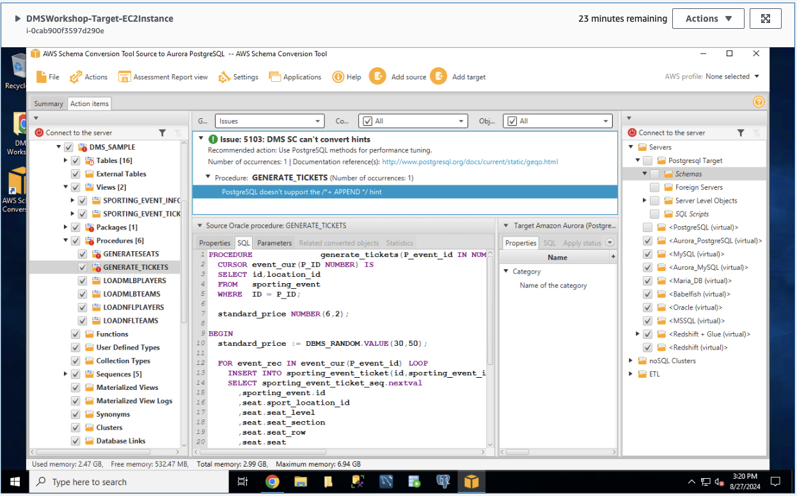

# ***스키마 변환***

이제 오라클에서 PostgreSQL 데이터베이스로 이기종 스키마 변환을 수행해 보겠습니다.

1. 화면 왼쪽 소스에서 ```DMS_SAMPLE``` 스키마를 클릭합니다.

    

   > 📒 **참고**<br>
   > 오른쪽에 보이는 Aurora 타겟에는 ```dms_sample```과 같은 애플리케이션별 스키마가 없다는 것을 알 수 있습니다. 다음 몇 단계에서 ```SCT``` 프로세스의 일부로 이를 생성하겠습니다.


   - ```AWS SCT```는 스키마를 분석하고 ```PostgreSQL```로의 변환을 위한 데이터베이스 마이그레이션 평가 보고서를 생성합니다. 빨간색 느낌표가 있는 항목은 원본에서 대상으로 자동 변환할 수 없는 항목을 나타냅니다. 여기에는 대표적을 ```저장 프로시저```와 ```패키지``` 등이 포함됩니다.

2. ```보기``` 버튼을 클릭하고 ```평가 보고서 보기```를 선택합니다.


3. 다음으로 보고서의 ```작업 항목 (Action Items)``` 탭으로 이동하여 도구로 변환할 수 없는 항목을 확인하고 수동으로 변경해야 하는 정도를 알아보세요. ```저장 프로시저```를 선택하고 녹색 원 안의 느낌표(!) 옆에 있는 아래쪽 화살표를 클릭하여 아래 이미지와 같은 문제를 확인하고 다음을 클릭합니다. 모든 세부 정보를 보려면 각 ```프로시저``` 옆에 있는 화살표를 클릭하세요.

   

   

4. 나열된 각 문제를 확인하고 소스 패널과 타겟 Aurora PostgreSQL 패널의 내용을 비교합니다. 문제가 해결되었나요?

   - ```AWS SCT```는 소스 데이터베이스를 분석하고 ```Autora PostgreSQL```로의 변환을 위한 데이터베이스 마이그레이션 평가 보고서를 생성합니다. 옆에 빨간색 느낌표가 있는 항목은 AWS SCT에서 자동으로 변환할 수 없습니다. 여기에는 저장 프로시저 및 패키지가 포함됩니다. 대상 데이터베이스와 호환되도록 하려면 이러한 개체를 수동으로 수정해야 합니다. 다음 작업 중 하나를 완료하여 문제를 해결할 수 있습니다.
   
   ```
   * AWS SCT가 객체를 대상 Aurora PostgreSQL 데이터베이스로 변환할 수 있도록 소스 데이터베이스의 객체를 수정합니다.
   * 소스 데이터베이스 객체를 수정하는 대신, 대상 Aurora PostgreSQL 데이터베이스에 스크립트를 적용하기 전에 AWS SCT가 생성하는 스크립트를 수정합니다.
   ```

   - 시간 관계상 ```AWS SCT```가 자동으로 변환할 수 없다고 표시한 모든 객체의 수정은 수행하지 않습니다. 대신, 예를 들어 SCT 내의 ```GENERATESEATS``` 및 ```GENERATE_TICKETS``` 저장 프로시저에서 문제를 찾아 검토합니다. 원하는 경우 주석 처리된 코드를 제거할 수도 있지만 필수는 아닙니다.

   - ```GENERATESEATS``` 및 ```GENERATE_TICKETS``` 저장 프로시저를 클릭하면 PostgreSQL에서 APPEND 힌트가 지원되지 않으므로 코드를 강조 표시된 것을 볼 수 있습니다. 이들을 제거하고 진행해 보겠습니다.

5. ```GENERATESEATS```와 ```GENERATE_TICKETS``` 저장 프로시저를 클릭합니다.

   - 오라클 데이터베이스의 힌트인 /* +APPEND */를 찾을 수 있습니다. 이를 제거하도록 합니다. 

   


6. 왼쪽 패널에서 ```DMS_SAMPLE``` 스키마를 마우스 오른쪽 버튼으로 클릭하고 **보고서 생성**을 클릭합니다.

   

7. 수정된 두 객체 모두 이제 타겟 데이터베이스와 호환되며 빨간색 느낌표가 사라진 것을 확인할 수 있습니다.

   

8. 왼쪽 패널에서 ```DMS_SAMPLE``` 스키마를 클릭하고 ```스키마 변환 (Convert Schema)```를 클릭합니다.

   

9. "대상 데이터베이스에 개체가 이미 존재할 수 있습니다. 바꾸시겠습니까?"라는 대화 상자가 표시될 수 있습니다. **예**를 선택합니다.

   

   

10. 오른쪽 패널에서 ```dms_sample``` 스키마를 마우스 오른쪽 버튼으로 클릭하고 ```데이터베이스에 적용```을 클릭합니다.

   

11. 스키마를 데이터베이스에 적용할지 묻는 메시지가 나타나면 예를 클릭합니다.

   

12. 이제 타겟 데이터베이스에 스키마가 적용되었습니다. 테이블, 뷰, 프로시저 등을 보려면 오른쪽 창에서 ```dms_sample``` 스키마를 확장하세요.

   

데이터베이스 스키마와 객체를 소스에서 ```Amazon Aurora PostgreSQL```로 성공적으로 변환했습니다.

```AWS Schema Conversion Tool```을 사용하여 이기종 소스 데이터베이스의 (여기서는 오라클) 스키마를 ```Amazon Aurora PostgreSQL```로 비교적 쉽게 전환할 수 있습니다.

이 과정에서 스키마 변환 도구가 서로 다른 데이터베이스 엔진 간의 차이점을 강조하는 방법을 배웠고 프로시저 및 기타 데이터베이스 개체를 마이그레이션해야 할 때 코드를 성공적으로 수정할 수 있는 방법에 대한 팁도 제공방았습니다.

SQL Server 및 Oracle 워크로드를 PostgreSQL 및 MySQL을 포함한 다른 RDS 엔진으로 마이그레이션하려면 동일한 단계를 수행할 수 있습니다.

다음 섹션에서는 AWS DMS를 사용하여 실제 데이터를 이동하는 데 필요한 단계를 설명합니다.
