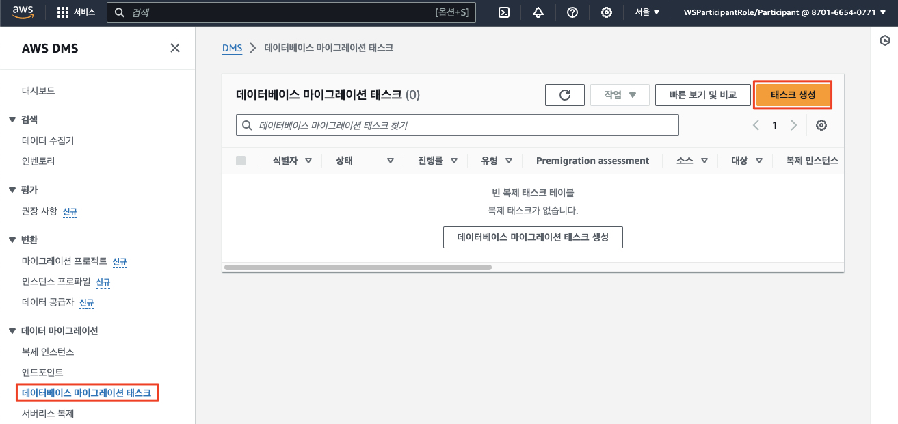
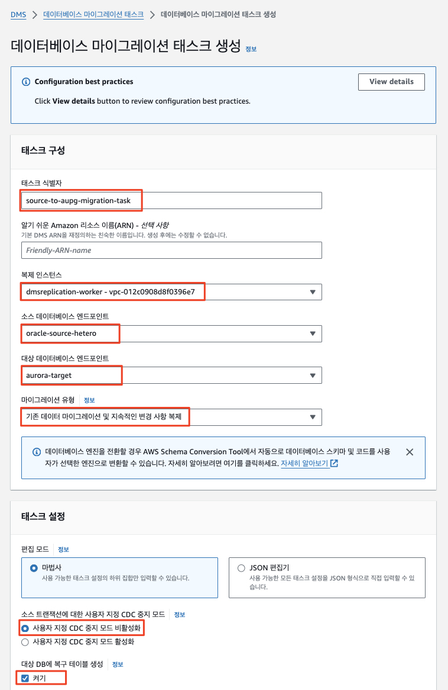
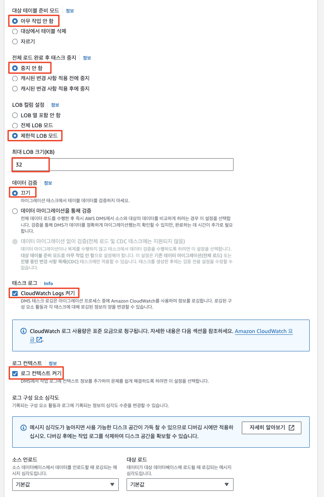
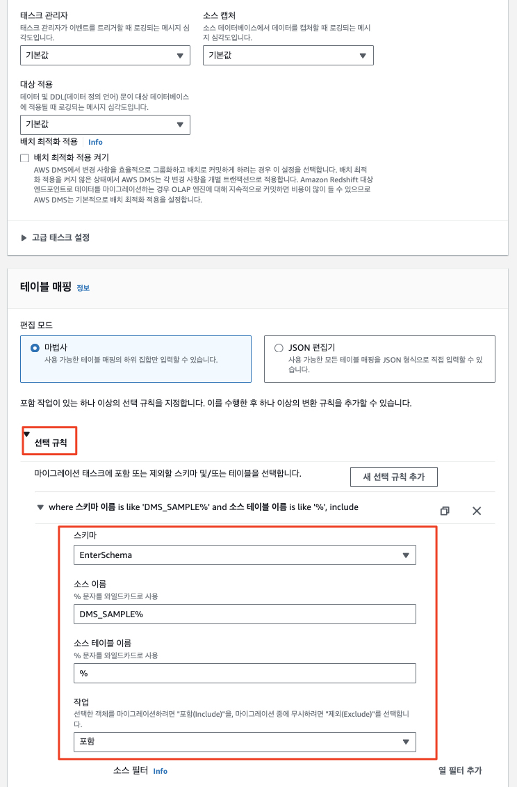
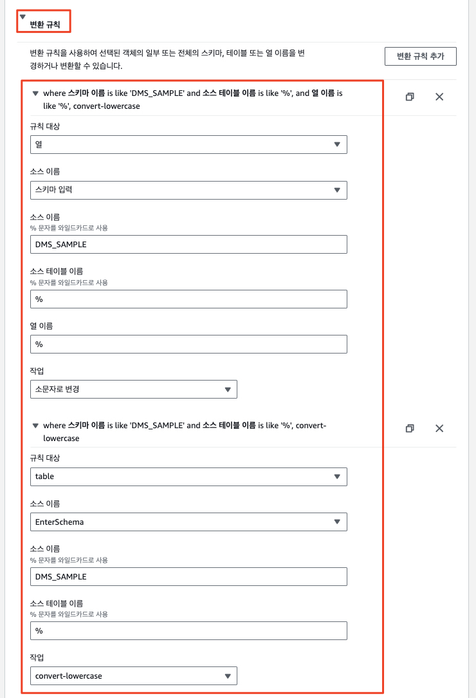
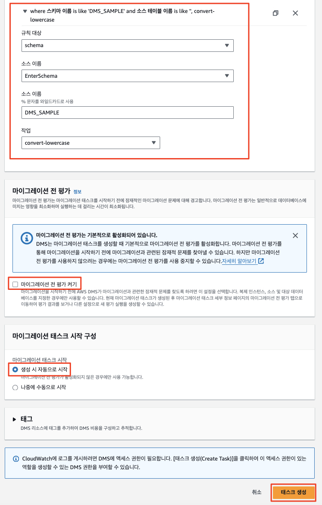
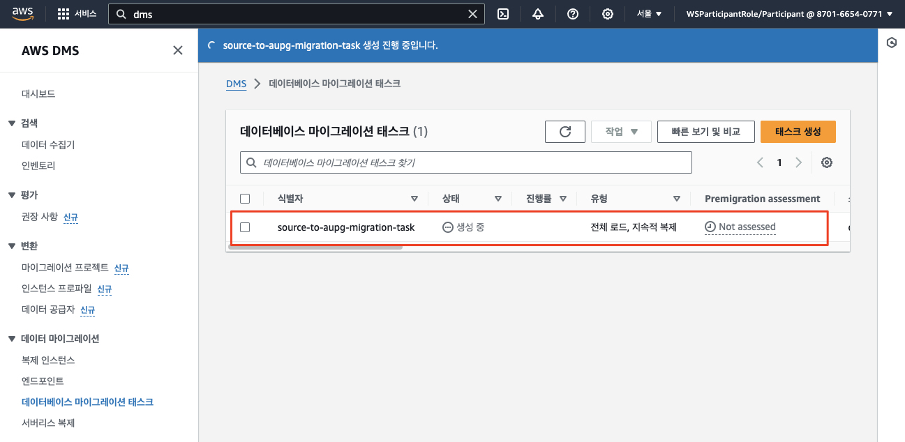
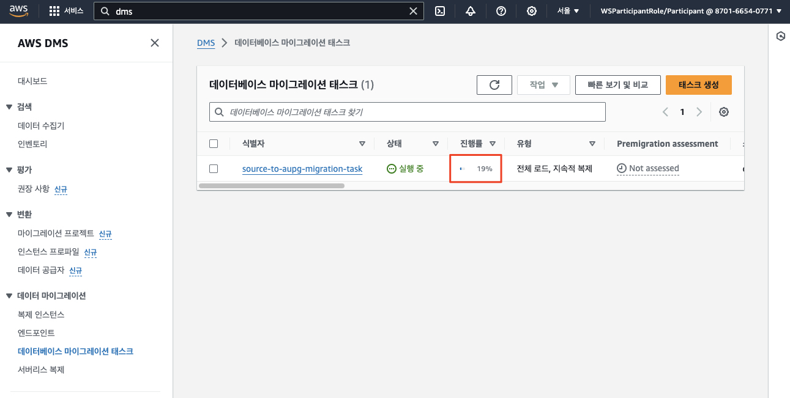
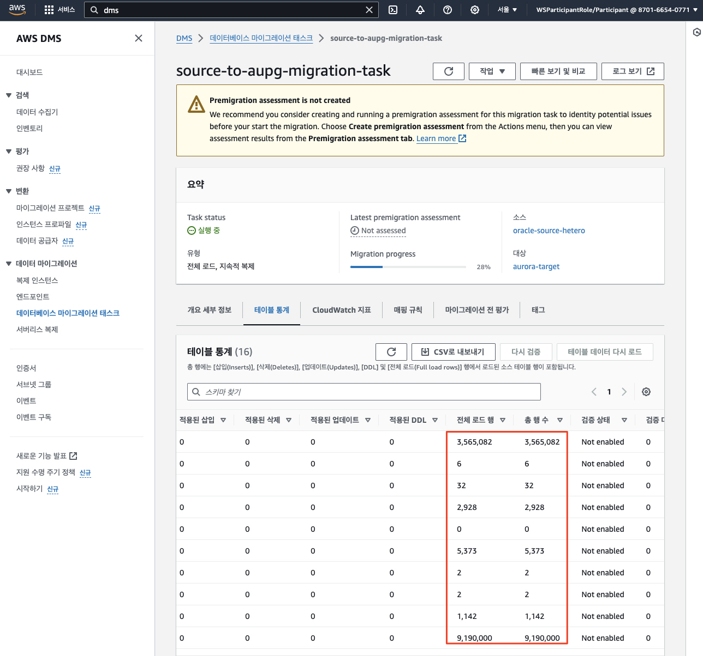

# ***DMS 마이그레이션 태스크 생성***

AWS DMS는 ```데이터베이스 마이그레이션 태스크```를 사용하여 소스에서 대상 데이터베이스로 데이터를 마이그레이션합니다. ```데이터베이스 마이그레이션 태스크```를 생성하여 기존 데이터를 마이그레이션하고 소스에서 대상 데이터베이스로 변경 사항을 지속적으로 복제합니다.

1. ```DMS > 데이터 마이그레이션 > 데이터베이스 마이그레이션 태스크```로 이동한 다음 오른쪽 상단에서 ```태스크 생성``` 버튼을 클릭합니다.

    

2. ```DMS_SAMPLE``` 스키마의 마이그레이션을 위해 다음 값을 사용하여 ```데이터베이스 마이그레이션 태스크```를 생성합니다.

   | **파라미터**                         | **값**                                                |
   |----------------------------------|------------------------------------------------------|
   | **태스크 식별자**                      | ```source-to-aupg-migration-task```                  |
   | **친숙한 Amazon 리소스 이름(ARN)**       | ```비워둠```                                            |
   | **복제 인스턴스**                      | ```dmsreplication-worker``` (혹은 별도로 생성한 복제 인스턴스의 이름) |
   | **소스 데이터베이스 엔드포인트**              | ```oracle-source-hetero``` (앞에서 생성한 소스 엔드포인트)        |
   | **대상 데이터베이스 엔드포인트**              | ```aurora-target``` (앞에서 생성한 타겟 엔드포인트)                            |
   | **마이그레이션 유형**                    | ```기존 데이터 마이그레이션 및 지속적인 변경 사항 복제```                  |
   | **소스 트랜잭션을 위한 사용자 지정 CDC 중지 모드** | ```사용자 지정 CDC 중지 모드 비활성화```                          |
   | **대상 DB에 복구 테이블 생성**             | ```체크```                                             |
   | **대상 테이블 준비 모드**                 | ```아무 작업 안 함``` (기본값 아님)                             |
   | **전체 로드 완료 후 태스크 중지**            | ```중지 안 함```                                         |
   | **LOB 컬럼 설정**                    | ```제한된 LOB 모드```                                     |
   | **최대 LOB 크기(KB)**                | ```32```                                             |
   | **데이터 검증**                       | ```끄기```                                             |
   | **태스크 로그 / CloudWatch 로그 켜기**    | ```CloudWatch 로그 켜기 체크``` (기본값 아님)                   |
   | **로그 컨텍스트**                      | ```체크된 상태로 로깅의 기본 수준 사용```                           |
   | **배치 최적화 적용 켜기**                 | ```체크 안 함```                                         |

3. ```테이블 매핑``` 섹션을 확장하고 편집 모드로 ```마법사```를 선택합니다.

4. ```새 선택 규칙 추가``` 버튼을 클릭하고 양식에 다음 값을 입력합니다. (참고: 대소문자를 구분하므로 주의하세요. 또한 선택 규칙은 마이그레이션하려는 스키마와 테이블 정보를 ```DMS 복제 인스턴스```에 전달하는데 사용됩니다. 

   | **파라미터**   | **값**                       |
    |------------|-----------------------------|
    | **스키마**    | ```DMS_SAMPLE%``` (대소문자 유의) |
    | **테이블 이름** | ```%```                     |
    | **작업**     | ```포함```                    |

   > ⚠️ **주의**<br>
   > * 태스크 생성 화면에서 스키마를 인식하지 못하는 경우 엔드포인트 화면으로 돌아가서 엔드포인트를 클릭하세요. ```스키마``` 탭에서 ```새로 고침``` 버튼을 클릭하면 잠시 후 스키마들이 표시됩니다.

5. 그런 다음 ```변환 규칙``` 섹션을 확장하고 다음 값을 사용하여 ```변환 규칙 추가```를 클릭합니다. (참고: ```PostgreSQL```에서는 소문자로만 개체 이름을 저장하므로 이 값은 개체 이름을 소문자로 변경하는 데 사용됩니다 또한 SQL Server의 경우 변환 규칙을 사용하여 대상 시스템의 데이터베이스 이름을 바꿉니다.

   > **참고**<br>
   > `Oracle`, `MySQL`, 그리고 `PostgreSQL` 데이터베이스 간의 객체 대소문자와 관련해서는 아래 페이지를 참고하세요.
   > * [[오라클, MySQL, PostgreSQL의 객체 이름 대소문자 처리]](../migrate-application-database/Case-Sensitivity-for-Oracle-PostgreSQL-MySQL.md)
   
   * Rule 1:

     | **파라미터**   | **값**                       |
     |------------|-----------------------------|
     | **규칙 대상**     | ```스키마```               |
     | **소스 이름**     | (스키마 입력을 선택한 후) ```DMS_SAMPLE```               |
     | **작업**     | ```소문자로 변경```               |

   * Rule 2:

     | **파라미터**      | **값**                            |
       |---------------|----------------------------------|
     | **규칙 대상**     | ```테이블```                        |
     | **소스 이름**     | (스키마 입력을 선택한 후) ```DMS_SAMPLE``` |
     | **소스 테이블 이름** | ```%```                          |
     | **작업**        | ```소문자로 변경```                    |

   * Rule 3:

     | **파라미터**      | **값**                            |
     |---------------|----------------------------------|
     | **규칙 대상**     | ```컬럼```                         |
     | **소스 이름**     | (스키마 입력을 선택한 후) ```DMS_SAMPLE``` |
     | **소스 테이블 이름** | ```%```                          |
     | **작업**        | ```소문자로 변경```                    |

   * ⚠️ ```마이그레이션 전 평가 켜기```는 비활성합니다. 이 옵션은 마이그레이션 전 평가를 위해 사용되며 이 워크샵에서는 시간이 부족하므로 사용하지 않습니다.

   * ```마이그레이션 태스크 시작 구성``` 아래 ```생성 시 자동으로 시작```이 선택되어 있는지 확인한 다음 ```태스크 생성```을 클릭합니다.

   * 설정된 화면은 아래와 유사합니다.
   
    
    
    
    
    
    
    
    
    

6. ```마이그레이션 태스크``` 실행이 시작되고 소스의 ```DMS_SAMPLE``` 스키마의 데이터가 ```Amazon Aurora RDS (PostgreSQL)``` 인스턴스로 복제되기 시작합니다. ```마이그레이션 태스크```는 ```생성 (상태=생성 중)```하는 데 잠시 시간이 걸린 다음 ```상태=Created```, ```상태=시작 중```, ```상태=실행 중```으로 전환됩니다. 새로 고침 버튼을 사용하여 작업 상태를 업데이트할 수 있습니다.

    

7. 행이 전송되는 동안 작업 진행 상황을 모니터링할 수 있습니다.

    

8. ```마이그레이션 태스크 (source-to-aupg-migration-task)```를 클릭하고 ```테이블 통계``` 탭으로 이동하여 테이블 통계를 보고 이동된 행 수를 확인합니다.

    

9. 오류가 발생하면 상태 색상이 녹색에서 빨간색으로 변경됩니다. 디버그할 로그에 대해 로그 보기 링크를 클릭합니다.    

> 📕 **참고**<br>
> * 모든 데이터를 이동하는 데 몇 분 정도 걸립니다. ```SPORT_TYPE``` 테이블이 완성되면 다음 단계로 넘어갈 수 있습니다. ```SPORTING_EVENT_TICKET```과 같은 더 큰 테이블이 완료될 때까지 기다릴 필요가 없으므로 다음 단계로 진행하세요.

---
