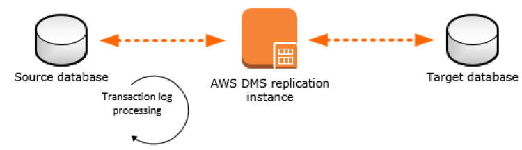

# ***DMS 복제 인스턴스 생성***

다음 그림은 마이그레이션 프로세스 설명하는 대략적인 그림입니다.




> 📒 **참고**<br>
> AWS DMS 복제 인스턴스는 소스와 대상 간의 실제 데이터 마이그레이션을 수행합니다. 복제 인스턴스는 마이그레이션 중에 트랜잭션 로그도 캐시합니다. 복제 인스턴스의 CPU 양과 메모리 용량은 마이그레이션에 필요한 전체 시간에 영향을 미칩니다.

1. ```AWS Database Migration Service (DMS)``` 콘솔로 이동합니다.

2. 왼쪽 메뉴에서 ```복제 인스턴스```를 클릭합니다.

3. DMS 복제 인스턴스가 이미 생성되어 있을 수 있지만 우리는 새로운 복제 인스턴스를 생성합니다.

4. 오른쪽 상단의 ```복제 인스턴스 생성``` 버튼을 클릭합니다.    

    

5. 아래 정보를 사용하여 복제 인스턴스를 생성합니다.

   | **파라미터**                     | **값**                                                   |
   |------------------------------|---------------------------------------------------------|
   | **이름**                       | ```dmsreplication-worker```                             |
   | **알기 쉬운 Amazon 리소스 이름(ARN)** | ```비워둠```                                               |
   | **설명**                       | ```Replication server for General Database Migration``` |
   | **인스턴스 클래스**                 | ```dms.c5.4xlarge```                                    |
   | **엔진 버전**                    | ```기본값을 유지```                                           |
   | **고가용성/다중 AZ**               | ```개발 또는 테스트 워크로드(단일 AZ)```                             |
   | **할당된 저장 공간(GB)**            | ```100```                                               |
   | **VPC**                      | ```이름에 DmsVpc가 포함된 VPC ID```                            |
   | **퍼블릭 액세스 가능**               | ```아니요/선택 해제됨```                                        |
   | **고급 -> VPC 보안 그룹**          | ```기본값```                                               |

   

   

   


> **참고**<br>
> * **The IAM Role arn aws iam ########## role dms-vpc-role is not configured properly.** 오류가 발생하는 경우 취소를 클릭하고 단계를 반복하여 복제 인스턴스를 다시 생성합니다. 이 오류는 IAM 역할이 DMS 복제 인스턴스에 대한 권한을 부여하지 않았기 때문에 발생합니다.
> * 복제 인스턴스를 생성하는 데 몇 분 정도 걸립니다.
