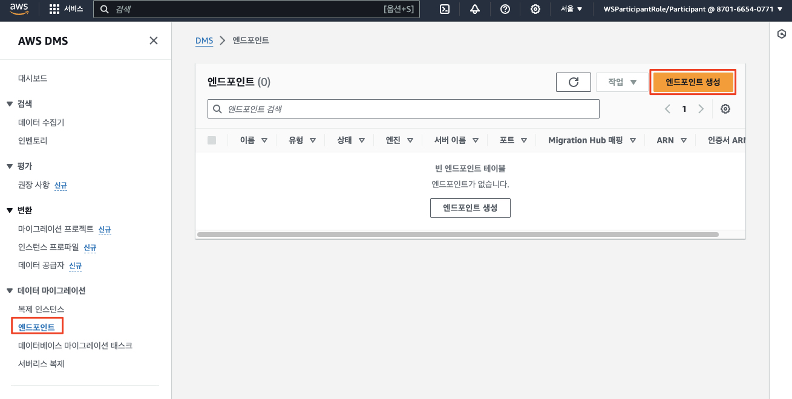
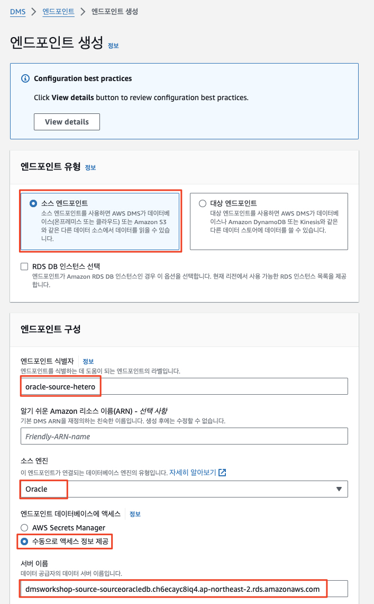
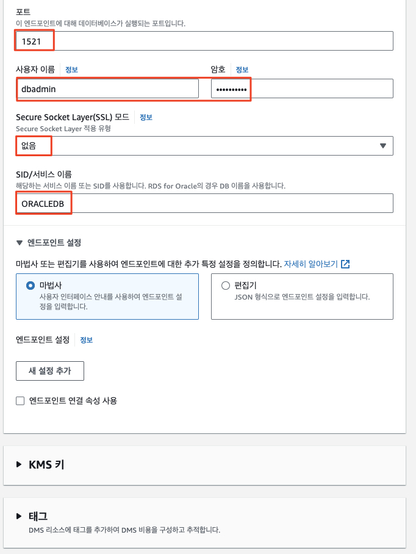
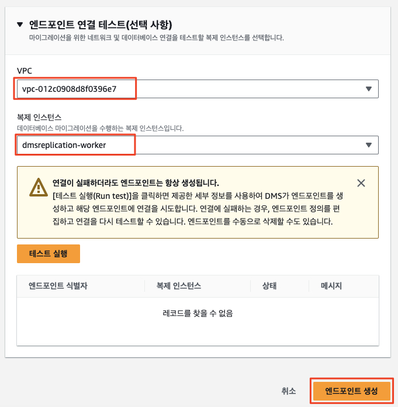
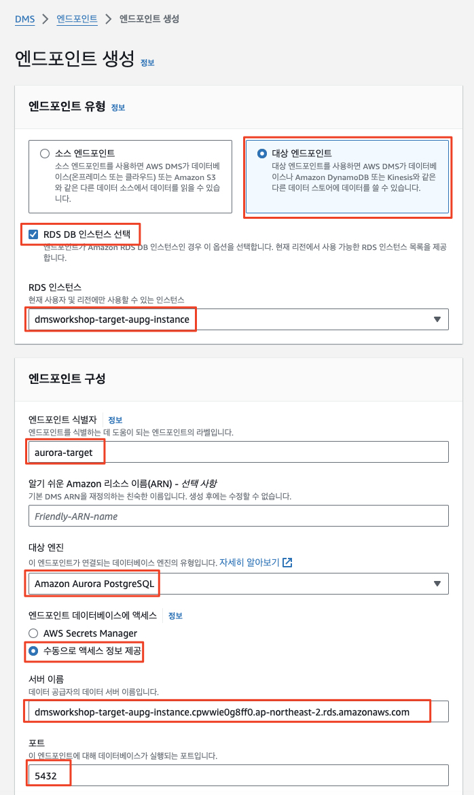
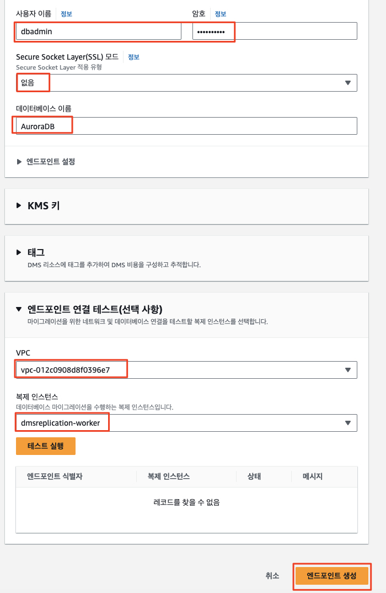

# ***DMS 소스 및 타겟 엔드포인트 생성***

생성된 복제 인스턴스를 사용하는 소스 및 타겟 데이터베이스 엔드포인트를 생성하도록 하겠습니다.

1. ```DMs > 데이터 마이그레이션 > 엔드포인```로 이동한 후 오른쪽 상단의 ```엔드포인트 생성```을 클릭합니다.

    

2. ```소스 엔드포인트```를 선택한 후 다음 정보를 입력한 후 ```연결 테스트```을 클릭합니다. 상태가 **성공**으로 바뀌면 **엔드포인트 생성**을 클릭합니다.
   
   | **파라미터**                | **값**                        |
   |-------------------------|------------------------------|
   | **엔드포인트 유형**            | ```소스 엔드포인트```               |
   | **RDS DB 인스턴스 선택**      | ```체크 해제 (선택하지 않음)```        |
   | **엔드포인트 식별자**           | ```oracle-source-hetero```   |
   | **소스 엔진**               | ```Oracle```                 |
   | **엔드포인트 데이터베이스 액세스**    | ```수동으로 액세스 정보 제공```         |
   | **서버 이름**               | ```소스 측 오라클 데이터베이스 주소``` |
   | **포트**                  | ```1521```                   |
   | **SSL 모드**              | ```없음```                     |
   | **사용자 이름**              | ```dbadmin```                |
   | **비밀번호**                | ```dbadmin123```             |
   | **SID/Service Name**    | ```ORACLEDB```               |   
   | **엔드포인트 연결 테스트 -> VPC** | ```DMSWorkshop-Target-DmsVpc``` |
   | **복제 인스턴스**             | ```앞서 생성한 복제 인스턴스```         |

   

   

   

3. 동일하게 다음 값을 사용하여 ```Aurora RDS 데이터베이스```에 대한 타겟 엔드포인트를 생성합니다```연결  테스트```를 수행하고 ```엔드포인트 생성```을 클릭합니다.

   | **파라미터**                | **값**                                          |
   |-------------------------|------------------------------------------------|
   | **엔드포인트 유형**            | ```대상 엔드포인트```                                 |
   | **RDS DB 인스턴스 선택**      | ```체크```                                       |
   | **RDS DB 인스턴스**         | ```dmsworkshop-target-aupg-instance```         |
   | **엔드포인트 식별자**           | ```aurora-target```                            |
   | **대상 엔진**               | ```Amazon Aurora PostgreSQL```                 |
   | **엔드포인트 데이터베이스 액세스**    | ```수동으로 액세스 정보 제공```                           |
   | **서버 이름**               | ```타겟 Aurora PostgreSQL 데이터베이스 주소 (자동으로 설정)``` |
   | **포트**                  | ```5432```                                     |
   | **사용자 이름**              | ```dbadmin```                                  |
   | **비밀번호**                | ```dbadmin123```                               |
   | **SSL 모드**              | ```없음```                                       |
   | **데이터베이스 이름**           | ```AuroraDB```                                 |   
   | **엔드포인트 연결 테스트 -> VPC** | ```DMSWorkshop-Target-DmsVpc```                   |
   | **복제 인스턴스**             | ```앞서 생성한 복제 인스턴스```                           |

   

   

---
