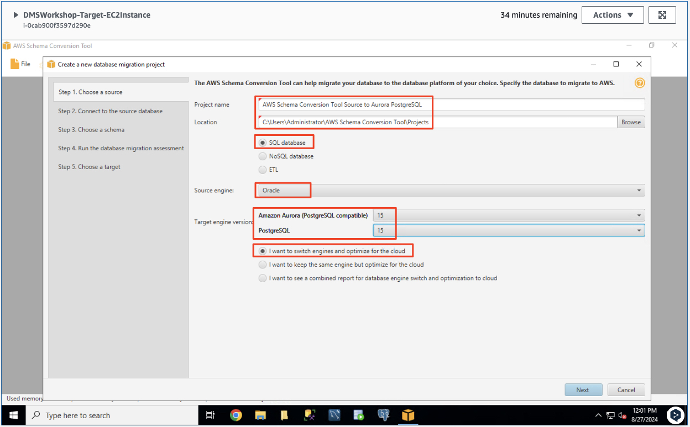
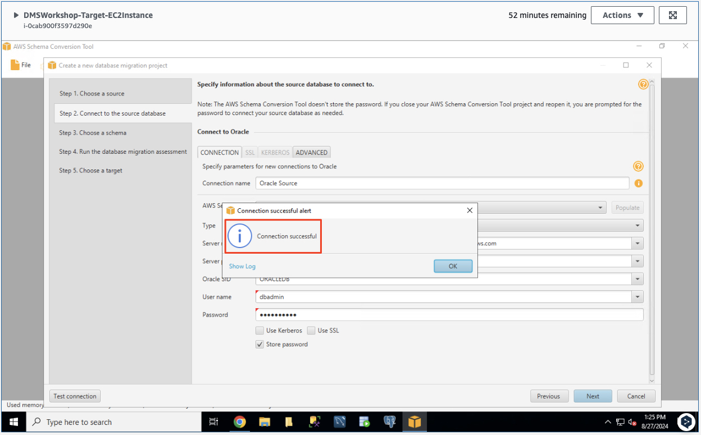
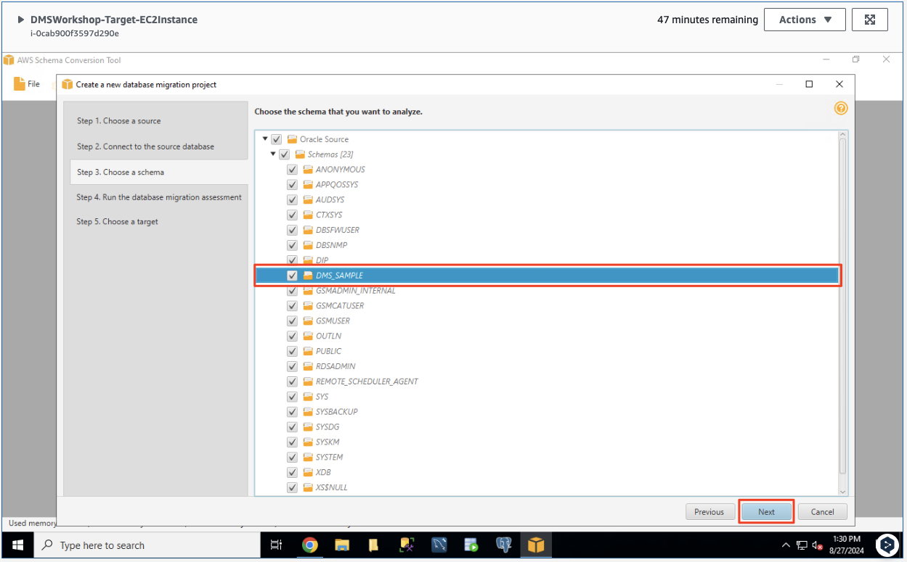
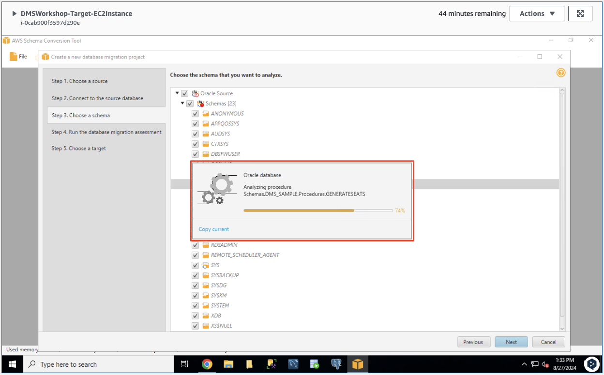
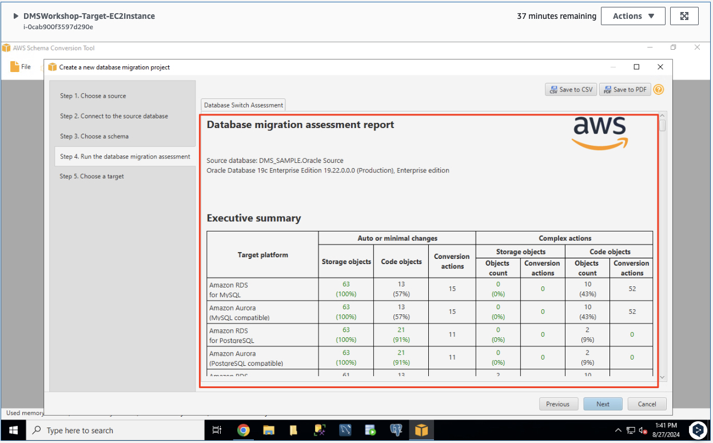
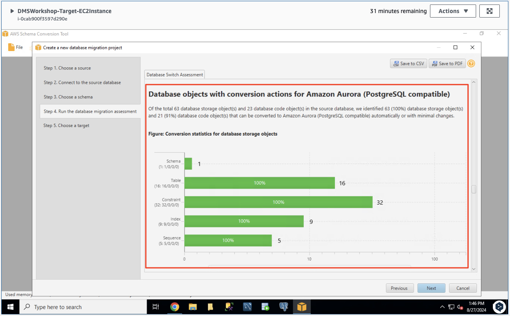
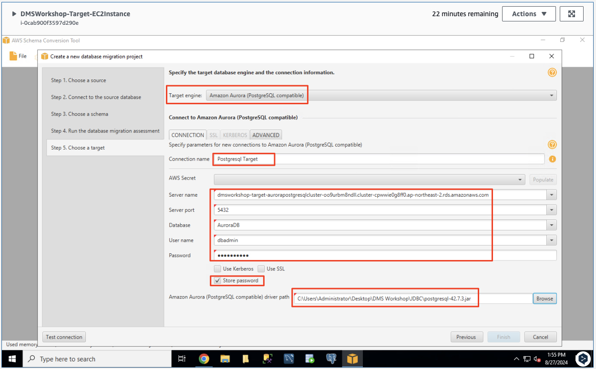
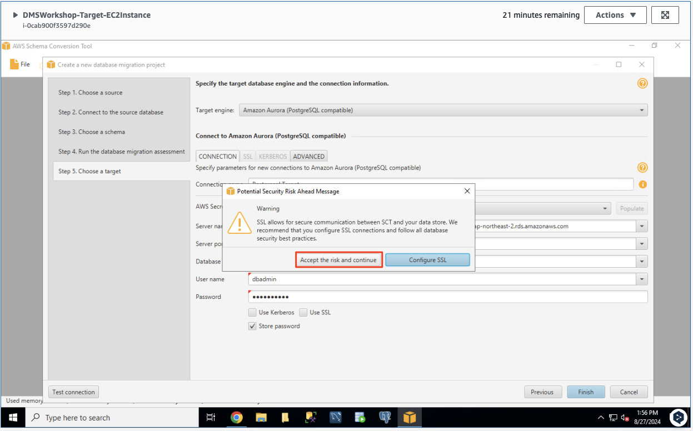
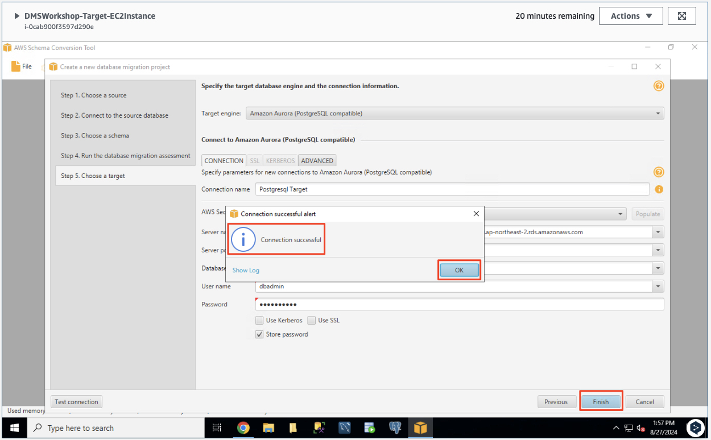

# ***데이터베이스 마이그레이션 프로젝트 생성***

다음 단계는 설치된 ```스키마 변환 도구 (AWS Schema Conversion Tool)```을 사용하여 데이터베이스 마이그레이션 프로젝트를 생성하는 것입니다.

1. ```스키마 변환 도구``` 내에서 새 프로젝트 마법사가 시작되지 않으면 왼쪽 상단의 파일 메뉴로 이동하여 ```새 프로젝트 마법사```를 시작하세요. 프로젝트 마법사 모드에서 양식에 다음 값을 입력한 후 ```다음```을 클릭하세요. (때때로 다음 버튼이 표시되도록 하려면 창을 최대화하거나 이동해야 하는 경우가 있습니다.)

    

    

   | **파라미터**      | **값**                                                                                         |
   |---------------|-----------------------------------------------------------------------------------------------|
   | **프로젝트 이름**   | ```AWS Schema Conversion Tool Source to Aurora PostgreSQL```                                  |
   | **위치**        | ```C:\Users\Administrator\AWS Schema Conversion Tool\Projects (기본값)```                        |
   | **데이터베이스 타입** | ```SQL database```                                                                            |
   | **소스 엔진**     | ```Oracle```                                                                                  |
   | **타겟 엔진 버전**  | ```Amazon Aurora (PostgreSQL compatible) 15```                                                |
   | **전환 옵션**     | ```나는 엔진을 전환하고 클라우드용으로 최적화하려고 합니다 (I want to switch engines and optimize for the cloud)``` 선택 |

   

2. 양식에 아래 값을 사용하여 소스 데이터베이스 구성을 지정합니다. 그런 다음 ```Test connection```을 클릭하세요. 연결 테스트가 성공적으로 완료되면 연결 성공 버튼에서 ```확인```을 클릭한 후 ```다음```을 클릭하세요.


   | **파라미터**                    | **값**                                                              |
   |-----------------------------|--------------------------------------------------------------------|
   | **연결 이름 (Connection name)** | ```Oracle Source```                                                |
   | **타입**                      | ```SID```                                                          |
   | **서버 이름**                   | ```소스 환경의 CloudFormation의 출력 탭에서 확인```                             |
   | **서버 포트**                   | ```1521```                                                         |
   | **SID**                     | ```ORACLEDB```                                                     |
   | **사용자 이름**                  | ```dbadmin```                                                      |
   | **암호**                      | ```dbadmin123```                                                   |
   | **SSL 사용**                  | ```체크 해제 (미사용)```                                                  |
   | **암호 저장**                   | ```체크 (암호 저장)```                                                   |
   | **오라클 드라이버 경로**             | ```C:\Users\Administrator\Desktop\DMS Workshop\JDBC\ojdbc11.jar``` |
    
   

   

   > ⚠️ **참고**<br>
   > 만약 연결 테스트가 실패하면 소스 데이터베이스 포트 ```1521```를 위한 위한 방화벽 (보안 그룹)에 ```10.16.0.0/12``` 대역이 허용되어 있는지 확인합니다.

   

3. ```DMS_SAMPLE``` 스키마를 선택한 다음 ```다음```을 클릭합니다.

   > 📒 **참고**<br>
   > ```다음``` 버튼은 ```DMS_SAMPLE``` 스키마를 클릭하고 아래 그림과 같이 파란색 막대가 표시될 때까지 활성화되지 않습니다.

   

   

   > 📕 **참고**<br>
   > ```다음```을 누르고 메타데이터를 로드한 후 다음과 같은 경고 메시지가 나타날 수 있습니다. **Metadata loading was interrupted because of data fetching issues.** 이 메시지는 워크샵 진행에 영향을 주지 않으므로 무시해도 됩니다. ```SCT```가 데이터베이스 개체를 분석하는 데 몇 분 정도 걸립니다.

4. ```데이터베이스 마이그레이션 평가 보고서```의 요약 페이지를 검토한 다음 ```Amazon Aurora PostgreSQL``` 변환 섹션까지 아래로 스크롤합니다 (오른쪽 스크롤 막대의 중간 조금 아래에 있습니다).

    
    
   - ```SCT```는 소스 데이터베이스 스키마의 모든 개체를 자세히 검토합니다. 가능한 한 많은 것을 자동으로 변환하고 변환할 수 없는 항목에 대한 자세한 정보를 제공합니다.

   

   - 일반적으로 패키지, 프로시저 및 함수는 가장 많은 사용자 지정 또는 독점 SQL 코드를 포함하고 있기 때문에 해결해야 할 문제가 있을 가능성이 높습니다. ```AWS SCT```는 각 개체 유형을 변환하는 데 필요한 수동 변경의 양을 산정합니다. 또한 이러한 개체를 대상 스키마에 성공적으로 적응시키기 위한 힌트를 제공합니다.

5. 데이터베이스 마이그레이션 평가 보고서 검토를 마친 후 ```다음```을 클릭합니다.

6. 아래 값을 사용하여 타겟 데이터베이스에 대한 정보를 제공합니다. ```Test connection``` 버튼을 눌러 연결 테스트가 성공적으로 완료되면 ```마침```을 클릭하세요.

   | **파라미터**                    | **값**                                                                        |
    |-----------------------------|------------------------------------------------------------------------------|
    | **타겟 엔진**                   | ```Amazon Aurora (PostgreSQL compatible) (기본값이 아니므로 변경하세요)```                |
    | **연결 이름 (Connection name)** | ```Postgresql Target```                                                      |
    | **서버 이름**                   | ```(타겟 환경의 CloudFormation의 출력 탭에서 확인)```                                     |
    | **서버 포트**                   | ```5432```                                                                   |
    | **데이터베이스 이름**               | ```AuroraDB (대소문자 주의)```                                                     |
    | **사용자 이름**                  | ```dbadmin```                                                                |
    | **암호**                      | ```AWS Secrets Manager에서 확인```                                               |
    | **SSL 사용**                  | ```체크 해제 (미사용)```                                                            |
    | **암호 저장**                   | ```체크 (암호 저장)```                                                             |
    | **Amazon Aurora 드라이버 경로**   | ```C:\Users\Administrator\Desktop\DMS Workshop\JDBC\postgresql-42.7.3.jar``` |

    

    

    

   > 📕 **참고**<br>
   > ```다음```을 누르고 메타데이터를 로드한 후 다음과 같은 경고 메시지가 나타날 수 있습니다. **Metadata loading was interrupted because of data fetching issues.** 이 메시지는 워크샵 진행에 영향을 주지 않으므로 무시해도 됩니다. ```SCT```가 데이터베이스 개체를 분석하는 데 몇 분 정도 걸립니다.
