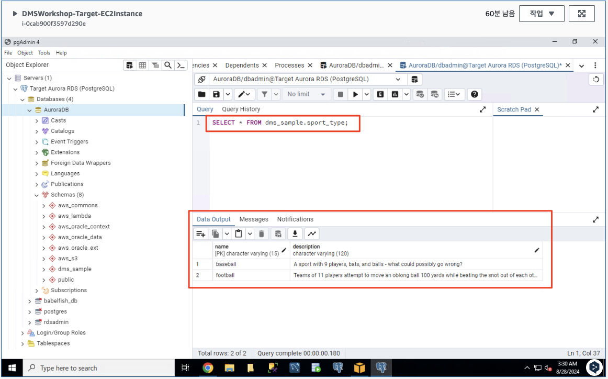

# ***타겟 데이터베이스 데이터 검사***

1. EC2 서버 내에서 ```pgAdmin4```를 연 다음 이전에 생성한 타겟 ```Aurora RDS (PostgreSQL)``` 데이터베이스에 연결합니다.

2. 대상 데이터베이스의 테이블 중 하나를 쿼리하여 마이그레이션된 데이터를 검사합니다. 예를 들어 다음 쿼리는 두 개의 행이 있는 테이블을 반환해야 합니다 (혹은 앞선 워크샵 결과가 남아 있다면 좀 더 많은 행).

    ```sql
    SELECT * FROM dms_sample.sport_type;
    ```

   

   > 📒 **참고**<br>
   > 다음 단계에서는 다른 스포츠 유형에 대한 정보가 포함된 몇 가지 새 레코드를 소스 데이터베이스에 삽입합니다. DMS는 이러한 새 레코드를 소스 데이터베이스에서 대상 데이터베이스로 자동으로 복제합니다.

3. 이제 다음 스크립트를 사용하여 이전에 삭제한 외래 키 제약 조건을 활성화합니다. 아래 내용을 ```pgAdmin 4```의 ```쿼리 편집기```에 복사한 다음 스크립트를 ```실행```합니다.

   ```sql
   ALTER TABLE dms_sample.player
   ADD CONSTRAINT sport_team_fk
   FOREIGN KEY (sport_team_id)
   REFERENCES dms_sample.sport_team(id)
   ON DELETE CASCADE;
   
   ALTER TABLE dms_sample.seat
   ADD CONSTRAINT seat_type_fk
   FOREIGN KEY (seat_type)
   REFERENCES dms_sample.seat_type(name)
   ON DELETE CASCADE;
   
   /*
   Skipping because of long wait time for the query to complete
   
   ALTER TABLE dms_sample.seat
   ALTER COLUMN sport_location_id TYPE numeric;
   
   ALTER TABLE dms_sample.seat
   ADD CONSTRAINT s_sport_location_fk
   FOREIGN KEY (sport_location_id)
   REFERENCES dms_sample.sport_location(id)
   ON DELETE CASCADE;
   */
   
   ALTER TABLE dms_sample.sport_division
   ADD CONSTRAINT sd_sport_type_fk
   FOREIGN KEY (sport_type_name)
   REFERENCES dms_sample.sport_type (name)
   ON DELETE CASCADE;
   
   ALTER TABLE dms_sample.sport_division
   ADD CONSTRAINT sd_sport_league_fk
   FOREIGN KEY (sport_league_short_name)
   REFERENCES dms_sample.sport_league (short_name)
   ON DELETE CASCADE;
   
   ALTER TABLE dms_sample.sport_league
   ADD CONSTRAINT sl_sport_type_fk
   FOREIGN KEY (sport_type_name)
   REFERENCES dms_sample.sport_type (name);
   
   ALTER TABLE dms_sample.sport_team
   ADD CONSTRAINT st_sport_type_fk
   FOREIGN KEY (sport_type_name)
   REFERENCES dms_sample.sport_type (name)
   ON DELETE CASCADE;
   
   ALTER TABLE dms_sample.sport_team
   ADD CONSTRAINT home_field_fk
   FOREIGN KEY (home_field_id)
   REFERENCES dms_sample.sport_location (id)
   ON DELETE CASCADE;
   
   ALTER TABLE dms_sample.sporting_event
   ADD CONSTRAINT se_sport_type_fk
   FOREIGN KEY (sport_type_name)
   REFERENCES dms_sample.sport_type (name);
   
   ALTER TABLE dms_sample.sporting_event
   ADD CONSTRAINT se_away_team_id_fk
   FOREIGN KEY (away_team_id)
   REFERENCES dms_sample.sport_team (id)
   ON DELETE CASCADE;
   
   ALTER TABLE dms_sample.sporting_event
   ADD CONSTRAINT se_home_team_id_fk
   FOREIGN KEY (home_team_id)
   REFERENCES dms_sample.sport_team (id);
   
   ALTER TABLE dms_sample.sporting_event_ticket
   ADD  CONSTRAINT set_person_id
   FOREIGN KEY(ticketholder_id)
   REFERENCES dms_sample.person (ID)
   ON DELETE CASCADE;
   
   ALTER TABLE dms_sample.sporting_event_ticket
   ADD CONSTRAINT set_sporting_event_fk
   FOREIGN KEY (sporting_event_id)
   REFERENCES dms_sample.sporting_event (id)
   ON DELETE CASCADE;
   
   /*
   Skipping because of long wait time for the query to complete
   
   ALTER TABLE dms_sample.sporting_event_ticket
   ALTER COLUMN sport_location_id TYPE numeric;
   
   ALTER TABLE dms_sample.sporting_event_ticket
   ADD CONSTRAINT set_seat_fk
   FOREIGN KEY (sport_location_id, seat_level, seat_section, seat_row, seat)
   REFERENCES dms_sample.seat (sport_location_id, seat_level, seat_section, seat_row, seat);
   */
   
   ALTER TABLE dms_sample.ticket_purchase_hist
   ADD CONSTRAINT tph_sport_event_tic_id
   FOREIGN KEY (sporting_event_ticket_id)
   REFERENCES dms_sample.sporting_event_ticket (id)
   ON DELETE CASCADE;
   
   ALTER TABLE dms_sample.ticket_purchase_hist
   ADD CONSTRAINT tph_ticketholder_id
   FOREIGN KEY (purchased_by_id)
   REFERENCES dms_sample.person (ID);
   
   ALTER TABLE dms_sample.ticket_purchase_hist
   ADD CONSTRAINT tph_transfer_from_id
   FOREIGN KEY (transferred_from_id)
   REFERENCES dms_sample.person (ID);
   ```

   

--
