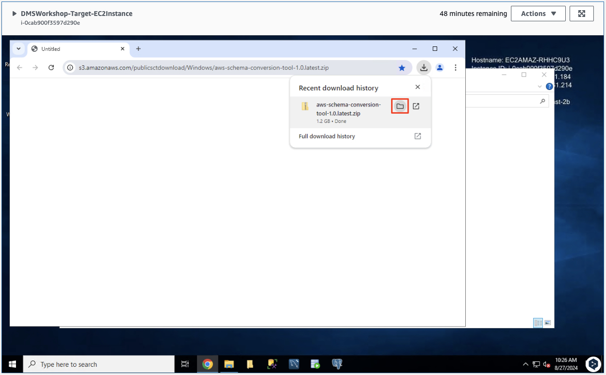

# ***AWS 스키마 변환 도구 (AWS Schema Conversion Tool) 설치***

EC2 인스턴스에 ```Fleet Manager``` 혹은 ```RDP```를 통해 연결한 후 ```AWS 스키마 변환 도구```를 설치합니다.

> ⚠️ (주의)<br>
> Chrome 이외의 브라우저를 사용하여 Fleet Manger RDP에 접속한 경우 클립보드를 통한 복사/붙여넣기를 사용할 수 없습니다. Chrome 브라우저의 사용을 권장하며 부득이 다른 브라우저를 사용할 경우 진행자에게 문의합니다.


1. EC2 서버에서 ```데스크톱```에 있는 ```DMS Workshop``` 폴더를 엽니다 (다른 앱이 열려 있는 경우 바탕 화면으로 이동하면 아래 이미지와 같은 폴더가 표시됩니다). 그런 다음 ```Schema Conversion Tool download``` 링크를 두 번 클릭하여 아래 그림과 같은 최신 버전의 소프트웨어를 다운로드합니다.

    

2. 다운로드가 완료되면 콘텐츠의 압축을 해제하고 ```AWS SCT``` 설치 패키지를 더블클릭하여 설치를 시작합니다. 기본값을 적용하여 설치 마법사 단계를 마치면 ```AWS Schema Conversion Tool``` 설치가 완료됩니다.

    > 📕 (참고)
    > - 때때로 ```Fleet Manager``` 세션에서 더블클릭하는 것이 까다로울 수 있습니다. 파일이 강조 표시된 상태에서 한 번 클릭하고 Enter 키를 누르는 것이 쉬울 수 있습니다.<br>
    > - 또한 설치 마법사가 가려지는 경우도 있으므로 하단 작업 표시줄에 있는지 확인하고 클릭하면 해당 창을 다시 활성화할 수 있습니다.

    

    

    

    

    
    
    
    
    
    
    

3. 설치가 완료되면 ```시작 메뉴```로 이동하여 ```AWS Schema Conversion Tool```을 시작하거나 바탕 화면에서 ```AWS Schema Conversion Tool``` 아이콘을 더블클릭하여 실행합니다.
   
   

   

4. AWS에서는 관리 콘솔을 통해 소스 스키마를 변환하는 서비스의 기능을 점차 개선하고 있습니다. 하지만 일부 지원되지 않는 기능이 있으므로 오늘은 ```AWS SCT```를 사용하여 스키마를 변환합니다.

    

5. 이용약관에 동의하고 ```AWS SCT```를 실행합니다.

   

5. ```AWS SCT```가 정상적으로 실행되면 아래와 같이 화면이 표시됩니다.
