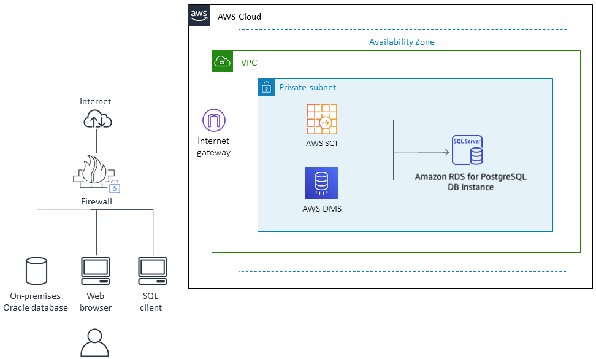

# ***오라클 데이터베이스의 이기종 (Heterogeneous) 마이그레이션***

우리는 앞서 오라클 데이터베이스를 동일 기종 오라클 데이터베이스 마이그레이션하는 과정을 살펴보았습니다.

이번에는 좀 더 복잡하지만 전산 워크로드를 클라우드로 이전하는 과정에서 빈번하게 발생하는 이기종 데이터베이스로의 마이그레이션에 대해서 살펴보도록 하겠습니다.

단계별로 앞서 살펴보았던 [[AWS Database Migration Service (DMS)][(https://aws.amazon.com/dms/) 및 새로이 [[AWS 스키마 변환 도구(AWS SCT)]](https://aws.amazon.com/dms/schema-conversion-tool/?nc=sn&loc=2)를 사용하는 방법을 접해보도록 하겠습니다. 또한 ```AWS DMS```를 사용하여 소스 데이터베이스에서 대상 데이터베이스로 데이터베이스 변경 사항을 지속적으로 복제합니다.

이를 위해 다음과 같은 자원을 사용합니다:
- 소스: 오라클 데이터베이스
- 타겟: ```Amazon RDS Aurora (PostgreSQL)``` 인스턴스
- 데이터베이스에 접근하고 필요한 작업을 수행할 스키마 변환 도구 및 기타 데이터베이스 GUI 도구




다음 순서로 진행합니다.

- [파트 1: 스키마 변환](./Convert-Oracle-Schema-To-PostgreSQL.md)
  - [AWS 스키마 변환 도구 (AWS Schema Conversion Tool) 설치](./Install-AWS-Schema-Conversion-Tool.md)
  - [데이터베이스 마이그레이션 프로젝트 생성](./Create-Database-Migration-Project.md)
  - [스키마 변화](./Convert-Schema.md)
- [파트 2: 데이터 마이그레이션](./Data-Migration.md)
  - [타겟 데이터베이스 설정](./Configure-Target-Database.md)
  - [DMS 복제 인스턴스 생성](./Create-DMS-Replication-Instance.md)
  - [DMS 소스 및 타겟 엔드포인트 생성](./Create-DMS-Source-and-Target-Endpoints.md)
  - [DMS 마이그레이션 태스크 생성](./Create-DMS-Migration-Tasks.md)
  - [타겟 데이터베이스 데이터 검사](./Inspect-Target-Database-Content.md)
  - [데이터 변경 복제](./Replicate-Data-Changes.md)
- [이기종 데이터 마이그레이션 요약](./Summary-Heterogeneous-Data-Migration.md)

---

> 📕 (참고)<br>
> 클라우드 전환 시 이기종 데이터베이스로의 마이그레이션이 가져다 주는 가치에 대해서 정리해 보면 아래와 같습니다.

## 이기종 데이터베이스로의 마이그레이션이 필요한 이유

1. **비용 절감**:
    - 기존 온프레미스 데이터베이스 솔루션을 클라우드로 마이그레이션할 때, 특정 벤더 종속성을 줄이기 위해 이기종 데이터베이스를 선택할 수 있습니다.
    - 클라우드 환경에서 제공하는 관리형 데이터베이스 서비스(예: Amazon RDS, Azure SQL Database)나 오픈 소스 데이터베이스(예: PostgreSQL, MySQL)로 전환하면 비용을 절감할 수 있습니다.

2. **유연성 및 확장성**:
    - 클라우드 서비스는 다양한 데이터베이스 옵션을 제공하여 특정 워크로드에 최적화된 데이터베이스를 선택할 수 있는 유연성을 제공합니다.
    - 이기종 데이터베이스로 마이그레이션하면 애플리케이션 요구사항에 맞게 데이터베이스 기술을 선택할 수 있으며, 클라우드 인프라의 확장성 덕분에 데이터베이스를 쉽게 확장하거나 축소할 수 있습니다.

3. **벤더 종속성 탈피**:
    - 특정 데이터베이스 벤더에 종속되지 않으려는 경우, 이기종 데이터베이스로 마이그레이션하여 여러 데이터베이스 옵션을 사용할 수 있게 됩니다.
    - 이를 통해 다양한 클라우드 공급자의 서비스와 호환이 가능하며, 벤더 종속에 따른 리스크를 줄일 수 있습니다.

4. **성능 최적화**:
    - 클라우드 환경에서는 다양한 데이터베이스 유형을 제공하여 데이터 유형, 처리 요구사항, 쿼리 패턴 등에 맞게 최적화된 데이터베이스를 선택할 수 있습니다.
    - 예를 들어, 트랜잭션 데이터는 관계형 데이터베이스로, 빅데이터 분석에는 NoSQL 데이터베이스로 마이그레이션하는 것이 성능 향상에 도움이 될 수 있습니다.

5. **최신 기술 사용**:
    - 클라우드 서비스 제공자는 최신 데이터베이스 기술을 빠르게 제공하며, 이기종 데이터베이스로의 마이그레이션을 통해 이러한 최신 기술을 활용할 수 있습니다.
    - 최신 데이터베이스 기능을 통해 데이터 관리, 보안, 백업, 복구 등 다양한 면에서 더 나은 성능을 제공받을 수 있습니다.

## 이기종 데이터베이스로의 마이그레이션의 이점

1. **비용 효율성**:
    - 오픈 소스 데이터베이스나 클라우드 네이티브 데이터베이스 솔루션으로 전환하면 라이선스 비용을 절감할 수 있습니다.
    - 관리형 서비스로 운영 비용이 절감되며, 자원 사용에 따라 비용이 청구되므로 경제적인 이점이 있습니다.

2. **향상된 성능 및 확장성**:
    - 클라우드 기반 데이터베이스는 수요에 따라 쉽게 확장 가능하며, 고성능을 요구하는 애플리케이션을 위한 다양한 최적화 옵션을 제공합니다.
    - 자동 스케일링, 로드 밸런싱, 분산 아키텍처 등을 통해 데이터베이스 성능을 최적화할 수 있습니다.

3. **보안 및 컴플라이언스 강화**:
    - 클라우드 제공자는 데이터 보안을 위해 다양한 보안 기능을 제공하며, 이기종 데이터베이스로의 마이그레이션을 통해 최신 보안 표준과 컴플라이언스 요구 사항을 쉽게 충족할 수 있습니다.
    - 예: 데이터 암호화, 액세스 제어, 감사 로그 등.

4. **유연한 데이터 관리**:
    - 다양한 데이터베이스 기술을 활용하여 구조화된 데이터, 반구조화된 데이터, 비구조화된 데이터 등 다양한 유형의 데이터를 효과적으로 관리할 수 있습니다.
    - 클라우드에서는 데이터베이스를 목적에 맞게 선택하여 사용자가 원하는 방식으로 데이터를 처리하고 관리할 수 있습니다.

5. **자동화된 관리 및 운영**:
    - 클라우드 데이터베이스 서비스는 자동 백업, 자동 복구, 소프트웨어 패치 및 업그레이드 등의 관리 기능을 제공하여 운영 부담을 줄입니다.
    - 이러한 자동화된 기능은 데이터베이스의 가용성을 높이고 운영자의 작업을 줄여줍니다.

## 결론

클라우드 전환 시 이기종 데이터베이스로의 마이그레이션은 비용 절감, 성능 최적화, 유연성 확보, 최신 기술 사용, 보안 및 관리 효율성을 강화하는 데 중요한 역할을 합니다. 이를 통해 기업은 더 나은 데이터 관리 전략을 수립하고, 비즈니스 요구사항에 맞는 데이터베이스 솔루션을 활용하여 경쟁력을 강화할 수 있습니다.


