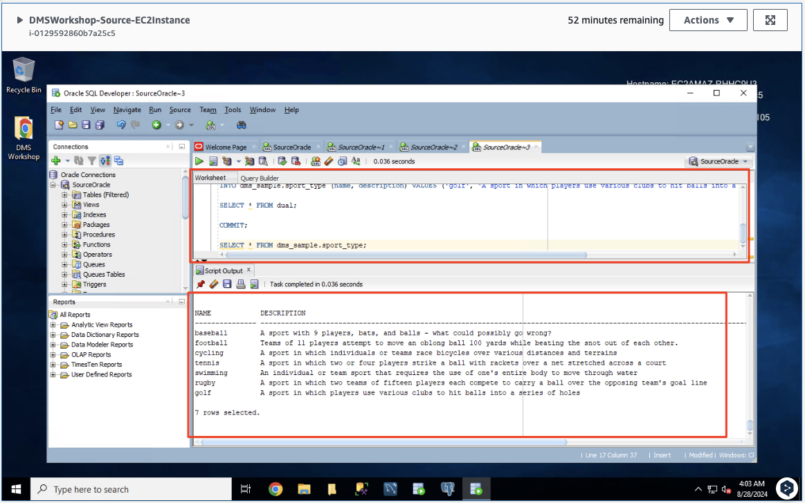
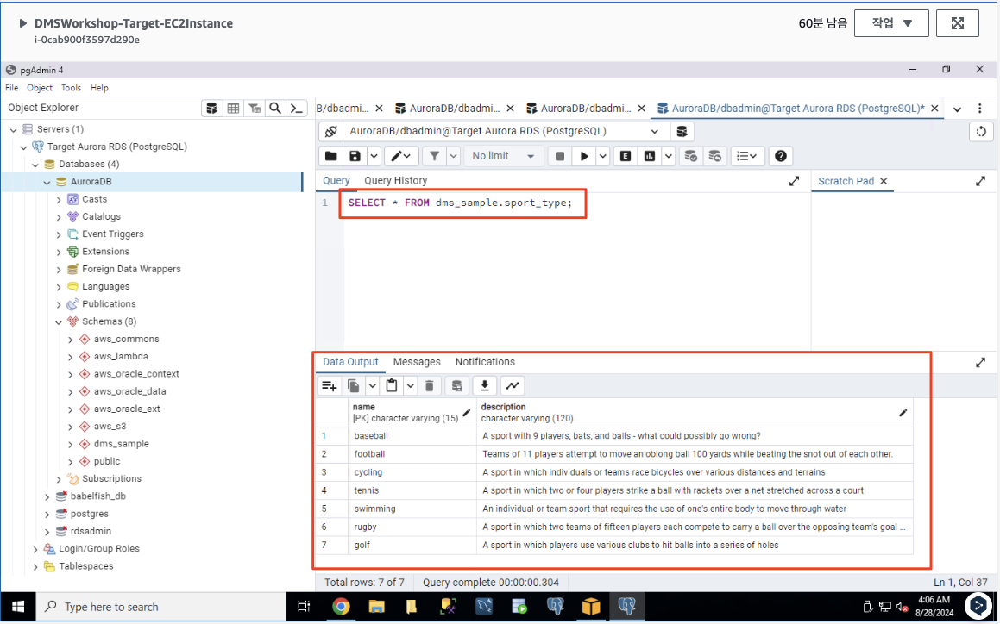
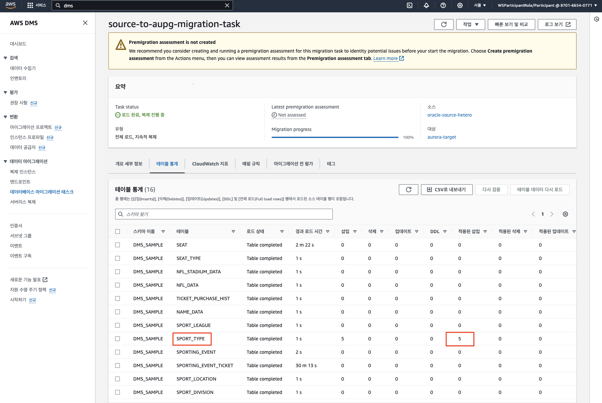

# ***데이터 변경 복제***

이제 ```SPORT_TYPE``` 테이블을 업데이트하여 소스 데이터베이스에 대한 트랜잭션을 시뮬레이션하겠습니다. ```Database Migration Service```는 이러한 변경 사항을 자동으로 감지하고 대상 데이터베이스에 복제합니다.

1. (소스 측) EC2 인스턴스로 돌아가서 (```Fleet Manager```를 통해 다시 연결해야 할 수도 있음) 다음 단계를 수행하여 소스 데이터베이스에 레코드를 추가합니다.

2. ```Oracle SQL Developer```의 새 쿼리 창을 열고 다음 쿼리문을 실행하여 ```SPORT_TYPE``` 테이블에 5개의 새 스포츠 타입을 입력합니다.

    ```sql
    INSERT ALL
    
    INTO dms_sample.sport_type (name, description) VALUES ('cycling', 'A sport in which individuals or teams race bicycles over various distances and terrains')
    
    INTO dms_sample.sport_type (name, description) VALUES ('tennis', 'A sport in which two or four players strike a ball with rackets over a net stretched across a court')
    
    INTO dms_sample.sport_type (name, description) VALUES ('swimming', 'An individual or team sport that requires the use of one''s entire body to move through water')
    
    INTO dms_sample.sport_type (name, description) VALUES ('rugby', 'A sport in which two teams of fifteen players each compete to carry a ball over the opposing team''s goal line')
    
    INTO dms_sample.sport_type (name, description) VALUES ('golf', 'A sport in which players use various clubs to hit balls into a series of holes')
    
    SELECT * FROM dual; 
    
    COMMIT;
    
    SELECT * FROM dms_sample.sport_type;
    ```

    

3. (타겟 측) ```pgAdmin4``` 다음 쿼리를 다시 실행해 봅니다.

    ```sql
    SELECT * FROM dms_sample.sport_type;
    ```

    

    > **참고**<br>
    > 이제 다른 스포츠 유형에 대한 정보가 포함된 몇 가지 새 레코드를 소스 데이터베이스에 삽입했습니다. ```DMS```는 이러한 새 레코드를 소스 데이터베이스에서 대상 데이터베이스로 자동으로 복제합니다.


4. 소스 데이터베이스의 ```SPORT_TYPE``` 테이블에 입력된 새로운 스포츠 종목 레코드가 타겟 측의 해당 테이블에 복제되었습니다. AWS 콘솔에서 ```데이터베이스 마이그레이션 태스크```의 ```테이블 통계```를 확인하여 삽입, 삭제, 업데이트 및 DDL 수를 자세히 조사할 수 있습니다.

    


> 📕 **참고**<br>
> * ```AWS DMS 마이그레이션 태스크```는 소스 데이터베이스 변경 사항을 대상 ```Aurora PostgreSQL``` 데이터베이스로 복제하여 최신 상태로 유지합니다.
> * ```AWS DMS```는 애플리케이션 마이그레이션을 구현할 때까지 작업의 모든 테이블을 최신 상태로 유지합니다. 소스의 데이터를 타겟쪽으로 초기 적재하는 작업이 완료되면 변경 사항의 복제 레이턴스 굉장히 작습니다 (Nearly 0).
