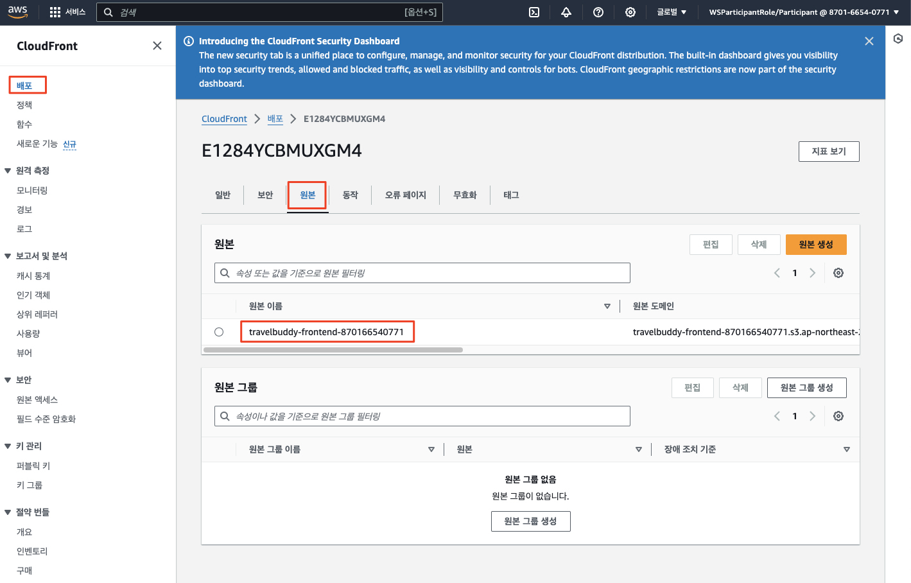

# ***프론트엔드의 백엔드 접속 엔드포인트 (DNS)를 ALB로 변경***

---

## **Agenda*
1. 개요

---

## **1. 개요**

이제 프론트엔드의 백엔드 접속 엔드포인트 (DNS)를 ALB로 변경합니다.

> 📌 **참고**<br>
> * 대개의 실무 사례에서는 앞선 과정에서 분리된 프론트엔드 이미 최종 백엔드 DNS 이름을 가리키고 있으므로, 이 과정은 해당 DNS 이름의 ```CNAME``` 레코드를 ALB의 DNS 이름으로 변경하는 것을 의미합니다.<br>
> * 즉 아래와 유사하다고 볼 수 있습니다.
>   * 기존: 프론트엔드 -> 백엔드 접속 DNS 주소 (예: travelbuddy.mycompany.com) CNAME -> 온프레미스 백엔드 DNS 주소 (예: travelbuddy-legacy.mycompany.com) -> 애플리케이션 서버 주소
>   * 신규: 프론트엔드 -> 백엔드 접속 DNS 주소 (예: travelbuddy.mycompany.com) CNAME -> 온프레미스 클라우드 ALB DNS 주소 (예: k8s-travelbuddy-2157020304-1285626420.ap-northeast-2.elb.amazonaws.com) -> 신규 트래픽은 쿠버네테스 Pod로 유입, 기존 트래픽은 온프레미스로 라우팅
> * 하지만 오늘 우리는 백엔드에서 사용할 공용 DNS 주소가 준비되지 않았으므로, ```CloudFront```에 배포된 프론트엔드가 요청하는 백엔드 DNS 주소를 ```ALB```로 변경하는 것만 수행합니다.

---

## **2. ```Amazon CloudFront```에 프론트엔드 배포**

1. ```CloudFront > 배포``` 콘솔로 이동하여 생성된 ```CloudFront``` 배포를 확인합니다.

   

2. ```CloudFront``` 배포를 클릭하여 ```원본``` 탭으로 이동한 후 ```원본 이름``` 열에 적힌 ```S3``` 버킷을 확인하고 이를 메모해 둡니다.

   

3. ```Cloud9``` 터미널 창에서 아래 명령으로 프론트엔드 애플리케이션의 환경 설정 파일을 (```config.json```) 엽니다. 이 파일에는 ```TravelBuddy``` 애플리케이션의 백엔드 엔드포인트 설정도 들어 있습니다.

    ```bash
    c9 open ~/environment/aws-database-migration/legacy/applications/TravelBuddy/ui/src/config.json
    ```

   

4. (<u>***이제 타겟 환경의 ALB로***</u>) 타겟 환경의 ```EC2 > 로드 밸런싱 > 로드밸런서```로 이동하여 ```TravelBuddy``` ```ALB```의 DNS 이름의 확인하고 이 값으로 ```config.json``` 파일을 수정합니다.

   

   

   > **주의**<br>
   > * 우리는 퍼블릭 인증서가 준비되지 않았으므로 프로토콜은 ```http```로 설정합니다. 그리고 ```ALB```가 ```80``` 포트를 사용하므로 ```포트``` 정보는 ```80```으로 설정합니다.
   > *```config.json``` 파일을 수정한 후에는 꼭 ```저장``` 메뉴를 클릭하거나 ```Ctrl + S``` 키를 눌러 변경 사항을 저장합니다.*
   > * 또한 현재 소스 환경에서는 ```애플리케이션 서버```가 ```8080``` 포트를 통해서 서비스되고 있으므로, 해당 포트 정보도 ```config.json``` 파일에 반영하도록 합니다.

5. ```Cloud9``` 터미널 창에서 아래 명령으로 프론트엔드 애플리케이션을 빌드하고 배포합니다. 아래에서 ```<CloudFront 배포 원본 이름>```은 앞서 확인한 ```CloudFront``` 배포의 ```원본 이름 ```을 입력합니다.

    ```bash
    cd ~/environment/aws-database-migration/legacy/applications/TravelBuddy/ui
    npm run build
    ```

    ```bash
    # 프론트엔드를 오리진 S3 버킷에 업로드 - 예: aws s3 sync build s3://travelbuddy-frontend-537682470830
    aws s3 sync build/ s3://<CloudFront 배포 원본 이름>
    ```

   

6. ```CloudFront > 배포``` 콘솔로 돌아와서 ```배포 도메인 이름```을 확인합니다.

   

7. 이제 배포 도메인을 사용하여 프론트엔드 애플리케이션이 정상적으로 표시되는지 확인합니다.
    * 웹 브라우저를 열고 ```CloudFront``` 배포 도메인을 입력하여 접속합니다.
    * 이 때 **"https:"** 가 아닌 **"http:"** 프로토콜을 사용합니다.

   

---

## 축하합니다. 이제 모든 트래픽을 일단 클라우드의 ```ALB```로 유입시키고, ```ALB```가 적절히 트래픽을 분산하여 데이터베이스와 애플리케이션이 전환된 신규 트래픽은 클라우드로, 그렇지 않은 기존 트래픽은 온프레미스로 라우팅하도록 설정하였습니다.

## 이 작업은 처음에는 복잡하게 느껴질 수 있지만, 한번만 수행하며 이후의 개발 과정을 가속화시키고 다양한 실험을 할 수 있는 기반을 마련하게 되었습니다.
