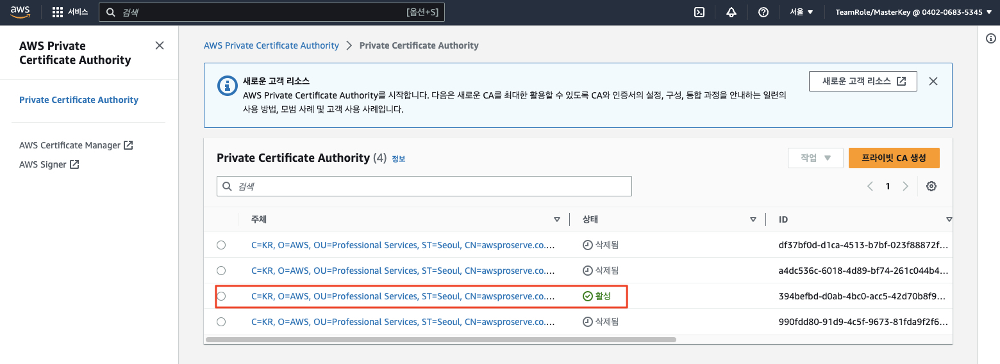
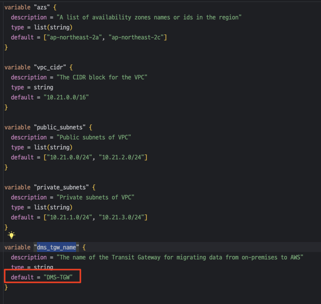
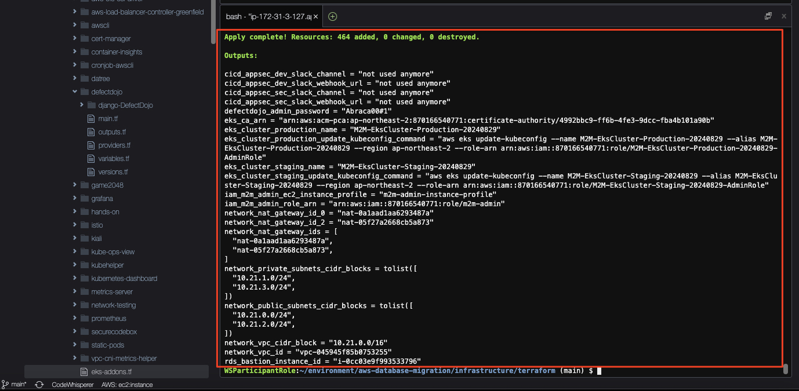

# ***(타겟) 신규 데이터베이스 및 애플리케이션 인프라 구성***

---

## Agenda
1. ```Cloud9``` 통합 환경 (IDE) 생성 및 설정
2. 워크샵 소스 코드 (`aws-database-migration`) 다운로드
3. 데이터베이스 및 애플리케이션 인프라 구성
4. 신규 인프라 네트워크 설정

---

## 1. ```Cloud9``` 통합 환경 (IDE) 생성 및 설정


---

## 2. 워크샵 소스 코드 (`aws-database-migration`) 다운로드

이제부터 모든 작업은 `Cloud9` 상에서 이루어지며, 먼저 `aws-database-migration` (현재 워크샵) 소스를 아래와 같이 다운로드합니다.

```bash
cd ~/environment/
git clone https://github.com/shkim4u/aws-database-migration
cd aws-database-migration
```

해당 소스 코드에는 테라폼으로 작성된 IaC 코드도 포함되어 있으며 여기에는 우리가 이번 과정에서 목표로 하는 타겟 데이터베이스 자원인 ```Amazon RDS```, 관리형 컨테이너 오케스트레이션 서비스인 ```Amazon EKS```, 프론트엔드 호스팅을 위한 ```Amazon CloudFront```, 그리고 이벤트 드리븐 아키텍처를 구성하는 ```Amazon MSK``` 등의 자원이 포함되어 있습니다.

우선 이 테라폼 코드를 사용하여 자원을 배포하도록 합니다.

---

## 3. 데이터베이스 및 애플리케이션 인프라 구성

본격적으로 자원을 생성하기 앞서, 우선 아래 명령을 실행하여 몇몇 ALB (애플리케이션, ```ArgoCD```, ```Argo Rollouts``` 등에 접속하기 위한 엔드포인트 역할)에서 사용하기 위한 ```Amazon Certificate Manager (ACM)``` 사설 (Private) CA를 생성하고 Self-signed Root CA 인증서를 설치합니다.

```bash
hash -d aws

cd ~/environment/aws-database-migration/infrastructure/terraform

# 1. Configure Terraform workspace and Private Certificate Authority.
. ./configure.sh aws-database-migration ap-northeast-2

env | grep TF_VAR

cat <<EOF > terraform.tfvars
ca_arn = "${TF_VAR_ca_arn}"
eks_cluster_production_name = "${TF_VAR_eks_cluster_production_name}"
eks_cluster_staging_name = "${TF_VAR_eks_cluster_staging_name}"
EOF
```

위와 같이 수행하면 ACM에 사설 CA가 생성되는데 진행자와 함께 ACM 콘솔로 이동하여 Private CA를 한번 살펴봅니다.<br>
아래와 같이 Private CA가 활성 상태인 것을 확인합니다.<br>


> (참고)<br>
> 현재 리포지터를 통해 공유된 테라폼 코드에는 테라폼 상태 공유 및 공동 작업을 위한 백엔드 (S3, DynamoDB)가 포함되어 있지 않은데, 이에 대해서 궁금하시면 관리자나 과정 진행자에게 문의하세요.

이제 아래 명령어를 통해 타겟 데이터베이스 호스팅을 위한 ```Amazon RDS, 애플리케이션 컨테이너 구동을 위한 ```Amazon EKS ``` 클러스터 및 기타 자원을 생성합니다. 15 ~ 20분 정도 소요됩니다.<br>

> **주의**<br>
> * 아래 명령을 수행하여 자원을 생성하기 전에 앞선 과정에서 생성한 ```Transite Gateway```의 이름이 ```DMS-TGW```로 설정되어 있는지 확인합니다.<br>
> * 만약 다른 이름으로 설정되어 있다면 ```DMS-TGW```로 변경하거나, ```~/environment/aws-database-migration/infrastructure/terraform/modules/network/variables.tf``` 파일을 열어서 ```dms_tgw_name``` 변수의 기본값을 수정합니다.



```bash
# 1. IaC 디렉토리로 이동
cd ~/environment/aws-database-migration/infrastructure/terraform

# terraform init
terraform init

# terraform plan
terraform plan -out tfplan

# terraform apply
terraform apply -auto-approve tfplan
```



모든 자원의 생성이 완료되면 `Production`과 `Staging`을 위한 ```Amazon RDS``` 데이터베이스와 ```Amazon EKS``` 클러스터 2개가 생성됩니다.

쿠버네테스의 경우 우리는 주로 `Production` 클러스터를 사용하므로 아래와 같이 환경 변수를 설정합니다.

```bash
cd ~/environment/aws-database-migration/infrastructure/terraform

echo 'export KUBECONFIG=~/.kube/config:$(find ~/.kube/ -type f -name "*M2M-EksCluster*" | tr "\n" ":")' >> ~/.bash_profile 

echo 'alias kcp="kubectl config use-context $(kubectl config get-contexts -o name | grep Production | sort -r | head -n 1)"' >> ~/.bash_profile
echo 'alias kcs="kubectl config use-context $(kubectl config get-contexts -o name | grep Staging | sort -r | head -n 1)"' >> ~/.bash_profile
echo 'alias kcc="kubectl config current-context"' >> ~/.bash_profile

# Terraform helper aliases.
echo 'alias ti="terraform init"' >> ~/.bash_profile
echo 'alias taa="terraform apply -auto-approve"' >> ~/.bash_profile

source ~/.bash_profile
```

또한 이후 작업의 편의를 위해 아래와 같이 ArgoCD Admin 암호를 설정합니다.<br>
```bash
# 아래 명령을 수행하면 ArgoCD 서버의 Admin 암호를 설정하고 이를 AWS Secrets Manager에 동기화 저장합니다.
# AWS Secrets Manager에 동기화 저장된 암호는 어플리케이션의 배포 파이프라인에서 배포 단계에 사용됩니다.
cd ~/environment/aws-database-migration/cloud9
chmod +x *.sh

# Staging 클러스터
kcs
ARGOCD_ADMIN_INITIAL_PASSWORD=`kubectl -n argocd get secret argocd-initial-admin-secret -o jsonpath="{.data.password}" | base64 -d`
echo $ARGOCD_ADMIN_INITIAL_PASSWORD
./set-argocd-admin-password-argocd-server.sh $ARGOCD_ADMIN_INITIAL_PASSWORD "Abraca00#1"

# Production 클러스터
kcp
ARGOCD_ADMIN_INITIAL_PASSWORD=`kubectl -n argocd get secret argocd-initial-admin-secret -o jsonpath="{.data.password}" | base64 -d`
echo $ARGOCD_ADMIN_INITIAL_PASSWORD
./set-argocd-admin-password-argocd-server.sh $ARGOCD_ADMIN_INITIAL_PASSWORD "Abraca00#1"
```

---

## 4. 신규 인프라 네트워크 설정

새롭게 생성된 데이터베이스와 애플리케이션 인프라를 위한 이전에 설정한 ```Transite Gateway```와 연결합니다.


---


## 축하합니다! 아마존 EKS 클러스터를 정상적으로 프로비저닝하였습니다.

시간 여유가 있다면 진행자와 함께 생성된 자원, 특히 타겟 데이터베이스를 한번 살펴봅니다.
