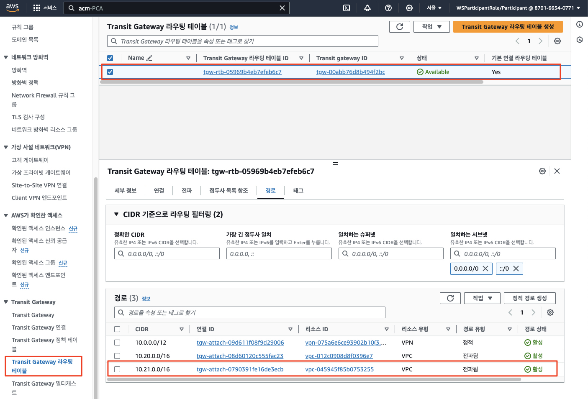
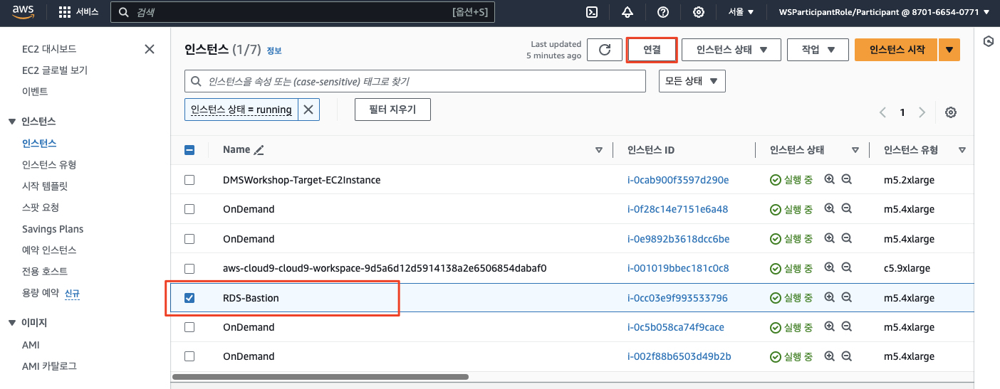
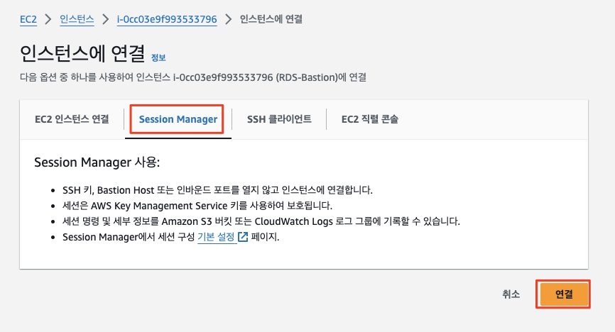
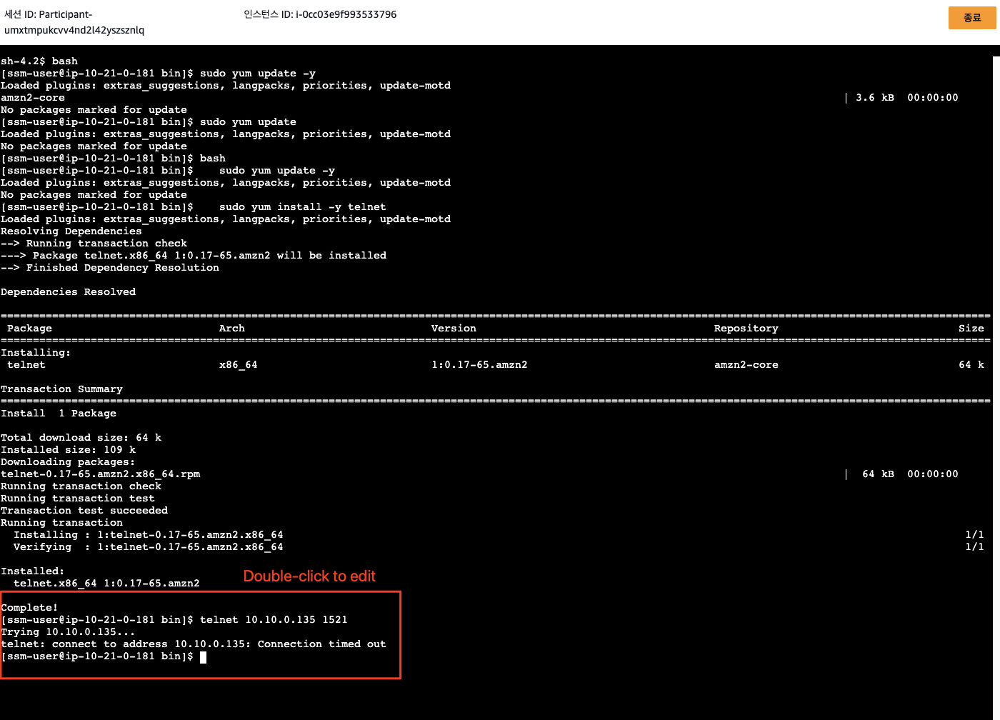
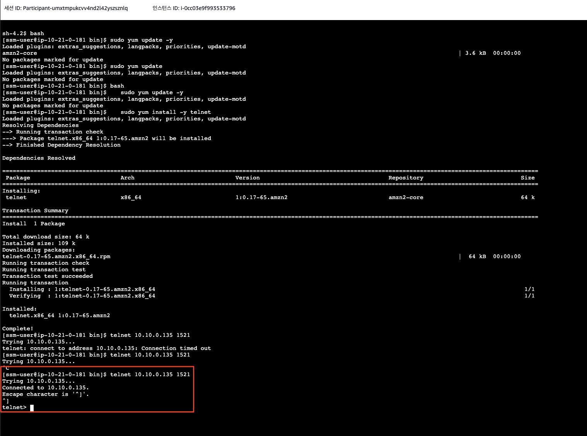

# ***(타겟) 신규 데이터베이스 및 애플리케이션 인프라 구성***

---

## Agenda
1. ```Cloud9``` 통합 환경 (IDE) 생성 및 설정
2. 워크샵 소스 코드 (`aws-database-migration`) 다운로드
3. 데이터베이스 및 애플리케이션 인프라 구성
4. 신규 인프라 네트워크 설정

---

## 1. ```AWS Cloud9``` 통합 환경 (IDE) 생성 및 설정

### 1.1. ```AWS Cloud9``` IDE 생성

진행자가 제공한 AWS 관리 콘솔에서 ```CloudShell```을 실행한 후 아래 명령을 수행하여 ```Cloud9``` 환경을 생성해 줍니다.<br>
```CloudShell```도 다수의 개발 언어와 런타임, 그리고 클라우드 환경을 다룰 수 있는 CLI를 기본적으로 제공하지만 보다 풍부한 통합 개발 환경을 제공하는 ```Cloud9```을 사용하기로 합니다.<br>
아래 명령은 ```Cloud9``` 환경을 구성하기 위하여 일련의 작업을 수행하므로 완료될 때까 다소 시간이 걸립니다 (1 ~ 2분)

```bash
export AWS_PAGER=''
curl -fsSL https://raw.githubusercontent.com/shkim4u/m2m-travelbuddy/main/cloud9/bootstrap-v2-with-admin-user-trust.sh | bash -s -- c5.9xlarge
```
### 1.2. ```AWS Cloud9``` IDE 설정

위에서 생성한 ```Cloud9``` 통합 개발 환경에 접속하여 필요한 사항을 사전에 구성한 쉘 스크립트 파일을 아래와 같이 실행합니다.

여기에는 다음 사항이 포함됩니다.

1. IDE IAM 설정 확인
2. 쿠버네테스 (Amazon EKS) 작업을 위한 Tooling
    * kubectl 설치
    * eksctl 설치
    * k9s 설치
    * Helm 설치
3. AWS CLI 업데이트
4. AWS CDK 업그레이드
5. 기타 도구 설치 및 구성
    * AWS SSM 세션 매니저 플러그인 설치
    * AWS Cloud9 CLI 설치
    * jq 설치하기
    * yq 설치하기
    * bash-completion 설치하기
6. Cloud9 추가 설정하기
7. 디스크 증설
8. (Optional) CUDA Deep Neural Network (cuDNN) 라이브러리
9. Terraform 설치
10. ArgoCD 설치
11. Python 3.11 설치

```bash
cd ~/environment/

export AWS_PAGER=''
# Cloud9 환경 설정
curl -fsSL https://raw.githubusercontent.com/shkim4u/m2m-travelbuddy/main/cloud9/cloud9.sh | bash

# Amazon Corretto Headless 17 설치
sudo yum install -y java-17-amazon-corretto-headless

# Docker 빌드를 위한 Docker Compose 설치
sudo curl -L "https://github.com/docker/compose/releases/download/v2.29.2/docker-compose-linux-x86_64" -o /usr/local/bin/docker-compose
sudo chmod +x /usr/local/bin/docker-compose
docker-compose --version

# JWT CLI 설치
npm install -g jwt-cli
```

---

## 2. 워크샵 소스 코드 (`aws-database-migration`) 다운로드

이제부터 모든 작업은 `Cloud9` 상에서 이루어지며, 먼저 `aws-database-migration` (현재 워크샵) 소스를 아래와 같이 다운로드합니다.

```bash
cd ~/environment/
git clone https://github.com/shkim4u/aws-database-migration
cd aws-database-migration
```

해당 소스 코드에는 테라폼으로 작성된 IaC 코드도 포함되어 있으며 여기에는 우리가 이번 과정에서 목표로 하는 타겟 데이터베이스 자원인 ```Amazon RDS```, 관리형 컨테이너 오케스트레이션 서비스인 ```Amazon EKS```, 프론트엔드 호스팅을 위한 ```Amazon CloudFront```, 그리고 이벤트 드리븐 아키텍처를 구성하는 ```Amazon MSK``` 등의 자원이 포함되어 있습니다.

우선 이 테라폼 코드를 사용하여 자원을 배포하도록 합니다.

---

## 3. 데이터베이스 및 애플리케이션 인프라 구성

본격적으로 자원을 생성하기 앞서, 우선 아래 명령을 실행하여 몇몇 ALB (애플리케이션, ```ArgoCD```, ```Argo Rollouts``` 등에 접속하기 위한 엔드포인트 역할)에서 사용하기 위한 ```Amazon Certificate Manager (ACM)``` 사설 (Private) CA를 생성하고 Self-signed Root CA 인증서를 설치합니다.

```bash
hash -d aws

cd ~/environment/aws-database-migration/infrastructure/terraform

# 1. Configure Terraform workspace and Private Certificate Authority.
. ./configure.sh aws-database-migration ap-northeast-2

env | grep TF_VAR

cat <<EOF > terraform.tfvars
ca_arn = "${TF_VAR_ca_arn}"
eks_cluster_production_name = "${TF_VAR_eks_cluster_production_name}"
eks_cluster_staging_name = "${TF_VAR_eks_cluster_staging_name}"
EOF
```

위와 같이 수행하면 ACM에 사설 CA가 생성되는데 진행자와 함께 ACM 콘솔로 이동하여 Private CA를 한번 살펴봅니다.<br>
아래와 같이 Private CA가 활성 상태인 것을 확인합니다.<br>


> (참고)<br>
> 현재 리포지터를 통해 공유된 테라폼 코드에는 테라폼 상태 공유 및 공동 작업을 위한 백엔드 (S3, DynamoDB)가 포함되어 있지 않은데, 이에 대해서 궁금하시면 관리자나 과정 진행자에게 문의하세요.

이제 아래 명령어를 통해 타겟 데이터베이스 호스팅을 위한 ```Amazon RDS```, 애플리케이션 컨테이너 구동을 위한 ```Amazon EKS ``` 클러스터 및 기타 자원을 생성합니다. 15 ~ 20분 정도 소요됩니다.<br>

> ⚠️ **주의**<br>
> * 아래 명령을 수행하여 자원을 생성하기 전에 앞선 과정에서 생성한 ```Transit Gateway```의 이름이 ```DMS-TGW```로 설정되어 있는지 확인합니다.<br>
> * 만약 다른 이름으로 설정되어 있다면 ```DMS-TGW```로 변경하거나, ```~/environment/aws-database-migration/infrastructure/terraform/modules/network/variables.tf``` 파일을 열어서 ```dms_tgw_name``` 변수의 기본값을 수정합니다.


```bash
# 1. IaC 디렉토리로 이동
cd ~/environment/aws-database-migration/infrastructure/terraform

# terraform init
terraform init

# terraform plan
terraform plan -out tfplan

# terraform apply
terraform apply -auto-approve tfplan
```


모든 자원의 생성이 완료되면 `Production`과 `Staging`을 위한 ```Amazon RDS``` 데이터베이스와 ```Amazon EKS``` 클러스터 2개가 생성됩니다.

쿠버네테스의 경우 우리는 주로 `Production` 클러스터를 사용하므로 아래와 같이 환경 변수를 설정합니다.

```bash
cd ~/environment/aws-database-migration/infrastructure/terraform

echo 'export KUBECONFIG=~/.kube/config:$(find ~/.kube/ -type f -name "*M2M-EksCluster*" | tr "\n" ":")' >> ~/.bash_profile 

echo 'alias kcp="kubectl config use-context $(kubectl config get-contexts -o name | grep Production | sort -r | head -n 1)"' >> ~/.bash_profile
echo 'alias kcs="kubectl config use-context $(kubectl config get-contexts -o name | grep Staging | sort -r | head -n 1)"' >> ~/.bash_profile
echo 'alias kcc="kubectl config current-context"' >> ~/.bash_profile

# Terraform helper aliases.
echo 'alias ti="terraform init"' >> ~/.bash_profile
echo 'alias taa="terraform apply -auto-approve"' >> ~/.bash_profile

source ~/.bash_profile
```

또한 이후 작업의 편의를 위해 아래와 같이 ArgoCD Admin 암호를 설정합니다.<br>
```bash
# 아래 명령을 수행하면 ArgoCD 서버의 Admin 암호를 설정하고 이를 AWS Secrets Manager에 동기화 저장합니다.
# AWS Secrets Manager에 동기화 저장된 암호는 어플리케이션의 배포 파이프라인에서 배포 단계에 사용됩니다.
cd ~/environment/aws-database-migration/cloud9
chmod +x *.sh

# Production 클러스터
kcp
ARGOCD_ADMIN_INITIAL_PASSWORD=`kubectl -n argocd get secret argocd-initial-admin-secret -o jsonpath="{.data.password}" | base64 -d`
echo $ARGOCD_ADMIN_INITIAL_PASSWORD
./set-argocd-admin-password-argocd-server.sh $ARGOCD_ADMIN_INITIAL_PASSWORD "Abraca00#1"
./set-argocd-admin-password-secrets-manager.sh "Abraca00#1" hotelspecials-ci-argocd-admin-password
```

---

## 4. 신규 인프라 네트워크 확인

위의 과정이 차질없이 완료되면 다음 네트워크 구성도 자동으로 설정됩니다.

* 새로운 ```워크로드 VPC (M2M-VPC)```에 대한 ```Transit Gateway Attachment```
* ```Transit Gateway 라우팅 테이블```에 ```워크로드 VPC```에 대한 라우팅 경로



우리는 소스 환경에 오라클 데이터베이스를 사용하여 구축된 ```TravelBuddy``` 애플리케이션을 데이터베이스와 함께 타겟 환경으로 마이그레이션이 목적이므로 워크로드 VPC에서 소스 데이터베이스로 접근할 수 있는지 확인해 봅니다.

1. 타겟 환경의 ```EC2 > 인스턴스```로 이동하여 ```RDS Bastion```이라는 이름을 가진 인스턴스를 선택하고 ```접속```을 클릭합니다. 해당 인스턴스는 신규로 구축된 ```워크로드 VPC``` 내에 존재합니다.

    

2. ```Session Manager```를 통하여 연결한 후, 간단한 소스 오라클 데이터베이스 접속 테스트를 수행합니다.

    

   * 아래에서 ```<소스 데이터 엔드포인트>```는 소스 환경의 ```OnPremAppServer-DMSWorkshop-Source``` 인스턴스의 ```Private IP``` 주소를 사용합니다 (소스 환경을 맡으신 분께 문의). 왜냐하면 이 인스턴스에서 오라클 데이터베이스와 애플리케이션 서버가 함께 구동되고 있기 때문입니다.

   ```bash
   bash
   sudo yum update -y
   sudo yum install -y telnet
   ```
   
   ```bash
   telnet <소스 데이터베이스 엔드포인트> 1521
   ```
   
   * 별다른 작업을 하지 않았다면 아래와 같이 접속이 되지 않을 것입니다.<br>***원인이 무엇인지 추측해 보고 조치를 취해서 다시 접속을 시도해 봅니다. (힌트: 아래 사항을 살펴봅니다)***
     * (소스 측) ```애플리케이션 서버```의 오라클 포트 방화벽 설정
     * (타겟 측) ```워크로드 VPC```의 서브넷 별 라우팅 테이블
 
   

    * 위 조치 후에 다시 접속을 시도하면 아래와 같이 접속이 성공하는 것을 볼 수 있습니다.
   
    

    > **참고**<br>
    > * 사실 새로운 타겟인 ```워크로드 VPC```에서 소스 환경으로 직접 통신이 수행될 필요는 없습니다.
    > * ```AWS Database Migration Service```의 ```Replication Instance```가 소스 데이터베이스와 타겟 데이터베이스 간의 데이터 마이그레이션을 수행하기 때문입니다. (일종의 MITM; Machine In The Middle)
    > * 이는 오직 마이그레이션 작업을 위한 일시적인 접속 테스트입니다. 이후 마이그레이션 작업은 ```DMS```를 통해 이루어집니다.

---


## 축하합니다! 아마존 EKS 클러스터를 정상적으로 프로비저닝하였습니다.

시간 여유가 있다면 진행자와 함께 생성된 자원, 특히 타겟 데이터베이스를 한번 살펴봅니다.
