# ***```FlightSpecials``` 데이터베이스 스키마 전환***

## **Agenda**
1. 개요
2. ```AWS Schema Conversion Tool (AWS SCT)``` 설치
3. 데이터베이스 마이그레이션 프로젝트 생성
4. 스키마 변환
5. 프로시저 코드 수정

---

## **1. 개요**

이제 본격적으로 ```TravelBuddy``` 시스템을 클라우드로 전환하는 작업을 시작합니다.

우선 ```FlightSpecials``` 데이터베이스의 스키마를 전환하는 작업을 수행합니다. 실제 데이터는 해당 ```FlightSpecials``` 서비스가 클라우드로 전화되기 직적에 옮겨지 예정이므로 여기서는 스키마만을 전환하도록 하겠습니다.

전환 작업은 ```Oracle``` 소스에서 ```Amazon Aurora MySQL``` 타겟으로 진행합니다.

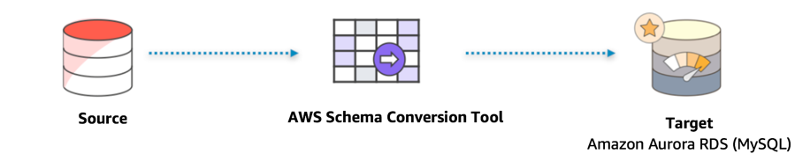

---

## **2. ```AWS Schema Conversion Tool (AWS SCT)``` 설치**

> 📕 **참고**<br>
> ```AWS SCT```가 타겟 환경의 ```EC2 인스턴스```에 이미 설치되어 있으면 이 과정을 건너뛰어도 됩니다.

EC2 인스턴스에 ```Fleet Manager``` 혹은 ```RDP```를 통해 연결한 후 ```AWS 스키마 변환 도구```를 설치합니다.

> ⚠️ (주의)<br>
> Chrome 이외의 브라우저를 사용하여 Fleet Manger RDP에 접속한 경우 클립보드를 통한 복사/붙여넣기를 사용할 수 없습니다. Chrome 브라우저의 사용을 권장하며 부득이 다른 브라우저를 사용할 경우 진행자에게 문의합니다.


1. EC2 서버에서 ```데스크톱```에 있는 ```DMS Workshop``` 폴더를 엽니다 (다른 앱이 열려 있는 경우 바탕 화면으로 이동하면 아래 이미지와 같은 폴더가 표시됩니다). 그런 다음 ```Schema Conversion Tool download``` 링크를 두 번 클릭하여 아래 그림과 같은 최신 버전의 소프트웨어를 다운로드합니다.

   

2. 다운로드가 완료되면 콘텐츠의 압축을 해제하고 ```AWS SCT``` 설치 패키지를 더블클릭하여 설치를 시작합니다. 기본값을 적용하여 설치 마법사 단계를 마치면 ```AWS Schema Conversion Tool``` 설치가 완료됩니다.

   > 📕 (참고)
   > - 때때로 ```Fleet Manager``` 세션에서 더블클릭하는 것이 까다로울 수 있습니다. 파일이 강조 표시된 상태에서 한 번 클릭하고 Enter 키를 누르는 것이 쉬울 수 있습니다.<br>
   > - 또한 설치 마법사가 가려지는 경우도 있으므로 하단 작업 표시줄에 있는지 확인하고 클릭하면 해당 창을 다시 활성화할 수 있습니다.

   

   

   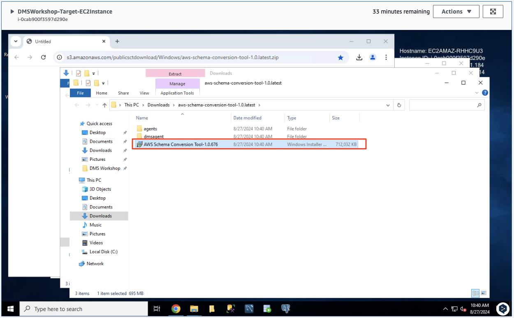

   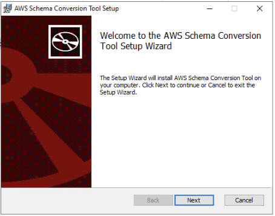

   

   

   

   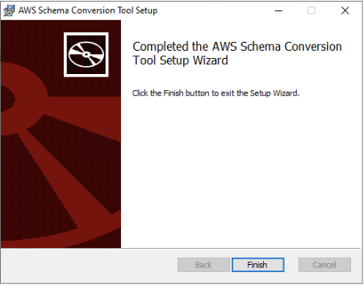

3. 설치가 완료되면 ```시작 메뉴```로 이동하여 ```AWS Schema Conversion Tool```을 시작하거나 바탕 화면에서 ```AWS Schema Conversion Tool``` 아이콘을 더블클릭하여 실행합니다.

   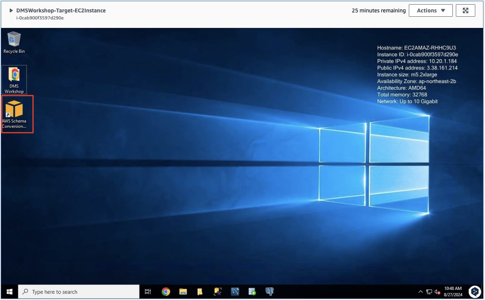

   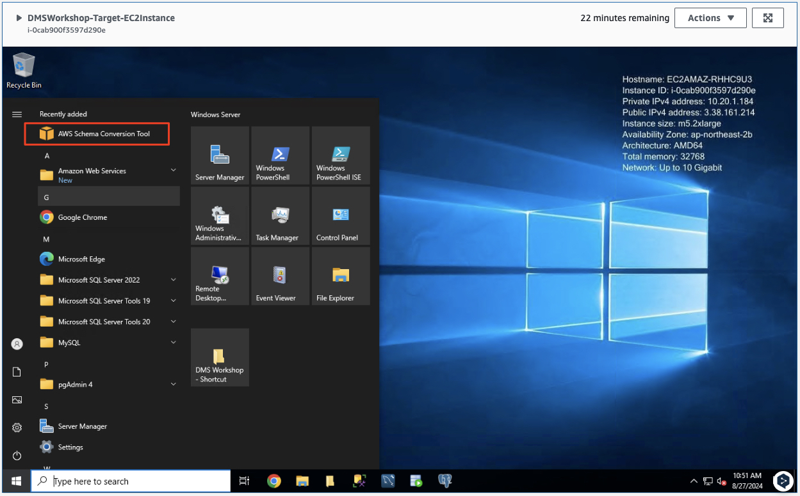

4. AWS에서는 관리 콘솔을 통해 소스 스키마를 변환하는 서비스의 기능을 점차 개선하고 있습니다. 하지만 일부 지원되지 않는 기능이 있으므로 오늘은 ```AWS SCT```를 사용하여 스키마를 변환합니다.

   

5. 이용약관에 동의하고 ```AWS SCT```를 실행합니다.

   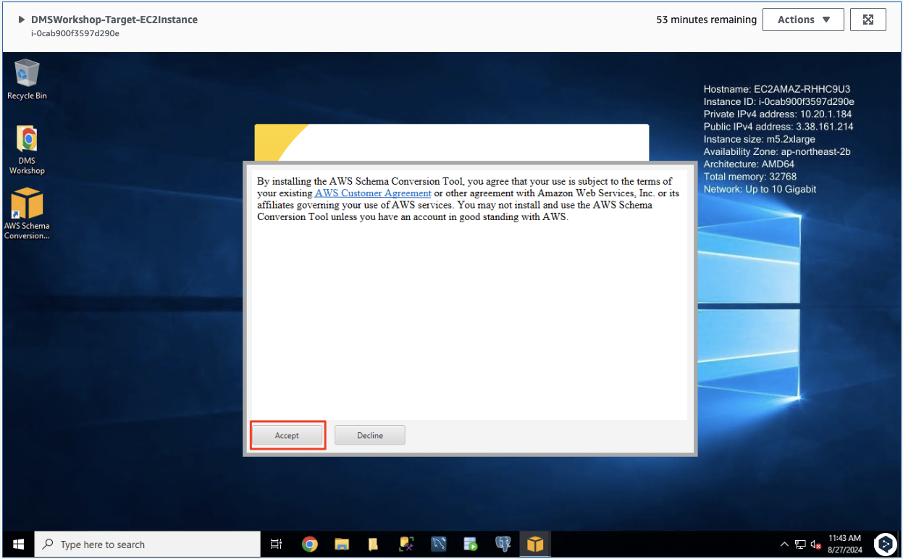

6. ```AWS SCT```가 정상적으로 실행되면 아래와 같이 화면이 표시됩니다.

---

## **3. 데이터베이스 마이그레이션 프로젝트 생성**

다음 단계는 설치된 ```스키마 변환 도구 (AWS Schema Conversion Tool)```를 사용하여 데이터베이스 마이그레이션 프로젝트를 생성하는 것입니다.

아래 단계에서 ```Amazon Aurora MySQL```을 타겟으로 하는 프로젝트를 생성하기 위해서는 우선 ```MySQL JDBC 드라이버```를 설정해야 합니다. 다음 단계를 따라 진행하세요.

1. ```AWS SCT```를 실행한 후 ```Settings > Global Settings```를 선택합니다.

   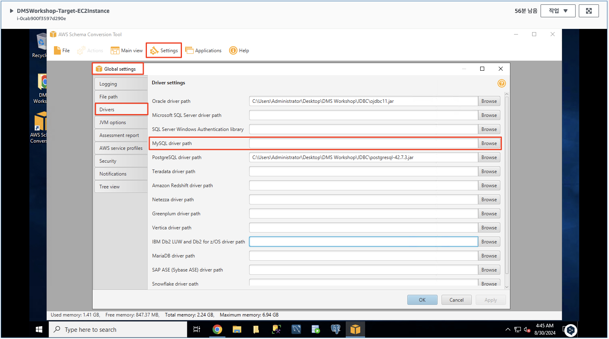

2. ```MySQL JDBC 드라이버```를 아래 그림과 같이 설정해 줍니다.

   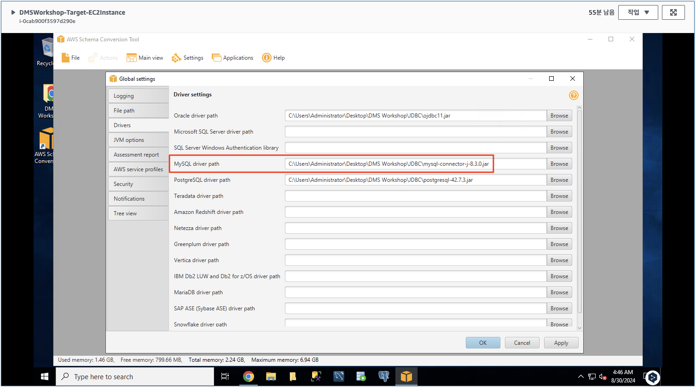

3. ```스키마 변환 도구``` 내에서 새 프로젝트 마법사가 시작되지 않으면 왼쪽 상단의 파일 메뉴로 이동하여 ```새 프로젝트 마법사```를 시작하세요. 프로젝트 마법사 모드에서 양식에 다음 값을 입력한 후 ```다음```을 클릭하세요. (때때로 다음 버튼이 표시되도록 하려면 창을 최대화하거나 이동해야 하는 경우가 있습니다.)

   

   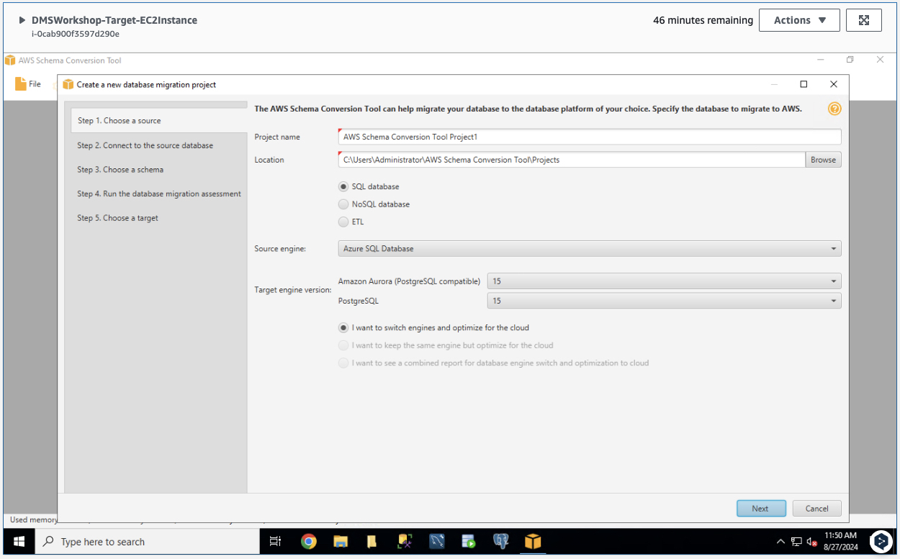

   | **파라미터**      | **값**                                                                                         |
      |---------------|-----------------------------------------------------------------------------------------------|
   | **프로젝트 이름**   | ```AWS Schema Conversion Tool Source to Aurora MySQL```                                       |
   | **위치**        | ```C:\Users\Administrator\AWS Schema Conversion Tool\Projects (기본값)```                        |
   | **데이터베이스 타입** | ```SQL database```                                                                            |
   | **소스 엔진**     | ```Oracle```                                                                                  |
   | **타겟 엔진 버전**  | ```Amazon Aurora (PostgreSQL compatible) 15```                                                |
   | **전환 옵션**     | ```나는 엔진을 전환하고 클라우드용으로 최적화하려고 합니다 (I want to switch engines and optimize for the cloud)``` 선택 |

   

4. 양식에 아래 값을 사용하여 소스 데이터베이스 구성을 지정합니다. 그런 다음 ```Test connection```을 클릭하세요. 연결 테스트가 성공적으로 완료되면 연결 성공 버튼에서 ```확인```을 클릭한 후 ```다음```을 클릭하세요.


| **파라미터**                    | **값**                                                              |
   |-----------------------------|--------------------------------------------------------------------|
| **연결 이름 (Connection name)** | ```Oracle Source```                                                |
| **타입**                      | ```SID```                                                          |
| **서버 이름**                   | ```소스 환경의 CloudFormation의 출력 탭에서 확인```                             |
| **서버 포트**                   | ```1521```                                                         |
| **SID**                     | ```ORACLEDB```                                                     |
| **사용자 이름**                  | ```dbadmin```                                                      |
| **암호**                      | ```dbadmin123```                                                   |
| **SSL 사용**                  | ```체크 해제 (미사용)```                                                  |
| **암호 저장**                   | ```체크 (암호 저장)```                                                   |
| **오라클 드라이버 경로**             | ```C:\Users\Administrator\Desktop\DMS Workshop\JDBC\ojdbc11.jar``` |

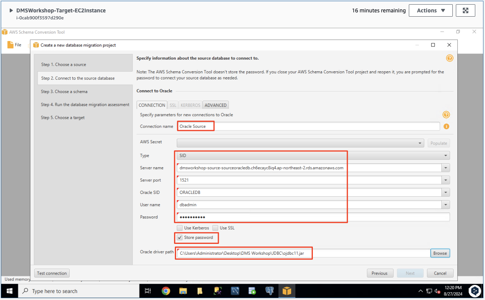


> ⚠️ **참고**<br>
> 만약 연결 테스트가 실패하면 소스 데이터베이스 포트 ```1521```를 위한 위한 방화벽 (보안 그룹)에 ```10.16.0.0/12``` 대역이 허용되어 있는지 확인합니다.

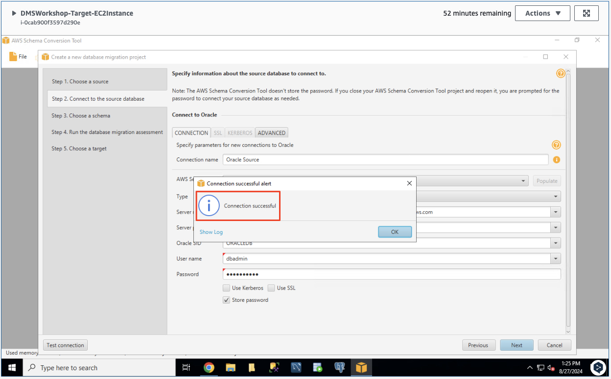

5. ```DMS_SAMPLE``` 스키마를 선택한 다음 ```다음```을 클릭합니다.

   > 📒 **참고**<br>
   > ```다음``` 버튼은 ```DMS_SAMPLE``` 스키마를 클릭하고 아래 그림과 같이 파란색 막대가 표시될 때까지 활성화되지 않습니다.

   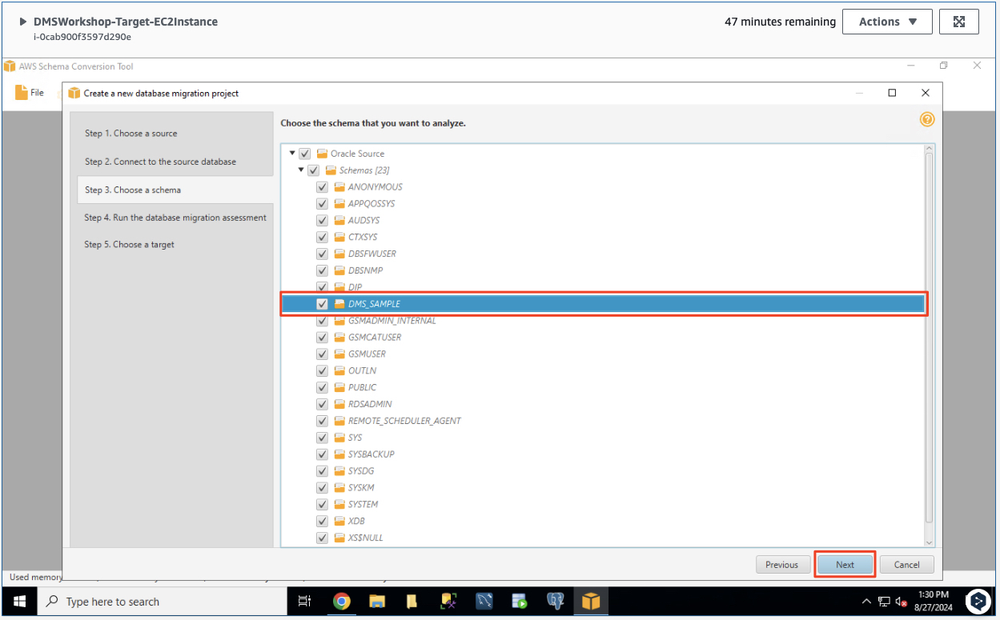

   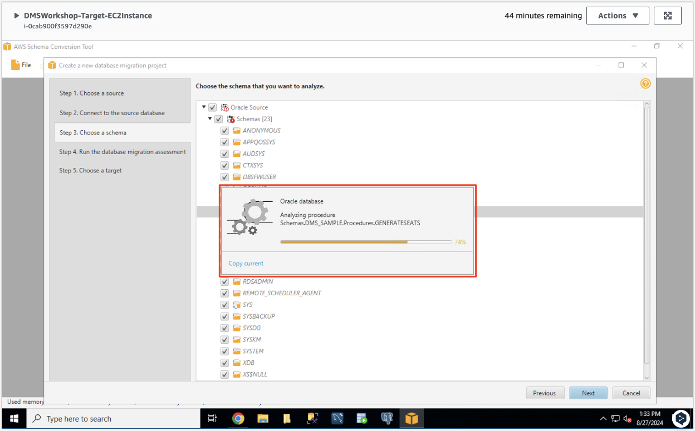

   > 📕 **참고**<br>
   > ```다음```을 누르고 메타데이터를 로드한 후 다음과 같은 경고 메시지가 나타날 수 있습니다. **Metadata loading was interrupted because of data fetching issues.** 이 메시지는 워크샵 진행에 영향을 주지 않으므로 무시해도 됩니다. ```SCT```가 데이터베이스 개체를 분석하는 데 몇 분 정도 걸립니다.

6```데이터베이스 마이그레이션 평가 보고서```의 요약 페이지를 검토한 다음 ```Amazon Aurora PostgreSQL``` 변환 섹션까지 아래로 스크롤합니다 (오른쪽 스크롤 막대의 중간 조금 아래에 있습니다).

   

    - ```SCT```는 소스 데이터베이스 스키마의 모든 개체를 자세히 검토합니다. 가능한 한 많은 것을 자동으로 변환하고 변환할 수 없는 항목에 대한 자세한 정보를 제공합니다.

   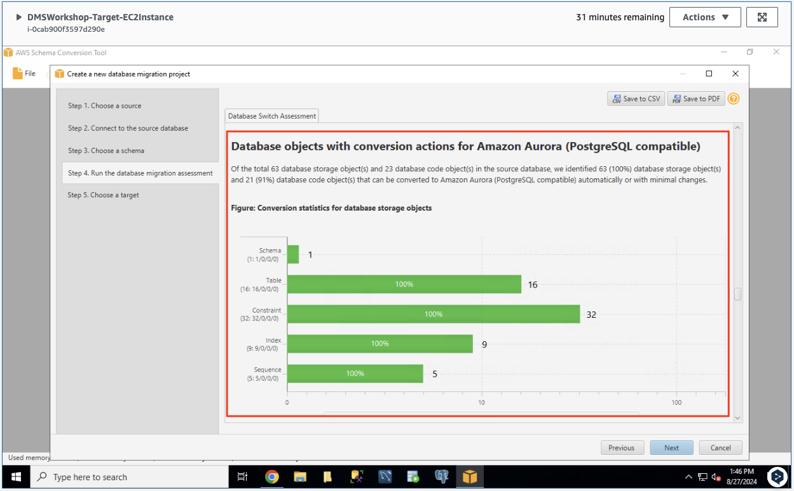

    - 일반적으로 패키지, 프로시저 및 함수는 가장 많은 사용자 지정 또는 독점 SQL 코드를 포함하고 있기 때문에 해결해야 할 문제가 있을 가능성이 높습니다. ```AWS SCT```는 각 개체 유형을 변환하는 데 필요한 수동 변경의 양을 산정합니다. 또한 이러한 개체를 대상 스키마에 성공적으로 적응시키기 위한 힌트를 제공합니다.

7. 데이터베이스 마이그레이션 평가 보고서 검토를 마친 후 ```다음```을 클릭합니다.

8. 아래 값을 사용하여 타겟 데이터베이스에 대한 정보를 제공합니다. ```Test connection``` 버튼을 눌러 연결 테스트가 성공적으로 완료되면 ```마침```을 클릭하세요.

   | **파라미터**                    | **값**                                                                        |
       |-----------------------------|------------------------------------------------------------------------------|
   | **타겟 엔진**                   | ```Amazon Aurora (PostgreSQL compatible) (기본값이 아니므로 변경하세요)```                |
   | **연결 이름 (Connection name)** | ```Postgresql Target```                                                      |
   | **서버 이름**                   | ```(타겟 환경의 CloudFormation의 출력 탭에서 확인)```                                     |
   | **서버 포트**                   | ```5432```                                                                   |
   | **데이터베이스 이름**               | ```AuroraDB (대소문자 주의)```                                                     |
   | **사용자 이름**                  | ```dbadmin```                                                                |
   | **암호**                      | ```AWS Secrets Manager에서 확인```                                               |
   | **SSL 사용**                  | ```체크 해제 (미사용)```                                                            |
   | **암호 저장**                   | ```체크 (암호 저장)```                                                             |
   | **Amazon Aurora 드라이버 경로**   | ```C:\Users\Administrator\Desktop\DMS Workshop\JDBC\postgresql-42.7.3.jar``` |

   

   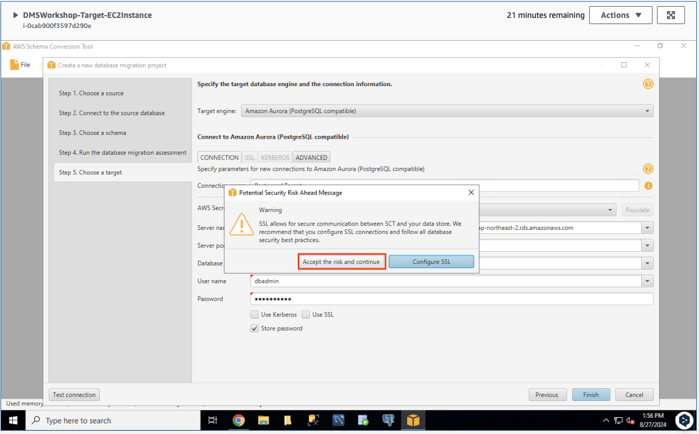

   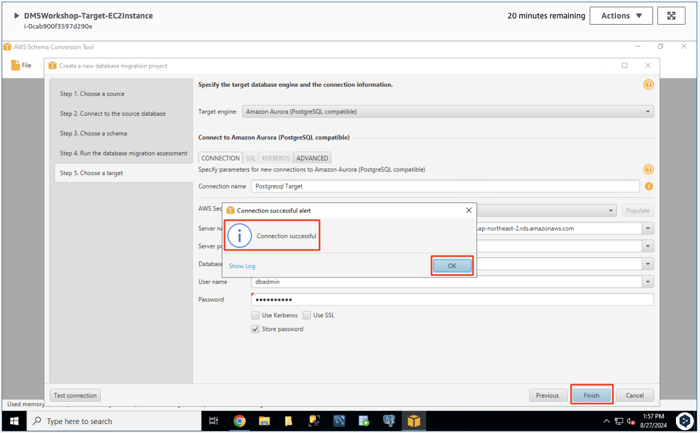

   > 📕 **참고**<br>
   > ```다음```을 누르고 메타데이터를 로드한 후 다음과 같은 경고 메시지가 나타날 수 있습니다. **Metadata loading was interrupted because of data fetching issues.** 이 메시지는 워크샵 진행에 영향을 주지 않으므로 무시해도 됩니다. ```SCT```가 데이터베이스 개체를 분석하는 데 몇 분 정도 걸립니다.

---

## **4. 스키마 변환**

이제 오라클에서 PostgreSQL 데이터베이스로 이기종 스키마 변환을 수행해 보겠습니다.

1. 화면 왼쪽 소스에서 ```DMS_SAMPLE``` 스키마를 클릭합니다.

   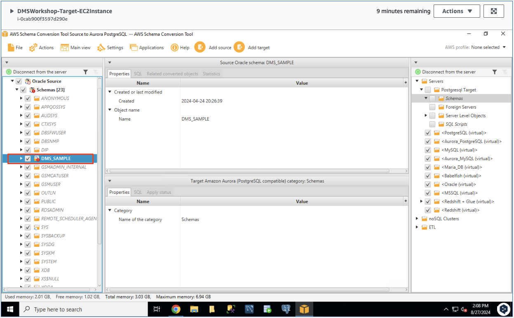

   > 📒 **참고**<br>
   > 오른쪽에 보이는 Aurora 타겟에는 ```dms_sample```과 같은 애플리케이션별 스키마가 없다는 것을 알 수 있습니다. 다음 몇 단계에서 ```SCT``` 프로세스의 일부로 이를 생성하겠습니다.


- ```AWS SCT```는 스키마를 분석하고 ```PostgreSQL```로의 변환을 위한 데이터베이스 마이그레이션 평가 보고서를 생성합니다. 빨간색 느낌표가 있는 항목은 원본에서 대상으로 자동 변환할 수 없는 항목을 나타냅니다. 여기에는 대표적을 ```저장 프로시저```와 ```패키지``` 등이 포함됩니다.

2. ```보기``` 버튼을 클릭하고 ```평가 보고서 보기```를 선택합니다.


3. 다음으로 보고서의 ```작업 항목 (Action Items)``` 탭으로 이동하여 도구로 변환할 수 없는 항목을 확인하고 수동으로 변경해야 하는 정도를 알아보세요. ```저장 프로시저```를 선택하고 녹색 원 안의 느낌표(!) 옆에 있는 아래쪽 화살표를 클릭하여 아래 이미지와 같은 문제를 확인하고 다음을 클릭합니다. 모든 세부 정보를 보려면 각 ```프로시저``` 옆에 있는 화살표를 클릭하세요.

   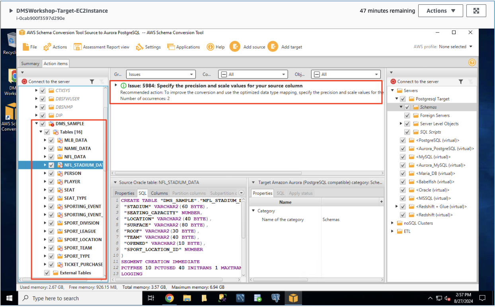

   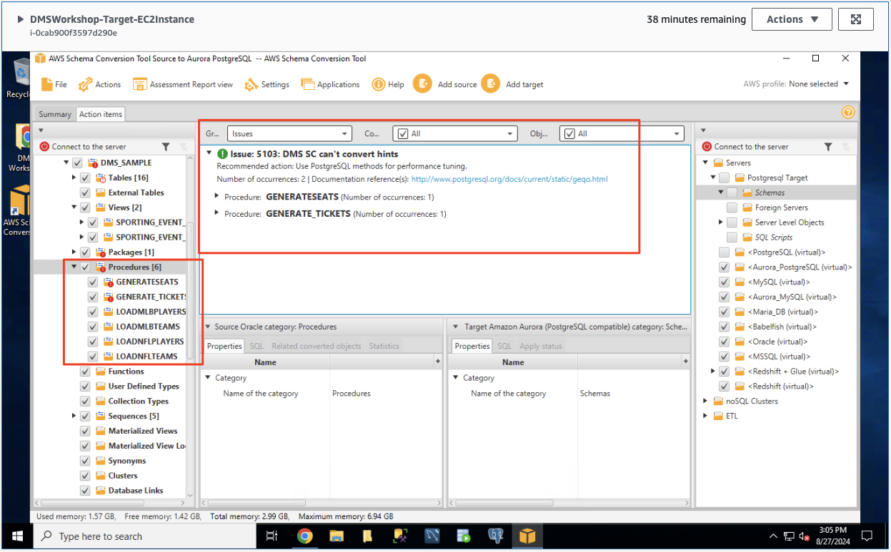

4. 나열된 각 문제를 확인하고 소스 패널과 타겟 Aurora PostgreSQL 패널의 내용을 비교합니다. 문제가 해결되었나요? 그리고 어떻게?

    - ```AWS SCT```는 소스 데이터베이스를 분석하고 ```Autora PostgreSQL```로의 변환을 위한 데이터베이스 마이그레이션 평가 보고서를 생성합니다. 옆에 빨간색 느낌표가 있는 항목은 AWS SCT에서 자동으로 변환할 수 없습니다. 여기에는 저장 프로시저 및 패키지가 포함됩니다. 대상 데이터베이스와 호환되도록 하려면 이러한 개체를 수동으로 수정해야 합니다. 다음 작업 중 하나를 완료하여 문제를 해결할 수 있습니다.

   ```
   * AWS SCT가 객체를 대상 Aurora PostgreSQL 데이터베이스로 변환할 수 있도록 소스 데이터베이스의 객체를 수정합니다.
   * 소스 데이터베이스 객체를 수정하는 대신, 대상 Aurora PostgreSQL 데이터베이스에 스크립트를 적용하기 전에 AWS SCT가 생성하는 스크립트를 수정합니다.
   ```

    - 시간 관계상 ```AWS SCT```가 자동으로 변환할 수 없다고 표시한 모든 객체의 수정은 수행하지 않습니다. 대신, 예를 들어 SCT 내의 ```GENERATESEATS``` 및 ```GENERATE_TICKETS``` 저장 프로시저에서 문제를 찾아 검토합니다. 원하는 경우 주석 처리된 코드를 제거할 수도 있지만 필수는 아닙니다.

    - ```GENERATESEATS``` 및 ```GENERATE_TICKETS``` 저장 프로시저를 클릭하면 PostgreSQL에서 APPEND 힌트가 지원되지 않으므로 코드를 강조 표시된 것을 볼 수 있습니다. 이들을 제거하고 진행해 보겠습니다.

5. ```GENERATESEATS```와 ```GENERATE_TICKETS``` 저장 프로시저를 클릭합니다.

    - 오라클 데이터베이스의 힌트인 /* +APPEND */를 찾을 수 있습니다. 이를 제거하도록 합니다.

   


6. 왼쪽 패널에서 ```DMS_SAMPLE``` 스키마를 마우스 오른쪽 버튼으로 클릭하고 **보고서 생성**을 클릭합니다.

   

7. 수정된 두 객체 모두 이제 타겟 데이터베이스와 호환되며 빨간색 느낌표가 사라진 것을 확인할 수 있습니다.

   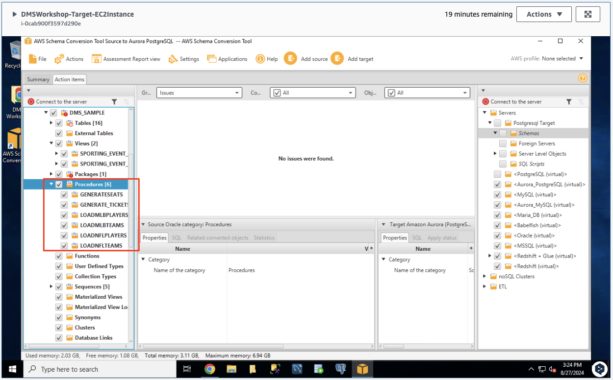

8. 왼쪽 패널에서 ```DMS_SAMPLE``` 스키마를 클릭하고 ```스키마 변환 (Convert Schema)```를 클릭합니다.

   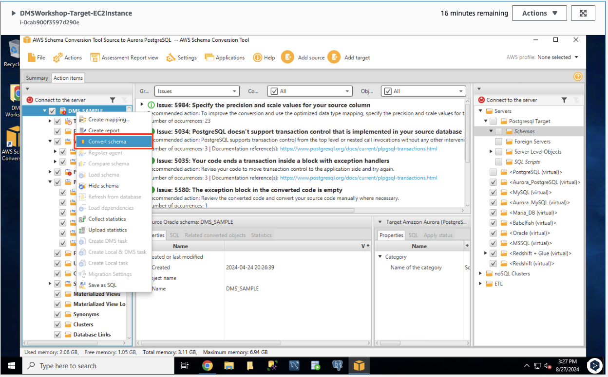

9. "대상 데이터베이스에 개체가 이미 존재할 수 있습니다. 바꾸시겠습니까?"라는 대화 상자가 표시될 수 있습니다. **예**를 선택합니다.

   

   

10. 오른쪽 패널에서 ```dms_sample``` 스키마를 마우스 오른쪽 버튼으로 클릭하고 ```데이터베이스에 적용```을 클릭합니다.

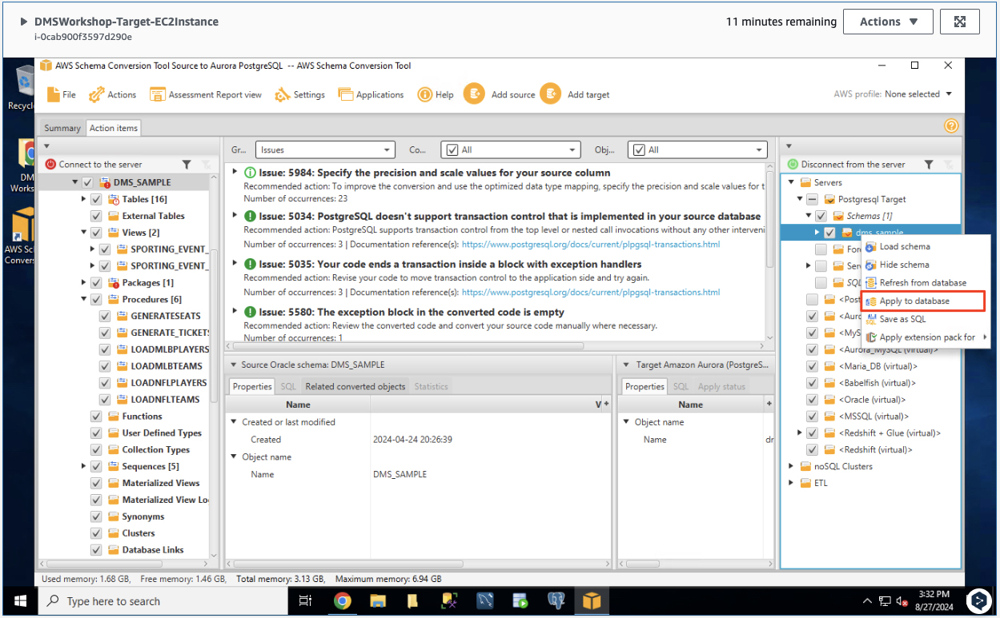

11. 스키마를 데이터베이스에 적용할지 묻는 메시지가 나타나면 예를 클릭합니다.


12. 이제 타겟 데이터베이스에 스키마가 적용되었습니다. 테이블, 뷰, 프로시저 등을 보려면 오른쪽 창에서 ```dms_sample``` 스키마를 확장하세요.

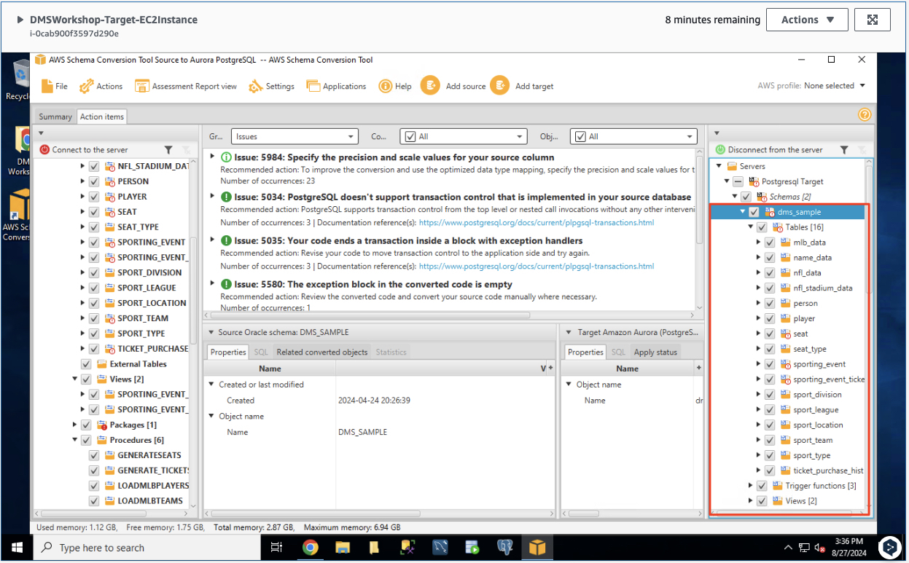

데이터베이스 스키마와 객체를 소스에서 ```Amazon Aurora PostgreSQL```로 성공적으로 변환했습니다.

```AWS Schema Conversion Tool```을 사용하여 이기종 소스 데이터베이스의 (여기서는 오라클) 스키마를 ```Amazon Aurora PostgreSQL```로 비교적 쉽게 전환할 수 있습니다.

이 과정에서 스키마 변환 도구가 서로 다른 데이터베이스 엔진 간의 차이점을 강조하는 방법을 배웠고 프로시저 및 기타 데이터베이스 개체를 마이그레이션해야 할 때 코드를 성공적으로 수정할 수 있는 방법에 대한 팁도 제공방았습니다.

SQL Server 및 Oracle 워크로드를 PostgreSQL 및 MySQL을 포함한 다른 RDS 엔진으로 마이그레이션하려면 동일한 단계를 수행할 수 있습니다.


---

### **5. 프로시저 코드 수정**
