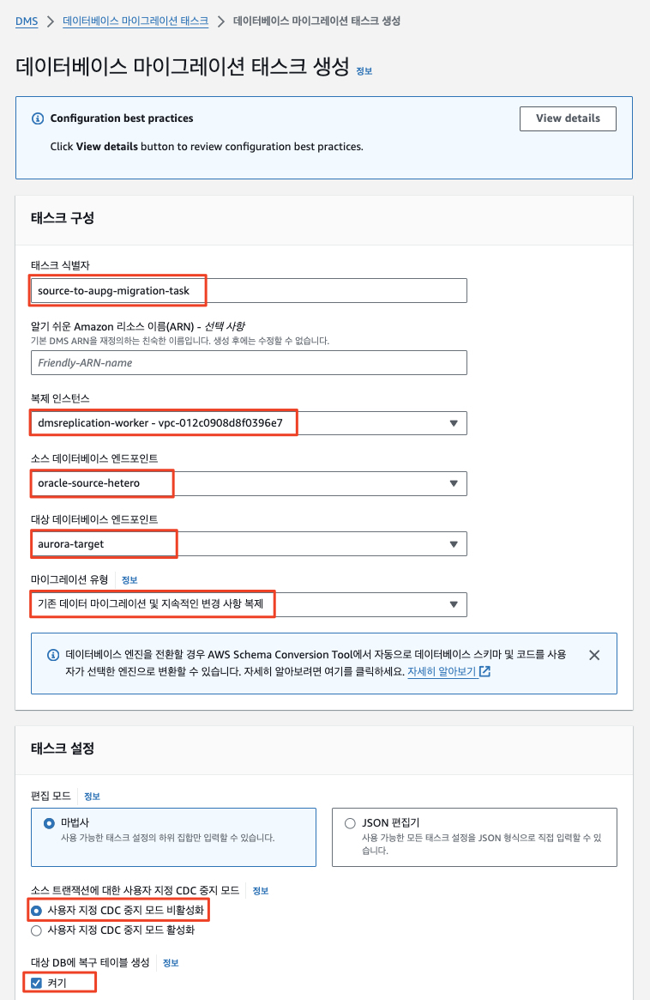
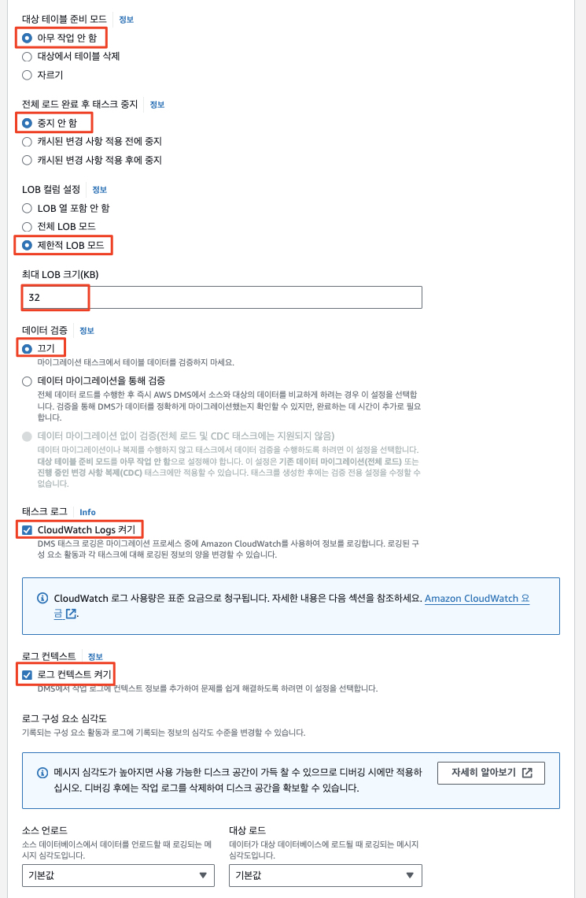
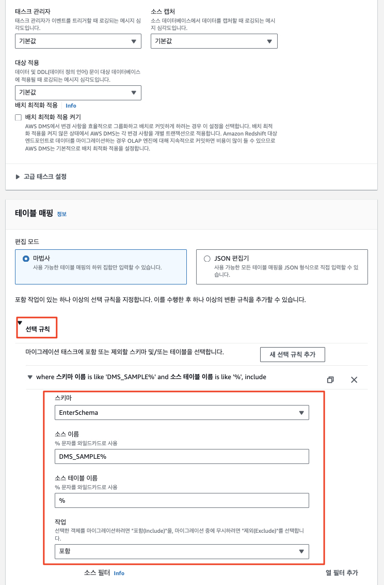
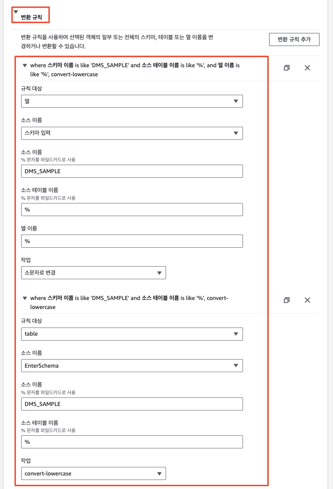
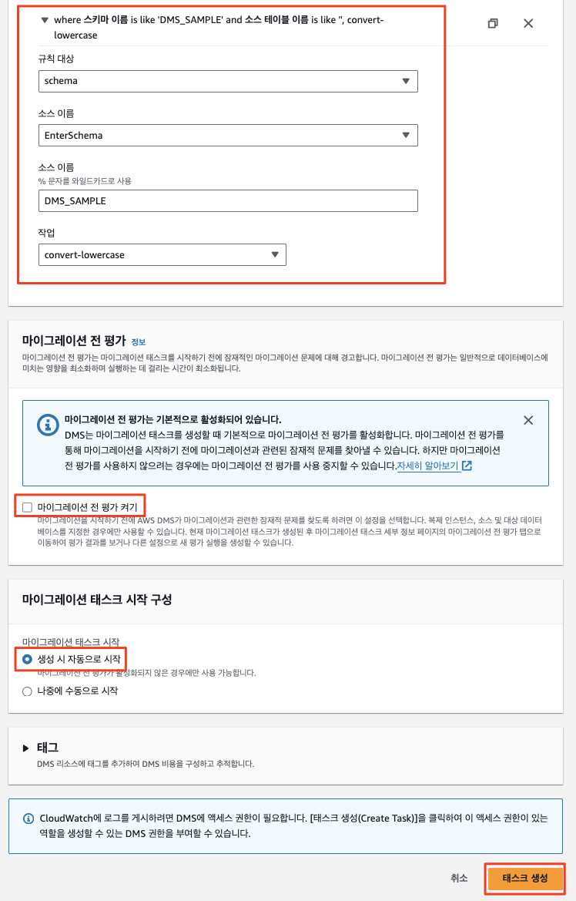
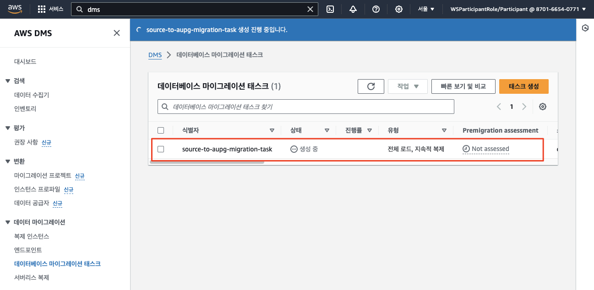
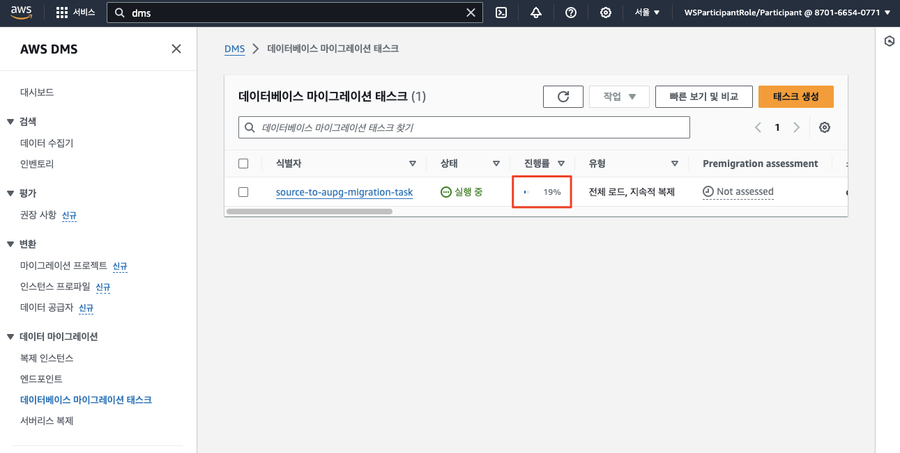
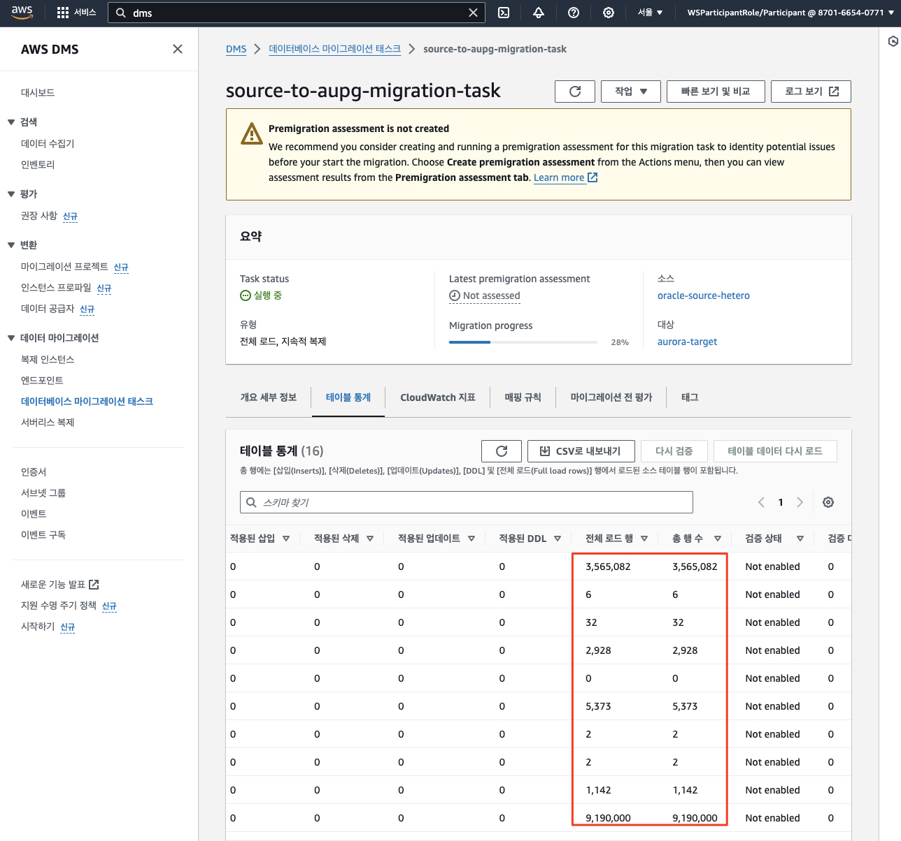

# ***```HotelSpecials``` 데이터 마이그레이션***

---

## **Agenda**

1. 개요
2. 복제 인스턴스 확인
3. 소스 및 타겟 엔드포인트 생성
4. ```DMS 마이그레이션 태스크``` 생성

---

## **1. 개요**

이제 ```HotelSpecials``` 데이터 마이그레이션을 수행합니다.

```AWS Database Migration Service```를 사용하여 소스 데이터베이스에서 대상 ```Amazon Aurora MySQL```로 데이터를 마이그레이션하는 방법을 보여줍니다.

한편 이렇게 수행되는 데이터 마이그레이션은 ```HotelSpecials``` 서비스의 데이터 ```SSoT (Single Source of Truth)```를 타겟 클라우드로 전환하는 것을 목표로 하므로 전체 Full Load만을 수행하고 지속적 변경 복제는 수행하지 않습니다.

```AWS DMS```는 데이터 마이그레이션과 특별히 관련되지 않은 보조 인덱스, 시퀀스, 기본값, 저장 프로시저, 트리거, 동의어, 보기 및 기타 스키마 객체를 마이그레이션하지 않습니다. 우리는 ```AWS Schema Conversion Tool```을 사용하여 이러한 객체를 타겟 ```Amazon Aurora MySQL```  대상으로 마이그레이션해 두었습니다.

---

## **2. 복제 인스턴스 확인***

우리는 아래 그림과 같이 소스 데이터베이스 (```TravelBuddy 오라클 데이터베이스``)로부터 타겟 데이터베이스 (```HotelSpecials Amazon Aurora MySQL``)로 데이터를 복제하기 위하여 ```DMS 복제 인스턴스 (Replication Instance)```를 생성합니다.


1. ```DMS > 데이터 마이그레이션 > 복제 인스턴스```로 이동합니다.

2. 이미 환경 설정 과정에서 생성된 복제 인스턴스 (```dmsworkshop-target-dmsrepl```)가 존재할 것입니다. 이번에는 이 복제 인스턴스를 사용합니다.  

    

---

## **3. 소스 및 타겟 엔드포인트 생성**

### **3.1. 소스 엔드포인트 생성**

1. ```DMS > 데이터 마이그레이션 > 엔드포인트```로 이동한  후 오른쪽 상단의 ```엔드포인트 생성```을 클릭합니다.

    

2. 다음 값들을 사용하여 소스 ```TravelBuddy``` 데이터베이스에 대한 엔드포인트를 생성합니다.

2. ```소스 엔드포인트```를 선택한 후 다음 정보를 입력한 후 ```연결 테스트```을 클릭합니다. 상태가 **성공**으로 바뀌면 **엔드포인트 생성**을 클릭합니다.

   | **파라미터**                | **값**                                                     |
      |-------------------------|-----------------------------------------------------------|
   | **엔드포인트 유형**            | ```소스 엔드포인트```                                            |
   | **RDS DB 인스턴스 선택**      | ```체크 해제 (선택하지 않음)```                                     |
   | **엔드포인트 식별자**           | ```travelbuddy-oracle-source```                           |
   | **소스 엔진**               | ```Oracle```                                              |
   | **엔드포인트 데이터베이스 액세스**    | ```수동으로 액세스 정보 제공```                                      |
   | **서버 이름**               | ```(소스 측 담당자분 확인) 소스 측에서 생성된 오라클 데이터베이스 주소 (애플리케이션 서버)``` |
   | **포트**                  | ```1521```                                                |
   | **SSL 모드**              | ```없음```                                                  |
   | **사용자 이름**              | ```dmsuser```                                             |
   | **비밀번호**                | ```dmsuser123```                                          |
   | **SID/Service Name**    | ```XE```                                                  |   
   | **엔드포인트 연결 테스트 -> VPC** | ```이름에 DmsVpc가 포함된 VPC ID```                              |
   | **복제 인스턴스**             | ```dmsworkshop-target-dmsrepl```                                      |

   

   

   

### **3.2. 타겟 엔드포인트 생성**

1. 동일하게 다음 값을 사용하여 ```Aurora MySQL```에 대한 타겟 엔드포인트를 생성합니다```연결  테스트```를 수행하고 ```엔드포인트 생성```을 클릭합니다.

   | **파라미터**                | **값**                                     |
      |-------------------------|-------------------------------------------|
   | **엔드포인트 유형**            | ```대상 엔드포인트```                            |
   | **RDS DB 인스턴스 선택**      | ```체크```                                  |
   | **RDS DB 인스턴스**         | ```mysql-excluded-1.```                   |
   | **엔드포인트 식별자**           | ```hotelspecials-mysql-target```          |
   | **대상 엔진**               | ```Amazon Aurora MySQL```                 |
   | **엔드포인트 데이터베이스 액세스**    | ```수동으로 액세스 정보 제공```                      |
   | **서버 이름**               | ```타겟 Aurora MySQL 데이터베이스 주소 (자동으로 설정)``` |
   | **포트**                  | ```3306```                                |
   | **사용자 이름**              | ```dmsuser```                             |
   | **비밀번호**                | ```dmsuser123```                          |
   | **SSL 모드**              | ```없음```                                  | 
   | **엔드포인트 연결 테스트 -> VPC** | ```이름에 DmsVpc가 포함된 VPC ID```              |
   | **복제 인스턴스**             | ```dmsworkshop-target-dmsrepl```                      |

   

   

   

   

---

## **4. ```DMS 마이그레이션 태스크``` 생성**

1. ```DMS > 데이터 마이그레이션 > 데이터베이스 마이그레이션 태스크```로 이동한 다음 오른쪽 상단에서 ```태스크 생성``` 버튼을 클릭합니다.

   

2. ```DMS_SAMPLE``` 스키마의 마이그레이션을 위해 다음 값을 사용하여 ```데이터베이스 마이그레이션 태스크```를 생성합니다.

   | **파라미터**                         | **값**                                                |
      |----------------------------------|------------------------------------------------------|
   | **태스크 식별자**                      | ```source-to-aupg-migration-task```                  |
   | **친숙한 Amazon 리소스 이름(ARN)**       | ```비워둠```                                            |
   | **복제 인스턴스**                      | ```dmsreplication-worker``` (혹은 별도로 생성한 복제 인스턴스의 이름) |
   | **소스 데이터베이스 엔드포인트**              | ```이전에 생성한 소스 엔드포인트```                               |
   | **대상 데이터베이스 엔드포인트**              | ```이전에 생성한 타겟 엔드포인트```                               |
   | **마이그레이션 유형**                    | ```기존 데이터 마이그레이션 및 지속적인 변경 사항 복제```                  |
   | **소스 트랜잭션을 위한 사용자 지정 CDC 중지 모드** | ```사용자 지정 CDC 중지 모드 비활성화```                          |
   | **대상 DB에 복구 테이블 생성**             | ```체크```                                             |
   | **대상 테이블 준비 모드**                 | ```아무 작업 안 함``` (기본값 아님)                             |
   | **전체 로드 완료 후 태스크 중지**            | ```중지 안 함```                                         |
   | **LOB 컬럼 설정**                    | ```제한된 LOB 모드```                                     |
   | **최대 LOB 크기(KB)**                | ```32```                                             |
   | **데이터 검증**                       | ```끄기```                                             |
   | **태스크 로그 / CloudWatch 로그 켜기**    | ```CloudWatch 로그 켜기 체크``` (기본값 아님)                   |
   | **로그 컨텍스트**                      | ```체크된 상태로 로깅의 기본 수준 사용```                           |
   | **배치 최적화 적용 켜기**                 | ```체크 안 함```                                            |

   > **주의**<br>
   > 위에서 ```대상 테이블 준비 모드```를 선택하지 마세요. 이 옵션을 선택하면 오류가 발생합니다.

3. ```테이블 매핑``` 섹션을 확장하고 편집 모드로 ```마법사```를 선택합니다.

4. ```새 선택 규칙 추가``` 버튼을 클릭하고 양식에 다음 값을 입력합니다. (참고: 대소문자를 구분하므로 주의하세요. 또한 선택 규칙은 마이그레이션하려는 스키마와 테이블 정보를 ```DMS 복제 인스턴스```에 전달하는데 사용됩니다.

   | **파라미터**   | **값**                       |
       |------------|-----------------------------|
   | **스키마**    | ```DMS_SAMPLE%``` (대소문자 유의) |
   | **테이블 이름** | ```%```                     |
   | **작업**     | ```포함```                    |

   > ⚠️ **주의**<br>
   > * 태스크 생성 화면에서 스키마를 인식하지 못하는 경우 엔드포인트 화면으로 돌아가서 엔드포인트를 클릭하세요. ```스키마``` 탭에서 ```새로 고침``` 버튼을 클릭하면 잠시 후 스키마들이 표시됩니다.

5. 그런 다음 ```변환 규칙``` 섹션을 확장하고 다음 값을 사용하여 ```변환 규칙 추가```를 클릭합니다. (참고: ```PostgreSQL```에서는 소문자로만 개체 이름을 저장하므로 이 값은 개체 이름을 소문자로 변경하는 데 사용됩니다 또한 SQL Server의 경우 변환 규칙을 사용하여 대상 시스템의 데이터베이스 이름을 바꿉니다.

   - Rule 1:

     | **파라미터**   | **값**                       |
          |------------|-----------------------------|
     | **규칙 대상**     | ```스키마```               |
     | **소스 이름**     | (스키마 입력을 선택한 후) ```DMS_SAMPLE```               |
     | **작업**     | ```소문자로 변경```               |

   - Rule 2:

     | **파라미터**      | **값**                            |
            |---------------|----------------------------------|
     | **규칙 대상**     | ```테이블```                        |
     | **소스 이름**     | (스키마 입력을 선택한 후) ```DMS_SAMPLE``` |
     | **소스 테이블 이름** | ```%```                          |
     | **작업**        | ```소문자로 변경```                    |

   - Rule 3:

     | **파라미터**      | **값**                            |
                 |---------------|----------------------------------|
     | **규칙 대상**     | ```테이블```                        |
     | **소스 이름**     | (스키마 입력을 선택한 후) ```DMS_SAMPLE``` |
     | **소스 테이블 이름** | ```%```                          |
     | **작업**        | ```소문자로 변경```                    |

   - ⚠️ ```마이그레이션 전 평가 켜기```는 비활성합니다. 이 옵션은 마이그레이션 전 평가를 위해 사용되며 이 워크샵에서는 시간이 부족하므로 사용하지 않습니다.

   - ```마이그레이션 태스크 시작 구성``` 아래 ```생성 시 자동으로 시작```이 선택되어 있는지 확인한 다음 ```태스크 생성```을 클릭합니다.

   - 설정된 화면은 아래와 유사합니다.












6. ```마이그레이션 태스크``` 실행이 시작되고 소스의 ```DMS_SAMPLE``` 스키마의 데이터가 ```Amazon Aurora RDS (PostgreSQL)``` 인스턴스로 복제되기 시작합니다. ```마이그레이션 태스크```는 ```생성 (상태=생성 중)```하는 데 잠시 시간이 걸린 다음 ```상태=Created```, ```상태=시작 중```, ```상태=실행 중```으로 전환됩니다. 새로 고침 버튼을 사용하여 작업 상태를 업데이트할 수 있습니다.

   

7. 행이 전송되는 동안 작업 진행 상황을 모니터링할 수 있습니다.

   

8. ```마이그레이션 태스크 (source-to-aupg-migration-task)```를 클릭하고 ```테이블 통계``` 탭으로 이동하여 테이블 통계를 보고 이동된 행 수를 확인합니다.

   

9. 오류가 발생하면 상태 색상이 녹색에서 빨간색으로 변경됩니다. 디버그할 로그에 대해 로그 보기 링크를 클릭합니다. 
