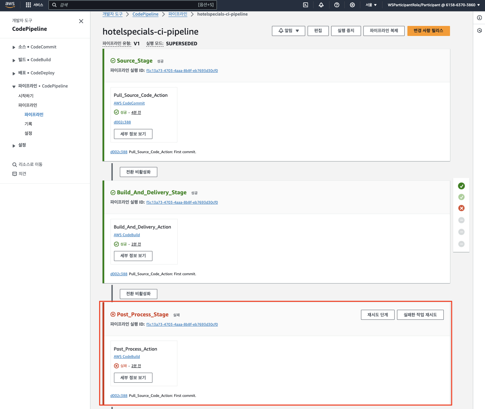

# ***```HotelSpecials``` 서비스 마이그레이션***

## **Agenda**
1. 개요
2. ```Amazon EKS``` 클러스터에 배포
   1. ```GitOps``` 리포지터리 (```Helm```) 설정
   2. 소스 리포지터리 클론 및 빌드 파이프라인 실행
   2. GitOps 리포지터리 클론 및 배포

---

## **1. 개요**
우리는 앞서 ```FlightSpeicals``` 서비스를 마이그레이션하기 위해 우선 데이터베이스 스키마를 준비해 두었습니다. 이제 이 서비스를 ```Amazon EKS``` 클러스터에 배포해 보겠습니다.

> 📌 **참고**<br>
> * 온프레미스에서 이미 운영 중인 ```TravelBuddy``` 애플리케이션은 비록 화면 표현 계층과 비즈니스 로직, 그리고 각 서비스별 단일 데이터베이스를 가진 모놀리식 구조이지만, ```HotelSpecials``` 서비스를 위한 모델 조회용 ```REST``` API는 이미 분리되어 있습니다. 이 API는 ```HotelSpecials``` 서비스의 데이터베이스 스키마를 조회하는 역할을 합니다.
> * 이러한 기본 구조를 최대한 활용하기 위하여 ```HotelSpecials``` 서비스는 최소한의 수정 (데이터베이스 Oracle -> MySQL로 변경된 부분을 반영) 으로 ```Amazon EKS``` 클러스터에 배포합니다.

---

## **2. ```Amazon EKS``` 클러스터에 배포**
우리의 주된 관심사가 데이터베이스 마이그레이션이므로 ```쿠버테네트``` 및 ```GitOps``` 배포 체계에 대해서 시간을 들여 알아보지는 않고 아래 읽을거리만을 간단하게 참고로 달아두었으니 관심있으신 분들은 읽어보셔도 좋을 것 같습니다.<br>

> 📕 **참고 문서**<br>
> * [Kubernetes Solutions Market Forecast](https://www.linkedin.com/pulse/kubernetes-solutions-market-2024-cagr-2371-forecast-gplwc/)
> * [데브옵스의 확장 모델 – 깃옵스(GitOps) 이해하기 - 삼성SDS 인사이트 리포트](https://www.samsungsds.com/kr/insights/gitops.html)

### **2.1. ```GitOps``` 리포지터리 (```Helm```) 설정**
먼저 애플리케이션이 빌드되면 ```Amazon EKS``` 클러스터에 배포하기 위한 ```GitOps``` 리포지터리를 설정합니다.

참고로 이 리포지터리는 ```GitOps```를 담당하는 ```ArgoCD```에 의해 사용되며, 컨테이너 이미지가 빌드되어 ```ECR```에 푸시되면 이 리포지터리를 통해 ```Amazon EKS``` 클러스터에 배포됩니다.

컨테이너 이미지를 빌드하는 파이프라인에 대해서는 아래에서 설명합니다.

```bash
cd ~/environment/aws-database-migration
rm -rf .git

# 1. 어플리케이션 Helm Artifact 경로로 이동
cd ~/environment/aws-database-migration/legacy/applications/TravelBuddy/helm

# 2. git 연결
git init
git branch -M main

export HELM_CODECOMMIT_URL=$(aws codecommit get-repository --repository-name hotelspecials-configuration --region ap-northeast-2 | grep -o '"cloneUrlHttp": "[^"]*' | grep -o '[^"]*$')
echo $HELM_CODECOMMIT_URL

# CodeCommit 배포 리포지터리와 연결
git remote add origin $HELM_CODECOMMIT_URL

# 3. Git 스테이징 영역에 파일을 추가합니다.
git add .

# 4. Commit 및 배포 리포지터리에 Push합니다.
git commit -am "First commit."
git push --set-upstream origin main
```

### **2.2. 소스 리포지터리 클론 및 빌드 파이프라인 실행**

1. ```Cloud9``` 상에서 ```HotelSpecials``` 서비스의 소스 코드를 클론하고 빌드 파이프라인을 실행합니다.

    ```bash
    # 0. Git 초기화
    cd ~/environment/aws-database-migration
    rm -rf .git
    
    # 1. 어플리케이션 소스 경로로 이동
    cd ~/environment/aws-database-migration/legacy/applications/TravelBuddy/build/
    
    # 2. git 연결
    git init
    git branch -M main
    
    export BUILD_CODECOMMIT_URL=$(aws codecommit get-repository --repository-name hotelspecials-application --region ap-northeast-2 | grep -o '"cloneUrlHttp": "[^"]*'|grep -o '[^"]*$')
    echo $BUILD_CODECOMMIT_URL
    
    git remote add origin $BUILD_CODECOMMIT_URL
    # (예)
    # git remote add origin https://git-codecommit.ap-northeast-2.amazonaws.com/v1/repos/M2M-BuildAndDeliveryStack-SourceRepository
    
    # 3. Git 스테이징 영역에 파일을 추가합니다.
    git add .
    
    # 4. Commit 및 Push합니다.
    git commit -am "First commit."
    git push --set-upstream origin main
    ```

2. ```CodeCommit``` 리포지터리에 소스 코드가 푸시되었음을 확인합니다.

    

3. 또한 빌드 파이프라인도 트리거되어 실행되었음을 확인합니다. 다만, Build Spec이 없거나 정상적으로 구성되지 않은 등의 이유로 파이프라인은 실패하였을 수 있습니다.

   
