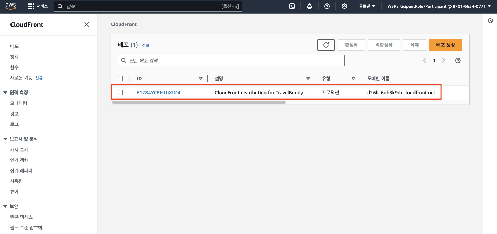
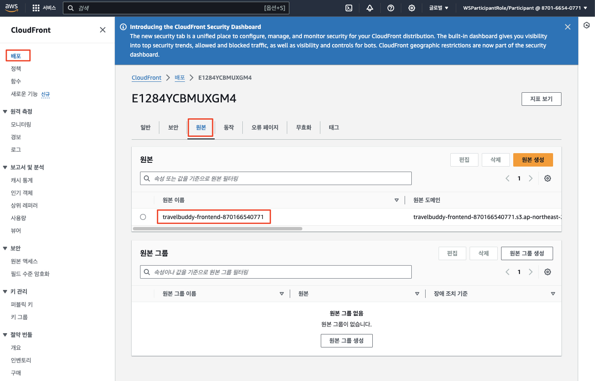
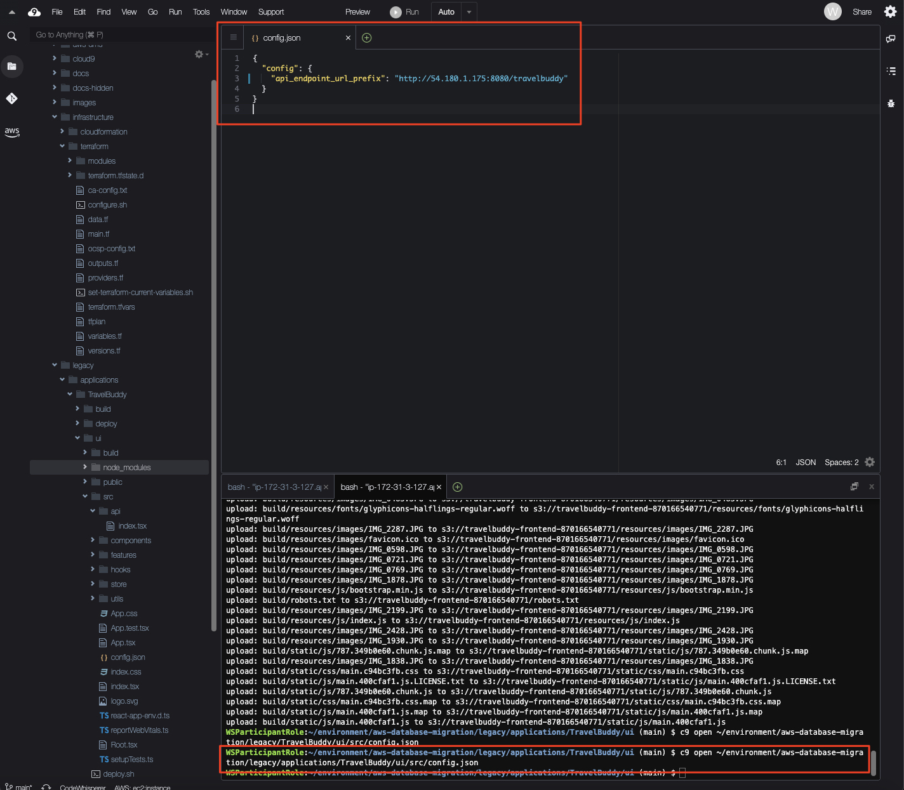
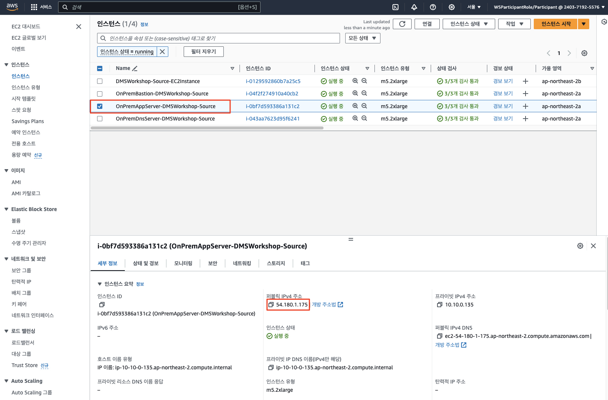
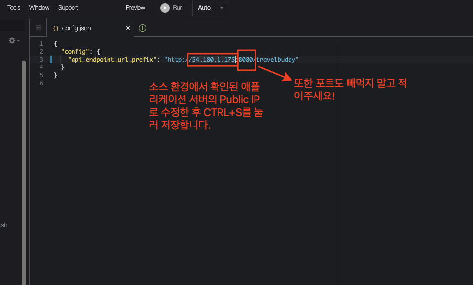
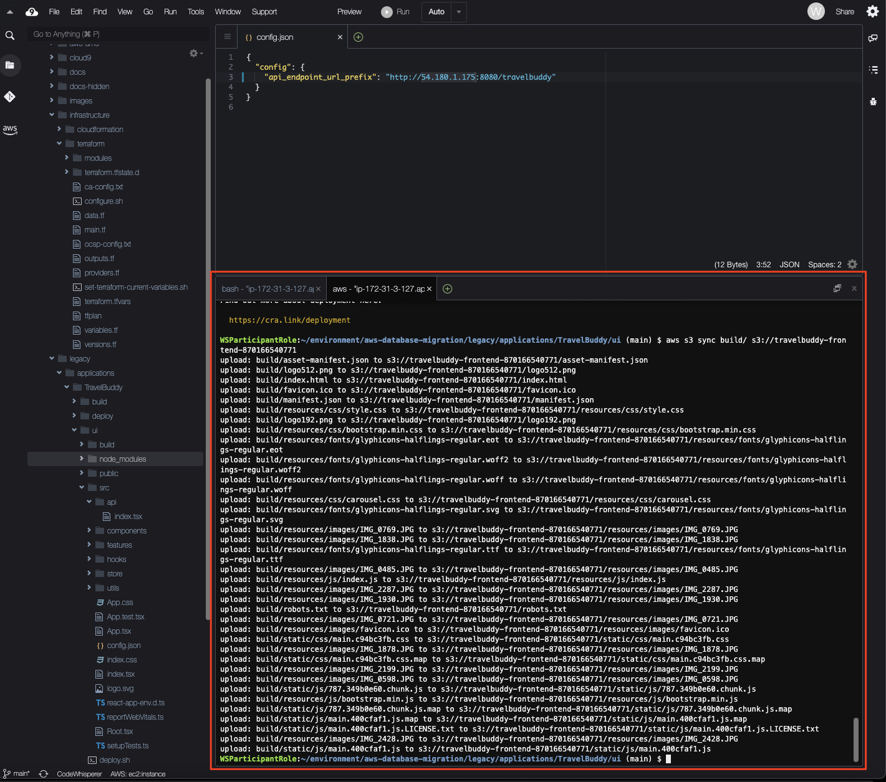
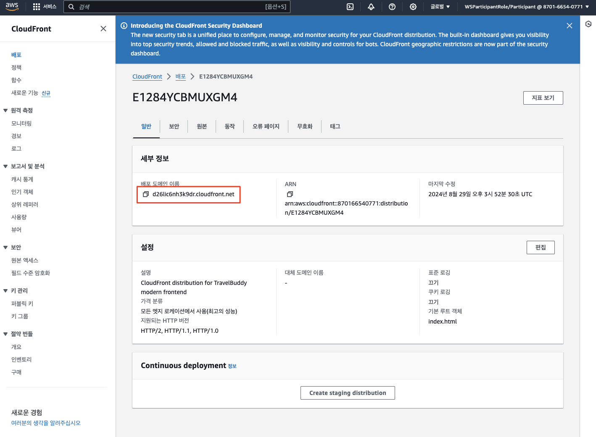
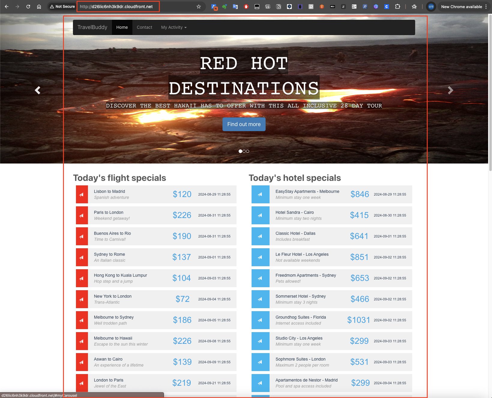

# ***사용자 인터페이스 (프론트엔드) 분리***

---

## **개요 및 목표**

애플리케이션과 데이터베이스를 클라우드로 전환하는 과정은 대개의 경우 긴 시간에 걸쳐 수행되고 온프레미스와 클라우드, 레거시와 신규 워크로드를 일정 시간 병행 운영해야 할 필요가 많습니다. 따라서 이러한 과정은 단계적으로 수행하는 것이 좋습니다.

이러한 단계 중 하나는 사용자 인터페이스 (UI)를 애플리케이션에서 분리하는 것입니다. 이렇게 하면 애플리케이션과 데이터베이스를 분리하는 데 필요한 시간을 확보할 수 있습니다.

현재 레거시 소스 환경에서 동작하고 있는 애플리케이션은 전통적인 ```Tomcat``` 내장 ```Spring Boot``` 애플리케이션으로 구성되어 있으며, 사용자 인터페이스는 ```JSP```로 구성되어 있습니다.

```JSP```는 사용자 인터페이스와 비즈니스 로직 및 데이터베이스 접근 계층이 분리되지 않아 유지보수가 어렵고, 데이터베이스를 포함한 전체 워크로드의 전환을 어렵게 하는 요인이 됩니다.

여기서는 우선 ```JSP```에 녹아 있는 사용자 인터페이스를 현대적인 ```React.js```로 분리하여 향후 데이터베이스 및 애플리케이션의 클라우드 전환의 기반을 다지고자 합니다.

이 작업은 타겟 환경에서 수행합니다.

---

## ```Amazon CloudFront```에 프론트엔드 배포

앞선 과정에서 신규 타겟 환경에 ```테라폼```으로 생성한 자원 중에는 ```React.js``` 프론트엔드 애플리케이션을 호스팅하는 ```Amazon S3 버킷```과 해당 버킷을 오리진으로 삼는 ```Amazon CloudFront 배포```가 포함되어 있습니다.

```Amazon CloudFront```는 ```Amazon S3``` 버킷에 저장된 웹 사이트를 전 세계에 빠르게 전달할 수 있는 글로벌 ```콘텐츠 전송 네트워크 (Content Delivery Network, CDN)``` 서비스입니다. ```CloudFront```는 웹 사이트, 애플리케이션, 비디오 스트리밍, API 등을 전 세계 사용자에게 빠르고 안전하게 전달할 수 있도록 도와줍니다.

* 주요 기능
  * 콘텐츠 캐싱: 전 세계에 분산된 엣지 로케이션에 콘텐츠를 캐싱하여 사용자에게 더 빠르게 전달합니다.
  * 보안: AWS Shield, AWS WAF와 통합되어 DDoS 공격 및 웹 애플리케이션 공격으로부터 보호합니다.
  * 확장성: 자동으로 확장되어 트래픽 증가에 대응할 수 있습니다.
  * 유연한 설정: 다양한 콘텐츠 전송 정책을 설정할 수 있습니다.
* 사용 사례
  * 웹 사이트 가속화: 정적 및 동적 콘텐츠를 빠르게 전달하여 웹 사이트 성능을 향상시킵니다.
  * 비디오 스트리밍: 전 세계 사용자에게 고품질 비디오 스트리밍을 제공합니다.
  * API 가속화: API 응답 시간을 줄이고 성능을 최적화합니다.
  * 보안 강화: 콘텐츠 전송을 보호하고 보안을 강화합니다.

1. ```CloudFront > 배포``` 콘솔로 이동하여 생성된 ```CloudFront``` 배포를 확인합니다.

    

2. ```CloudFront``` 배포를 클릭하여 ```원본``` 탭으로 이동한 후 ```원본 이름``` 열에 적힌 ```S3``` 버킷을 확인하고 이를 메모해 둡니다.

    

3. ```Cloud9``` 터미널 창에서 아래 명령으로 프론트엔드 애플리케이션의 환경 설정 파일을 (```config.json```) 엽니다. 이 파일에는 ```TravelBuddy``` 애플리케이션의 백엔드 엔드포인트 설정도 들어 있습니다.

    ```bash
    c9 open ~/environment/aws-database-migration/legacy/applications/TravelBuddy/ui/src/config.json
    ```

    

4. (소스 환경 문의) 소스 환경에서 현재 ```TravelBuddy``` 애플리케이션이 실행 중인 ```애플리케이션``` 서버의 ```Public IP``` 주소를 확인하고 이 주소로 ```config.json``` 파일을 수정합니다. 해당 정보는 소스 환경의 ```EC2``` 인스턴스 콘솔에서 확인할 수 있습니다.

    

    

    > **주의**<br>
    > *```config.json``` 파일을 수정한 후에는 꼭 ```저장``` 메뉴를 클릭하거나 ```Ctrl + S``` 키를 눌러 변경 사항을 저장합니다.*
    > * 또한 현재 소스 환경에서는 ```애플리케이션 서버```가 ```8080``` 포트를 통해서 서비스되고 있으므로, 해당 포트 정보도 ```config.json``` 파일에 반영하도록 합니다. 

5. ```Cloud9``` 터미널 창에서 아래 명령으로 프론트엔드 애플리케이션을 빌드하고 배포합니다. 아래에서 ```<CloudFront 배포 원본 이름>```은 앞서 확인한 ```CloudFront``` 배포의 ```원본 이름 ```을 입력합니다.

    ```bash
    cd ~/environment/aws-database-migration/legacy/applications/TravelBuddy/ui
    npm install
    npm run build
    ```
        
    ```bash
    # 프론트엔드를 오리진 S3 버킷에 업로드 - 예: aws s3 sync build s3://travelbuddy-frontend-537682470830
    aws s3 sync build/ s3://<CloudFront 배포 원본 이름>
    ```

    

6. ```CloudFront > 배포``` 콘솔로 돌아와서 ```배포 도메인 이름```을 확인합니다.

    

7. 이제 배포 도메인을 사용하여 프론트엔드 애플리케이션이 정상적으로 표시되는지 확인합니다.
    * 웹 브라우저를 열고 ```CloudFront``` 배포 도메인을 입력하여 접속합니다.
    * 이 때 **"https:"** 가 아닌 **"http:"** 프로토콜을 사용합니다.

    

---

## 축하합니다. 기존의 프론트엔드와 백엔드 로직이 혼재된 ```TravelBuddy``` 애플리케이션에서 ```React.js```로 분리하여 ```Amazon CloudFront```에 성공적으로 배포하였습니다. 이를 통해 데이터베이스를 투명하게 클라우드로 전환하는 준비를 마쳤습니다.
