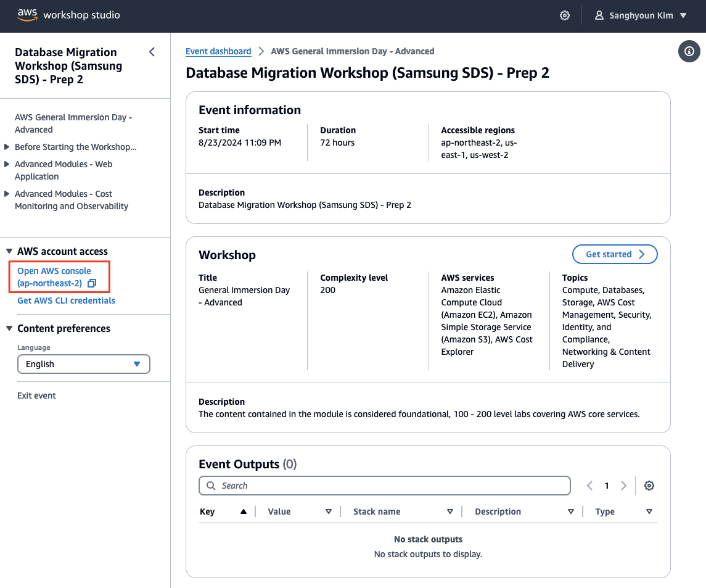
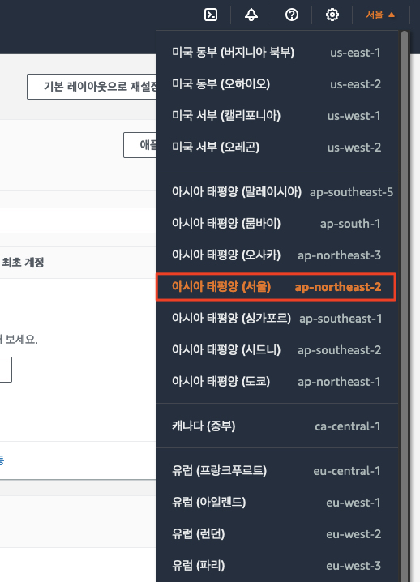
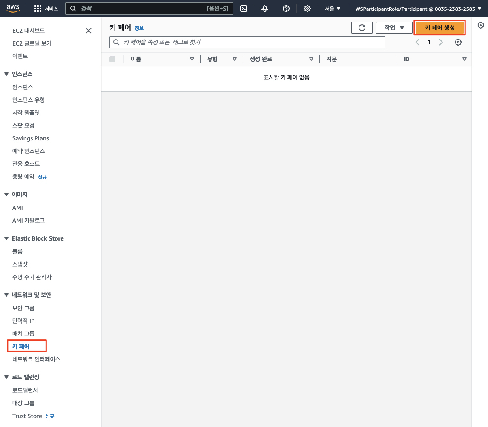
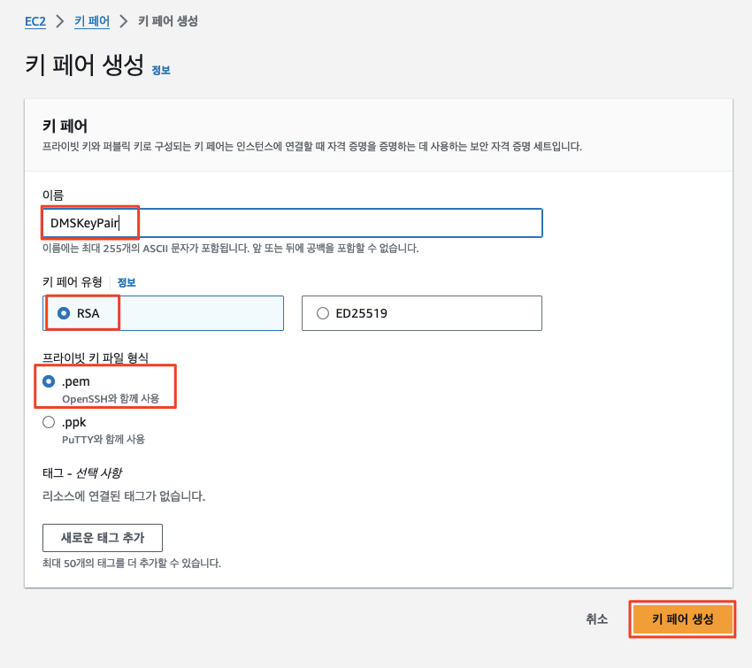

# ***공통 구성***

소스와 타겟 환경 모두 마이그레이션에 사용되는 데이베이스 도구가 설치된 ```Amazon Elastic Compute Cloud (EC2)``` 인스턴스 (윈도우)가 생성될 것입니다.

이 인스턴스에 로그인하기 위하여 키 페어가 필요하며 다음과 같이 설정합니다.

---

## AWS 콘솔 로그인

1. 워크샵을 통하여 제공받은 AWS 계정으로 [AWS Management Console](https://console.aws.amazon.com/console/home)에 로그인합니다.



2. 오른쪽 위의 리전을 선택하는 콤보 박스에서 리전을 선택합니다. 대개의 경우 워크샵 환경은 ```서울 리전 (ap-northeast-2)```에서 진행됩니다.



---

## EC2 키 페어 생성

1. AWS 콘솔에서 ```EC2 > 네트워크 및 보안 (Network & Security) > 키 페어 (Key Pairs)```로 이동한 후 ```키 페어 생성 (Create key pair)``` 버튼을 클릭합니다..



2. 키 페어 이름은 ```DMSKeyPair```로 설정하고 **키 페어 생성 (Create key pair)** 버튼을 클릭합니다. 이렇게 하면 브라우저를 통해 생성된 키 페이 파일을 (`DMSKeyPair.pem`) 다운로드 할 수 있으며, 이후 과정에서 사용됩니다. 



> ⚠️ 키 페어 파일 저장 위치 메모<br>
> ```DMSKeyPair.pem```을 저장한 위치를 기억하세요. 나중에 이 파일을 사용하게 됩니다.

---
