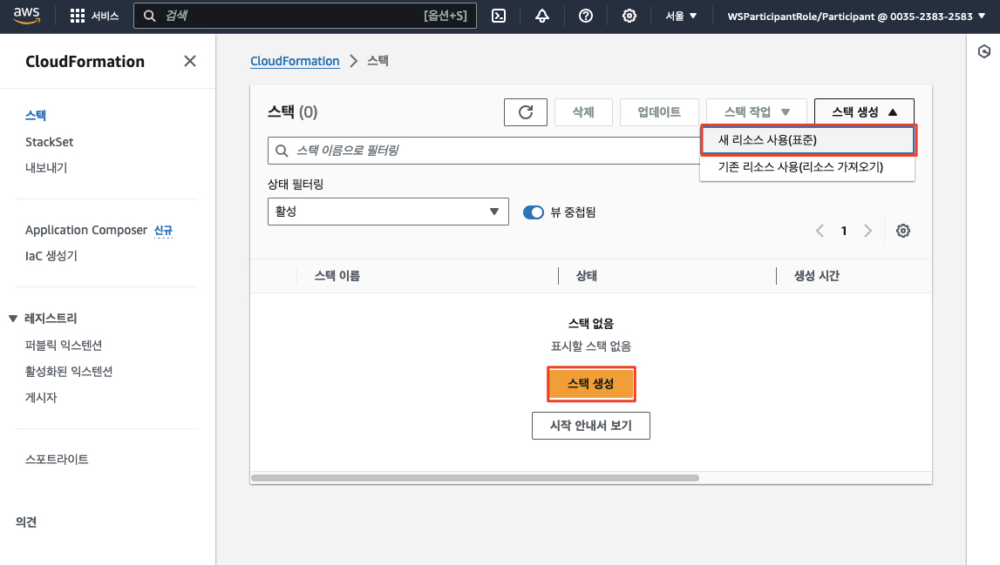
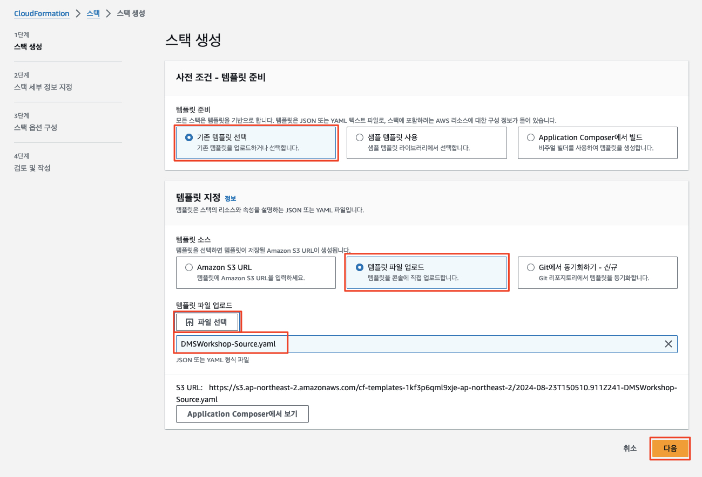
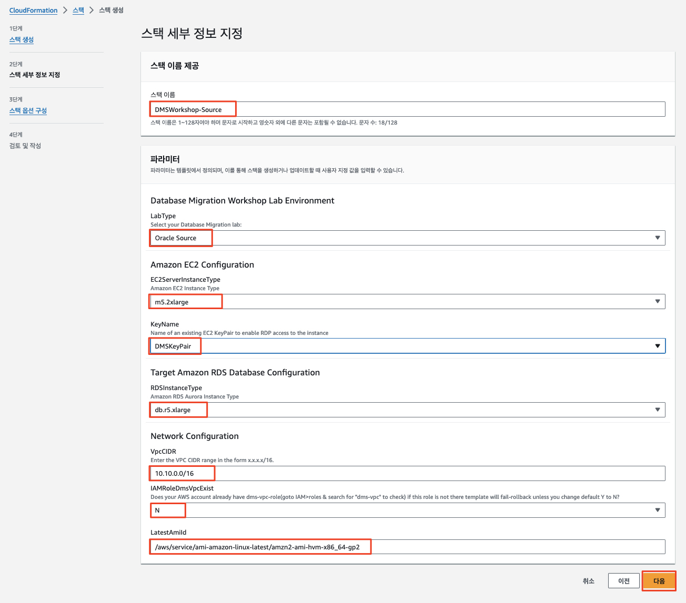
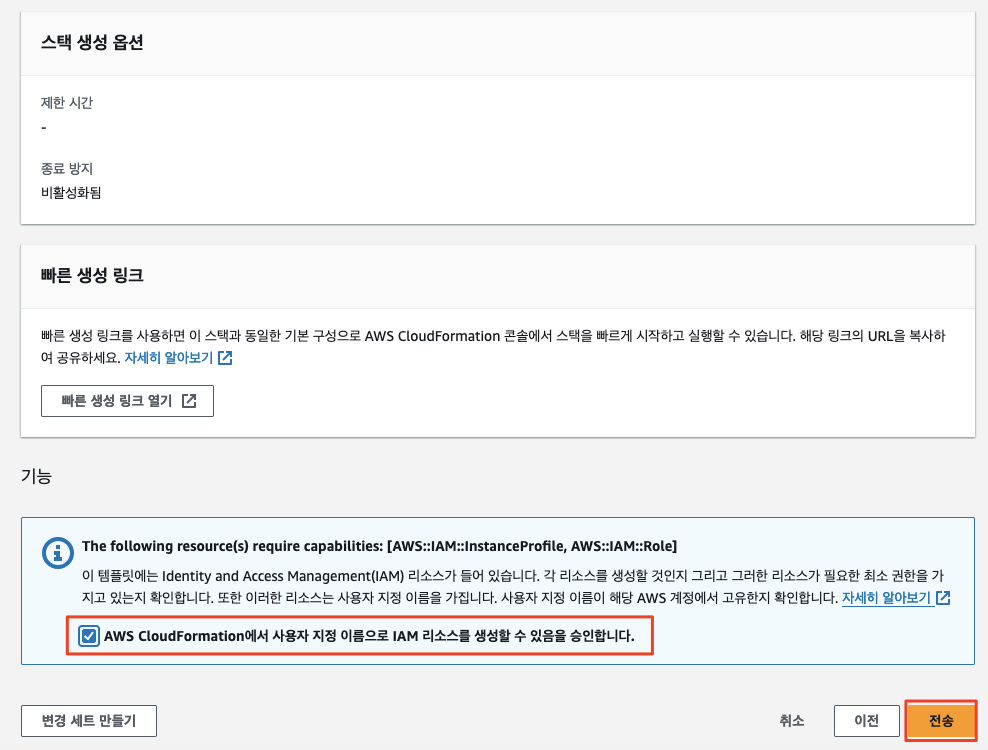
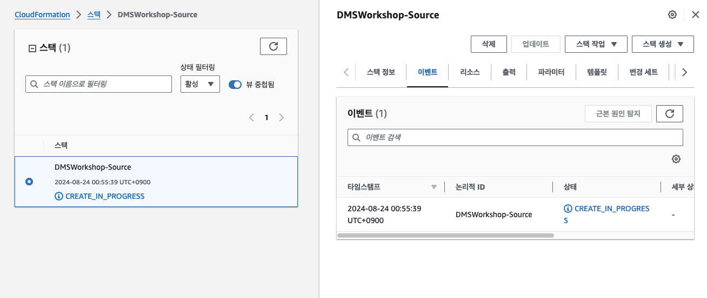
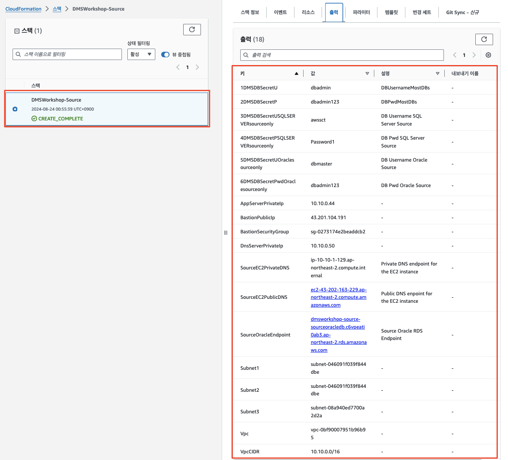

# ***소스 환경 구성***

소스 데이터베이스를 가지는 환경을 구성하는 방법에 대해 설명합니다.

소스 환경은 다음과 같은 자원을 포함합니다.

- 소스 환경 자원
    - `AWS SCT (AWS Schema Conversion Tool)`를 포함하여 이 마이그레이션에 사용하는 도구를 호스팅하기 위해 `Amazon Elastic Compute Cloud (EC2)` 인스턴스 (윈도우)
    - 소스 데이터베이스를 시뮬레이션하기 위해 사용하는 오라클 데이터베이스 인스턴스 (```Amazon RDS```)
    - 예제 애플리케이션을 호스팅하기 위한 애플리케이션 서버 (리눅스)
    - 클라우드 환경과의 연결을 위한 VPN 게이트웨이 역할을 하는 EC2 인스턴스 (리눅스)

---

## 소스 환경 구성

```AWS CloudFormation``` 템플릿을 사용하여 데이터베이스 마이그레이션을 위한 소스 환경의 자원을 배포합니다.

1. 아래 링크를 클릭하여 소스 측 자원을 생성하는 ```AWS CloudFormation``` 템플릿 파일을 다운로드 합니다.

  - [[소스 환경 자원을 위한 CloudFormation 템플릿]](https://aws-database-migration-workshop.s3.ap-northeast-2.amazonaws.com/DMSWorkshop-Source.yaml)

2. ```AWS CloudFormation``` 서비스로 이동하여  ```스택 생성 (Create stack)``` 메뉴를 클릭합니다.



3. ```기존 템플릿 선택 (Template is ready)```를 선택하고 ```템플릿 파일 업로드 (Upload a template file)```을 선택합니다. 그런 다음 ```파일 선택 (Choose file)```을 클릭하고 위 1에서 다운로드 받은 ```DMSWorkshop-Source.yaml``` 을 업로드합니다. 업로드가 완료되면 ```다음 (Next)```을 클릭하세요.



3. 아래 지정된 값으로 양식을 채운 후 다음을 클릭합니다.

| **입력 파라미터**              | **값**                                                               |
|--------------------------|---------------------------------------------------------------------|
| **스택 이름**                | ```DMSWorkshop-Source```                                            |
| **LabType**              | ```Oracle Source```                                                 |
| **EC2ServerInstanceType** | ```m5.2xlarge```                                                    |
| **KeyName**              | ```DMSKeyPair``` (혹은 실제 생성한 키 페어 이름)                                |
| **RDSInstanceType**      | ```db.r5.xlarge```                                                  |
| **VpcCIDR**              | ```10.10.0.0/16```                                                  |
| **IAMRoleDmsVpcExist**   | ```N```                                                             |
| **LatestAmiId**   | ```/aws/service/ami-amazon-linux-latest/amzn2-ami-hvm-x86_64-gp2``` |



4. ```스택 옵션 구성 (Stack Options)``` 페이지에서 모든 기본값을 수락하고 다음을 클릭합니다.

5. 검토 페이지에서 ```AWS CloudFormation에서 사용자 지정 이름으로 IAM 리소스를 생성할 수 있음을 승인합니다.```를 선택하고 ```전송``` 버튼을 클릭하여 스택을 생성합니다.



6. ```CloudFormation 콘솔```에서 해당 스택이 ```CREATE_IN_PROGRESS```로 표시되며, 상태가 ```COMPLETE```로 변경될 때까지 기다립니다.



7. ```CloudFormation``` 스택의 상태가 ```CREATE_COMPLETE```로 변경되면 ```출력 (Outputs)``` 섹션으로 이동합니다.

8. 이후 워크샵 진행 과정에서 필요한 값들을 사용하기 위해 ```CloudFormation``` 환경에서 생성된 ```출력``` 값을 메모해 둡니다.



---
