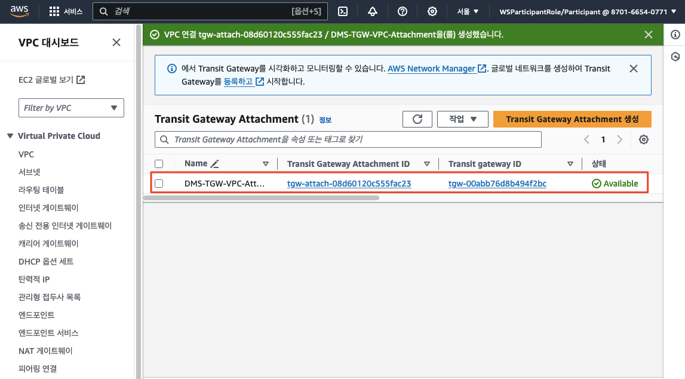
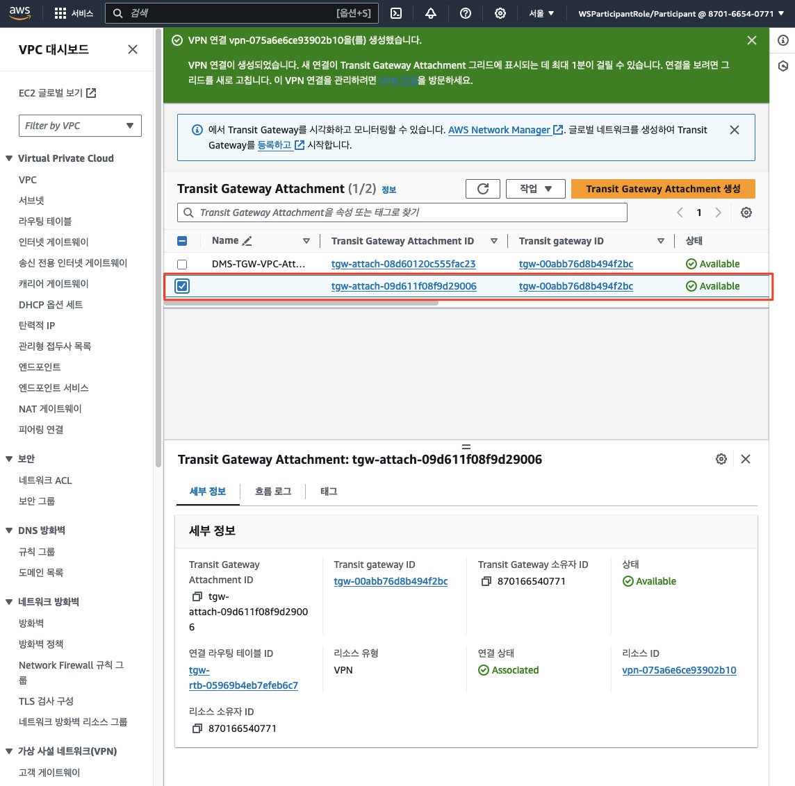
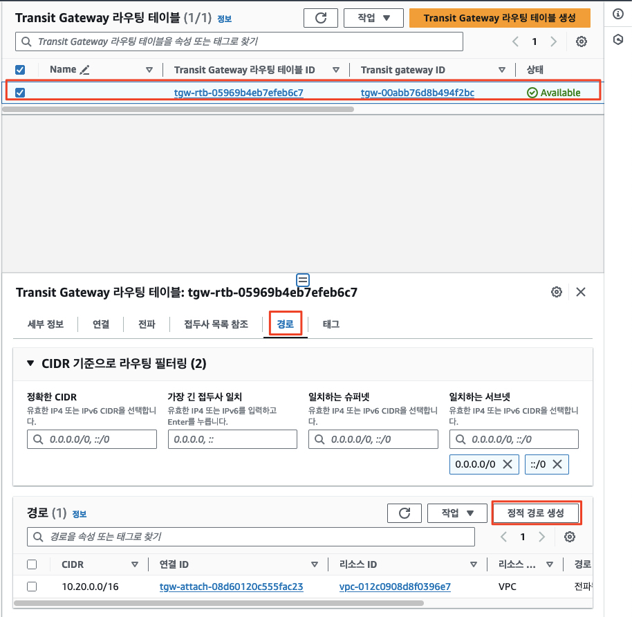
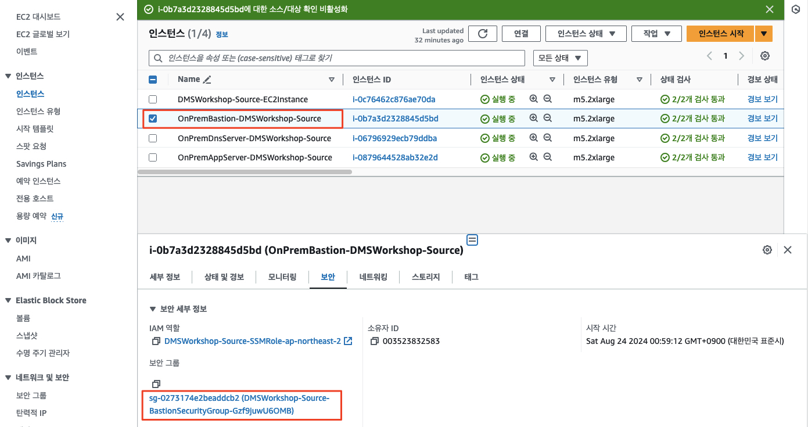
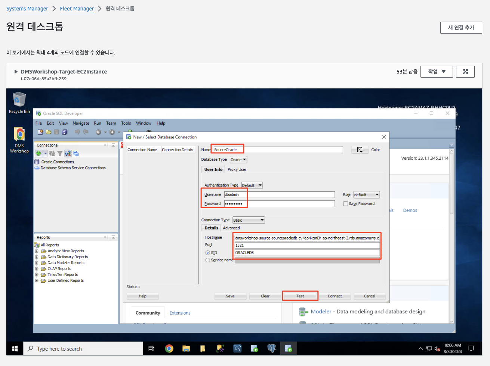

# ***소스/타겟 연결 구성***

이제 소스 환경과 타겟 환경을 연결하여 데이터베이스를 마이그레이션할 기본적인 준비를 해보도록 하겠습니다.

주목할 점은 AWS 클라우드의 서비스를 사용하는 것이 아닌 개방형 표준인 IPSec 기반 VPN을 사용하여 소스 환경과 타겟 환경을 연결한다는 것입니다. 이를 통해 실제 현장에서 구성되는 기반 구조 위에서 데이터베이스 마이그레이션을 체험해 볼 수 있습니다.

온프레미스 혹은 타사 클라우드와 AWS 클라우드가 IPSec VPN으로 연결된 모습은 아래와 같습니다.


아래 순서로 작업을 진행합니다.
- 타겟 환경 (AWS 클라우드 환경 구성)
- 소스 환경 (온프레미스 환경 구성)
- 타겟 환경에서 소스 데이터베이스 접속 확인

---

## 타겟 환경 (AWS 클라우드) 환경 구성

타겟 환경인 AWS 클라우드 측에서는 아래 순서로 수행하여 소스 환경과 연결하기 위한 네트워크 요소를 구성합니다.

1. ```Transit Gateway``` 생성
2. 타겟 VPC Attachment 생성
3. Customer Gateway 및 VPN Attachment 생성
4. 타겟 -> 소스 통신을 위한 라우팅 테이블 구성
5. VPN 구성 정보 다운로드

### 1. Transit Gateway 생성
1. ```VPC > Transite Gateway > Transit Gateway 생성```으로 이동합니다.

   

2. 아래 정보를 사용하여 ```Transit Gateway```를 생성합니다.
   - **이름 태그**: ```DMS-TGW```
   - **Transit Gatewway** 구성: 기본 선택 값 적용
     - 그외 사항 모두 기본 선택 값 적용

        

3. ```Transit Gateway``` 생성이 완료될 때까지 기다립니다.

   

### 2. 타겟 VPC Attachment 생성

1. ```VPC > Transite Gateway > Transit Gateway 연결```로 이동하여 ```Create Transit Gateway 생성 (Create Transit Gateway Attachment)```을 클릭합니다.

   

2. 아래 정보를 사용하여 ```Transit Gateway Attachment```를 생성합니다.
   - **이름 태그**: ```DMS-TGW-VPC-Attachment```
   - **Transit Gateway ID**: 앞서 생성한 ```DMS-TGW```
   - **연결 유형**: ```VPC```
   - **DNS 지원**: ```활성화```
   - **VPC ID**: ```DMSWorkshop-Target-DmsVpc```
   - **서브넷 ID**: 모든 서브넷 선택 (기본값) 

    

3. ```Transit Gateway Attachment``` 생성이 완료되고 상태가 ```Available```로 변경될 때까지 기다립니다.

   

### 3. Customer Gateway 및 VPN Attachment 생성

1. ```VPC > Transit Gateway > Transit Gateway 연결```로 이동하여 ```Transit Gateway 생성 (Create Transit Gateway Attachment)```을 클릭합니다.

   

2. 아래 정보를 사용하여 ```Transit Gateway Attachment```를 생성합니다.
   - **연결 유형**: ```VPN```
   - **Transit Gateway ID**: 앞서 생성한 ```DMS-TGW```
   - **고객 게이트웨이**: ```신규```
   - **(중요) IP 주소**: 소스 환경에서 생성된 Bastion 호스트의 Public IP 주소
      - ```⚠️ 소스 환경을 맡으신 분께 문의합니다. 이는 소스 환경의 CloudFormation 출력 탭에서 찾을 수 있습니다.``` 
   - **BGP ASN**: ```65000```
   - **라우팅 옵션**: ```정적```

    

3. ```Transit Gateway Attachment``` 생성이 완료되고 상태가 ```Available```로 변경될 때까지 기다립니다.

   

### 4. 타겟 -> 소스 통신을 위한 라우팅 테이블 구성

1. ```VPC > Transit Gateway > Transit Gateway 라우팅 테이블```로 이동하여 위에서 생성한 Transit Gateway `DMS-TGW`의 기본 경로 테이블이 선택되어 있는지 확인한 다음 하단 창에서 ```경로 (Routes)``` 탭을 선택합니다.

   

2. 우리는 앞서 VPN 연결에 정적 라우팅을 설정하였습니다. 따라서 소스 환경 네트워크에 대한 경로를 수동으로 생성해야 합니다. ```정적 경로 생성 (Create static route)```를 클릭하여 새 정적 경로를 추가합니다.

   

3. 소스 환경으로 라우팅될 수 있도록 아래와 같이 정보를 입력하고 ```정적 경로 생성 (Create static route)```를 클릭합니다.
   - **CIDR**: ```10.0.0.0/12```
   - **유형**: ```활성```
   - **연결 선택**: ```앞서 생성한 VPN Attachment 선택```

   

   > ❓ 라우팅 경로에서 소스 측 CIDR 대역 ```10.0.0.0/12```의 의미는?<br>
   > 소스 측 환경을 담당하는 분께 확인해 보면 소스 측의 CIDR 대역은 ```10.10.0.0/16```으로 구성되어 있습니다.<br>
   > 그렇다면 소스 측으로 라우팅하는 경로를 ```10.0.0.0/12```와 같이 잡은 이유는 무엇일까요?<br>
   > 물론 실제로 구성하는 요구 사항에 따라 달라질 수 있겠지만 다음과 같은 설계 목적을 충족하기 위함이라고 볼 수 있습니다.<br>
   > - **목적**:
   >   - 소스 측 환경을 구성하는 VPC의 CIDR 대역을 더 큰 범위로 설정함으로써, 소스 측 환경의 확장성을 고려하여 더 많은 서브넷을 포함할 수 있도록 하기 위함입니다.<br>
   >   - 특정 서브넷만을 고려하여 라우팅을 설정하면, 또 다른 서브넷이 온프레이스 환경에 추가되거나 확장되는 경우에 대응하기 어려울 수 있습니다.<br>
   > - ```10.0.0.0/12``` 범위는 소스와 타겟을 세부적으로 분리하면서도, 소스의 범위를 포괄하는 범위이므로 세분성과 확장성을 동시에 달성할 수 있습니다.
   > - 즉, `10.0.0.0 ~ 10.15.255.255.255` 범위는 소스 측 범위로 할당된 것이라면, `10.16.0.0 ~ 10.31.255.255` 범위는 타겟 측 범위로 할당된 것이라고 볼 수 있습니다.

4. ```정적 경로 생성 (Create static route)```를 클릭하면 경로가 생성됩니다.

   

   > ⚠️ 생성된 정적 경로는 ```블랙홀 (Blackhole)``` 상태로 전환됩니다. 이는 VPN 연결이 활성화되지 않아서 발생하는 현상입니다. 소스 환경에서 VPN 연결을 활성화하고, 라우팅 테이블을 구성하면 이 경로는 활성화됩니다.
   > 

4. 위에서 타겟 환경이 소스 환경으로 거쳐가기 위한 Transit Gateway VPN 연결의 라우팅 경로를 설정하였습니다. 이번에는 타겟 환경의 VPC 내부에서 소스 환경으로 향하는 패킷이 거쳐가는 (Via) 경로를 Transit Gateway로 설정해 보겠습니다.

5. ```VPC > 라우팅 테이블```로 이동하여 타겟 VPC `DMSWorkshop-Target-RouteTable` 의 라우팅 테이블을 선택합니다.

   

6. 라우팅 테이블의 ```라우팅``` 탭을 선택하고 ```라우팅 편집```을 클릭합니다.

   

7. 다음 정보를 사용하여 라우팅을 추가합니다.
   - **대상**: ```10.0.0.0/12```
   - **대상 (Via)**: ```Transit Gateway``` 선택 > ```Transit Gateway ID (DMS-TGW)```

   

   

### 5. VPN 구성 정보 다운로드
앞서 ```Customer Gateway```를 생성하게 되면 고객 측 VPN 장비와 연결할 수 있는 Site-to-Site VPN 터널도 함께 구성되며, 이에 대한 구성 정보를 다운로드할 수 있습니다.

1. ```VPC > Site-to-Site VPN 연결```로 이동하여 생성한 VPN 연결을 선택합니다.

   

2. ```Download configuration```을 클릭합니다.

   

3. ```Vendor``` 콤보박스에서 ```Openswan```을 선택하고 ```Download``` 버튼을 클릭하여 파일을 저장합니다. 이 파일은 소스 환경의 VPN 장비에서 VPN 구성을 수행할 때 필요합니다.

   

---

## 소스 환경 (온프레미스) 환경 구성

소스 환경인 온프레미스 측에서는 아래 순서로 수행하여 타겟 환경과 연결하기 위한 네트워크 요소를 구성합니다.

1. 온프레미스 네트워크의 라우팅 경로 구성
2. VPN 장비 (가상 Bastion 호스트) 구성
3. IPSec 데몬 (Openswan) 설정 및 VPN 터널 기동
4. 연결 확인

### 1. 온프레미스 네트워크의 라우팅 경로 구성
1. 온프레미스 네트워크의 라우팅 테이블을 열어, 타겟 환경으로 향하는 패킷이 VPN 연결을 통해 전달되도록 설정합니다. 이러한 패킷을 전달하는 장비는 Bastion 호스트이므로 타겟 환경으로 향하는 패킷을 Bastion 호스트로 전달하도록 라우팅 테이블을 구성합니다.

2. 온프레미스 소스 환경의 ```VPC > 라우팅 테이블 (Route Tables)```로 이동하여, ```DMSWorkshop-Source-RouteTable (혹은 설정한 이름에 따른 라우팅 테이블)``` 을 선택한 후 다음과 같이 라우팅 경로를 추가합니다 (라우팅 탭).

      

   - **대상**: ```10.16.0.0/12```
   - **대상 (Via)**: ```인스턴스 선택 > Bastion 호스트 인스턴스``` 선택 (에: ```OnPremBastion-DMSWorkshop-Source```)

   

   

   > ❓ 라우팅 경로에서 타겟 측 CIDR 대역 ```10.6.0.0/12```의 의미는?<br>
   > (타겟 환경의 라우팅 경로 설정과 유사하게)<br>
   > 타겟 측 환경을 담당하는 분께 확인해 보면 소스 측의 CIDR 대역은 ```10.20.0.0/16```으로 구성되어 있습니다.<br>
   > 그렇다면 타겟 측으로 라우팅하는 경로를 ```10.16.0.0/12```와 같이 잡은 이유는 무엇일까요?<br>
   > 물론 실제로 구성하는 요구 사항에 따라 달라질 수 있겠지만 다음과 같은 설계 목적을 충족하기 위함이라고 볼 수 있습니다.<br>
   > - **목적**:
       >   - 타겟 측 환경을 구성하는 VPC의 CIDR 대역을 더 큰 범위로 설정함으로써, 타겟 측 환경의 확장성을 고려하여 더 많은 서브넷을 포함할 수 있도록 하기 위함입니다.<br>
   >   - 특정 서브넷만을 고려하여 라우팅을 설정하면, 또 다른 서브넷이 타겟 클라우드 환경에 추가되거나 확장되는 경우에 대응하기 어려울 수 있습니다.<br>
   > - ```10.16.0.0/12``` 범위는 소스와 타겟을 세부적으로 분리하면서도, 소스의 범위를 포괄하는 범위이므로 세분성과 확장성을 동시에 달성할 수 있습니다.
   > - 즉, `10.0.0.0 ~ 10.15.255.255.255` 범위는 소스 측 범위로 할당된 것이라면, `10.16.0.0 ~ 10.31.255.255` 범위는 타겟 측 범위로 할당된 것이라고 볼 수 있습니다.

### 2. VPN 장비 (가상 Bastion 호스트) 구성

비록 우리는 온프레미스 소스 환경을 시뮬레이션하기 위하여 자원을 AWS 클라우드에 생성하였지만, 이를 타겟 환경과 연결하기 위하여 개발형 스펙은 IPSec VPN을 사용한다고 말씀드렸습니다.

이를 위해 필요한 설정을 다음과 같이 수행합니다.

1. ```EC2 > 인스턴스 (Instances)```로 이동합니다.
2. Bastion 호스트를 찾아 선택합니다. 호스트 이름은 OnPremBastion으로 시작합니다.
3. ```작업 (Actions)``` 메뉴에서 ```네트워킹 (Networking)```을 선택한 다음 ```소스/대상 확인 변경 (Change Source/Destination Check)```을 선택합니다.

   

4. ```중지 (Stop)```을 선택합니다. 이렇게 하면 인스턴스를 라우터로 사용하여 EC2 인스턴스의 자체 IP 주소로 향하지 않는 트래픽을 전달할 수 있습니다. 이 옵션을 사용하지 않으면 EC2는 소스 또는 대상 IP 주소가 인스턴스의 IP 주소와 일치하지 않는 IP 패킷을 전달하지 않습니다.

   

5. EC2 콘솔에서 Bastion 호스트를 선택한 상태에서 하단 창에서 ```보안 (Security)``` 탭을 선택하고, ```보안 그룹 (Security Groups)``` 링크를 클릭합니다. 새탭으로 열리는 보안 그룹 편집 창에서 AWS VPN 엔드포인트가 IPSEC를 통해 인스턴스와 통신할 수 있도록 허용해야 합니다.

   

6. ```인바운드 규칙 편집 (Edit inbound rules)```를 선택합니다.

   

7. (AWS 타겟 환경을 맡은 분께 정보 요청) AWS 타겟 환경에서 VPN 연결을 생성할 때 함께 생성된 두 개의 ```외부``` 터널 주소에 대해 UDP 포트 500 및 4500에 대한 규칙을 추가하세요 (사용자 지정 UDP). 대화 상자에서 CIDR 표기법으로 주소를 입력해야 하므로, 두 터널 IP 주소 끝에 /32를 추가하기만 하면 됩니다. 완료되면 규칙 저장을 클릭합니다.

    

   

>📕 참고<br>
> 우리는 시뮬레이션된 온프레이스 소스 환경을 가정하므로 AWS 기능을 사용하지만, 실제 현장에서는 데이터센터의 물리적인 네트워크 설정을 통해 유사하게 이루어지는 작업임을 강조하고 싶습니다.

### 3. IPSec 데몬 (Openswan) 설정 및 VPN 터널 기동

이제 소스 환경인 온프레미스의 네트워크를 구성하고 타겟 환경인 AWS 클라우드에 대한 VPN 연결을 만들었으므로, Bastion 호스트에서 Openswan을 구성하고 터널을 실행할 준비가 되었습니다. Openswan은 이미 Bastion 호스트에 설치되어 있습니다.

타겟 환경에서 다운로드한 구성 파일을 사용하여 VPN을 구성합니다. (타겟 측 담당자에게 해당 파일을 요청)

1. EC2 콘솔에서 Bastion 인스턴스에 대한 연결 옵션을 사용하여 인스턴스에 연결합니다 (세션 관리자).

2. IP 포워딩을 사용하도록 ```/etc/sysctl.conf```를 편집합니다:

   ```bash
   sudo vi /etc/sysctl.conf
   ```

   다음 파라미터를 파일의 끝에 추가합니다.

   ```bash
   net.ipv4.ip_forward = 1
   net.ipv4.conf.default.rp_filter = 0
   net.ipv4.conf.default.accept_source_route = 0
   ```

3. 변경 사항을 다음 명령을 통해 적용합니다:

   ```bash
   sudo sysctl -p
   ```

4. 타겟 환경에서 전달된 고객 게이트웨이용 구성 파일을 엽니다. 이 파일을 통해 터널 1에 대한 Openswan을 구성할 것입니다. Openswan은 터널 장애 조치 기능을 제공하지 않으므로 터널 중 하나만 구성할 것입니다.

5. Bastion 호스트의 ```/etc/ipsec.d``` 디렉토리 내에 ```aws.conf``` 파일을 새로 생성하면서 편집합니다.

    ```bash
    sudo vi /etc/ipsec.d/aws.conf
    ```
    
6. 구성 파일 내에서 ```conn Tunnel1``` 섹션을 복사하여 붙여넣습니다 (원하는 편집기를 사용하여 변경합니다. 붙여넣기는 ```nano```보다 ```vi```에서 더 잘 작동합니다. nano에서는 줄 바꿈 수정이 필요할 수 있습니다).

   

7. 아래와 같이 변경합니다.<br>
   - ```auth=esp``` 라인을 삭제
   - ```phase2alg=``` 라인의 ```aes128-sha1;modp1024``` 값을 ```aes_gcm```으로 변경
   - ```ike=``` 라인의 ```s128-sha1;modp1024``` 값을 ```aes256-sha2_256;dh14```으로 변경
   - ```leftsubnet=``` 라인의 ```<LOCAL NETWORK>``` 부분을 소스 온프레미스 CIDR 블록인 ```10.10.0.0/16```으로 변경
   - ```rightsubnet=``` 라인의 ```<REMOTE NETWORK>``` 부분을 타겟 AWS 클라우드의 CIDR 블록인 ```10.16.0.0/12```으로 변경

8. 최종적인 모습은 다음과 유사하며 저장 후 종료합니다.

   

9. ```/etc/ipsec.d``` 디렉토리 내에 ```aws.secrets``` 파일을 생성하면서 바로 편집합니다.<br>
    ```bash
    sudo vi /etc/ipsec.d/aws.secrets
    ```

10. 구성 파일 내의 ```(5) Create a new file ...``` 로 시작되는 부분의 아래 라인을 복사하여 붙여 넣습니다.

    
    

11. ```Openswan```을 활성화하고 시작합니다.

    ```bash
    sudo systemctl enable ipsec.service
    sudo ipsec start
    ```

12. (타겟 환경 담당자 확인) 잠시 후 타겟 환경의 ```AWS > VPC > Site-to-Site VPN 연결``` 화면에서 VPN 터널 중 하나가 ```Up``` 상태로 변경됨을 확인합니다. 또한 ```VPC > Transit Gateway > Transit Gateway 라우팅 테이블``` 화면에서 앞서 ```Blackhole``` 상태였던 정적 경로가 ```Active``` 상태로 변경됨을 확인합니다.

   

   

---

## 타겟 환경에서 소스 데이터베이스 접속 확인

마지막으로 타겟 한겨에서 소스 데이터베이스로 접속됨을 확인합니다.

1. 타겟 환경에서 ```EC2 > 인스턴스 (Instances)```로 이동하여 ```DMSWorkshop-Target-EC2Instance`` 인스턴스 (혹은 자원 생성 시 CloudFormation 스택명에 따른 인스턴스)를 선택하고 ```연결``` 버튼을 클릭합니다.

   

2. 연결 방법으로 ```RDP 클라이언트 > Fleet Manager를 사용하여 연결```을 ```Fleet Manager 원격 데스크톱``` 버튼을 클릭합니다.

   

3. ```Fleet Manager 원격 데스크톱```이 새 탭에서 열리는데, 다음과 같이 선택합니다.<br>
   - **인증 유형**: ```키 페어```
   - **관리자 계정 이름**: ```Administrator```
   - **키 페어**: ```DMSKeyPair```
   - **키 페어 콘텐츠**: ```로컬 시스템을 탐색하여 키 페어 파일을 선택합니다.```
   - **파일 선택** 버튼을 누른 후 앞서 공통 환경 설정 과정에서 다운로드 받은 키 페어 파일 선택<br>
   - **연결** 버튼을 클릭합니다.

      

4. 원격 데스크톱 연결이 성공하면 브라우저 윈도우 화면이 표시됩니다.

   

5. 원격 데스크톱 화면에서 ```SQL Developer```를 실행합니다.

   

   

6. (소스 측 담당자 확인) 소스 오라클 데이터베이스 접속을 위한 주소를 확인합니다. 해당 정보는 아래 위치에서 찾을 수 있습니다.
   - ```CloudFormation > 스택 > DMSWorkshop-Source > 출력``` 탭에서 ```SourceOracleEndpoint``` 항목을 확인합니다.

   

7. SQL Developer에서 ```새 연결```을 클릭하여 아래 정보를 입력하고 ```Test``` 버튼을 클릭하여 연결을 테스트합니다.
   - **접속 이름**: ```SourceOracle```
   - **사용자 이름**: ```dbadmin```
   - **비밀번호**: ```dbadmin1234```
   - **Hostname**: 위에서 확인한 ```SourceOracleEndpoint```
   - **SID**: ```ORACLEDB```
   - **포트**: ```1521```

   > 📕 참고<br>
   > Chrome 브라우저는 Fleet Manager 인스턴스와 클립보드를 통하여 정보를 교환할 수 있습니다. 하지만 Firefox 등의 브라우저에서는 클립보드 공유가 지원되지 않습니다. 이 경우, SQL Developer에서 직접 입력해야 하는데 길이가 긴 데이터베이스 엔드포인트는 이 작업이 번거로울 수 있습니다. 이 경우 온라인 클립보드 도구를 사용하여 클립보드에 복사한 후 SQL Developer에 붙여넣을 수 있습니다.<br>
   > 해당 사항에 대해서는 진행자의 안내를 따릅니다.

   

   

   > ⚠️ 연결이 실패할 것입니다!<br>
   > 소스 쪽 오라클 데이터베이스 연결이 실패하는 이유가 무엇일까요?<br>
   > 힌트는 소스 오라클 데이터베이스 방화벽이 열려 있지 않기 때문입니다. 소스 환경의 오라클 데이터베이스 방화벽을 열어주어야 합니다.

8. 소스 환경의 오라클 데이터베이스 방화벽을 설정해 준 후 다시 연결을 테스트하고 연결을 생성합니다.

   

   

---

> 🎊 축하합니다!<br>
> 보다 현실적인 시나리오를 위해 온프레미스 소스 환경과 AWS 클라우드 타겟 환경을 구성하고 이들 사이의 연결을 구성하였습니다. 이제 DMS를 통해 데이터 마이그레이션을 수행할 준비가 되었습니다.
