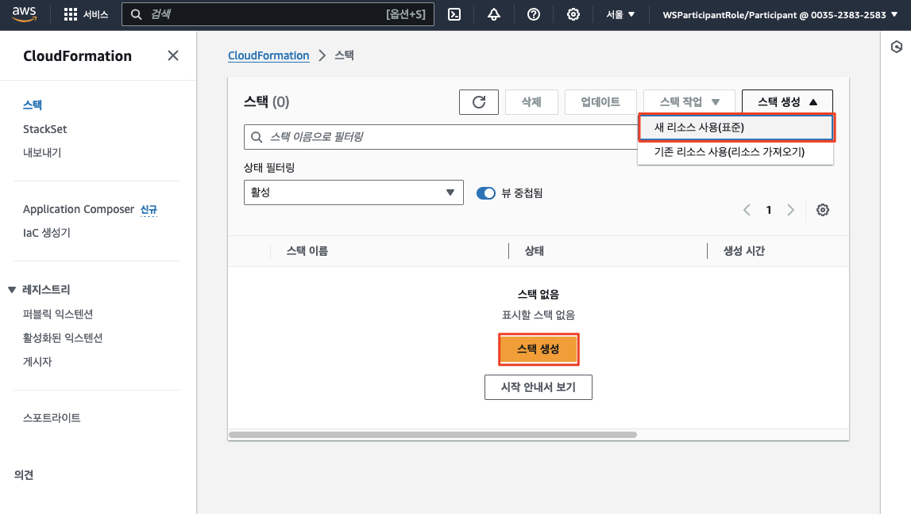
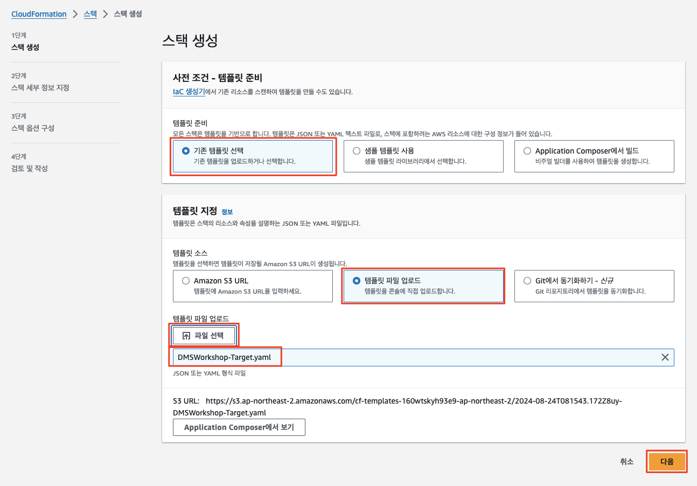
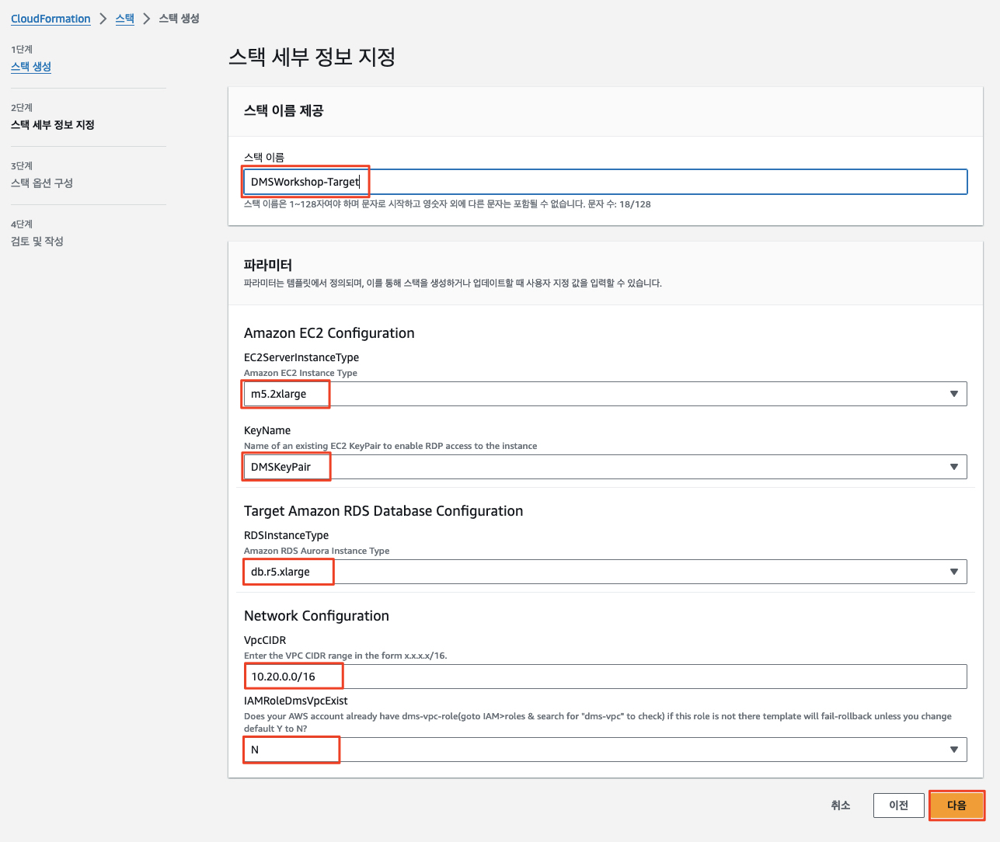
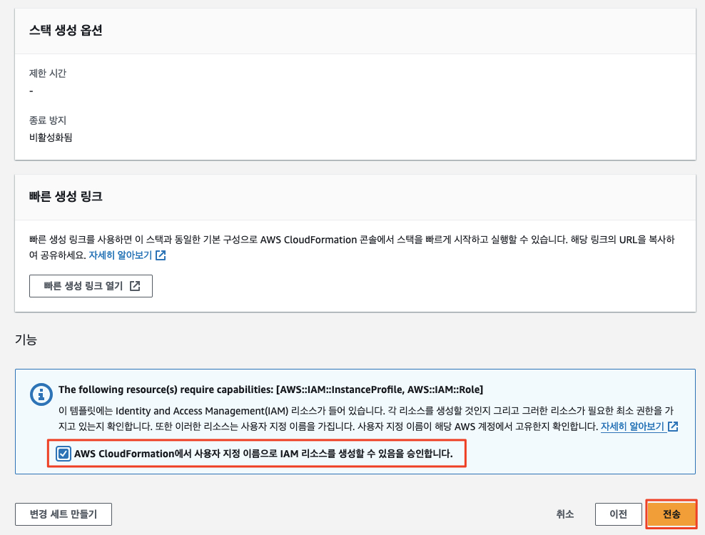
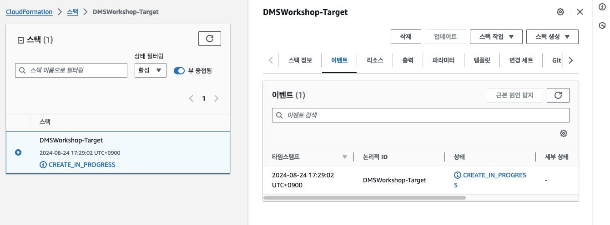
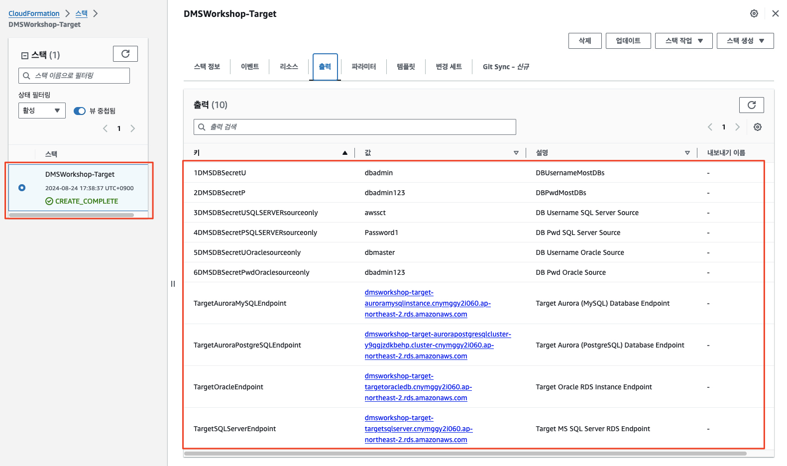

# ***타겟 환경 구성***

이번에는 타겟 환경을 구성해 보겠습니다. 타겟 환경은 다음과 같은 자원을 포함합니다.

- 타겟 환경 자원
  - 3개의 퍼블릭 서브넷이 있는 `Amazon Virtual Private Cloud (Amazon VPC)`와 기본 네트워크 토폴로지
  - 위 VPC에 위치하는 ```AWS Database Migration Service (AWS DMS)``` 복제 인스턴스
  - 타겟 데이터베이스
  - `Amazon Elastic Compute Cloud (EC2)` 인스턴스 (윈도우)
    - 마이그레이션에 사용하는 데이터베이스 도구 및 AWS SCT (AWS Schema Conversion Tool) 포함

---

## 타겟 환경 구성

역시 ```AWS CloudFormation``` 템플릿을 사용하여 데이터베이스 마이그레이션을 위한 타겟 환경의 자원을 배포합니다.

1. 아래 링크를 클릭하여 소스 측 자원을 생성하는 ```AWS CloudFormation``` 템플릿 파일을 다운로드 합니다.

  - [[타겟 환경 자원을 위한 CloudFormation 템플릿]](https://aws-database-migration-workshop.s3.ap-northeast-2.amazonaws.com/DMSWorkshop-Target.yaml)

2. ```AWS CloudFormation``` 서비스로 이동하여  ```스택 생성 (Create stack)``` 메뉴를 클릭합니다.



3. ```기존 템플릿 선택 (Template is ready)```를 선택하고 ```템플릿 파일 업로드 (Upload a template file)```을 선택합니다. 그런 다음 ```파일 선택 (Choose file)```을 클릭하고 위 1에서 다운로드 받은 ```DMSWorkshop-Target.yaml``` 을 업로드합니다. 업로드가 완료되면 ```다음 (Next)```을 클릭하세요.



3. 아래 지정된 값으로 양식을 채운 후 다음을 클릭합니다.

| **입력 파라미터**              | **값**                                       |
|--------------------------|---------------------------------------------|
| **스택 이름**                | ```DMSWorkshop-Target``` |
| **EC2ServerInstanceType** | ```m5.2xlarge```                            |
| **KeyName**              | ```DMSKeyPair``` (혹은 실제 생성한 키 페어 이름)        |
| **RDSInstanceType**      | ```db.r5.xlarge```                          |
| **VpcCIDR**              | ```10.20.0.0/16```                          |
| **IAMRoleDmsVpcExist**   | ```N```                                     |



4. ```스택 옵션 구성 (Stack Options)``` 페이지에서 모든 기본값을 수락하고 다음을 클릭합니다.

5. 검토 페이지에서 ```AWS CloudFormation에서 사용자 지정 이름으로 IAM 리소스를 생성할 수 있음을 승인합니다.```를 선택하고 ```전송``` 버튼을 클릭하여 스택을 생성합니다.



6. ```CloudFormation 콘솔```에서 해당 스택이 ```CREATE_IN_PROGRESS```로 표시되며, 상태가 ```COMPLETE```로 변경될 때까지 기다립니다.



7. ```CloudFormation``` 스택의 상태가 ```CREATE_COMPLETE```로 변경되면 ```출력 (Outputs)``` 섹션으로 이동합니다.

8. 이후 워크샵 진행 과정에서 필요한 값들을 사용하기 위해 ```CloudFormation``` 환경에서 생성된 ```출력``` 값을 메모해 둡니다.



---
